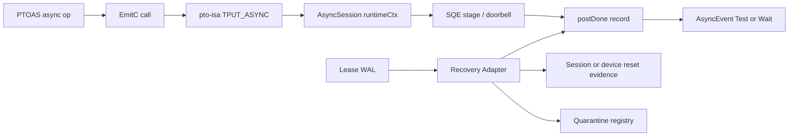
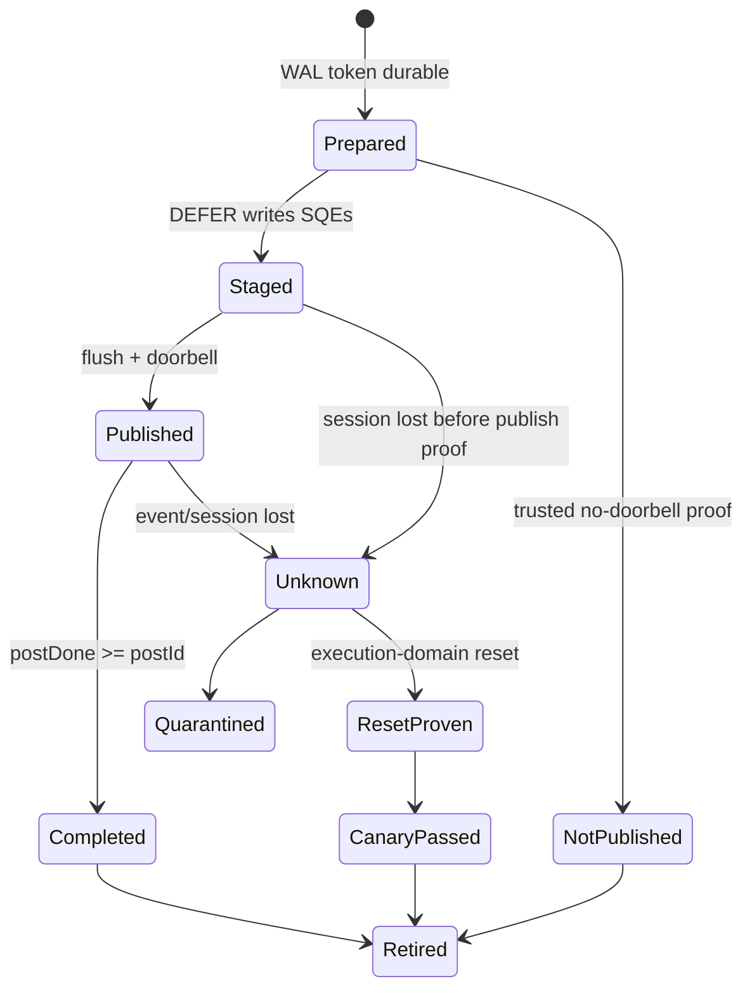

> 源码基线：PTOAS [`f5eff3ee`](https://github.com/hw-native-sys/PTOAS/commit/f5eff3ee249697f6157088f649c6434fcc9d7c5b)，pto-isa [`327cd586`](https://github.com/hw-native-sys/pto-isa/commit/327cd5869f3a7c4d2c6a1b945b2aed06e7665c5d)，均为 2026-09-25 核验时默认分支最新提交。PTOAS 相对上一章前进 2 个 commit，async op/lowering 未发生语义变化；pto-isa 的直接相关提交是 [`513e9e73`](https://github.com/hw-native-sys/pto-isa/commit/513e9e730fd1651323d4ed04e04f203f6921d9b0)，它为 `TPUT_ASYNC` 加入 session-driven aggregate submit。

## 本篇在 PTO 课程路线中的位置

课程 45 定义了 `AsyncLeaseToken` 和 register-before-submit WAL，并留下最棘手的恢复状态：WAL 还在，但产生 `AsyncEvent` 的 kernel、进程或 session 已经消失。本章只回答一个问题：**recovery owner 凭什么把 `MAY_HAVE_SUBMITTED` 变成 completed，或者安全释放被 lease 覆盖的 range？**

主线推进为：

`durable token → backend operation key → completion query → reset evidence / quarantine → canary validation`

## 前置知识

前两章已经确认：compiler 的 slot plan 不拥有运行时复用权；`Wait()==true` 是进程内事实，只有 durable completion 才能让 registry retire lease；timeout、cancel requested 和 cancel confirmed 也不是同一个状态。再加一条本章会用到的不变量：**软件 generation 只能拒绝旧报告，不能阻止硬件中已经发布的 DMA 继续写物理地址。**

## 今日两个紧密问题

1. `AsyncEvent.handle` 与 session workspace 能否在 event 对象丢失后重新证明 completion？
2. 若 completion 无法查询，什么 reset 才能解除 quarantine，late-write canary 又应如何验证它？

## PTO 全栈中的位置



上游是 PTOAS 生成的 `build_async_session → tput_async → wait/test`；下游消费者是 pto-isa 的 SDMA/URMA/RDMA backend、Host workspace owner 和 allocator。PTOAS 当前只生成调用，不保存可跨 kernel 重建的 operation key；因此 recovery 是 runtime contract，而不是 MLIR verifier 可以单独完成的工作。

## 概念和精确语义

### `handle` 是查询索引，不是提交证据

pto-isa 的 [`AsyncEvent`](https://github.com/hw-native-sys/pto-isa/blob/327cd5869f3a7c4d2c6a1b945b2aed06e7665c5d/include/pto/comm/comm_types.hpp) 对 SDMA 只保存 64-bit `handle` 和 engine。`EncodeSdmaEventHandle` 把低 58 bit 用作 `postId`，高 6 bit 用作 `queueCount`；它不包含 allocation owner、range、session generation、workspace identity 或 payload hash。

更重要的是，[`MakeSdmaDeferredEvent`](https://github.com/hw-native-sys/pto-isa/blob/327cd5869f3a7c4d2c6a1b945b2aed06e7665c5d/include/pto/comm/async/sdma/sdma_async_batch.hpp) 会用 `nextPostId + 1` 预先编码 future event。此时 `FillBatchDataSqes` 只是把 SQE 写入 queue memory；只有后续 `FlushPendingAsyncPut → PublishSdmaBatch` 才写 flag payload、更新 tail、flush cache 并 ring doorbell。因此：

- valid handle 可以对应 `STAGED_NOT_PUBLISHED`；
- action return 可以对应 `PUBLISHED_COMPLETION_UNKNOWN`；
- `Test=false` 既可能是仍在执行，也可能是 session/workspace 已失效；
- 只有匹配同一 execution domain 的 completion record，才可能把 lease 推进为 completed。

### completion record 依赖完整 session identity

[`SdmaEventCheck`](https://github.com/hw-native-sys/pto-isa/blob/327cd5869f3a7c4d2c6a1b945b2aed06e7665c5d/include/pto/comm/async/sdma/sdma_async_detail_post.hpp) 解码 handle 后，从 `session.runtimeCtx.postDoneBase` 读取每个 queue 的 post-done ID。`postDoneBase` 又由 workspace、`channelGroupIdx`、`queue_num` 推导；session 还携带 scratch UB、sync ID、SQ head/tail 和 `nextPostId`。只把 handle 写入 WAL，恢复者无法证明它查询的是原 session，而不是地址复用后的新 workspace。

因此建议的 operation key 至少是：

```text
BackendOperationKey = {
  engine, execution_domain_id, session_generation,
  workspace_owner, channel_group, queue_count, post_id,
  src_range, dst_range, payload_hash
}
```

前置条件是 registry 在 publish 前已持久化 token，backend 在 doorbell 前持久化或可原子导出 operation key；后置条件只能是 `Completed`、`NotPublished`、`MayHaveExecuted`、`DomainReset` 或 `Unknown`。非法组合包括：旧 generation 的 postDone 匹配新 workspace、只凭 `handle.valid()` 记 submitted、用 `Test=false` 记 cancelled，以及没有 reset scope 就释放相交 range。

这五个 verdict 不能压缩成一个 `bool`。`Completed` 表示 adapter 在同一 operation key 下看到了完成；`NotPublished` 要求 backend 能证明旧 descriptor 从未跨过 doorbell，而不是“暂时没看到完成”；`MayHaveExecuted` 表示 submit 边界存在歧义；`DomainReset` 表示执行域已经被可信地截断；`Unknown` 则覆盖 workspace 丢失、generation 不匹配和控制面不可达。只有前三个终态中的 `Completed/NotPublished`，以及带有效 scope 的 `DomainReset` 能推进 retire；后两者必须继续占用 interval quarantine。

还要区分“logical operation”和“physical post”。aggregate 模式可让多个 PUT 共享一个 `postId` 与 completion flag，因此两个不同 `dst_range` 的 token 可能映射到同一个 backend key。此时任一 logical token 都不能提前根据自己的 payload 已可见而单独 retire；除非 backend 额外提供 per-SQE completion，否则 recovery 必须按 physical post 的全部成员共同收敛。反过来，一个大 PUT 也可能被拆到多个 queue，`queueCount` 不是性能提示，而是完成判断需要覆盖的队列集合。

## 真实文件、类型与指令逐段解读

PTOAS 的 [`AsyncSession.cpp`](https://github.com/hw-native-sys/PTOAS/blob/f5eff3ee249697f6157088f649c6434fcc9d7c5b/lib/PTO/Transforms/PTOToEmitC/ScalarMisc/AsyncSession.cpp) 把 IR 分别降成 `BuildAsyncSession<SDMA>`、`TPUT_ASYNC`、`TGET_ASYNC` 与 `PTOAS__ASYNC_EVENT_WAIT/TEST`。其 `MemoryEffects` 把 dst 标成 Write、src/session 标成 Read、event 标成 Write；这能约束编译器重排，却没有 crash durability。

pto-isa 的 [`AsyncSession`](https://github.com/hw-native-sys/pto-isa/blob/327cd5869f3a7c4d2c6a1b945b2aed06e7665c5d/include/pto/comm/async_common/async_types.hpp) 保存 `submitMode/batchSize` 和 mutable `SdmaRuntimeContext`。后者包含 `nextPostId`、各 channel 的 `postDoneId/sqHead/sqTail`，以及 staged SQE/operation 数。这个对象是 event 的真实上下文，也是 crash 后最容易丢失的状态。

[`TPUT_ASYNC`](https://github.com/hw-native-sys/pto-isa/blob/327cd5869f3a7c4d2c6a1b945b2aed06e7665c5d/include/pto/comm/pto_comm_inst.hpp) 的 A2/A3 路径有三种模式：`IMMEDIATE` 直接发布；`DEFER` 暂存并返回 future event；`DEFER_AND_SUBMIT` 暂存后发布。达到 `batchSize` 也会自动 flush。A5 的 SDMA PUT 则是同步 MTE fallback，返回 handle 0，而 URMA/RDMA 仍可能异步。由此，recovery adapter 必须按 engine 和 target 分派，不能把“handle 0”统一解释为失败或完成。

这也解释了为什么 PTOAS 的 `MemoryEffects` 不够：它描述的是同一次编译/执行里的读写依赖，例如 compiler 不能把 dst consumer 移到 async write 之前；它不描述进程重启后谁拥有 workspace，也不保证 `event` 的 SSA value 被持久化。`AsyncEvent` 的类型正确、`dst` 为 flat contiguous 1D、src/dst static shape 相同，只能证明调用在 ISA contract 内，不能证明调用已经发布，更不能证明设备不再访问这段物理内存。

Host 侧 [`SdmaWorkspaceManager`](https://github.com/hw-native-sys/pto-isa/blob/327cd5869f3a7c4d2c6a1b945b2aed06e7665c5d/include/pto/host/comm/sdma_workspace_manager.h) 则揭示了 operation key 的另一个所有者：它创建 stream、分配 workspace，并把 SQ/register 元数据写入 workspace。恢复 adapter 若只运行在新进程中，却无法证明拿到的是旧 workspace 的持久 identity，那么即使物理地址碰巧相同，也必须返回 `Unknown`。地址相同只能说明 allocator 复用了数值，不能说明旧 `postDoneBase` 的历史被延续。

## 对象、Event 与 Workspace 生命周期



`AsyncEvent` 在 kernel 栈上创建；`AsyncSession` 持有 runtime state；Host 的 `SdmaWorkspaceManager` 创建 STARS streams、分配 workspace，并在 `Finalize()` 中释放 workspace、销毁 streams。任何一个对象消失都不等于设备动作已终止。尤其是 Host manager 析构成功，只证明调用了 free/destroy；除非 runtime 给出“该 execution domain 的旧 SQ/CQ 不再产生写入”的证据，它不能自动升级为 `DomainReset`。

因此生命周期要由两个所有权域共同闭合。进程内，`AsyncSession` 从 `BuildAsyncSession` 起持有 `nextPostId`、staged count、queue tail 与 `postDoneBase`；每次 `DEFER` 改变 staged state，每次 publish 推进 tail/post identity，`Wait/Test` 只消费当前 session 的查询能力。进程外，Lease Registry 从 durable `PREPARED` 起持有 owner-range-generation；它不拥有硬件 queue，却拥有“是否允许 allocator 复用”的否决权。正常路径由 event completion 把两域连接起来；crash 路径则必须由 recovery adapter 或 reset witness 补上这条边。

释放也不是销毁 Python/C++ 对象这么简单。只有当所有与物理 interval 相交的 token 都到达 terminal，registry 才能先写 durable `RETIRED`，再把 interval 交回 free list。若 registry 在写 terminal 后、free 前崩溃，重放可幂等地完成 free；若先 free 后写 terminal，崩溃重放就可能把已经分配给新 generation 的地址再次释放，所以这个顺序本身也是恢复协议的一部分。

## 端到端调用链或指令链

完整链是：

`pto.comm.tput_async` → PTOAS `PTOAsyncTransferToEmitC` → `TPUT_ASYNC<SDMA>` → `SdmaDeferAsyncPut/SdmaPostAsync` → `FillBatchDataSqes` → `FlushDataCacheAndRingDoorbells` → completion flag SQE → `postDoneBase` → `AsyncEvent::Test/Wait`。

Recovery 链则应是：

`WAL replay` → 恢复 `BackendOperationKey` → adapter 查询原 domain/session → 校验 postDone 与 generation → durable `COMPLETED`；若 query 不可用，则请求 scoped reset，持久化 reset witness，再跑 late-write canary；两者都没有时保持 quarantine。

adapter 的接口应显式携带证据，而不是只返回成功/失败。输入包括 token、backend kind、target、session/workspace generation 与查询 deadline；输出至少包含 verdict、stable reason code、观测到的 post/queue 集合、证据 generation 和时间戳。前置条件是 WAL replay 已冻结相交 range，查询期间 allocator 不会复用它；后置条件是 adapter 不直接 free 内存，只把证据交给 registry 决策。超时、backend 不支持 query、workspace identity 不匹配和 reset scope 不足都必须是可区分的失败方式。

并发上，同一 physical post 的多个恢复线程必须合并为 single-flight 查询；否则一个线程可能看到旧 session，另一个线程同时 reset 并回收 workspace。`DomainReset` 也必须带单调 generation：reset 前发出的迟到 completion 只能作为旧代诊断，不能覆盖新代状态。这个要求与 software token generation 不同——前者约束真实执行域，后者只过滤 registry 中的 stale message。

## 具体 shape、Tile 和状态演算

取 A2/A3 SDMA，两个 `16×i32` 连续片段，每个 64 B，`queue_num=4`、`batchSize=2`：

1. destination generation 41 的 `[0x8000,0x8080)` 被一个 logical batch 覆盖；两个 token 分别描述 `[0x8000,0x8040)` 与 `[0x8040,0x8080)`。
2. 第一次 `DEFER` 后 `batchStagedDataSqeCount=1`，返回 future handle：`queueCount=1, postId=1`，数值为 `(1<<58)|1`。doorbell 尚未发生。
3. 第二次调用后 staged count 变 2，达到 batchSize，`PublishSdmaBatch` 以同一个 physical post `postId=1` 发布两个 SQE，并追加 completion flag SQE。
4. 若进程在第 2 步崩溃，WAL 有 handle 但设备未必见到任务；状态是 `MAY_HAVE_SUBMITTED`，不能从 valid handle 推断 published。
5. 若在第 3 步 doorbell 后崩溃，旧 DMA 可能稍后写满 128 B。此时把地址交给 generation 42，即使软件拒绝旧 completion，物理数据仍会被污染。

这个例子里两个 logical token 的 payload 只有 64 B，但 quarantine 的最小释放组是整个 physical post 覆盖的 128 B：`postDone=1` 到达前，两段都保持占用。若 queue 0 已完成第一段、queue 1 尚未完成第二段，而 handle 的 `queueCount=2`，只读一个 queue 的 postDone 会产生假完成。若恢复时 `postDoneBase` 指向 generation 8 的新 workspace，即使读到的值也是 1，也不能为 generation 7 的旧 post 作证。

状态空间可以具体写成：crash-before-doorbell 时 WAL=`PREPARED`、device=`staged-or-none`、registry verdict=`MayHaveExecuted`；crash-after-doorbell 时 device=`inflight-or-done`，verdict 仍是 `MayHaveExecuted`，直到同代 query 给出 `Completed`。两者故意保守地合并，是因为进程死亡后普通软件状态无法证明 doorbell 那一瞬间是否发生。只有 backend 提供不可伪造的 no-submit marker，第一种情况才能降为 `NotPublished`。

late-write canary 可把 generation 42 的 128 B 填成逐 cache-line 不同模式，例如前 64 B 为 `0xA5`、后 64 B 为 `0x5A`，guard 区再放 64 B `0xC3`。reset witness 持久化后，先写 canary、跨越足够覆盖 CQ/SQ drain 的观测窗口，再读回 payload 与 guard。任何旧 payload、部分 cache line 改写或 guard 变化都说明 reset 证据不可信，domain 必须继续 quarantine。

注意：canary 是 reset 实现的故障检测器，不是正式 completion proof。一次未观察到迟到写不能数学证明未来永不写；可接受它的前提是 reset 原语本身有明确 scope，canary 只用于设备/驱动回归与 fault injection。

## 为什么这样设计及替代方案

替代方案一是只保存 `event.handle`。它最小，却丢失 session/workspace/generation，而且最新 `DEFER` 会在 publish 前生成 future handle，存在确定性的假阳性。

替代方案二是 crash 后无条件 device reset。它安全面更强，但会扩大故障域、拉高恢复延迟，并清空无关 session；多租户或多 stream 环境下代价尤其大。更合理的是按 `execution_domain_id + session_generation` 做最小 scoped reset，无法证明 scope 时才升级 device reset。

替代方案三是永远 quarantine。正确性最好，却会持续吞噬显存/通信 window。实际系统应设置容量水位：低水位继续隔离，高水位拒绝新 async admission，并触发更强 reset；不能在压力下静默复用。

这三种方案的成本轴并不相同。只存 handle 的 WAL 最省字节，却把正确性风险推到恢复期；全设备 reset 几乎不需要细粒度 query，却牺牲无关 workload 的吞吐和尾延迟；永久 quarantine 避免迟到写，但把一次控制面故障变成持续容量泄漏。operation-key adapter 增加 schema、版本兼容与 backend 维护成本，换来的是按 session/queue 缩小故障域，也让正常路径只多一次可批量持久化的 token 写入。

对 graphability 而言，编译得到的 kernel 仍可保持静态 control flow；registry/WAL 和恢复查询位于 Host/runtime 控制面，不应把动态分支塞进每个 Tile 计算路径。代价是 launch ABI 必须能把 session generation 与 token identity 传到 runtime。若为了不改 ABI 而让 recovery 猜测 session，短期改动更小，却会破坏跨进程正确性与长期可维护性。

## 访存、流水、并行与硬件约束

- aggregate submit 减少 doorbell 与 completion flag 开销，提高多个小 PUT 的吞吐，但把多个 logical range 绑定到一个 physical post；retire 必须等待整个 post 的 completion。
- `postDone` 是 GM workspace 中的 per-queue record；查询需要 MTE/UB scratch 和正确 queue mask，不是普通 Host bool。
- `FlushDataCacheAndRingDoorbells` 的 cache flush、`dsb` 与 doorbell 是发布边界；仅写 SQE memory 不代表硬件可见。
- A5 SDMA PUT 的同步 MTE fallback 返回 handle 0，`Wait()` 直接 true；其风险边界是 kernel/device failure，而不是 A2/A3 的 outstanding SDMA post。
- URMA/RDMA 有不同的 CQ/QP/peer identity，不能复用 SDMA 的 `postId + queueCount` adapter。

硬件 reset 是否真正终止旧 SQE 属于公开源码无法确认的 runtime 保证，本篇把它明确标为待由平台接口和故障实验验证的推断，不把 `aclrtDestroyStream` 或 workspace free 臆测成 fence。

## 测试证据与未覆盖风险

当前事实有三层：

1. PTOAS [`async_put_get_emitc.pto`](https://github.com/hw-native-sys/PTOAS/blob/f5eff3ee249697f6157088f649c6434fcc9d7c5b/test/lit/pto/async_put_get_emitc.pto) 固定 `128xf32`、512 B 的 Session/PUT/GET/Wait/Test 生成文本；negative test 拒绝非 flat 1D；VPTO 对 async session fail-closed。它们不执行设备 completion。
2. pto-isa A2/A3 [`TPutAsyncBatch.SdmaAggregateFunctionalSuite`](https://github.com/hw-native-sys/pto-isa/blob/327cd5869f3a7c4d2c6a1b945b2aed06e7665c5d/tests/npu/a2a3/comm/st/testcase/tput_async_batch/tput_async_batch_kernel.cpp) 覆盖 4 次操作、65 个 batch、multi-AIV、queue capacity、intermediate event、defer 后 TGET/notify/prefetch，并用 poison 检查最终数据。合入提交记录两设备套件通过。
3. A5 [`tput_async`](https://github.com/hw-native-sys/pto-isa/blob/327cd5869f3a7c4d2c6a1b945b2aed06e7665c5d/tests/npu/a5/comm/st/testcase/tput_async/tput_async_kernel.cpp) 覆盖 64 B、256 B、512 B、4-rank 与大 payload，验证同步 MTE fallback。

这些测试验证正常完成、batch visibility 与 payload 正确，但没有在 stage/doorbell/postDone 之间杀 kernel/Host，没有重建丢失 event，没有 workspace 地址复用，也没有 reset 后 late-write canary。poison 初值只能证明最终写入正确，不能证明旧 generation 不会在新 generation 之后迟到覆盖。

建议增加 deterministic failpoint matrix：`after_sqe_stage`、`before_doorbell`、`after_doorbell`、`after_postdone`、`after_completion_before_wal`；每点分别注入 kernel abort、Host crash、workspace reuse 和 domain reset。oracle 同时断言 WAL 状态、query verdict、quarantine range、generation 与 canary/guard 未被改写。

其中最重要的 negative case 是“同地址、不同 workspace generation”：测试先让旧 session 发布 post 1，再销毁 Host 对象并把同一地址分配给新 session，也令新 `postDone` 恰好等于 1。adapter 必须因 workspace/session generation 不匹配返回 `Unknown`，而不是被数值相等骗过。另一个 case 是 `DEFER` 返回 valid future event 后立即 crash；恢复结果不得是 `Completed`，即使 handle 解码完全合法。

设备 canary 应与普通 functional test 分开统计。functional oracle 检查最终 tensor 值；late-write oracle 在 reset 后刻意复用同一地址、写入分段模式并延迟观测，验证旧 DMA 没有再次修改 payload 或 guard。需要记录 reset scope、观测窗口和 queue 压力，否则一次空载通过无法代表高并发。公开测试目前没有给出这样的故障矩阵，所以本文对 reset 强度的结论仍是待验证设计，不冒充已经存在的设备保证。

## 与前后章节的连接

上一章回答“如何保证每次可能提交都可被恢复发现”；本章回答“发现后如何获得终态证据”。下一章将进入容量问题：大量 `Unknown` range 被 quarantine 后，interval conflict index、backpressure 与 admission policy 如何避免显存耗尽，同时不牺牲安全。

## 本篇结论

`AsyncEvent.handle` 不是 durable completion token；在 aggregate `DEFER` 模式中，它甚至可能先于 publish 存在。可靠恢复必须绑定 backend、execution domain、session generation、workspace 与 owner-range，并把 query、reset 和 quarantine 作为三条不同路径。可信 reset 需要明确作用域和平台证据；late-write canary 用来验证 reset/fault path，但不能替代正式 fence。

### 知识债

- runtime `BackendOperationKey/RecoveryVerdict` schema 与 WAL frame；
- SDMA/URMA/RDMA 三套 query adapter 和 stable reason code；
- session/device reset 的平台级 scope 与 durable witness；
- interval conflict index、quarantine 水位与 admission backpressure；
- A3/A5 stage/doorbell/postDone crash injection 与 late-write canary；
- PTOAS 对 batch submit mode、event-to-lease binding 与 VPTO parity 的表达。

### 三个理解检查问题

1. 为什么 `DEFER` 返回的 valid handle 不能证明 doorbell 已发生？
2. 为什么 `postDoneId >= postId` 仍必须绑定原 session generation 和 workspace identity？
3. late-write canary 能验证什么，又为什么不能单独授权 range 复用？

### 下一章

**Quarantine 不能无限长——Interval Conflict Index、容量水位与 Admission Backpressure。**

## 课程账本增量

- 新覆盖：PTOAS EmitC async lowering；pto-isa `AsyncSession/AsyncEvent`、SDMA staged batch、doorbell、postDone 与 Host workspace lifecycle。
- 新不变量：future handle 不等于 publish；handle 必须和 domain/session/workspace/owner-range 一起恢复；reset witness 与 completion witness 不可互换；canary 只验证 reset 实现。
- 新测试路线：五个 publish/completion failpoint × crash/reuse/reset，配合 payload/guard canary。
- 下一步：为 quarantine range 建 interval index、容量水位和拒绝/降级策略。
