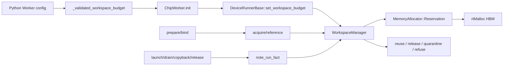
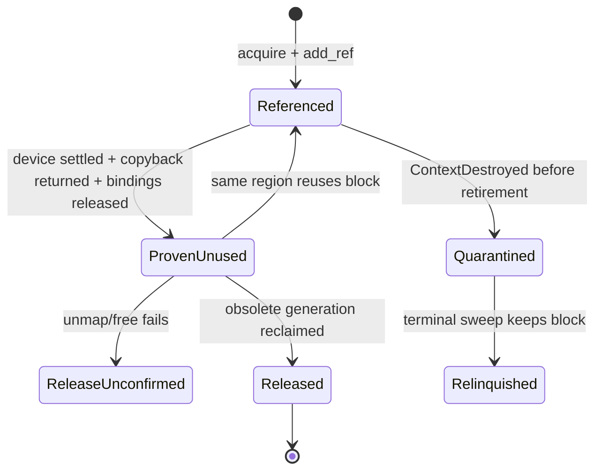

> 源码基线：simpler [`c605b03c`](https://github.com/hw-native-sys/simpler/commit/c605b03cad7be2a80700efbdf3bd00dbc79812a9)，为 2026-09-26 核验时 `main` 最新提交。本文主路径由已合入 [PR #2440](https://github.com/hw-native-sys/simpler/pull/2440)（commit [`9ca91c52`](https://github.com/hw-native-sys/simpler/commit/9ca91c522e8a80483f6a7cf8ad094f994fdcff5f)）引入；最新 [PR #2443](https://github.com/hw-native-sys/simpler/pull/2443) 又增加了预算之外的 A5 scheduler-state retained storage，这正好证明当前 report 明示的 `coverage_is_partial` 不是文档套话。

## 本篇在 PTO 课程路线中的位置

课程 43–46 从 `AsyncEvent` 一路推到 durable lease、backend recovery 与 completion unknown 下的 quarantine。此前的结论还是“应该有一个 runtime owner”。本章遇到了一次重要的源码校正：simpler 主干已经出现这样的 owner——`WorkspaceManager`。

本章只讲一个边界清晰的问题：**当旧 device consumer 可能仍在读写 workspace 时，runtime 怎样既不误复用旧地址，又不让增长无限突破 HBM 预算？**

路线推进为：

`completion facts → run reference → whole-block quarantine → finite budget → admission refusal`

## 前置知识

前章已经确认，event handle、timeout、`Test=false` 和软件 generation 都不能单独授权复用；只有同一执行域的 completion，或可信 reset fence，才能结束未知写入。还要保留两个概念：

- **容量**回答“这个 block 装不装得下新请求”；
- **权限**回答“旧内容的所有 consumer 是否已经结束，可以覆盖”。

两者不能合并成一个 `ref_count == 0` 判断：一个 region 当前发布的 backing 即使暂时没有 run，也仍属于 device context。

## 今日核心问题

1. `WorkspaceManager` 如何区分 current backing、run reference 和 obsolete generation，并从真实 completion facts 推导 reuse/quarantine？
2. `workspace_budget_bytes` 如何形成准入背压；为什么当前实现宁愿隔离整个 allocation，也没有引入 subrange interval index？

## PTO 全栈中的位置



上游输入是 Python `Worker` 的有限字节预算和某个 run 的 workspace 请求；下游消费者是 retained temporary staging buffer，以及 arena bank 的 `gm_heap`、`gm_sm`、`runtime_pool`。这里管理的是 raw HBM block：接口没有 tensor shape、dtype 或 layout，只有 `RegionKey + run_epoch + bytes`，输出是 device pointer。shape 到字节数的折叠发生在更上游的 plan/bind 阶段。

## 概念和精确语义

[`WorkspaceManager`](https://github.com/hw-native-sys/simpler/blob/c605b03cad7be2a80700efbdf3bd00dbc79812a9/src/common/platform/include/host/workspace_manager.h#L21-L75) 维护三类状态：

- `current backing`：region 当前发布的地址，归 context 所有；空闲不等于可被别的 region 抢走。
- `run reference`：某个 `run_epoch` 对 block 的使用权；它决定 close 是否仍可通过 drain 收敛。
- `obsolete generation`：region 已经发布到别处、且旧 block 没有 run reference；只有它能在增长时被回收。

`BlockState` 是 `Referenced / ProvenUnused / ReleaseUnconfirmed / Quarantined`。`Admission` 则是 `Open / DrainOnly / Closed`。值得注意的是，`DrainOnly` 仍允许已接受 work 的 bind 获得 workspace；只有 `Closed` 完全拒绝新请求。这比“一进入 shutdown 就禁止一切 allocation”更准确，否则正在完成 prepare 的 run 可能无法走到可证明终态。

安全不变量可以写成：

```text
可复用(block) = fits
             && same RegionKey
             && ref_count == 0
             && !quarantined
             && !release_unconfirmed
             && !released
```

容量不变量则是：

```text
reserved_bytes + requested_bytes <= limit_bytes
```

若不满足，代码只能释放满足 `!current && ref_count==0` 的 obsolete generation；不能拿 current backing、quarantine、unmap 失败或 free 未确认的 block 凑预算。

## 真实文件、类型和 API 逐段解读

### 1. 配置只在可保护的路径开启

Python `Worker` 对 `workspace_budget_bytes` 做 shape 与 route 校验：`bool` 不得冒充整数，值必须至少 1024 B，sim backend 不支持，拥有 chip child 的 hierarchical Worker 也拒绝。原因不是功能没接线，而是 parent 无法在 shutdown 前询问 child 是否还有可 drain 的 consumer。当前只支持 same-process L2；配置缺失时完全保持旧路径。

[`DeviceRunnerBase::set_workspace_budget`](https://github.com/hw-native-sys/simpler/blob/c605b03cad7be2a80700efbdf3bd00dbc79812a9/src/common/platform/onboard/host/device_runner_base.cpp#L439-L463) 注入两个 backend 回调：allocate 使用 `MemoryAllocator::begin_reservation()` 预留 tracking node，再执行 `rtMalloc`；release 必须先撤销整块 host mapping，成功后才 `rtFree`。这同时建立了所有权和失败原子性。

### 2. `acquire` 先找“能装且能覆写”的旧 block

[`acquire`](https://github.com/hw-native-sys/simpler/blob/c605b03cad7be2a80700efbdf3bd00dbc79812a9/src/common/platform/include/host/workspace_manager.h#L214-L247) 线性扫描 `blocks_`。同一 `RegionKey`、容量足够、无人引用且无 quarantine/free failure 才能复用；成功后先登记新 `run_epoch`，并把 block 标为 current。找不到才进入 `publish_new_block`。

新 allocation 之前，manager 先为 `blocks_` 和 allocator bookkeeping 预留 host metadata；device allocation 成功后的记录路径不再分配内存。这样 host `bad_alloc` 不会把一块已成功 `rtMalloc` 的 HBM 变成无人追踪的泄漏。

### 3. publish 与 retire 是两个边界

`acquire` 得到新 block，不等于 region 已切换过去。只有 transaction 全部成功后，[`note_published`](https://github.com/hw-native-sys/simpler/blob/c605b03cad7be2a80700efbdf3bd00dbc79812a9/src/common/platform/include/host/workspace_manager.h#L272-L292) 才把同 region 的旧 generation 标成 obsolete。若新 plan 中途失败，旧地址仍是 current，不会被下一次增长回收。

run retirement 也不由某个 phase enum 推断。`note_run_fact` 接收 `Launched`、`DrainProvedComplete`、`NoDeviceSubmission`、`CopybackReturned`、`BindingsReleased` 等事实。真正的退休条件是：

```text
(DrainProvedComplete || NoDeviceSubmission)
&& CopybackReturned
&& BindingsReleased
```

调用点位于真实边界：launch transaction 报告进度、成功 drain 返回、copy-back 返回和 bindings release 成功处。若 context 先销毁且条件仍不完整，[`quarantine_run_refs`](https://github.com/hw-native-sys/simpler/blob/c605b03cad7be2a80700efbdf3bd00dbc79812a9/src/common/platform/include/host/workspace_manager.h#L768-L780) 把它仍引用的整个 block 隔离。

### 4. 增长回收不是任意 eviction

[`make_room_locked`](https://github.com/hw-native-sys/simpler/blob/c605b03cad7be2a80700efbdf3bd00dbc79812a9/src/common/platform/include/host/workspace_manager.h#L784-L840) 只释放 obsolete、无 reference、未隔离、无 retained mapping 的 generation。release 失败时 charge 不减少，状态变成 `ReleaseUnconfirmed`；否则会出现“预算认为已归还、设备实际仍占用”的双重分配。

terminal close 先 `release_unreferenced()`，再让 `MemoryAllocator::finalize_except` 扫描。quarantined block 被 `KeepIt`，从 `reserved_bytes` 移入 `relinquished_bytes`，tracking map 随后无条件清空。这里的 relinquish 不是 free：设备字节仍可能存在，只是本进程再也不会复用或二次回收它。

## Block 与 run 状态生命周期



所有权的关键不在 state 名，而在两个正交维度：`current` 表示 region 是否仍发布该地址，`refs[]` 表示哪些 run 正在使用。`ProvenUnused + current=true` 只是 idle backing；它可被本 region 再用，却不能被另一个 region 回收。

## 端到端调用链

完整链条是：

1. `Worker(config)` 保存并验证 `workspace_budget_bytes`；
2. same-process L2 初始化把预算传给 `ChipWorker.init`；
3. `DeviceRunnerBase::set_workspace_budget` 配置 `WorkspaceManager`；
4. bind 请求 retained staging 或 arena region，`acquire(region, run_epoch, bytes)` 复用或 `rtMalloc`；
5. transaction 成功后 `note_published`，每个实际使用者通过 `reference` 登记；
6. launch/drain/copy-back/binding release 分别报告事实；
7. 事实闭合则 drop refs；context 提前消失则 whole-block quarantine；
8. 后续增长用 `make_room_locked` 回收 obsolete generation，超预算则在 device allocation 之前返回失败；
9. close 的 terminal sweep free 可证安全块、保留隔离块并发布 report。

并发假设是单个 manager 由 mutex 串行化；固定 lock order 为 workspace ledger → allocator。`MemoryAllocator::Reservation` 会跨 platform allocation 持有 allocator lock，换取“allocation 成功后 bookkeeping 不再失败”的原子性。

## 具体状态与容量演算

直接采用测试中的真实预算演算。一个 pipeline slot 的 staging region 依次需要 1、2、4 MiB，预算为 6 MiB：

1. run 1 获得 `g1=1 MiB` 并 publish；`reserved=1`。
2. run 1 完整退休。`g1` 无 reference，但仍 current，因此不是可 eviction 的空闲块。
3. run 2 需要 2 MiB，`g1` 装不下，分配 `g2=2 MiB`；在 `note_published(g2)` 前 `g1` 仍 current。publish 后 `g1` 才 obsolete；`reserved=3`。
4. run 2 退休。run 3 请求 4 MiB，直接相加为 7 MiB，超过预算。
5. `make_room_locked` 只能释放 obsolete 的 `g1`，于是 `reserved` 从 3 降到 2，再分配 `g3=4`，最终恰为 6 MiB。`g2` 是 current，即使 idle 也不能被抢。

若 run 1 的 context 在 completion 未闭合时消失，`g1` 会 whole-block quarantine；即使后续 region 不再 publish 它，也不能解除。此时 2+4 MiB 的安全增长是否还能发生，取决于是否还有足够预算，而不是“隔离块中只有多少字节真的被旧 DMA 触及”。当前实现按整块 1 MiB 收费。

## 为什么这样设计，以及 interval index 的边界

从第一性原理看，最小正确单位必须与**可实际释放的物理单位**一致。当前 allocator map、host-view registry 和 `rtFree` 都以 allocation base 为 key；host mapping 也覆盖整个 allocation。因此 subrange interval tree 即使能证明 `[base, base+512)` 无冲突，也不能安全释放同一 allocation 的另一半。whole-block quarantine 较粗，却让“逻辑保护单位”和“物理回收单位”一致。

替代设计有三种：

- 线性 `vector<Block>`：当前实现。查询为 O(B)，结构简单，适合少量 retained generation，并天然保留每代历史。
- disjoint interval map：只有当 allocator 支持稳定 suballocation、lease 绑定 offset/length、非重叠区间能独立再分配时，才会降低隔离放大；还必须保留 overlapping lease set，不能在 retire 一个 lease 后误放另一个仍覆盖的区间。
- 每次增长原地 overwrite：显存峰值最低，但必须等待旧 consumer，延长 bind latency，并把 pipeline 并发变成同步停顿；completion unknown 时甚至可能永久阻塞。

所以当前选择更偏正确性和维护成本，代价是 quarantine amplification 与增长峰值。interval index 是未来优化，不是当前事实；在 allocator/unmap 粒度仍为 whole block 时先加树，只会提高元数据复杂度，不会返还更多 HBM。

## 访存、并发、性能与边界条件

- **显存**：旧 generation 与新 generation 会同时存在；quarantine 永不为增长腾预算。有限 budget 把风险变成可见 refusal，而不是无界占用。
- **延迟**：复用避免 `rtMalloc/rtFree`；增长可能扫描并释放 obsolete block。源码与 PR 均没有宣称实测性能收益。
- **并发**：manager mutex 和 allocator reservation 序列化 bookkeeping；长 `rtMalloc` 持锁降低并行度，但避免未追踪 allocation。
- **背压**：当前不是高/低水位队列，而是 hard limit + 同步失败；没有 deadline、fairness、priority 或 structured admission reason。
- **正确性**：unmap 必须先于 free；late `NoDeviceSubmission` 不能覆盖已记录的 `Launched`；释放失败继续计费。
- **覆盖边界**：budget 只覆盖四类 workspace region。外部 tensor、result、diagnostics、code/ELF、RTS/provider memory，以及最新加入的 retained scheduler state 都在外面；它不是整卡 HBM ceiling。
- **进程边界**：只支持 same-process L2；hierarchical child 无法在 parent teardown gate 前提供可信 liveness，故 fail closed。

## 测试证据与未覆盖风险

当前测试不是一句“有覆盖”，而是固定了关键不变量：

- [`ReuseNeedsBothCapacityAndNoRemainingConsumer`](https://github.com/hw-native-sys/simpler/blob/c605b03cad7be2a80700efbdf3bd00dbc79812a9/tests/ut/cpp/common/platform/test_workspace_manager.cpp#L101-L124)：同 slot、容量足够，但旧 run 未退休时必须分配新 block；退休后才可复用。
- [`AnOverBudgetRequestFailsAndChangesNothing`](https://github.com/hw-native-sys/simpler/blob/c605b03cad7be2a80700efbdf3bd00dbc79812a9/tests/ut/cpp/common/platform/test_workspace_manager.cpp#L195-L211)：4 KiB 已持有、再请求 8 KiB 超过 8 KiB budget，拒绝发生在 device allocation 前，charge/block/state 均不变。
- [`ADestroyedContextQuarantinesTheWholeBlockItHeld`](https://github.com/hw-native-sys/simpler/blob/c605b03cad7be2a80700efbdf3bd00dbc79812a9/tests/ut/cpp/common/platform/test_workspace_manager.cpp#L265-L293)：launch 后 drain 未证明完成、context 消失，block 不 release、不 reuse，并上报 `proof_unavailable`。
- [`GrowthReclaimsAnObsoleteGenerationRatherThanRefusing`](https://github.com/hw-native-sys/simpler/blob/c605b03cad7be2a80700efbdf3bd00dbc79812a9/tests/ut/cpp/common/platform/test_workspace_manager.cpp#L669-L697)：6 MiB budget 下的 1→2→4 MiB 演算，证明只回收 obsolete 1 MiB。
- Python surface tests 还验证 invalid budget、sim/hierarchical refusal，以及 close 在 live consumer 或 report unavailable 时先于 owner Buffer cleanup 失败。

仍未覆盖的风险也很明确：没有随机 interval/代际模型与 reference oracle；没有真实 A3/A5 late-write 证明 quarantine 挡住旧 DMA；没有 budget exhaustion 下的公平等待、deadline 与 recovery-priority；没有 process crash 后持久化重建；partial coverage 也没有与 device-wide HBM telemetry 联合校准。测试事实证明的是 manager 状态机，不是整卡 OOM 不会发生。

## 与前后章节的连接

向前，本章把课程 44–46 推导的 runtime owner、generation fence 和 completion evidence 映射到已合入的 `WorkspaceManager`。但它保护的是 simpler workspace run，而不是 PTOAS `AsyncLeaseToken` 的任意 src/dst range，二者尚未共享 schema。

向后，hard-limit refusal 还只是最小背压：调用方只收到 acquire failure，无法区分“预算不足”“quarantine 占满”“free 未确认”或“report 不可读”，也没有等待队列。下一章应沿失败返回继续追踪，设计能让 recovery/cleanup 先行、又不会饿死普通请求的 admission verdict 与 wakeup 协议。

## 本篇结论、知识债与理解检查

结论只有三条：

1. 当前代码已经把 capacity 与 overwrite permission 分开；`ref_count==0` 不足以回收 current backing。
2. quarantine 的物理单位是 whole allocation，因为 allocator、mapping 和 free 都以 base 为单位；这不是 interval index 的实现。
3. `workspace_budget_bytes` 提供 hard admission bound，但只覆盖部分 workspace，也没有水位、队列或结构化拒绝。

知识债：把 PTO async lease 接入 runtime owner；持久化 owner/generation/range；真实 reset/completion adapter；suballocation 成立后的 interval conflict index；device-wide reserve；structured reason；deadline/fairness/recovery priority；A3/A5 late-write 与 OOM/failure injection。

理解检查：

1. 为什么一个 block 已经 `ref_count==0`，只要仍是 `current` 就不能为另一个 region 的增长腾空间？
2. `DrainAttempted + CopybackReturned + BindingsReleased` 为什么仍不能 retire 已 launch 的 run？
3. 如果只加入 interval tree，却不改变 whole-allocation mapping/free 粒度，能够实际回收多少额外 HBM？

下一章：**拒绝以后谁先走——Structured Admission Verdict、Recovery-priority Queue 与 Deadlock-free Wakeup。**

## 课程账本增量

- 课程编号：47
- 新覆盖仓库：simpler
- 源码基线：`c605b03cad7be2a80700efbdf3bd00dbc79812a9`
- 直接相关合入：PR #2440 / `9ca91c522e8a80483f6a7cf8ad094f994fdcff5f`
- 新确认不变量：capacity 不等于 overwrite permission；只有 obsolete + unreferenced + unquarantined generation 可为增长回收；release/unmap 失败继续计费；terminal relinquish 不等于 free。
- 新知识债：suballocation/interval index、durable recovery、structured admission reason、watermark/queue/fairness、device-wide capacity 与真机故障矩阵。
- 下一章：Structured Admission Verdict 与 recovery-priority wakeup。
