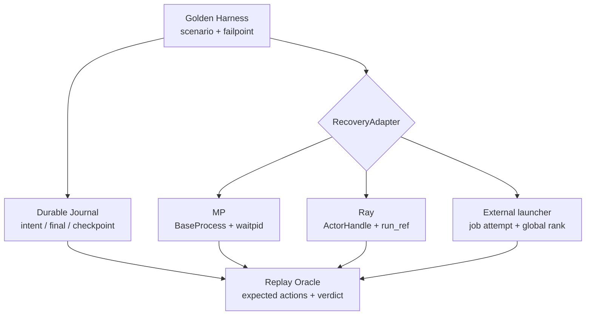
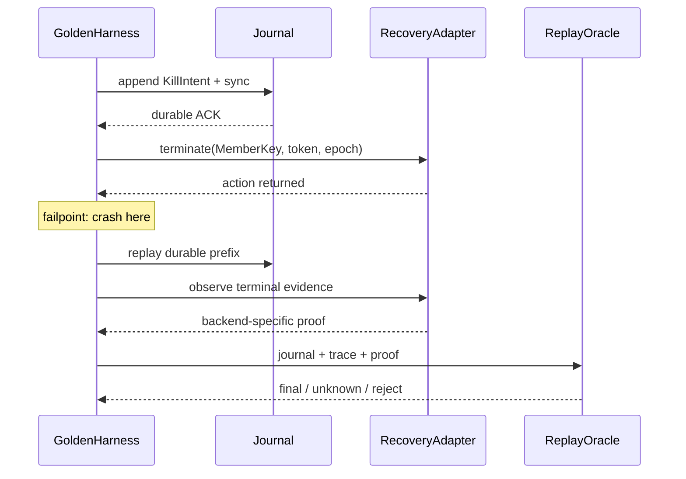

> 本文基于 vLLM 默认分支提交 [`8a236460`](https://github.com/vllm-project/vllm/commit/8a2364605c0b0581ea5d0d3720cb1125b47abc6f)（2026-09-26）。该提交为 speculative draft-token RPC 增加 execute-model timeout，与本文 shutdown/takeover 路径没有语义冲突。本文所写 `FailpointDriver`、`RecoveryAdapter`、durable journal 与 replay oracle 均是基于现有代码缺口提出的测试设计，不是已合入接口。

## 本篇在课程路线中的位置

第 37 章把 MP、Ray 与 external launcher 的 terminal evidence 分开；第 38 章又说明 owner 崩溃后必须以 `owner_epoch` fencing 接管；第 39 章把接管拆成 `create/register/kill/reap/final/checkpoint` 六个崩溃边界。本章只解决一个问题：**怎样让同一套 crash-recovery golden 在三种 backend 上可重复、可判定，而不把不同 owner 的证据伪装成相同的 `join()`？**

课程位置是：

`fenced takeover → crash boundary → backend adapter → replay oracle → fault-injection E2E`

## 前置知识回顾

上一章已经确认三个不变量：

1. destructive action 前必须先持久化 intent；
2. action、terminal observation、owner proof 与 durable final 是不同层次；
3. 同一个 operation id 重放同一 payload 可以幂等，换 payload 必须 fail closed。

本章再加一个更严格的不变量：**semantic parity 不等于 syscall parity**。三种 backend 可以收敛为同一种 `MemberFinal` verdict，但其中的 proof 字段必须保留 `direct_reaped`、`actor_terminal` 或 `launcher_reaped`，不能全部压成 `exited=true`。

## 本篇要回答的核心问题

- deterministic failpoint 应插在业务函数的哪一侧，才能覆盖 ACK 丢失而不是依赖 `sleep()` 猜时序？
- MP、Ray 与 external launcher 分别由谁执行 destructive action、谁有资格签发 terminal evidence？
- replay oracle 的输入、输出和拒绝条件是什么？怎样验证“没有双重回收”而非只验证“最后进程没了”？

## 组件在全局架构中的位置

当前代码有三条真实 owner 链：

- MP：[`CoreEngineProcManager`](https://github.com/vllm-project/vllm/blob/8a2364605c0b0581ea5d0d3720cb1125b47abc6f/vllm/v1/engine/utils.py#L144-L274) 持有 `BaseProcess`；通用 [`shutdown`](https://github.com/vllm-project/vllm/blob/8a2364605c0b0581ea5d0d3720cb1125b47abc6f/vllm/v1/utils.py#L615-L668) 先 TERM、共享 deadline 内 `join()`，仍存活则 `kill_process_tree(pid)`。
- Ray：[`CoreEngineActorManager`](https://github.com/vllm-project/vllm/blob/8a2364605c0b0581ea5d0d3720cb1125b47abc6f/vllm/v1/engine/utils.py#L397-L1030) 持有 `ActorHandle`、`run_ref` 与 placement group；shutdown 调 `ray.kill(actor)` 后移除 placement group。
- external launcher：[`ExecutorWithExternalLauncher`](https://github.com/vllm-project/vllm/blob/8a2364605c0b0581ea5d0d3720cb1125b47abc6f/vllm/v1/executor/uniproc_executor.py#L161-L207) 每个进程只创建一个本地 worker，并从 `RANK/LOCAL_RANK` 接入 `env://`；rank group 的创建与回收属于 torchrun 等外部 supervisor。

因此共享 harness 应位于这些 owner 之上：它只定义日志状态机与期望结果；每个 backend adapter 负责把抽象 action/proof 翻译为自己真正拥有的操作。

## 完整调用链

以“owner 在 destructive action 返回后、final 落盘前崩溃”为例，共享链路应是：

1. harness 构造 `MemberKey(group_generation, backend, member_id, member_generation)` 与新 `owner_epoch`；
2. registry 以 CAS 获得 owner lease；
3. journal durable append `KillIntent(op_id, member_key, owner_epoch, action_hash)`；
4. adapter 执行 `terminate(member_token)`；
5. `after_action_return` failpoint 触发进程级 crash，故意跳过 ACK/final；
6. 新 owner replay journal，发现 durable intent 而无 durable final；
7. adapter 读取 backend snapshot，返回 owner-specific evidence；
8. oracle 比较实际 action trace、证据类别、最终 verdict 与预期，并检查旧 epoch 没有再次执行破坏动作；
9. 只有满足 backend proof contract 才追加 `MemberFinal`，全部 expected members 收敛后才 checkpoint `GroupFinal`。

这条链目前不是生产代码事实；它是把现有 owner API 放进可恢复协议后的最小可测试调用链。现有代码的真实末端分别停在 `kill_process_tree`、`ray.kill/remove_placement_group` 和本地 `WorkerWrapperBase.shutdown`。

## 关键类型、字段和状态生命周期

建议 harness 的输入输出都使用纯控制面记录，不携带模型 tensor；因此没有 shape/dtype/device。若未来走 msgpack wire，应把整数宽度、枚举和 hash bytes 固化成 schema golden。

| 类型 | 关键字段 | 所有者与生命周期 | 失败方式 |
| --- | --- | --- | --- |
| `MemberKey` | `group_generation, backend, member_id, member_generation` | create 前生成，直到 `GroupFinal` checkpoint 后才可退休 | 裸 PID、裸 rank 或可复用 actor name 会别名到新成员 |
| `KillIntent` | `op_id, owner_epoch, member_key, action_hash` | journal 在 action 前持有；replay 时是唯一授权来源 | 未 sync 就 action 会产生不可追踪成员；同 ID 不同 hash 是冲突 |
| `BackendEvidence` | `kind, token, terminal_state, observed_at` | adapter 创建，oracle 消费；不能跨 generation 复用 | control plane unavailable、token 不匹配、observer 无权限 |
| `MemberFinal` | `verdict, evidence_kind, op_id, owner_epoch` | registry/WAL 持有，参与 group 聚合 | 用 weak evidence 冒充 strong proof；旧 epoch late final |
| `ReplayDecision` | `reissue, accept_final, quarantine, reason_code` | oracle 单次纯函数输出；执行器按它行动 | 非确定性时间依赖、输入快照不完整、reason 不稳定 |

状态生命周期是 `Prepared → ActionIssued → TerminalObserved → OwnerProven → FinalDurable → Checkpointed`。crash 后不能根据“没有进程”跳级；只能由 durable prefix 与当前 backend evidence 重新推导。

## 逐函数源码解读

### 1. MP：handle 在 parent，强证据是 direct-child reap

`CoreEngineProcManager.__init__` 创建并保存 `BaseProcess`；其 `shutdown()` 最终进入通用 `shutdown(procs, timeout)`。后者 TERM 后调用 `proc.join(remaining)`，但强杀分支只对 PID 执行 `kill_process_tree`，之后没有统一的 KILL→`join()`。Executor 内部也类似：[`MultiprocExecutor._ensure_worker_termination`](https://github.com/vllm-project/vllm/blob/8a2364605c0b0581ea5d0d3720cb1125b47abc6f/vllm/v1/executor/multiproc_executor.py#L453-L503) 给 worker grace、TERM 4 秒、最后 `p.kill()`，却不在同一函数内 reap。

MP adapter 因而可以确定性模拟 `is_alive/terminate/kill/join/exitcode`，但 replay oracle 必须区分：

- `kill_called=true`：只证明 action 被请求；
- `exitcode!=None`：证明 parent 观察到终止；
- `join` 消费 direct-child exit status：才可置 `direct_reaped=true`；
- owner 已崩溃且新 owner不是 parent/subreaper：即使 PID 消失，也只能得到 `containment_unknown`。

### 2. Ray：强证据由 Ray runtime 签发，不是本地 waitpid

[`CoreEngineActorManager.monitor_engine_liveness`](https://github.com/vllm-project/vllm/blob/8a2364605c0b0581ea5d0d3720cb1125b47abc6f/vllm/v1/engine/utils.py#L989-L1017) 对 `run_ref` 执行 `ray.wait/ray.get`，捕获 `RayActorError`；`shutdown()` 则直接 `ray.kill(actor)` 并移除 placement group。调用进程不持有远端 OS child handle，所以 MP 的 `join()` oracle 在这里没有意义。

Ray adapter 至少要绑定 `(actor identity, run attempt, placement-group identity, owner_epoch)`。`ray.kill` 返回后若 control plane 暂不可用，不能凭 handle RPC 失败立即写 `actor_terminal=true`；RPC 失败也可能来自网络或 control-plane 故障。测试 double 应脚本化 actor state 和 placement-group state，使相同 journal 输入总得到相同 snapshot；少量真实 Ray E2E 再校准 `RayActorError` 与资源回收的实际关系。

### 3. External launcher：本地 cleanup 不是 group terminal

`ExecutorWithExternalLauncher` 继承 `UniProcExecutor.shutdown()`，只关闭当前 rank 的 `driver_worker`。`_distributed_args()` 从环境取全局 `RANK` 与 `LOCAL_RANK`；其中全局 `RANK` 才能标识 expected member，所有进程内的 worker 都可能是局部 `rpc_rank=0`。因此 rank adapter 最多发布 `local_cleanup_complete`；只有外部 launcher 能用 `(job_id, launch_attempt, global_rank)` 证明 rank terminal，并在全部成员收敛后发布 group terminal。

这也是为什么单进程 pytest fixture 不能伪装成 external-launcher recovery golden：必须有一个 fake launcher/supervisor 端，能够脚本化 rank create、exit、restart、late report 与 job-attempt rollover。

## 具体示例与状态演算

设 TP=2，`group_generation=17`，成员 `rank0/rank1`，接管 owner 从 epoch 4 崩溃后升到 epoch 5。对 rank1 的 `op_id=kill-17-1-9`，failpoint 固定在 action 返回之后：

| 时刻 | durable journal | backend 现场 | oracle 结论 |
| --- | --- | --- | --- |
| t0 | `KillIntent(epoch=4)` 已 sync | rank1 尚存活 | epoch 4 有执行权限 |
| t1 | 无新增 | destructive action 已调用 | action return 不等于 terminal |
| t2 | owner 4 崩溃 | ACK/final 丢失 | 新 owner只能 replay，不能创建新 op |
| t3 | owner 5 CAS 成功 | 查询同一 member token | 旧 epoch 后续 action/final 一律拒绝 |

三种 backend 在 t3 的正确分歧是：

- MP：若 owner 5 是合法 subreaper 且成功 `waitpid`，可写 `direct_reaped`; 若只有 PID 不存在，写 `containment_unknown` 并 quarantine 共享资源。
- Ray：若 control plane 对同一 actor/run attempt 返回 terminal，可写 `actor_terminal`; state 不可查询则 unknown，不能改用本机 `ps` 猜测。
- external launcher：若同一 job attempt 报告 global rank 1 已被 launcher reap，可写 `launcher_reaped`; 只有 rank0 看到通信断开仍是 unknown。

尽管 proof 不同，oracle 的共同断言完全一致：旧 epoch 没有第二次 destructive action；相同 op/payload 的 replay 是幂等的；成员 generation 没变；只有 strong owner proof 才把 verdict 推进到 contained；`GroupFinal` 不会在 rank0/rank1 任一 unknown 时 checkpoint。

## 为什么这样设计及替代方案

方案一是写一个通用 `kill(); join()` wrapper。它代码最少，却假设所有 backend 都拥有 OS child，Ray 和 external launcher 会被迫伪造证据，正确性不可接受。

方案二是三套完全独立测试。它忠于 backend，但六个边界、op-id 冲突、epoch fencing 和 checkpoint 规则会复制三遍，维护成本高，且最容易出现“MP 拒绝旧 epoch、Ray 却忘了”的协议漂移。

更稳妥的是**共享纯状态机 + owner-specific adapter**：

- 延迟/吞吐：单测用虚拟 clock 与脚本化 snapshot，不等待真实 5+4 秒；CI 只保留少量真实 backend E2E，速度和稳定性更好。
- 显存：大多数 golden 无需加载模型；真实 GPU/NCCL hang 仅做校准，降低资源成本。
- 并发：harness 以 step barrier 精确放行每个动作，能枚举 ACK-loss 窗口，不靠概率竞争。
- graphability：这是控制面协议，不进入 CUDA Graph；代价是要维护稳定的 adapter contract。
- 正确性：共享 oracle统一 fencing/幂等不变量，backend proof 又不被抹平。
- 维护成本：新增 backend 只实现 action/snapshot/evidence 三个接口，并复用同一 scenario matrix。

## 性能、并发、正确性与边界条件

deterministic 不等于串行。adapter 可接受 `StepGate(name, occurrence)`：目标线程到达 gate 后阻塞，test driver 原子检查 journal，再选择 crash、continue 或 duplicate delivery。这样可以稳定复现“sync 已完成但 ACK 未返回”“terminal 已观察但 final 未 sync”等窗口。

必须额外覆盖：owner epoch CAS 与 adapter action 并发；同一 op 被两名 owner 重放；Ray actor restart 复用名称；torchrun 新 job attempt 复用 `RANK=1`；MP PID reuse；checkpoint temp file 已 sync 但 rename 未完成。任何 token/generation 不匹配都应返回 `STALE_MEMBER`，而不是 best effort kill。

生产开销方面，本文无法从当前代码测得，因为 registry/WAL 尚未实现。基于证据的推断是：若 future implementation 把 journal fsync 放进正常请求 hot path，会直接放大尾延迟；更合理的边界是只在 create/destructive/final 等低频控制面事件持久化，并以 benchmark 验证 group commit 与恢复时间。

## 测试证据与未覆盖风险

当前测试事实如下：

- [`test_engine_core_process_shutdown_timeout`](https://github.com/vllm-project/vllm/blob/8a2364605c0b0581ea5d0d3720cb1125b47abc6f/tests/v1/engine/test_startup_watch_processes.py#L36-L72) 用 fake finalizer 验证重复 shutdown 只调用一次，并验证 ROCm cleanup timeout 选择；它不注入 action 后 owner crash。
- [`test_multiproc_executor_worker_termination_timeout`](https://github.com/vllm-project/vllm/blob/8a2364605c0b0581ea5d0d3720cb1125b47abc6f/tests/v1/executor/test_executor.py#L48-L91) 用 fake clock/process 验证 worker 在 grace 内退出则不 TERM、超时则 TERM；fake process 没有 `kill/join/exitcode`，所以未覆盖 KILL→reap。
- [`test_core_engine_actor_manager`](https://github.com/vllm-project/vllm/blob/8a2364605c0b0581ea5d0d3720cb1125b47abc6f/tests/v1/engine/test_core_engine_actor_manager.py#L163-L207) 的 Ray 用例在 `finally` 调正常 `manager.shutdown()`，重点验证 runtime env 隔离；没有 actor-kill crash boundary 或 control-plane loss oracle。
- [`test_torchrun_example.py`](https://github.com/vllm-project/vllm/blob/8a2364605c0b0581ea5d0d3720cb1125b47abc6f/tests/distributed/test_torchrun_example.py) 验证各 rank 的 KV block 数、参数数和输出一致；没有 launcher attempt、单 rank hang 或 group reap。
- shutdown E2E 的 [`_assert_children_cleaned_up`](https://github.com/vllm-project/vllm/blob/8a2364605c0b0581ea5d0d3720cb1125b47abc6f/tests/entrypoints/launchers/test_shutdown.py#L41-L65) 明确把 zombie 排除出 `still_alive`，因此不能证明 direct child 已被 reap。

近期已合入的 [PR #52281](https://github.com/vllm-project/vllm/pull/52281) 与 [PR #52282](https://github.com/vllm-project/vllm/pull/52282) 改进了 cleanup grace 和测试服务器的外层等待预算，但没有引入 durable owner registry 或 replay oracle。[PR #44428](https://github.com/vllm-project/vllm/pull/44428) 的 fault-tolerance `retry` 只处理仍存活 EngineCore 内的可恢复状态，也不能替代 manager/launcher crash takeover。

未覆盖的最大风险是 test double 与真实 backend 语义漂移：Ray state API、torchrun/Slurm/Kubernetes 的终态定义、Linux subreaper/pidfd 行为都需要契约测试；另外还缺 registry partition、torn checkpoint、late GPU work 与 owner crash 的联合 E2E。

## 与前后章节的连接

本章把第 39 章的抽象六边界落到了三个真实 owner 上，也解释了为何 cross-backend golden 比较的是状态机、fencing 和 final verdict，而不是底层 syscall。下一章应继续收紧 oracle：当 registry 本身发生 partition、旧 owner 恢复并同时行动时，怎样通过 linearizable CAS、operation lease 与 reconciliation 保证 destructive action 仍然至多一次。

## 本篇结论、知识债、三个理解检查问题和下一章

结论只有一句：**共享状态机，保留证据来源。** deterministic harness 应固定 journal 边界与并发放行点；replay oracle 应是 journal、backend snapshot 和 owner epoch 上的纯函数；MP、Ray、external launcher 则分别提供 direct-reap、actor-terminal、launcher-reap 证据。

知识债：实际 `OwnerLease/KillIntent/MemberFinal` schema、durable CAS/WAL、MP KILL 后 join 与 subreaper/pidfd、Ray run-attempt state adapter、launcher job-attempt API、stable reason code、torn-checkpoint recovery、真实 native/GPU hang 校准。

理解检查：

1. 为什么 `ray.kill()` 返回不能直接映射成 MP 的 `direct_reaped=true`？
2. external launcher 中为什么必须用 global `RANK + job attempt`，不能用每个进程内部的 `rpc_rank=0`？
3. owner 在 action return 后崩溃时，replay 为什么必须复用原 `op_id`，而不是生成一个“更安全”的新 kill operation？

下一章：**Registry 分区时谁有权 KILL——Linearizable CAS、Operation Lease 与 Split-brain Reconciliation。**

## 课程账本增量

- 第 40 章；源码基线：`8a236460`。
- 新覆盖：`CoreEngineProcManager/CoreEngineActorManager`、通用 `shutdown`、`MultiprocExecutor._ensure_worker_termination`、`ExecutorWithExternalLauncher` 以及对应 MP/Ray/torchrun 测试。
- 新不变量：cross-backend parity 比较共享状态机与 verdict，但 owner proof 必须保持 `direct_reaped/actor_terminal/launcher_reaped`；deterministic failpoint 放在 durable transition 与外部 action 的边界；replay 输入必须包含 journal、backend snapshot、member token 与 owner epoch。
- 新知识债：三类真实 adapter、durable registry、stable reason code、step-gated concurrency harness 与 backend calibration E2E。
- 下一章：Registry partition 下的 action authority 与 split-brain reconciliation。
