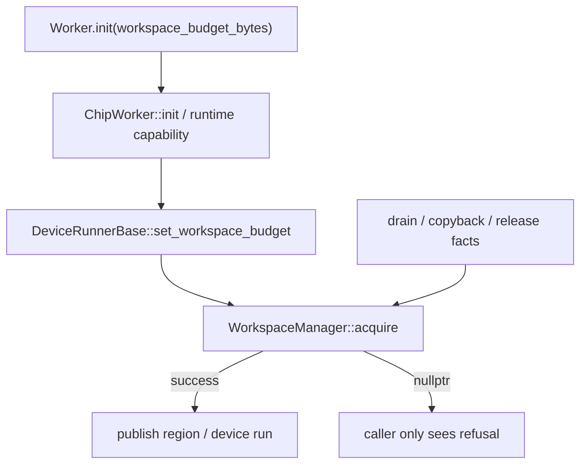
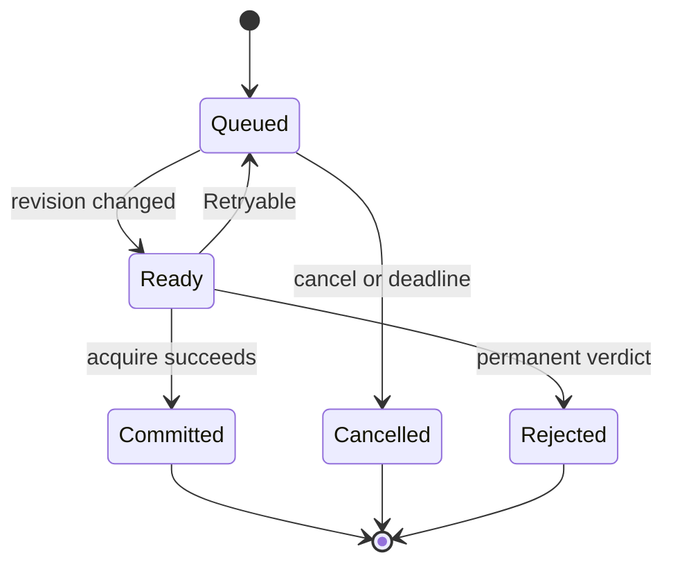

> 源码基线：simpler [`c605b03c`](https://github.com/hw-native-sys/simpler/commit/c605b03cad7be2a80700efbdf3bd00dbc79812a9)，为 2026-09-27 核验时 `main` 最新提交。workspace ledger 来自已合入 [PR #2440](https://github.com/hw-native-sys/simpler/pull/2440)；父 run FIFO 边界由已合入 [PR #2314](https://github.com/hw-native-sys/simpler/pull/2314) 的回归测试固定。本文中的 `AdmissionVerdict`、recovery-priority queue 与 `admission_revision` 是基于当前接口缺口推导的建议设计，**不是主干已有类型**。

## 本篇在 PTO 课程路线中的位置

课程 47 已确认：completion unknown 的 workspace 不能被静默复用；`WorkspaceManager` 用 whole-block ownership ledger 与有限 `workspace_budget_bytes` 把安全代价变成同步 admission refusal。

本章接住拒绝之后的问题：**调用方只得到 `nullptr`，究竟应该立即失败、等待某个 run 退休、触发 recovery，还是永远不要重试？如果要等待，谁先走，怎样避免等待者反过来卡住释放容量所需的工作？**

路线推进为：

`whole-block budget → structured verdict → progress-capable recovery priority → revision wakeup → recheck`

## 前置知识

两个不变量不能让步：

1. `capacity` 不等于 overwrite permission。即使 block 足够大，只要旧 run reference 未退休，就不能复用。
2. 可计费字节满足守恒：只有 backend release 成功后，`reserved_bytes` 才能减少；quarantine、unmap/free 失败和 current backing 都继续占预算。

因此 backpressure 不是单纯的“内存不够”。它是 ownership、completion evidence 与 allocation capacity 的联合结论。

## 今日核心问题

本文只讲一条因果链中的两个紧密问题：

1. `WorkspaceManager::acquire()==nullptr` 丢失了哪些决定重试策略的事实？
2. 怎样让能够减少占用或补齐 completion facts 的 recovery 工作优先，同时保持正常请求最终可进展，并避免 lost wakeup 与锁环？

## PTO 全栈中的位置



上游是 Python Worker 初始化、run prepare 与 region growth；核心 owner 是 host runtime 的 `WorkspaceManager`；下游消费者包括 arena、retained staging、device run、copyback 与 bindings release。这里没有 Tile shape/dtype：请求是 `RegionKey + run_epoch + bytes`，memory location 是同一 device context 管理的 workspace allocation。它位于 ISA 之上、kernel 执行之下的 runtime ownership 层。

## 概念和精确语义：当前 `nullptr` 混合了不同世界

当前 [`workspace_manager.h`](https://github.com/hw-native-sys/simpler/blob/c605b03cad7be2a80700efbdf3bd00dbc79812a9/src/common/platform/include/host/workspace_manager.h) 的 `acquire(region, run_epoch, bytes)` 在 manager mutex 下依次尝试：

- 复用同 region、容量足够、未 quarantine、无 release failure 且 `ref_count==0` 的 block；
- 否则由 `make_room_locked(bytes)` 释放 eligible obsolete generation；
- 再调用 backend allocate；
- 任一条件不满足就返回 `nullptr`，并保证 published address、charge 与 references 不变。

这个 all-or-nothing 后置条件很好，但 `nullptr` 至少可能表示：

| 类别 | 当前可观察原因 | 是否值得重试 |
| --- | --- | --- |
| 状态门 | manager disabled、`bytes==0`、`Admission::Closed` | 通常永久失败 |
| 活跃 consumer | 合适 block 仍有 `ref_count` | run 退休后可重试 |
| 预算压力 | current + protected obsolete + request 超 limit | 取决于是否存在可完成 consumer |
| quarantine | 最后 consumer 已不可证明 | 普通 completion 不会解除 |
| release 不确定 | unmap/free 失败，仍计费 | 需要 recovery/reset 或人工处置 |
| allocator failure | backend acquire 返回 null | 可能瞬态，也可能资源耗尽 |

代码事实是“这些情况最终都映射为 null”；**不是**“当前实现已经能返回上表 reason”。此外，`Admission::DrainOnly` 仍允许 `acquire`，因为已接受 run 的 drain/收尾可能还需要完成既有 plan；它不能被简单解释成“任何 allocation 都禁止”。

## 真实文件、类型与 API 逐段解读

当前接口把预算能力、allocation backend 与 run facts 分在三层：Python surface 负责 opt-in，ChipWorker/DeviceRunner 负责 ABI 与 allocator，WorkspaceManager 只消费稳定 identity 与事实。

## 端到端调用链或指令链

完整入口链是：

1. Python [`Worker.init(..., workspace_budget_bytes)`](https://github.com/hw-native-sys/simpler/blob/c605b03cad7be2a80700efbdf3bd00dbc79812a9/python/simpler/task_interface.py) 声明预算只覆盖 retained temp 与三个 pooled arena region，且 `0` 表示关闭。
2. [`ChipWorker::init`](https://github.com/hw-native-sys/simpler/blob/c605b03cad7be2a80700efbdf3bd00dbc79812a9/src/common/worker/chip_worker.cpp) 同时解析 set/report 两个 runtime symbol；要求预算而 module 不支持时直接报错，不会静默退回 unmanaged。
3. [`DeviceRunnerBase::set_workspace_budget`](https://github.com/hw-native-sys/simpler/blob/c605b03cad7be2a80700efbdf3bd00dbc79812a9/src/common/platform/onboard/host/device_runner_base.cpp) 把 `MemoryAllocator::Reservation` 封成 backend acquire，并规定 unmap 成功后才能 free。
4. prepare thread 用 thread-local `WorkspacePlanIdentity` 绑定 `run_epoch` 与 `RegionKey`；arena/staging growth 最终调用 `workspace_.acquire`。
5. device drain、copyback 与 bindings 边界通过 `note_run_fact` 提交事实；只有 device side settled、`CopybackReturned`、`BindingsReleased` 同时成立，run references 才退休。

### 逐函数源码解读

**`WorkspaceManager::acquire`** 先在同一个 mutex 快照里检查复用候选。候选必须同时满足 region identity 相同、容量不小于请求、没有 quarantine/release-unconfirmed、尚未 release，且 `ref_count==0`。最后一个条件不是性能优化，而是覆盖权限。如果已有 block 装得下 4 MiB，但旧 run 仍可能从中 copyback，返回同一地址就会让新 writer 与旧 reader 发生物理 WAR。找不到复用候选后，函数才进入新 allocation 路径。

**`make_room_locked`** 不是通用 LRU。它只扫描已经被 successor publication 变成 obsolete 的 generation；current block 即使零引用也跳过，因为它仍是 context 对该 region 的已发布 backing。对 obsolete block 还要排除 quarantine、release-unconfirmed、retained host mapping 与非零 reference。backend release 失败时，代码把状态记为 `ReleaseUnconfirmed` 并继续计费，避免“账面腾出、设备仍占有”造成双发地址。

**`publish_new_block`** 在设备 allocation 前预留 ledger vector 容量，backend 又通过 `MemoryAllocator::Reservation` 预留 tracking node。这是失败原子性的关键：平台分配之后不会再因为 host bookkeeping allocation 抛错而留下无人记录的 device pointer。新 block 创建后先带上 `run_epoch` reference；只有 region publication 完成，旧 current generation 才真正变 obsolete。

**`note_run_fact`** 接收的是边界事实，不猜测调用返回值。device 一侧必须是 `DrainProvedComplete` 或 `NoDeviceSubmission`，host 一侧还必须同时出现 `CopybackReturned` 和 `BindingsReleased`，才会 `drop_run_refs`。若 `ContextDestroyed` 先到，代码 whole-block quarantine 当前仍被该 run 引用的 allocation。由此可见，admission waiter 真正依赖的不是“过了一段时间”，而是这些事实的单调状态转换。

**`WorkerThread::activate_prepared`** 则在 `admission_mu_` 与 lane mutex 下把 staged successor 移到 active lane。它处理的是 device execution lane 的有序占用，不读 workspace ledger，也不知道失败请求缺多少字节。把 memory waiter 直接塞进这个 FIFO 会混合两种资源：前者等待 run order，后者等待 capacity/permission。若 FIFO head 正好需要一个排在后面的 cleanup 才能释放内存，就会把顺序保证变成进展阻塞。

父 run 的 execution 顺序是另一条链。[Worker Manager 文档](https://github.com/hw-native-sys/simpler/blob/c605b03cad7be2a80700efbdf3bd00dbc79812a9/docs/worker-manager.md) 明确 two-frame endpoint 可 staged 一个 successor，但必须等它成为 FIFO head 后，`activate_prepared(run_id)` 才能让 device work 变 active。这个 FIFO 保证“谁可以执行”，却没有表达“谁因 workspace budget 被拒绝、等待什么状态变化”。

## 对象生命周期：建议的 `AdmissionTicket`

要保持当前失败无副作用，等待对象不应预先拥有 device pointer。建议生命周期是：



`AdmissionTicket` 只保存 request identity、bytes、class、deadline、observed revision 与 stable reason；直到 `Committed` 才取得 block/reference。通知只是“事实可能改变”，不是 reservation，也不是复用许可证。

## 从约束推导最小 `AdmissionVerdict`

这不是要求一开始就发明庞大错误体系。最小充分契约可以是：

```cpp
struct AdmissionVerdict {
    enum class Action { AdmitNow, Retryable, RejectPermanent };
    enum class Reason {
        BudgetPressure, LiveConsumer, QuarantinePressure,
        ReleaseUnconfirmed, AdmissionClosed, AllocationFailed
    };
    Action action;
    Reason reason;
    uint64_t observed_revision;
    uint64_t needed_bytes;
};
```

关键是三个语义：

- `AdmitNow`：同一锁快照内已满足容量与权限，随后原子 commit。
- `Retryable`：存在公开进展路径，例如某个 live run 仍能报告 completion/copyback/binding facts。
- `RejectPermanent`：当前 execution domain 没有普通进展路径；例如 closed，或事实源已消失并进入 quarantine。更高层 reset/recreate 仍可能改变它，但普通 waiter 不应自旋。

`needed_bytes` 用于观测，不是“保证腾出多少”；`observed_revision` 用于无丢失唤醒。

## 具体 6 MiB 演算

设同一 staging region 中，budget=6 MiB，current g2=2 MiB；obsolete g1=1 MiB，但仍被 run R1 的 copyback/bindings 引用；normal request N 想生成 g3=4 MiB。

第一次检查：

[
2	ext{ MiB}+1	ext{ MiB}+4	ext{ MiB}=7	ext{ MiB}>6	ext{ MiB}
]

g1 虽 obsolete，但 `ref_count>0`，`make_room_locked` 不能释放。当前实现返回 `nullptr`；建议 verdict 是 `Retryable(LiveConsumer, revision=37, needed=1 MiB)`。

recovery work C 随后提交 R1 的 `CopybackReturned` 与 `BindingsReleased`；若 device completion 已知，R1 退休，g1 reference 归零。release g1 成功后：

[
reserved=3-1=2	ext{ MiB},qquad 2+4=6	ext{ MiB}
]

owner 把 revision 更新为 38 并唤醒 waiter。N **重新执行完整 admission**，回收/分配成功后才进入 `Committed`。

若 R1 在事实闭合前 `ContextDestroyed`，g1 进入 whole-block quarantine。revision 同样应变化，但 N 的 recheck 会得到 `QuarantinePressure`，不能把一次 notify 误当成 1 MiB 已释放。

### 一次拒绝的真实状态生命周期

把 N 的一次请求拆开看，能够看到为什么 ticket 不能提前占有 block。N 首先在 revision 37 上读取 ledger：g2 是 current，g1 是 obsolete 但仍有 R1 reference，因此没有任何可释放候选。此时 N 只把“我需要 4 MiB、当前至少短缺 1 MiB、进展依赖 R1”写入 host ticket；它没有调用 device malloc，也没有改 g2 的 current 标记，更没有给 g1 增加第二个 owner。

C 执行 cleanup 后，R1 的 device、copyback、bindings 三类事实闭合。ledger 在同一临界区内先删除 R1 reference，再尝试 release g1，最后才推进 revision。这样 revision 38 表示“判定输入发生过完整转换”，而不是“某个线程打算释放”。如果 release 返回错误，revision 仍可变化，让 waiter 重新得到 `ReleaseUnconfirmed`；但 `reserved_bytes` 不减，N 仍不能 commit。

当 N 醒来时，它不能沿用 revision 37 计算出的短缺量，因为期间还可能有另一个 ticket 先提交，或 g2 被新的 run 引用。N 必须重新读取 current/obsolete/reference/quarantine/release 状态。只有本轮检查与 allocation commit 属于同一受保护事务，才能把“可重试”提升为“已准入”。这也是为什么 ticket 是调度意图，而 allocation reference 才是运行时所有权。

## 为什么 recovery 可以优先，但普通“高优请求”不可以

队列目标是在安全预算内最大化可完成工作。建议只给具有**单调进展潜力**的任务 recovery class：

- 能补齐 `DrainProvedComplete/CopybackReturned/BindingsReleased`；
- 能完成已启动的 unmap/release；
- 能发布可信 reset witness，或把 unknown 明确收敛为 quarantine；
- 不再新增同一受限 budget 的长期 ownership。

正常 prepare 会增加或保持 demand，不应冒充 recovery。单 FIFO 的危险是：需要 4 MiB 的 normal ticket 排在 R1 cleanup 前，而 cleanup 正是释放 g1 的唯一办法，于是形成 head-of-line liveness failure。

严格 recovery priority 又可能让 normal 永久饥饿。更稳妥的是“recovery 先行直到当前 progress debt 清除，再回到公平 normal policy”；具体 burst、reserve 或 aging 必须由拒绝率、cleanup service time 与 SLA 测量校准，不能从源码拍固定百分比。

## Deadlock-free wakeup：先发布事实，再在锁外通知

最危险的替代方案是在 `WorkspaceManager::acquire` 内持 `mu_` 等 condition variable。容量释放路径本身也要进入 `note_run_fact`、`release_unreferenced` 或 allocator/unmap；waiter 持锁睡眠会阻止 producer 产生唤醒条件。

建议协议：

1. 在 ledger lock 下计算 verdict、读取 revision，绝不阻塞。
2. 调用方释放 ledger、allocator reservation、scheduler admission、binding 等所有 progress dependency。
3. waiter 以 `observed_revision` 注册，随后再次比较 revision；若已变化就不睡，关闭“检查后、入睡前”的 lost wakeup。
4. producer 完成状态转换和记账后递增 revision；释放 ledger lock 后 notify。
5. waiter 醒来只获得 recheck 权，不获得 allocation；cancel/deadline 必须能删除 ticket。

这还要求与当前 `WorkerThread::activate_prepared` 的 `admission_mu_` 保持锁序边界：workspace waiter 不能持 scheduler admission lock 等待 run retirement，否则 retiring run 的 promotion/progress 可能反向需要同一锁。

### 正确性条件

把某次准入写成约束更清楚。设 `B` 为 hard budget，`R` 为当前仍计费字节，`x` 为新请求，`F` 为本事务中已经成功释放的 obsolete bytes。只有同时满足 `R - F + x <= B`，并且候选 block 的所有 consumer 已退休，准入才成立。前一个条件是容量约束，后一个条件是权限约束，任何 priority 都不能修改它们；调度只能选择先执行哪条合法 transition，不能把不安全状态改名为成功。

可重试也有一个必要条件：系统中必须存在尚可执行的 transition，能够让 `F` 增大、让 reference 减少，或把 unknown 收敛成明确 terminal。若唯一事实源已经销毁，普通等待不会改变约束；继续排队只会占用 ticket、放大尾延迟并掩盖真正的 quarantine。相反，只要 run 仍可 drain/copyback/release，立即永久失败又会浪费可以安全回收的容量。因此 verdict 的 action 是从可达状态推导出来的，不是错误信息的漂亮包装。

## 为什么这样设计及替代方案

| 方案 | 优点 | 主要风险 |
| --- | --- | --- |
| 当前同步 null | 状态最少；失败严格无副作用 | 原因不透明；只能盲重试或失败 |
| 单 FIFO + condition variable | 表面公平，易实现 | recovery 被 normal 阻塞；锁环与 lost wakeup |
| 严格 recovery priority | 容量债收敛快 | recovery 洪峰可饿死 normal |
| structured verdict + progress class + revision | 可解释、可测试、等待不持资源 | 多 ticket/reason/revision 状态；需公平指标 |

性能上，这是 host 控制面开销：多一次 verdict 构造、队列操作和 recheck，换取更少的无意义 allocator 尝试与 thundering herd。主干和相关 PR 都没有给出该设计的吞吐收益，因此本文不宣称加速；正确实验应分别量化 queue delay、cleanup service time、拒绝原因分布与 device idle gap。

## 访存、计算、流水、并行和硬件约束

本章不改变任何 PTO ISA 指令、Tile layout 或 kernel 算术：成功路径最终仍得到同一 device address，随后才进入既有 prepare/launch。它改变的是 host admission 的时间顺序。recovery 可与尚未获得 workspace 的 normal ticket 并存，但不能与旧 consumer 对同一 allocation 的 ownership 规则并行绕行。

硬件侧的强约束仍是：只要迟到 DMA、copyback reader 或 device kernel 可能触碰旧 block，host queue 就不能把它判成 free。反过来，queue priority 也不能创造 HBM；它只能让产生 completion/release 证据的控制工作先运行。若 device 已经不可查询，必须保留 quarantine 或取得可信 reset witness。

### 并发前提与失败方式

建议 queue 的 owner 应与 workspace ledger 同属一个 device context，而不是放到任意调用线程。原因是只有它能把 ticket 的等待条件绑定到真实 `run_epoch`、region 与 revision，并在 close/drain 时统一取消。多 prepare thread 可以并发提交 ticket，但同一 ticket 只能有一个 commit winner；超时线程离开后，稍晚的 notify 不能复活它，更不能留下已经增加的 reference。

失败也要按证据分层：allocator null 可以选择有限重试；live consumer 只能等相应 run fact；quarantine 需要 reset/recreate 或明确失败；release-unconfirmed 必须保留 charge。把四者都映射成指数退避会制造两种坏结果：永久原因不断自旋，而真正能被 cleanup 解开的请求又无从向 scheduler 表达依赖。

## 测试证据与未覆盖风险

当前 [`test_workspace_manager.cpp`](https://github.com/hw-native-sys/simpler/blob/c605b03cad7be2a80700efbdf3bd00dbc79812a9/tests/ut/cpp/common/platform/test_workspace_manager.cpp) 已固定：

- `ReuseNeedsBothCapacityAndNoRemainingConsumer`：fits 不等于 permission；
- `AnOverBudgetRequestFailsAndChangesNothing`：8 KiB 超限在 allocation 前失败，ledger 不变；
- `ADestroyedContextQuarantinesTheWholeBlockItHeld`：事实源消失后 whole-block quarantine；
- `GrowthReclaimsAnObsoleteGenerationRatherThanRefusing`：6 MiB 下 1→2→4 MiB 只回收 obsolete generation。

[Scheduler tests](https://github.com/hw-native-sys/simpler/blob/c605b03cad7be2a80700efbdf3bd00dbc79812a9/tests/ut/cpp/common/hierarchical/test_scheduler.cpp) 与 PR #2314 还验证 successor 可 staged，但不能越过未 terminal predecessor 的 FIFO activation。

这些是测试事实；它们**没有**覆盖 structured reason、wait queue、recovery priority 或 wakeup。新增 golden 至少应包括：stable verdict、判定/注册竞态无 lost wakeup、睡眠时零 progress lock、recovery 先释放 debt、recovery 清空后的 normal fairness、quarantine 不忙等、cancel 不发布任何 block，以及上述 6 MiB deterministic replay。

仍未覆盖的设备风险包括 late DMA、unmap failure、allocator OOM 与 reset witness 组合；host UT 不能替代 A3/A5 fault injection。

### 应该观测什么

为了决定后续 watermark 与公平策略，至少要把三段时间分开：ticket 在 normal/recovery queue 的等待时间、cleanup 自身 service time，以及 workspace 已满足但 device lane 尚未激活的时间。只看端到端 latency 会把 memory pressure、host cleanup 与 FIFO execution 混在一起。

同样需要按 reason 统计拒绝次数、首次拒绝到成功的重试轮数、被 quarantine 与 release-unconfirmed 长期占用的字节、唤醒后仍失败的比例，以及因 deadline/cancel 离开的 ticket 数。只有这些分布能回答是否需要 reserve、hysteresis 或 aging；单次 OOM 日志和平均 HBM 利用率都不足以选择策略。

## 与前后章节的连接

上一章把 quarantine 的安全性与预算代价闭合；本章给拒绝增加“可否进展、等待什么、由谁推动”的控制面语义。它也解释了为什么 scheduler FIFO 不能直接复用为 memory admission FIFO：execution order 与 capacity-progress dependency 是两种不同偏序。

下一章将进入 **“Watermark 不是百分比——Cleanup Reserve、Hysteresis 与 Overload Shedding 的校准”**：在已有 reason/queue/wakeup 契约上，定义哪些指标决定暂停 normal admission、保留多少 recovery headroom，以及如何避免阈值附近抖动。

## 本篇结论、知识债、三个理解检查问题和下一章

- 当前 `acquire()==nullptr` 保持失败原子性，却不足以指导 retry、reject 与 recovery。
- 优先权只应授予能减少 ownership debt 或补齐终态证据的工作；业务优先级不能绕过 memory safety。
- notification 不是 grant。安全 waiter 必须以 revision 防 lost wakeup，醒后重跑完整 admission。
- 等待必须发生在 ledger、allocator、scheduler admission 与 binding 锁之外，否则 producer 可能永远进不来。

### 知识债

- 主干尚无 `AdmissionVerdict/AdmissionTicket/admission_revision`；
- 尚无 reason taxonomy、deadline/cancel、fairness/aging 与 queue metrics；
- workspace budget 仍是 partial coverage，A5 scheduler-state 等 retained region 在外；
- 尚无 durable recovery registry、trusted reset witness、subrange interval index 与真机 OOM/late-write/deadlock matrix。

### 三个理解检查问题

1. 为什么收到一次 notify 后仍不能直接把 g1 的地址交给 N？
2. 哪些任务可以进入 recovery class，为什么“高优先级用户请求”不满足同一条件？
3. revision snapshot 怎样消除“检查为 blocked，但真正 wait 前状态已变化”的 lost wakeup？

## 课程账本增量

- 课程：PTO 全栈课程 48
- 仓库：simpler `c605b03c`
- 新覆盖：`WorkspaceManager::Admission/acquire/make_room_locked/note_run_fact`、`DeviceRunnerBase::set_workspace_budget/acquire_arena_backing`、`WorkerThread::activate_prepared` 与 parent-run FIFO tests
- 新不变量：structured verdict 区分可进展与永久拒绝；recovery priority 只授予 progress-capable work；waiter 不持 progress dependency；notify 只触发 recheck
- 待实现：verdict/ticket/revision、无丢失唤醒、deadline/cancel、公平策略与 fault-injection matrix
- 下一章：Watermark、Cleanup Reserve、Hysteresis 与 Overload Shedding
