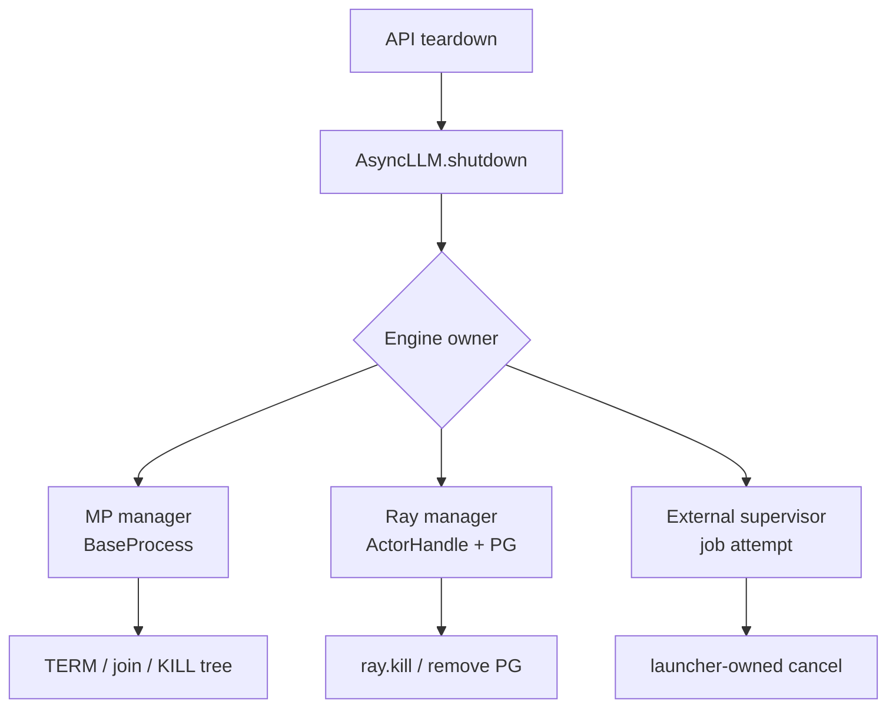
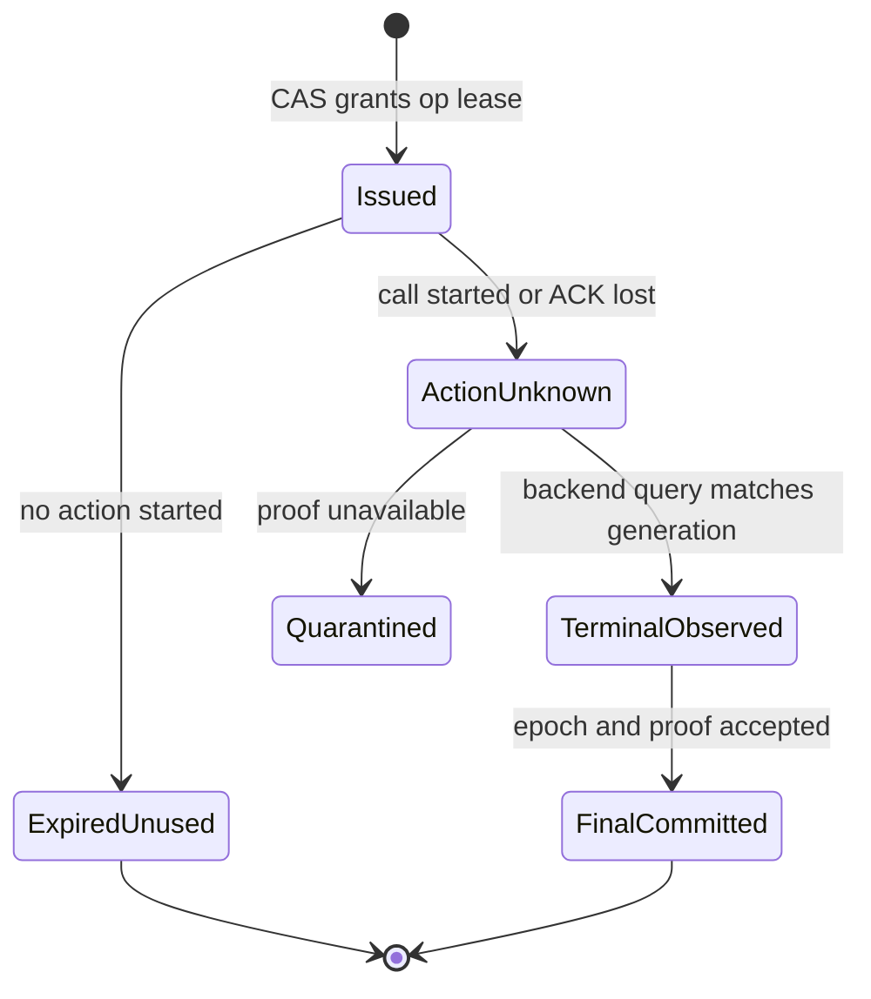

> 本文基于 vLLM 默认分支提交 [`eb0f2ca3`](https://github.com/vllm-project/vllm/commit/eb0f2ca37f65e496e8c67a7497e818c8a92bae46)（2026-09-27）。该提交为 Mooncake 增加 `CUSTOM_MEM_POOL` 支持；相对上一章，本文直接相关的 owner/shutdown 路径没有改变结论的语义变化。文中的 `OwnerLease`、`OperationLease`、linearizable registry 与 reconciliation 状态机是基于当前缺口提出的协议设计，不是 vLLM 已合入接口。

## 本篇在课程路线中的位置

第 38 章说明 failure detector 不能自动授予 takeover 权；第 39 章把恢复拆成 `create/register/kill/reap/final/checkpoint` 六个崩溃边界；第 40 章又将同一 replay oracle 映射到 MP、Ray 与 external launcher。本章只收紧一个仍然危险的窗口：**两个 owner 被网络分区隔开时，谁有权执行不可逆的 KILL？**

课程位置是：

`backend replay oracle → linearizable owner CAS → operation lease → backend fencing → split-brain reconciliation`

## 前置知识回顾

已经确认三条前提：

1. `suspect` 只是观测，不是 cleanup authority；
2. durable `KillIntent` 必须先于 destructive action，且 action 必须绑定 member generation；
3. 动作返回、terminal observed、MP direct reap 与 durable final 是不同证据。

还要补上本章的核心反例：旧 owner 即使最终无法写入 `MemberFinal`，也可能已经执行 `os.kill(reused_pid)`、`ray.kill(new_actor)` 或删除新 attempt 的 placement group。**只在结果写入时检查 epoch 太晚，fence 必须出现在 action 之前。**

## 本篇要回答的核心问题

- registry 不可达时，旧 owner 能否凭本地缓存继续 KILL？
- linearizable CAS、owner lease 与一次性的 operation lease 各自解决什么问题？
- lease 过期、action ACK 丢失或分区恢复后，怎样避免重复 KILL 和误杀新 generation？
- MP、Ray 与 external launcher 的 backend token 为什么不能被统一成裸 PID 或 rank？

## 组件在全局架构中的位置

当前真实入口从 API server 的 context teardown 开始：[`build_async_llm_client`](https://github.com/vllm-project/vllm/blob/eb0f2ca37f65e496e8c67a7497e818c8a92bae46/vllm/entrypoints/launchers/api_server/entry.py) 在 `finally` 中调用 `AsyncLLM.shutdown(timeout=...)`；[`AsyncLLM.shutdown`](https://github.com/vllm-project/vllm/blob/eb0f2ca37f65e496e8c67a7497e818c8a92bae46/vllm/v1/engine/async_llm.py) 再调用 `engine_core.shutdown()`。之后分成两条 owner 路径：

- MP：[`CoreEngineProcManager.shutdown`](https://github.com/vllm-project/vllm/blob/eb0f2ca37f65e496e8c67a7497e818c8a92bae46/vllm/v1/engine/utils.py) 把 `BaseProcess` 交给共享 [`shutdown`](https://github.com/vllm-project/vllm/blob/eb0f2ca37f65e496e8c67a7497e818c8a92bae46/vllm/v1/utils.py)，先 TERM、在共享 deadline 内 `join()`，再按 PID 调 `kill_process_tree`。
- Ray：[`CoreEngineActorManager.shutdown`](https://github.com/vllm-project/vllm/blob/eb0f2ca37f65e496e8c67a7497e818c8a92bae46/vllm/v1/engine/utils.py) 直接遍历 `ActorHandle` 调 `ray.kill(actor)`，随后移除自己创建的 placement group。

external launcher 则不同：[`ExecutorWithExternalLauncher`](https://github.com/vllm-project/vllm/blob/eb0f2ca37f65e496e8c67a7497e818c8a92bae46/vllm/v1/executor/uniproc_executor.py) 只拥有当前 rank 内的 worker wrapper；torchrun、Slurm 或 Kubernetes 才拥有整个 job attempt。



当前代码事实是：这些 owner 各自持有本进程内对象，却没有一个共享的 durable registry、`owner_epoch` CAS、operation lease 或 split-brain arbitration。以下协议是在它们之上补的控制面，不改变推理 tensor data plane。

## 完整调用链

以 MP 为例，当前链为：

1. API server 退出 context，调用 `AsyncLLM.shutdown(timeout)`；
2. `AsyncLLM` 关闭 renderer，再调用 `engine_core.shutdown(timeout)`；
3. `MPClient` 最终触发 `CoreEngineProcManager.shutdown`；
4. manager 只让 finalizer detach 一次，计算 process timeout；
5. 通用 shutdown 对仍存活的 child 发 TERM；
6. 用同一个 monotonic deadline 顺序 `join()`；
7. 收集仍存活的 PID，调用 [`kill_process_tree`](https://github.com/vllm-project/vllm/blob/eb0f2ca37f65e496e8c67a7497e818c8a92bae46/vllm/utils/system_utils.py)；该函数用 `psutil.Process(pid)` 快照递归 children，再向 children 与 parent 发 `SIGKILL`。

这个调用链适合**单个、仍存活、持有原始 `BaseProcess` 的 owner**。若 manager A 崩溃，manager B 只能从 registry 恢复裸 PID，那么 `PID absence/presence` 都不是 generation-safe proof：旧 PID 可能已经复用，A 也可能只是与 registry 分区、仍在执行。

建议链路把第 5 步之前改成：

```text
linearizable CAS owner_epoch
→ durable KillIntent
→ CAS acquire OperationLease(member_generation, action, op_seq)
→ adapter validate backend token
→ destructive action
→ query terminal evidence
→ epoch-matched MemberFinal
```

## 关键类型、字段和状态生命周期

这里没有模型 tensor：输入输出都在 Host 控制面，`shape/dtype/device` 不适用。真正的接口契约如下。

| 类型 | 最小字段 | 所有者与前置条件 | 输出/失败方式 |
| --- | --- | --- | --- |
| `MemberKey` | `group_id, backend, member_id, generation, backend_token` | 创建 member 的 supervisor；token 必须能区分 restart/reuse | 唯一定位一个 execution attempt；缺 token 时只能 unknown/quarantine |
| `OwnerLease` | `holder, owner_epoch, registry_revision, expiry` | linearizable registry；CAS 必须比较旧 revision/epoch | 单调新 epoch；quorum 不可达时拒绝 takeover |
| `KillIntent` | `member_key, owner_epoch, op_seq, action_hash` | 当前 owner；必须 durable-before-action | 为重放提供相同 payload；冲突 duplicate fail closed |
| `OperationLease` | `lease_id, member_key, owner_epoch, op_seq, action, deadline` | 当前 epoch 的 owner；仅允许一个具体动作 | 授权 adapter 一次；过期只撤销未来权限，不证明旧动作未发生 |
| `MemberFinal` | `member_key, owner_epoch, op_seq, backend_evidence` | registry 接受 generation/epoch 匹配的 proof | `direct_reaped / actor_terminal / launcher_reaped / unknown` |

`OperationLease` 生命周期应是 `Issued → ActionUnknown → TerminalObserved → FinalCommitted`。如果在 action 前过期，可标 `ExpiredUnused`；如果调用已经开始，超时或 holder 崩溃只能进入 `ActionUnknown`，不能回到“从未执行”。这是因为 `kill()` 可能已到达 backend，只是 ACK 丢了。



并发假设是 registry 对同一 `group_id` 提供 linearizable compare-and-swap；eventual-consistent cache 只能做观测，不能授权。后置条件是 destructive action trace 中每个 `(member_generation, op_seq)` 至多有一个被接受的执行者。

## 逐函数源码解读

### 1. `CoreEngineProcManager.shutdown`：拥有 direct handle，但权力不能继承

manager 在创建时保存 `self.processes`，shutdown 通过 finalizer detach 保证本对象只走一次，再把原始 handle 交给通用关闭函数。这能防止同一 Python owner 重复 teardown，却不能让新 owner从 durable state 继承 `waitpid` 权。新 owner如果只拿到 PID，不再拥有 direct-child reap 关系。

### 2. `_shutdown_subprocesses` 与 `kill_process_tree`：deadline 是时间约束，不是 fencing token

共享 shutdown 至少正确地使用一个 monotonic deadline，而不是为每个 child 重开 timeout；但最后一跳只传 `pid: int`。[`kill_process_tree`](https://github.com/vllm-project/vllm/blob/eb0f2ca37f65e496e8c67a7497e818c8a92bae46/vllm/utils/system_utils.py) 在枚举 children 与发信号之间也存在 fork/PID-reuse race。要把 operation lease 落到 MP，最好由仍持有 `BaseProcess`/pidfd/cgroup 的 supervisor 执行条件动作；只在 Python registry 里检查 epoch，随后调用裸 `os.kill(pid)`，仍无法阻止一个已失去租约但继续运行的旧 owner。

### 3. `CoreEngineActorManager.shutdown`：ActorHandle 比 PID 强，但缺少 attempt fence

Ray manager 同时保存 actor handles、`run_refs` 与 `created_placement_groups`，shutdown 直接 `ray.kill` 并删除 PG。handle 是比 PID 更强的身份，但当前 PG 名称和本地列表并没有 durable `owner_epoch/op_seq`；manager 崩溃、driver restart 或 registry 分区后的 reissue 也没有 read-before-act 协议。建议 `backend_token` 至少绑定 Ray actor ID、run attempt 与 placement-group ID，adapter 在 action 前查询并验证三者。

### 4. `EngineCoreSentinel.retry`：恢复存活 Core，不产生外部 owner authority

[`EngineCoreSentinel`](https://github.com/vllm-project/vllm/blob/eb0f2ca37f65e496e8c67a7497e818c8a92bae46/vllm/v1/fault_tolerance/engine_core_sentinel.py) 可把存活 EngineCore 的 `UNHEALTHY` 重新初始化为 `HEALTHY`；其 `_dp_reinit_epoch` 用于 store key。它不能恢复已 `DEAD` 的 executor，也不代表 manager/driver/launcher 的 durable ownership，因此不能拿来代替 `owner_epoch`。

## 具体示例与 shape/状态演算

设一个 `DP=2` group：`M0` 与 `M1`，当前 owner A 的 `owner_epoch=11`；`M1` 是 MP child，`member_generation=3`，当时 PID 为 `42017`。

1. A 与 registry 的 quorum 断开，但本地缓存仍显示 epoch 11。正确行为是继续观察、停止 destructive action；缓存不能续租。
2. B 连到 quorum，以 CAS 比较 `(epoch=11, revision=r70)` 成功写入 `(holder=B, epoch=12, revision=r71)`。
3. B durable append `KillIntent(M1,g3,epoch12,op8)`，再取得 `OperationLease L12-8`。
4. adapter 先验证 backend token 仍指向 `M1/g3`，再 KILL；ACK 在返回途中丢失，于是 durable 状态是 `ActionUnknown`。
5. 系统后来为新 member `M1/g4` 复用了 PID `42017`。若 A 依据旧缓存直接 `os.kill(42017)`，会误杀新 generation；因此 A 没有新 operation lease 时必须被 action gate 拒绝。
6. 分区恢复后，reconciler 读取 journal 和 backend snapshot：B 的 `op8` 查询到 `g3` terminal；A 的任何 epoch 11 late final 被拒绝。只有 epoch 12 的 generation-matched evidence 能提交 `MemberFinal`。

关键不等式不是“租约时间足够长”，而是：

```text
accepted_action(member, generation, op_seq)
<= 1 current owner epoch
```

lease 到期只意味着不能开始新动作。对已进入 `ActionUnknown` 的 `op8`，B 或后继 owner必须先查询 backend；不能换成 `op9` 盲杀一次。

## 为什么这样设计及替代方案

| 方案 | 延迟/可用性 | 正确性 | 维护成本 |
| --- | --- | --- | --- |
| heartbeat + eventual cache | 最低延迟，分区时双方都可继续 | 可能 split brain 与误杀 | 低，但不可接受 |
| linearizable CAS + client-side epoch check | 每次 takeover/action 多一次 quorum RTT | 能防止 registry 双写；无法阻止失租旧进程继续调裸 syscall | 中 |
| CAS + operation lease + backend generation fence | action 前多一次 token validation/query | 同时 fence authority 与 target generation | 高，需要 MP/Ray/launcher adapter |
| 单一永久 supervisor | 正常路径简单 | supervisor crash 后仍要 durable recovery；可能成为可用性瓶颈 | 中 |

选择 fail closed 的原因来自最小安全目标：分区时暂时不能 KILL，损失的是恢复速度；误杀新 generation，损失的是正确请求、KV ownership 和整个新执行域。若业务要求分区期间仍保持 destructive availability，就必须把 conditional kill 下沉到 backend（pidfd/cgroup controller、Ray actor-attempt API、launcher job-attempt API），不能靠多副本 owner 的本地判断补出来。

## 性能、并发、正确性与边界条件

- **延迟**：正常推理与 CUDA Graph 不受影响；额外 RTT 只在 takeover/cleanup 控制面。批量清理可以复用同一 owner lease，但每个 member action 仍需独立 `op_seq`。
- **吞吐/显存**：没有 tensor shape、dtype 或 device allocation 变化；失败资源被 quarantine 会延迟显存/placement group 回收，这是 safety 的容量代价。
- **并发**：CAS 线性化的是 ownership，不应把所有 backend query 串行化；不同 group 可并行，同 group 的 destructive log 必须按 revision/op_seq 单调。
- **时钟**：wall-clock expiry 不能单独解决 fencing。registry 需定义租约时钟与最大不确定性，client 的本地时钟只能让自己更早停止，不能延长权限。
- **重复调用**：同 `op_seq + payload_hash` 可查询/重放；同 id 不同 action 或 generation 是协议冲突。
- **永久分区**：没有 quorum 就没有新 KILL 权。系统应返回 `containment_unknown`、冻结复用并告警，而不是伪造成功。
- **backend 能力缺口**：plain PID、可重用 rank 或仅凭 PG 名称都不是 fencing token。registry 正确不代表 syscall target 正确。

## 测试证据与未覆盖风险

当前直接证据有三类：

1. [`test_fault_tolerance_e2e.py`](https://github.com/vllm-project/vllm/blob/eb0f2ca37f65e496e8c67a7497e818c8a92bae46/tests/v1/fault_tolerance/test_fault_tolerance_e2e.py) 会定位一个 Worker 并 `kill()`，验证存活 EngineCore 进入 `UNHEALTHY`、受害者进入 `DEAD`，且 retry 只恢复满足前置状态的 Core。它验证 failure detection/state transition，不验证 manager takeover 或 registry partition。
2. [`test_executor.py`](https://github.com/vllm-project/vllm/blob/eb0f2ca37f65e496e8c67a7497e818c8a92bae46/tests/v1/executor/test_executor.py) 的 fake process 只有 `is_alive()` 与 `terminate()`，断言 grace 内退出时不 TERM、超时时会 TERM；没有 `kill/join/reap`、owner epoch、duplicate operation 或 PID reuse。
3. [`test_core_engine_actor_manager.py`](https://github.com/vllm-project/vllm/blob/eb0f2ca37f65e496e8c67a7497e818c8a92bae46/tests/v1/engine/test_core_engine_actor_manager.py) 覆盖正常创建、地址与 cleanup；当前没有 driver crash 后双 manager、旧 actor attempt、重复 `ray.kill` 或 placement-group split brain。

因此测试事实只能支持“现有 owner在正常进程内会清理”和“活 Core 可以按状态 retry”。它不能支持本文建议协议已经安全。最小新增矩阵应在 `before_cas / after_cas / after_intent / after_action_call / after_action_return / after_final` 插入 deterministic failpoint，并组合：registry partition、旧 owner恢复、operation lease 过期、ACK 丢失、PID/actor/job attempt reuse。oracle 同时检查 action trace 至多一次、旧 epoch无 destructive call、generation-matched final 和 unknown 时 quarantine。

## 与前后章节的连接

向前，本章把第 40 章的 replay oracle 增加了一个不可省略的输入：**当前线性化 registry revision 与有效 operation lease**。只有 backend snapshot 和 member token，不足以决定“谁可以调用” destructive API。

向后，CAS 成功也没有消除 action ambiguity：lease 可能在 syscall/RPC 内过期，registry 只看到 `ActionUnknown`。下一章要专门讨论分区恢复后的 torn lease、backend query、相同 operation reissue 与 reconciliation golden。

## 本篇结论、知识债、三个理解检查问题和下一章

结论：

1. failure detector、本地 timeout 与 eventual cache 都不能授予 KILL 权；authority 必须来自 linearizable CAS。
2. owner epoch 只 fence 结果不够；每个 destructive action 还要有绑定 member generation 的 operation lease，并尽可能由 backend 条件执行。
3. lease 过期不证明 action 未发生；action 已开始而终态未知时只能 query、同 op 重放或 quarantine。

知识债：durable registry/CAS/WAL；`OwnerLease/OperationLease` wire schema；MP pidfd/subreaper/cgroup；Ray actor/run-attempt state query；launcher job-attempt adapter；可信 lease clock；stable reason code；partition、clock jump、late GPU work 与 PID reuse 联合 E2E。

理解检查：

1. 为什么旧 owner即使无法提交 `MemberFinal`，仍可能对新 generation 造成不可逆伤害？
2. `OperationLease` 到期时，什么条件下可以标 `ExpiredUnused`，什么条件下只能标 `ActionUnknown`？
3. linearizable registry 已保证唯一 owner 后，为什么 MP 的裸 PID KILL 仍然不够安全？

下一章：**分区恢复后怎么合并——Torn Lease、`ACTION_UNKNOWN`、Backend Query 与 Reconciliation Golden。**

## 课程账本增量

- 课程编号：41
- 源码基线：`eb0f2ca37f65e496e8c67a7497e818c8a92bae46`
- 新覆盖：API teardown 到 MP/Ray destructive action；`EngineCoreSentinel.retry` 与外部 owner authority 的边界。
- 新确认不变量：suspicion 不授予 authority；CAS 必须在线性化 registry 上；action lease 必须绑定 member generation；lease expiry 不等于 action absence；registry fencing 与 backend target fencing 缺一不可。
- 直接测试事实：现有 E2E 覆盖 Worker KILL 后 UNHEALTHY/DEAD 与 retry；fake-clock 覆盖 grace→TERM；Ray manager 覆盖正常 cleanup，均未覆盖 registry partition/split brain。
- 下一章：Torn Lease、`ACTION_UNKNOWN`、backend-aware reconciliation 与 deterministic golden。
