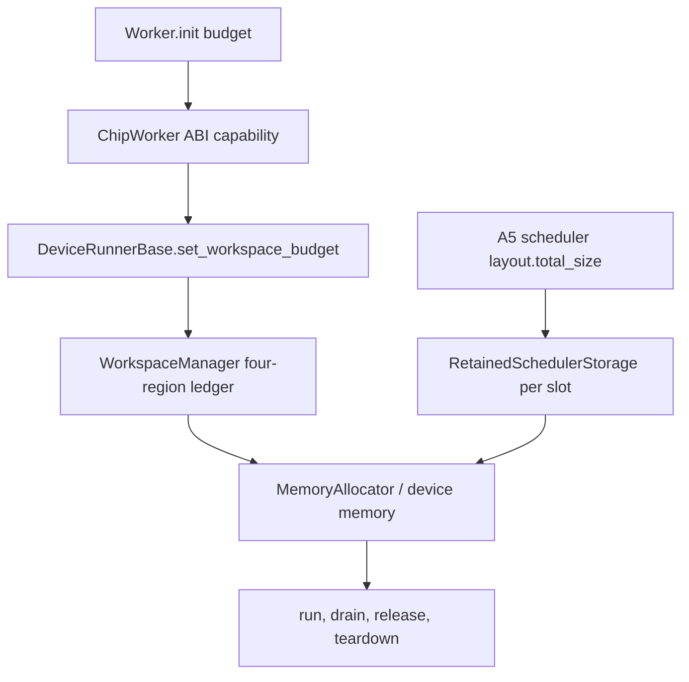
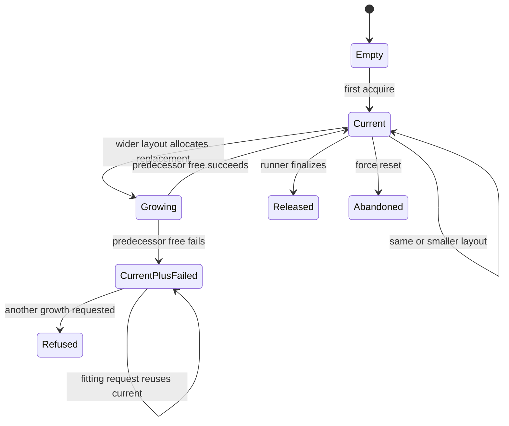

> 源码基线：simpler [`c5f3ba14`](https://github.com/hw-native-sys/simpler/commit/c5f3ba1449c3c9514e6b55194e4c8a52f4531fc3)，为 2026-09-28 核验时 `main` 最新提交。它修改 DFX vocabulary；本文直接相关的 workspace、retained scheduler-state 与测试文件和 [`c605b03c`](https://github.com/hw-native-sys/simpler/commit/c605b03cad7be2a80700efbdf3bd00dbc79812a9) blob 相同。workspace ledger 来自 [PR #2440](https://github.com/hw-native-sys/simpler/pull/2440)，slot-retained scheduler state 来自 [PR #2443](https://github.com/hw-native-sys/simpler/pull/2443)。

## 本篇在 PTO 课程路线中的位置

课程 47 建立 whole-block ownership ledger；课程 48 说明 `nullptr` 不能指导重试，并推导 structured verdict、recovery priority 与 revision wakeup。本章继续回答最后一个容量问题：

> 什么时候应该暂停 normal admission、为 cleanup 留空间、恢复 admission，或直接 shed load？

答案不是“显存达到 80%”。百分比只有分母，没有说明哪些 bytes 被统计、哪些能释放、释放要多久、以及 admission 停止后还有多少 in-flight growth 会到来。

路线推进为：

`workspace hard gate → partial memory census → cleanup reserve → high/low hysteresis → overload shedding`。

## 前置知识

先保留三个不变量：

1. `capacity` 不等于 overwrite permission；旧 consumer 未退休，即使 block 足够大也不能复用。
2. `reserved_bytes` 只有 backend release 成功后才能下降；quarantine、unmap/free failure 与 current backing 都继续占用物理资源。
3. notification 只允许重新检查，不是 allocation grant。

本章新增第四个：**局部预算的“未超限”不等于设备整体安全。**

## 今日两个紧密核心问题

1. `WorkspaceManager` 报告了哪些 bytes，又明确漏掉哪些 bytes？
2. 在 partial accounting 下，怎样从测量推导 high watermark、cleanup reserve、low watermark 和 shedding，而不是拍固定比例？

第二个问题依赖第一个；两者属于同一条容量因果链。

### 证据账本：先区分已经存在与尚未存在

| 项目 | 分类 | 本章处理 |
| --- | --- | --- |
| 四区 ledger、hard limit、whole-block release | 当前代码事实 | 作为不可绕过的 safety baseline |
| report 明示 partial coverage | 当前接口事实 | 禁止把 limit 当 device ceiling |
| scheduler-state 每 slot retained、增长旧新重叠 | 当前代码与测试事实 | 纳入预算外 peak |
| watermark、reserve、hysteresis、shedding | 建议策略 | 只能由指标校准，不能声称主干已有 |
| outside peak 与 cleanup service time | 当前未知 | 定义采集方法和决策式，不给默认值 |

这里最容易混淆的是“代码已经能报告一部分 charge”和“系统已经有完整 memory pressure controller”。前者成立，后者不成立。当前接口既没有 normal/recovery admission class，也没有 high/low pressure state，更没有把 scheduler-state、DFX 和 provider allocation 合并为统一 census。文章中的公式是设计约束，不是对当前实现性能的描述。

另一个容易误判的假设是“cleanup 总需要预留显存”。如果 cleanup 只提交 completion fact、执行 unmap/free 和更新 ledger，它可能完全不从四区 budget 申请新块；此时给它留 10% 只会无依据地压低 normal capacity。反之，如果 recovery 需要 scratch、copyback staging 或重建 control block，reserve 必须覆盖该路径的**并发 peak**，不能只取平均使用量。判断依据是 allocation trace，不是任务名称。

## PTO 全栈中的位置

上游是 Python `Worker.init(workspace_budget_bytes=...)` 和编译得到的 runtime layout；中间由 Host runtime 管理 workspace 与 A5 scheduler-state；下游是 allocator、device run、copyback、diagnostics 和 teardown。

图中 D 与 F 最终进入同一个 device allocator，却不在同一个 budget report 中。这正是水位校准必须先做 coverage census 的原因。

## 概念和精确语义

### Hard limit、watermark 与 reserve 不是一回事

**当前代码事实：** [`WorkspaceManager::acquire`](https://github.com/hw-native-sys/simpler/blob/c5f3ba1449c3c9514e6b55194e4c8a52f4531fc3/src/common/platform/include/host/workspace_manager.h) 在锁内先寻找同 `RegionKey`、容量足够、无 quarantine/release failure 且 `ref_count==0` 的 block。若需新 allocation，则 `make_room_locked(bytes)` 只释放 obsolete、无引用、无 mapping 的 generation；仍有

\[
reserved\_bytes + request\_bytes > limit\_bytes
\]

时同步返回 `nullptr`。这是不可越过的 safety gate。

**建议策略：** high watermark 是在 hard limit 之前停止 normal admission 的 policy；cleanup reserve 是为能够减少 ownership debt 的动作保留的可达容量；low watermark 是解除 pressure mode 的条件。它们不能修改 manager 的 capacity/permission 检查。

### Partial accounting 是接口事实

[`SimplerWorkspaceReport`](https://github.com/hw-native-sys/simpler/blob/c5f3ba1449c3c9514e6b55194e4c8a52f4531fc3/src/common/worker/runtime_c_api.h) 提供：

- `limit_bytes`、`reserved_bytes`；
- `relinquished_bytes`、`quarantined_mapped_bytes`；
- live blocked、quarantined/release-unconfirmed block 数；
- `proof_unavailable` 和 foreign release failure。

同时 `coverage_is_partial=1`。规范明确把 external tensors、run results、diagnostics、code/ELF、RTS argument blocks 与 provider memory 排除在外。[Python API 文档](https://github.com/hw-native-sys/simpler/blob/c5f3ba1449c3c9514e6b55194e4c8a52f4531fc3/python/simpler/task_interface.py) 也重复这一边界。

所以 `reserved_bytes / limit_bytes` 只能描述四个 workspace region 的局部压力，不能当 device utilization。

## 真实文件、类型与 API 逐段解读

### `WorkspaceManager::make_room_locked`

它不是 LRU：current backing 即使 `ref_count==0` 也不可为另一个 region 腾空间；零引用只表示 idle，不表示 abandoned。eligible block 的 release 失败时，代码设置 `release_unconfirmed` 并继续 charge，防止同一物理 bytes 被预算重复发放。

### `WorkspaceManager::report`

报告先填完所有字段，最后发布 schema。`proof_unavailable` 只要存在 quarantined 或 release-unconfirmed block 就为 1。这里有两个不同的压力量：

- `reserved_bytes`：仍由正常 ledger 计费；
- `relinquished_bytes`：manager 已放弃、但并未证明 device 回收。

做 device-wide census 时二者不能简单相减；后者应进入 unknown/unsafe charge，直到 reset 或 backend evidence 证明回收。

### `RetainedSchedulerStorage`：预算外的真实持有者

[该类型](https://github.com/hw-native-sys/simpler/blob/c5f3ba1449c3c9514e6b55194e4c8a52f4531fc3/src/common/utils/retained_scheduler_storage.h) 为每个 pipeline slot 保留 Host/device 一对 storage：

- `raw_bytes = bytes + alignment - 1`；
- fit 时复用，不缩容；
- growth 先分配新块、记录 replacement，再释放 predecessor；
- predecessor free 失败时，同时持有 current 与 `failed_release_`；
- `failed_release_` 存在时拒绝第三次 growth，因此每 slot 最多持有 current + 一个 failed predecessor。

当前 `PTO_PIPELINE_MAX_DEPTH=2`，两个 slot 必须保留不同 storage。它们通过 [`A5 runtime_maker.cpp`](https://github.com/hw-native-sys/simpler/blob/c5f3ba1449c3c9514e6b55194e4c8a52f4531fc3/src/a5/runtime/host_build_graph/host/runtime_maker.cpp) 的 `layout.total_size` 创建，经 `HostApi` 进入 [`DeviceRunnerBase::acquire_scheduler_state_storage`](https://github.com/hw-native-sys/simpler/blob/c5f3ba1449c3c9514e6b55194e4c8a52f4531fc3/src/common/platform/onboard/host/device_runner_base.cpp)。PR #2443 明确它暂不属于四区 `workspace_budget_bytes`。

## 对象生命周期：一个 scheduler-state block

这个生命周期说明 peak 发生在 steady state 之外：growth 的 allocate-before-free 窗口和 failed-release resting state 都可能同时占两块。只观察“当前 capacity”会低估真实 charge。

## 端到端调用链

### 四区 workspace

1. `Worker.init(..., workspace_budget_bytes=B)` 校验参数。
2. `ChipWorker::init` 要求 runtime 同时提供 set/report capability；缺能力时 fail closed。
3. `DeviceRunnerBase::set_workspace_budget` 将 `MemoryAllocator::Reservation` 包成 backend acquire，并坚持 unmap 成功后才 free。
4. arena/staging 的 acquire 进入 `WorkspaceManager`。
5. run 通过 `DrainProvedComplete/NoDeviceSubmission + CopybackReturned + BindingsReleased` 退休 reference。
6. obsolete generation 才可能由后续 growth 或 teardown release。

### A5 scheduler-state

1. `scheduler_plan_layout` 计算 `layout.total_size`。
2. `runtime_maker` 请求 `total_size`、`SCHEDULER_STATE_ALIGNMENT`。
3. `HostApi` 携带当前 pipeline slot。
4. `DeviceRunnerBase` 调用该 slot 的 `RetainedSchedulerStorage::acquire`。
5. Host 端初始化完整 `total_size`，随后整段上传。
6. run 释放 bindings 后 storage 仍留在 slot；更宽 layout 才触发 growth，runner finalize 才 release。

这条链证明 scheduler-state 的大小来自 task/subtask/worker layout，而不是 Tensor payload shape。

## 具体 shape、dtype 与容量演算

先明确层次：本章的 admission key 是 `RegionKey/run_epoch/bytes`，没有 Tile dtype；scheduler-state 也是控制结构字节。为避免把 tensor 大小冒充 workspace 大小，下面把两者分开。

假设一个教学 run 的数据面输入是 `bf16[16,16]`，即一个 512 B Tile，位于 GM；它只说明 kernel payload，不直接决定 scheduler-state 或 arena bytes。编译后的 layout 和真实 allocator 观测给出以下**示例测量**，不是仓库默认值：

- device usable：80 MiB；
- weights/code/external tensors/diagnostics/provider 的并发 peak：12 MiB；
- slot 0 current scheduler-state：3 MiB；
- slot 1 current scheduler-state：5 MiB；
- slot 0 下一次 growth：6 MiB，allocate-before-free 时和旧 3 MiB 重叠；
- allocator fragmentation/不可归因余量：2 MiB。

则预算外 peak envelope 至少是：

\[
P_{outside}=12+5+3+6+2=28\text{ MiB}
\]

因此四区 workspace limit 必须满足：

\[
B_{workspace}\le 80-28=52\text{ MiB}
\]

这不是建议设 52 MiB，而是说明：只有这些 peak 来自同一并发窗口且测量可信时，52 才是该样本的上界。若 predecessor free 失败，3+6 会从 transient peak 变成 resting charge；下一次更宽 growth 会被拒绝，但 device bytes 仍未减少。

在 workspace 内部，若选择 `B=48 MiB`，当前 `reserved=38 MiB`，normal request 需要 8 MiB，则 hard gate仍允许 46 MiB。是否提前阻断取决于已测得的 in-flight admission burst、cleanup 所需同池 bytes 与释放 service time，而不是 `38/48≈79%` 这个比例。

### 同一示例的 pressure 状态演算

继续使用 `B=48 MiB`，假定 trace 已证明 recovery 在四区内的最大新增 peak 为 2 MiB，freeze 生效前不可撤销的 in-flight growth 上界为 4 MiB。于是这个样本可取 `H=48-2-4=42 MiB`；这是由两项观测相减，不是“87.5% 更合理”。

- `t0`：reserved=38 MiB，8 MiB normal ticket 到达。hard gate看见 46≤48，本来能够分配；pressure controller看见 projected 46>42，先把 ticket 留在 Host 队列，不取得 device block。
- `t1`：一个 recovery ticket需要 2 MiB scratch，projected 40≤48，因此可执行。若它只提交 run facts 而不分配，则实际 reserve不增长。
- `t2`：cleanup 证明一个 6 MiB obsolete generation 可释放；backend free 成功后 reserved 从 38降到32 MiB，census revision推进。
- `t3`：若校准得到 low watermark为36 MiB，且 cleanup debt=0、proof_unavailable=0，pressure epoch可结束。原 8 MiB ticket重新检查后 projected=40 MiB，在新 revision上 commit。
- 反例：若 6 MiB block 转成 quarantine，reserved 数字可能因 ledger relinquish 变化，但 unknown physical charge仍在。pressure不能因局部数字下降而结束。

这个时间线还解释 throughput 取舍：t0 暂缓了一个本可通过 hard gate 的 normal request，换取 recovery 始终拥有可达路径。若 trace显示长期没有 recovery demand，2 MiB reserve会表现为稳定 device idle；它就是应当下调或按状态启用的证据，而不是安全规则本身。

## 从约束推导 watermark、reserve 与 hysteresis

建议先建立设备总账：

\[
M_{usable}\ge
M_{fixed}
+M_{outside,peak}
+M_{workspace,reserved}
+M_{workspace,unknown}
+M_{fragmentation}
\]

其中 `M_workspace,unknown` 包括 relinquished、quarantine 与不能证明已回收的 charge。只有能够从上述项中扣除并有 evidence 的 release，才能成为 headroom。

然后定义：

\[
H = B - R_{progress} - A_{reaction}
\]

- `R_progress`：progress-capable cleanup/recovery 在最坏可信路径上还必须从**同一 ledger**申请的 peak bytes；若 cleanup 不从该 ledger 分配，此项应为 0，不能为了“保险”拍 10%。
- `A_reaction`：从 pressure observation 到 normal admission 真正停止期间，已不可撤销的 in-flight requests 还能增加多少 charge。

pressure mode 解除条件不只看 bytes：

\[
reserved\le L
\land pending\_cleanup\_debt=0
\land proof\_unavailable=0
\]

且 `L < H`。`H-L` 应覆盖实测的 arrival burst 与 observation/recheck 抖动；如果只降到 `H-\epsilon` 就立即重开，下一请求会再次越线，形成频繁 close/open。

### Pressure epoch 的生命周期与非法组合

建议把 pressure mode 建成一个显式 epoch，而不是每次请求临时比较百分比。owner 首次观察到 `projected_charge > H`、`proof_unavailable` 或 reserve debt 时进入 `PRESSURED(epoch=n)`，冻结 normal ticket 的 commit；已持资源的 run 继续 drain，recovery ticket 可在 hard gate 内执行。每一次 release、quarantine、failed release、outside charge 变化都推进 census revision。

重新开放必须使用同一 revision 上的原子快照，确认 `reserved<=L`、cleanup debt 已清零、proof 可用，并且预算外 peak envelope 没有被新 generation 扩大。随后 pressure epoch 进入 `RECOVERED`，等待 ticket 仍要逐个重跑 admission，不能把旧 verdict 批量升级成 grant。这样可以阻止 ABA：水位下降后又被另一个 growth 占回，而旧 waiter 仍按过期 headroom 提交。

以下组合应直接 fail closed：

- `coverage_is_partial=1`，却用 `reserved/limit` 触发 device-wide OOM 判断；
- `proof_unavailable=1`，却因为 reserved 下降就开放 normal admission；
- failed scheduler-state predecessor 尚在，却只统计 current capacity；
- high watermark 大于 hard limit，或 low watermark 不小于 high watermark；
- recovery task 自己需要的同池 peak 未进入 reserve；
- pressure controller 与 allocator 使用不同 byte identity，导致 aligned raw allocation 和 logical bytes 重复或漏记。

需要注意，`relinquished_bytes` 也不能自动加回可用容量。这个字段表示 manager 不再能正常管理这些 bytes，而不是 backend 已证明归还。若 execution-domain reset 能证明整个 generation 失效并由 driver 回收，才可以在新的 census epoch 中消除该 unknown charge。

### Overload shedding 顺序

当 pressure 持续时，建议动作按可逆性排列：

1. 暂停 normal admission，但允许能减少 debt 的 recovery；
2. 到 deadline 前仍无可达 release，则拒绝尚未拥有 device block 的 ticket；
3. `proof_unavailable` 或 failed release 持续时，升级 scoped reset/recreate；
4. 只有在能证明 target scope 的前提下才释放 quarantine。

不能为了吞吐 shed 已持有旧 generation 的 cleanup task；它可能是让系统重新可进展的唯一工作。

## 为什么这样设计及替代方案

| 方案 | 优点 | 失败模式 |
| --- | --- | --- |
| 固定 80% high watermark | 简单 | partial denominator；不同 workload 的 outside peak 完全不同 |
| 只依赖 hard limit | 不会越四区 B | 来不及为 progress work 留空间；在 B 附近反复拒绝 |
| high watermark，无 low watermark | 能早停 | 阈值附近抖动、thundering recheck |
| measured envelope + reserve + hysteresis | 参数可解释、可重放 | 需要 device census、peak window 与 service-time metrics |
| 直接 interval index | 元数据更细 | allocator 仍按 whole allocation free 时，不会返还更多物理 bytes |

因此本阶段不应先实现 interval tree。只有 suballocation 能独立 unmap/free，或 allocation owner 能安全复用不相交 range 时，它才可能改变物理容量。

## 访存、计算、流水、并行和硬件约束

本策略不改变 PTO ISA 指令、Tile layout 或计算量；它改变 Host 在 launch 前是否接纳更多工作。提前 shed 会降低 queueing 与 OOM 风险，却可能留下 device idle gap；水位过高则让 cleanup 与 normal growth 争夺最后 headroom。

A5 两个 pipeline slot 可以并行 prepare，所以 scheduler-state 不能共用一块。复用减少 steady-state allocation/free 和一次 Host zero pass，但每 run 仍初始化并上传完整 `layout.total_size`；PR #2443 明确没有 copy-count 或 latency 收益声明。watermark 实验必须分别观测：

- normal queue wait、recovery queue wait；
- workspace reserved/unknown bytes；
- scheduler-state current/failed/growth peak；
- allocator committed/free 与 fragmentation；
- cleanup service time、device idle gap、admission rejection；
- P50/P99 与 SLA 内 goodput。

只看平均 HBM 利用率无法判定策略。

### 把不变量与可调参数分开

实现时最容易犯的错，是把一次 benchmark 得到的数字写成正确性条件。这里有三类不能调的**不变量**：任何新准入都不能突破 hard limit；未闭合的 run reference、quarantine 或 failed release 必须继续计费；pressure 退出前必须重新读取 revision 并验证 cleanup debt 与 proof 状态。改变 workload、型号或并行深度，都不能放松它们。

`H`、`L`、观测窗口和 normal-ticket deadline 则是**可调参数**。它们只能来自可复现实验：以突发到达压测 `A_reaction`，以真实 cleanup/recovery 路径测 `R_progress` 与 service time，以 allocator 快照估计 fragmentation。若三项证据不能同时取得，安全做法不是猜一个百分比，而是保留 hard gate、扩大 unknown charge，并降低 normal admission。

还要区分两个目标：正确性要求“不覆盖仍可能被使用的 bytes”；性能目标才是“减少拒绝和 idle gap”。例如把 `L` 降得很低，会延长 pressure epoch，却不提高内存安全；把 `L` 抬到接近 `H`，可能缩短停顿，却导致队列在阈值附近频繁醒来。调参应以 SLA 内 goodput、P99、拒绝率和 recovery 进展联合评价，而不能用单一利用率替代。

## 测试证据与未覆盖风险

**直接测试事实：**

- [`TheReportNamesItsOwnCoverageAsPartial`](https://github.com/hw-native-sys/simpler/blob/c5f3ba1449c3c9514e6b55194e4c8a52f4531fc3/tests/ut/cpp/common/platform/test_workspace_manager.cpp) 固定 `coverage_is_partial=1`。
- `GrowthReclaimsAnObsoleteGenerationRatherThanRefusing` 用 6 MiB budget 验证 1→2→4 MiB 增长只回收 obsolete 1 MiB。
- `AnIdleCurrentBackingIsNotEvictableForAnotherRegion` 证明 idle current 不能给另一 region。
- [`RetainedSchedulerStorage` tests](https://github.com/hw-native-sys/simpler/blob/c5f3ba1449c3c9514e6b55194e4c8a52f4531fc3/tests/ut/cpp/common/platform/test_retained_scheduler_storage.cpp) 覆盖 fit reuse、allocate-before-free growth、device/Host failure，以及 failed release 后拒绝第三块。
- [A5 bind ledger tests](https://github.com/hw-native-sys/simpler/blob/c5f3ba1449c3c9514e6b55194e4c8a52f4531fc3/tests/ut/cpp/common/host_build_graph/test_hbg_bind_ledger.cpp) 验证同 shape 复用、更宽增长/更窄复用和两个 slot storage 分离。

**当前未覆盖：** device-wide memory census、scheduler-state bytes 并入 report、peak overlap histogram、watermark mode、high/low hysteresis、cleanup reserve、ticket deadline/shedding，以及真实 OOM/unmap failure/late DMA 下的 goodput 与 P99。

### 最小校准实验：先测函数，再选参数

建议用确定性 fault adapter 加少量真机实验分四步校准。

第一步测 **coverage**：在每个 allocation/free/unmap 点记录 owner、generation、raw bytes、logical bytes、region、slot 与 result，核对 allocator committed 与各分类之和。若差值不能被已知 fragmentation/driver reserve解释，不能进入 watermark 调参；否则阈值只是建立在漏账之上。

第二步测 **reaction envelope**：在 normal admission 从可用切到冻结的边界打 timestamp，统计该时刻已经通过前置检查、但尚未 commit 的请求总 bytes。这个分布决定 `A_reaction`。若 admission 与 commit 完全串行且能在同一锁内关闭门，实测上界可能是零；不能因为“分布式系统通常有延迟”就预留虚构空间。

第三步测 **progress path**：分别注入 live consumer 退休、unmap 暂时失败、permanent free failure、context destroyed 和 scoped reset，记录从 verdict 到首次可释放证据的 service time，以及过程中新增的同池/outside peak。这一步决定 `R_progress` 和 deadline；无法产生 release 的 permanent path 应直接进入 shedding/reset，而不是无限排队。

第四步才做 **sensitivity sweep**：在可信 workload 的 request-byte、pipeline overlap、layout size 与 failure rate范围内扫描 H/L，比较 SLA 内 goodput、P99、rejection、device idle、pressure oscillation 和 unknown charge驻留时间。选择满足安全式且 goodput 最优的区间；硬件、runtime layout 或 pipeline depth 改变后必须重测。

建议 Golden 的 oracle 不是某个固定百分比，而是五条性质：任何时刻不重复发放物理 bytes；recovery 在 normal freeze 时仍可进展；无可达 release 的请求在 deadline 后确定失败；同一 pressure epoch 不反复开关；所有 admitted charge 加 budget 外 charge 不超过经过校准的 usable envelope。

最大的正确性风险是把 allocator 已 committed 但局部 report 看不见的 bytes 当作 free；最大的性能风险则是 reserve 过大，使 device 因保守 admission 长期空闲。

## 与前后章节的连接

课程 48 解决“拒绝后怎样等待”；本章解决“何时开始拒绝、何时重开”。两章合并后，admission 才同时拥有 reason、progress dependency、capacity envelope 和稳定状态转换。

下一章回到 ISA/runtime 交界的长期债：**正常 drain 之外——TPipe Early-exit、DIR_BOTH Generation 与 Cross-dispatch Golden。** 目标是把上层 quarantine/cancel 规则落实到 entry、flag 与 backing ownership。

## 第七次七章知识图谱回顾（课程 43–49）

- **43：** async completion unknown 需要 cancel confirmation、quarantine 或 generation fence。
- **44：** runtime lease registry 才能决定 allocation generation 是否可复用。
- **45：** register-before-submit WAL 消除 untracked submit，却仍保留 `MAY_HAVE_SUBMITTED`。
- **46：** backend operation key、completion/reset witness 和 late-write canary把恢复接到真实设备边界。
- **47：** `WorkspaceManager` 用 run facts、whole-block quarantine 与 hard budget承接未知 completion。
- **48：** structured verdict、recovery priority 与 revision wakeup让拒绝具备可进展语义。
- **49：** partial census、measured reserve 与 hysteresis把安全 ledger扩展为可校准的压力策略。

这七章形成 `async operation → durable lease → crash recovery → backend evidence → runtime ownership → admission → overload control`。最大缺口仍是这些建议 schema/queue/watermark 尚未实现，且缺 A3/A5 late-write、OOM、reset 与 P99 联合矩阵。

## 本篇结论、知识债、三个理解检查问题和下一章

### 结论

1. `workspace_budget_bytes` 是四区 hard limit，不是 device-wide ceiling。
2. retained scheduler-state 每 slot 独立、历史最大值常驻；growth 与 failed release 会同时持两块，而且当前在 budget report 外。
3. cleanup reserve 只应覆盖 progress work 的真实 peak；不用同池内存时应为 0。
4. high/low watermark 必须由 outside peak、reaction burst 与 cleanup service time校准。
5. shedding 先拒绝未持资源的 normal ticket，不能阻断唯一能减少 debt 的 cleanup。

### 知识债

- device-wide `MemoryCensus` 与统一 charge identity；
- scheduler-state current/failed/growth bytes 纳入 report；
- arrival-byte rate、cleanup service time、device idle gap 与 rejection reason metrics；
- `AdmissionVerdict/Ticket/revision`、high/low state machine、deadline/cancel；
- OOM、unmap failure、quarantine、reset 与 late DMA 真机矩阵；
- 只有独立 suballocation release 成立后再评估 interval conflict index。

### 三个理解检查问题

1. 为什么 `reserved_bytes / limit_bytes=70%` 仍可能已经接近 device OOM？
2. failed predecessor 存在时，`RetainedSchedulerStorage` 为什么允许 fit reuse，却拒绝下一次 growth？
3. 什么情况下 `R_progress` 应严格为 0，而不是保留一个“经验百分比”？

### 下一章

**正常 drain 之外——TPipe Early-exit、DIR_BOTH Generation 与 Cross-dispatch Golden。**

## 课程账本增量

- 课程：PTO 全栈课程 49
- 仓库：simpler `c5f3ba14`
- 新覆盖：`SimplerWorkspaceReport`、`RetainedSchedulerStorage`、`DeviceRunnerBase::acquire_scheduler_state_storage`、A5 `layout.total_size` 与 HBG bind ledger tests
- 新不变量：局部 hard limit 不等于 device ceiling；reserve 必须绑定 progress path；growth peak包含旧+新；failed release 继续 charge；pressure exit需要 bytes、cleanup debt 与 proof 三项共同满足
- 待实现：device census、scheduler-state charge、verdict/ticket/revision、watermark/hysteresis/shedding 与设备故障矩阵
- 下一章：TPipe early-exit、DIR_BOTH generation 与 cross-dispatch Golden
