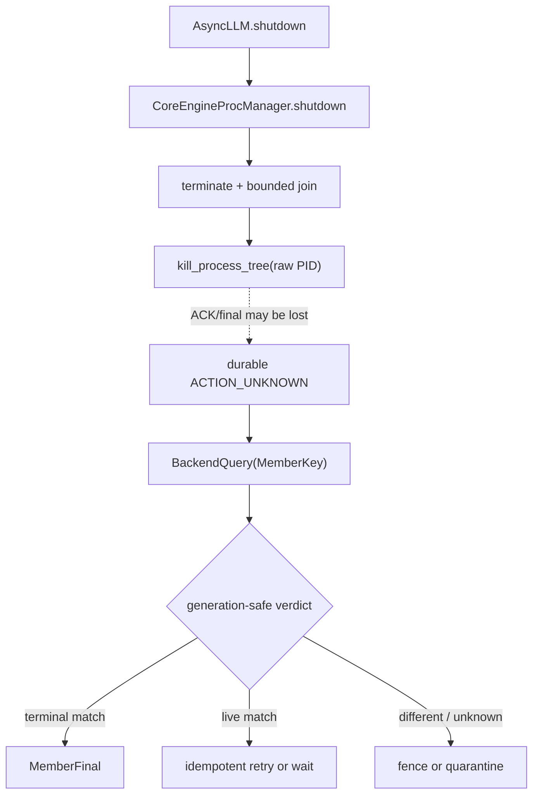
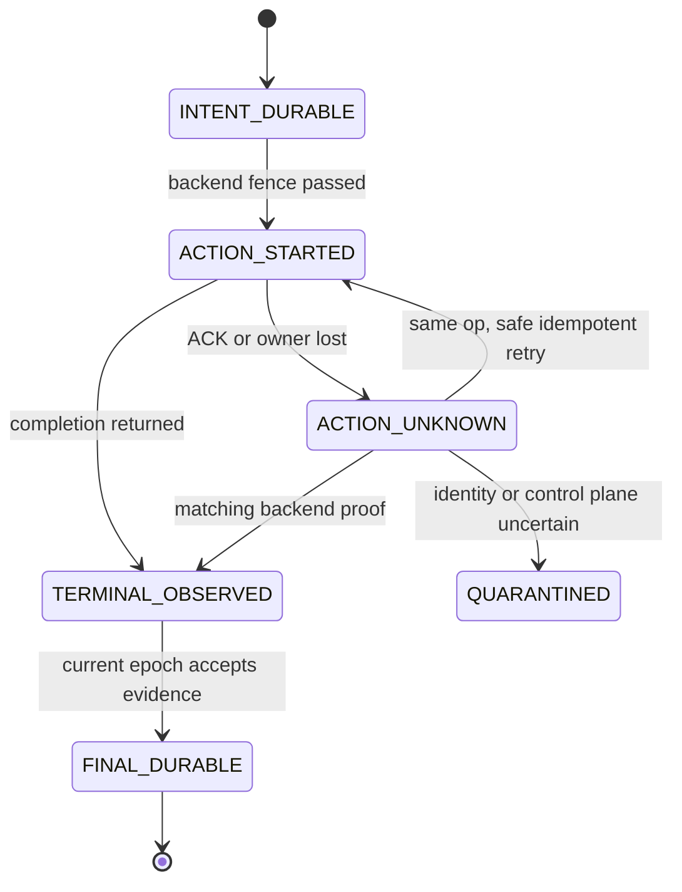

> 本文基于 vLLM `main` 的提交 [`31842269`](https://github.com/vllm-project/vllm/commit/3184226984b17fe0dba960ace5a2d7d57df44ab6)。本文中的“当前代码事实”“测试事实”和“建议协议”会分开标注；`OperationLease`、`BackendQuery`、`MemberFinal` 目前不是 vLLM 已实现类型。

## 本篇在课程路线中的位置

上一章解决“registry 分区时谁有权 KILL”：failure detector 只能产生怀疑，真正的 destructive authority 必须来自 linearizable owner CAS、durable intent、绑定 member generation 的 `OperationLease`，并在动作前通过 backend fence。

本章只追一个紧邻的问题：**KILL 调用可能已经生效，但 ACK、final 或 owner 本身丢了；分区恢复后，新 owner 怎样在不误杀新进程的前提下收敛？**

课程位置是：

```text
operation lease
→ ACTION_UNKNOWN
→ generation-safe BackendQuery
→ reconciliation
→ durable MemberFinal / quarantine
```

## 前置知识回顾

需要保留四个结论：

1. `lease expired` 只表示旧 owner 此后无权开始新动作，不表示它过去没开始过动作。
2. 相同 PID、actor 名或 `RANK` 不是相同 member；身份必须带 generation/attempt。
3. “信号已发送”“目标已退出”“direct child 已 reap”“整个 execution domain 已 contained”是不同证据。
4. backend 只能提供目标状态证据；谁有权写入 canonical final，仍由 registry epoch 决定。

## 本篇要回答的核心问题

- `ACTION_UNKNOWN` 精确表示什么，为什么不能把它折叠成 success 或 retry？
- MP、Ray、external launcher 应分别查询什么身份，返回什么 verdict？
- journal、backend snapshot、owner epoch 怎样共同决定 finalize、retry、fence 或 quarantine？
- 当前 vLLM 的 shutdown 与测试在哪些地方还无法给出这些证据？

## 组件在全局架构中的位置

公开入口的真实链路仍是：

`AsyncLLM.shutdown(timeout)`
→ Core client `shutdown(timeout)`
→ `CoreEngineProcManager.shutdown`
→ `vllm.v1.utils.shutdown`
→ `terminate() / join(remaining)`
→ `kill_process_tree(pid)`。

相关实现见 [`AsyncLLM.shutdown`](https://github.com/vllm-project/vllm/blob/3184226984b17fe0dba960ace5a2d7d57df44ab6/vllm/v1/engine/async_llm.py)、[`CoreEngineProcManager`](https://github.com/vllm-project/vllm/blob/3184226984b17fe0dba960ace5a2d7d57df44ab6/vllm/v1/engine/utils.py)、[通用 `shutdown`](https://github.com/vllm-project/vllm/blob/3184226984b17fe0dba960ace5a2d7d57df44ab6/vllm/v1/utils.py) 和 [`kill_process_tree`](https://github.com/vllm-project/vllm/blob/3184226984b17fe0dba960ace5a2d7d57df44ab6/vllm/utils/system_utils.py)。

当前实现是进程内 best-effort cleanup，不存在 durable operation journal 或 crash recovery coordinator。因此下图左侧是当前事实，右侧是本章从故障约束推出的建议协议：



## 完整调用链

### 源码基线与变化边界

本章重新读取了 `main` 当前提交，而不是沿用昨日快照。最新提交修改的是 frontend reasoning-token 计数；本文直接相关的 manager、通用 shutdown、process-tree kill、MultiprocExecutor、UniProcExecutor、Sentinel 及四组测试文件，其 blob 与上一章基线一致。因此，“当前没有 durable registry、backend query 和 reconciliation”不是从提交标题推断，而是对现行文件逐一核对后的结论。

这也限定了本文的证据强度：可以确认现有 Python 控制流与测试断言；不能据此声称 Linux 内核、Ray control plane 或外部 launcher 已提供某种未接线的可靠保证。后文关于 pidfd、actor attempt、launcher tombstone 和 WAL 的内容均是基于约束推导出的建议接口，不是隐藏功能或上游 roadmap。若未来实现发生变化，应先比较这些文件和测试的 post-image，再决定哪些不变量仍成立。


### 当前代码事实：KILL 之后没有统一回查

[`vllm.v1.utils.shutdown`](https://github.com/vllm-project/vllm/blob/3184226984b17fe0dba960ace5a2d7d57df44ab6/vllm/v1/utils.py) 先对仍存活的 `BaseProcess` 调用 `terminate()`，再以同一个 monotonic deadline 逐个 `join(remaining)`。超时目标被压缩成 `(pid, name)`，随后交给 `kill_process_tree(pid)`。

这里发生了关键的信息降级：原本 manager 持有可 `join`、可观察 `exitcode` 的 process handle；KILL 分支只留下裸 PID。`kill_process_tree` 通过 `psutil.Process(pid)` 快照 descendants，先杀 children 再杀 parent，但不会在返回后重新 `join/reap`，也不会核对 PID start time。于是返回只证明“调用过 kill”，不证明“同一个 generation 已终止”。

[`MultiprocExecutor._ensure_worker_termination`](https://github.com/vllm-project/vllm/blob/3184226984b17fe0dba960ace5a2d7d57df44ab6/vllm/v1/executor/multiproc_executor.py) 也有相似边界：先等待，接着 `terminate()`，再等 4 秒，最后 `p.kill()`；KILL 后没有共同 deadline 下的显式 reap。

### 当前代码事实：三类 backend 的证据不同

- **MP**：parent 持有 `BaseProcess`，有资格用 `join()/exitcode` 证明 direct-child terminal/reap；裸 PID 查询不够。
- **Ray**：`CoreEngineActorManager` 用 `ray.wait/ray.get` 观察 run ref，shutdown 时 `ray.kill(actor)` 并移除 placement group。Ray control plane 可以证明 actor attempt 的 terminal，但当前路径没有把该证明持久化为统一 final。
- **External launcher**：`ExecutorWithExternalLauncher` 继承 `UniProcExecutor`；rank-local shutdown 只清理本地 worker。整个 rank group 是否退出，只能由 torchrun 等 launcher 以 job attempt + global rank 证明。

因此，统一接口不能是“所有 backend 都调用 `join`”，而应是“所有 backend 都返回带证据类别的 reconciliation verdict”。

## 关键类型、字段和状态生命周期

以下是**建议协议**，不是当前类定义。

```text
MemberKey:
  backend_kind
  execution_domain
  backend_attempt_id
  global_rank
  member_generation

OperationKey:
  owner_epoch
  op_seq
  action_kind
  action_payload_hash

RecoveryRecord:
  member_key
  operation_key
  state
  evidence_ref
```

`MemberKey` 必须回答“杀的是谁”；`OperationKey` 回答“重放的是哪一次动作”。两者不可互相替代。相同 `op_seq` 但 payload 不同必须 fail closed；相同 PID 但 start time/generation 不同也必须视为不同 target。

建议的单调状态机如下：



生命周期中的关键点是：`ACTION_UNKNOWN` 不是错误字符串，而是“动作有可能已发生、但 canonical terminal 尚不可证明”的持久状态。它只能经 generation-matched backend proof、同 operation 的安全幂等重试，或 quarantine/reset 路径离开。

## 逐函数源码解读

### 1. `AsyncLLM.shutdown`：入口只传 timeout，不传 operation identity

[`AsyncLLM.shutdown`](https://github.com/vllm-project/vllm/blob/3184226984b17fe0dba960ace5a2d7d57df44ab6/vllm/v1/engine/async_llm.py) 先关闭 renderer，再将 timeout 传给 engine core client。它的接口没有 owner epoch、member generation、operation id，也不承诺 crash recovery。这说明恢复协议不能在当前参数上“推断出来”，必须显式扩展控制面。

### 2. `CoreEngineProcManager`：真实 process handle 的 owner

[`CoreEngineProcManager`](https://github.com/vllm-project/vllm/blob/3184226984b17fe0dba960ace5a2d7d57df44ab6/vllm/v1/engine/utils.py) 创建并保存 `self.processes`，monitor 也能等待 sentinel、读取 exit code。它是 MP 路径最有条件产生 `direct_reaped` 证据的位置。若恢复层只记录 PID 而不保留 pidfd、start time 或 supervisor-owned handle，就主动丢掉了 generation-safe 查询能力。

### 3. `shutdown` 与 `kill_process_tree`：动作和证据被混在一次返回中

通用 `shutdown` 的 shared deadline 是正确方向：前一个进程不能独占全部等待预算。但 KILL 后函数直接结束，缺少“剩余 deadline 内查询/`join`”“记录无法证明的 target”两步。`kill_process_tree` 的 recursive snapshot 还存在 fork race：快照后新 fork 的 descendant 不在集合里。

所以当前 return value 不能被升级解释为 `MemberFinal`。更准确的结果是：

- KILL 调用抛错：action 未确认；
- KILL 返回：action submission/dispatch 已返回；
- 只有 handle/pidfd/waitpid 或 backend attempt terminal 才能形成更强证据。

### 4. `EngineCoreSentinel.retry`：不是 dead-owner reconciliation

[`EngineCoreSentinel`](https://github.com/vllm-project/vllm/blob/3184226984b17fe0dba960ace5a2d7d57df44ab6/vllm/v1/fault_tolerance/engine_core_sentinel.py) 会在 fault 后 abort scheduler requests、清空 batch queue，并在 `UNHEALTHY` 状态下调用 executor retry。若 executor 已标记 `DEAD`，命令会被拒绝。它恢复的是仍存活 EngineCore 内的 worker fault，不会接管已死 manager 的 operation journal，也不会辨认 PID/actor attempt reuse。

## 具体示例与状态演算

设 DP=2，成员 `M1/g3` 的 MP PID 是 42100：

1. owner A 持有 `owner_epoch=11`，持久化 `op=(11,8,KILL,hash(M1/g3))`。
2. A 在 backend fence 通过后调用 KILL；kernel 已接受信号，目标开始退出。
3. registry 分区使 ACK 和 `MemberFinal` 丢失，A 随后崩溃。durable 状态只能是 `ACTION_UNKNOWN`。
4. 新 owner B 通过 CAS 获得 epoch 12。此时 PID 42100 已被系统复用给 `M1/g4`。
5. 若 B 只做 `psutil.Process(42100).is_running()`，会得到 live，并可能再次 KILL——这会误杀 g4。
6. generation-safe query 以 `MemberKey(MP, domain, pid/start_time, rank=1, g3)` 查询，返回 `LIVE_DIFFERENT_GENERATION(g4)`。
7. B 必须 fence `op8`，不得对 PID 42100 发信号。若旧 handle/pidfd 或 `waitpid` 还能证明 g3 已退出并 reap，则写入 `MemberFinal(direct_reaped)`；否则 g3 保持 `containment_unknown`，相关 execution domain 进入 quarantine。

这里没有 tensor，因此 shape/dtype/device 不适用；关键输入输出是 control-plane identity 与 evidence。GPU/NPU 相关影响是：在旧 execution domain 未证明终止前，不能仅因 Host PID 变化就宣布 device work 已停止。

## BackendQuery 的最小判定表

| Query verdict | 含义 | 允许动作 |
| --- | --- | --- |
| `TERMINAL_MATCH` | 同一 member generation 有权威 terminal/reap 证据 | 当前 epoch 可写 durable final |
| `LIVE_MATCH` | 同一 generation 仍活着 | 仅在同 `OperationKey` 可幂等且 backend fence 再次通过时 retry；否则继续等待 |
| `LIVE_DIFFERENT_GENERATION` | 物理标识被新 generation 复用 | 禁止 KILL；旧 operation fenced |
| `NOT_FOUND_WITH_TOMBSTONE` | backend 对该 attempt 有权威不存在/终止墓碑 | 可按 evidence class finalize |
| `NOT_FOUND_UNPROVEN` | 只是在当前列表找不到 | 不能当 terminal；query/reap/quarantine |
| `CONTROL_PLANE_UNAVAILABLE` | Ray/launcher/registry 无法给证据 | 禁止新 destructive action；保持 unknown |

“找不到”被拆成两类非常重要。MP 中 PID 不存在仍不等于 direct child 已 reap；external launcher 中本地 rank 不存在也不等于整个 job attempt 已 contained。


### 三类 adapter 不能丢失的身份

对 MP，query 的第一选择应是仍由 supervisor 持有的 process handle、pidfd 或等价不可复用句柄。`pid + start_time` 只能作为次优组合：它能发现大部分 PID reuse，却仍要处理读取 start time 与进程退出之间的竞态。`exitcode is not None` 证明子进程终止；只有 parent 执行 `join/waitpid` 后，才有 `direct_reaped`。递归 descendants 还需要 process group、cgroup 或 subreaper owner，不能由一次 `children(recursive=True)` 快照补齐。

对 Ray，`ActorHandle` 的 Python 对象身份也不足够。query 应绑定 Ray actor id、run/restart attempt 与 placement-group generation，区分“该 attempt terminal”“同名 actor 已 restart”“control plane 暂时不可用”。`ray.kill` 返回和 `RayActorError` 是不同观察点；placement group 被移除也不能反推每个 actor attempt 的最后状态。adapter 可以把这些差异归一成 verdict，但 evidence ref 必须保留原生 actor/attempt 标识，便于审计。

对 external launcher，vLLM rank 进程没有整个 job 的回收权。query 的 key 至少要含 launcher job id、job attempt 与 global `RANK`；本地 worker cleanup 只能产生 rank-local evidence。只有 launcher/supervisor 能发布 expected-rank 集合上的 group terminal。若 launcher API 不提供 attempt-scoped tombstone，`RANK=1` 消失不能排除新 job 已复用相同 rank，因此只能是 `NOT_FOUND_UNPROVEN`。

这三类差异也解释了为什么 verdict 中应保留 evidence class，而不能只返回布尔值 `dead=true`。布尔值会抹掉“谁观察到、观察哪个 attempt、能否 reap、是否覆盖 descendants”四个决定后续动作的条件。

### Reconciliation 的判定顺序

建议恢复循环严格按下列顺序，而不是先 query 再找 journal：

1. 从 durable journal 读取 `MemberKey`、`OperationKey` 和最后已提交状态；CRC/torn record 失败时不执行 destructive action。
2. 读取 linearizable current owner epoch；若本恢复者不是 owner，只能观察，不能 finalize 或 retry。
3. 使用 journal 中原始 `MemberKey` 查询 backend；禁止把“当前同名对象”回填成旧 target。
4. 对返回 evidence 核对 backend attempt、member generation、action payload hash 和 observation generation。
5. 只允许状态单调前进：`ACTION_UNKNOWN` 可到 matching terminal、同 operation retry 或 quarantine，不能退回“未开始”。
6. durable final 落盘后再释放被 quarantine 的资源；final 写入失败时保持隔离，不能先 free 再补账。

这个次序把两个常见错误挡在动作前：一是旧 owner 用缓存 epoch 继续 KILL；二是新 owner看到一个 live 的同名对象，就把旧 operation 重定向到新 generation。它也使 recovery 可重复运行：相同 journal 与相同 backend snapshot 必须得到相同 verdict；只有外部状态或 current epoch 改变时，结果才可变化。

## 为什么这样设计及替代方案

### 方案 A：lease 过期就重放 KILL

元数据最少、恢复最快，但 lease 过期不否认旧动作已执行；target identity 一旦复用就会误杀。不能接受。

### 方案 B：只查询 backend，不保存 durable operation

能够看到“现在有什么”，却无法回答“该 observation 对应哪次 intent、哪个 owner epoch”。ACK-loss 下仍无法区分重放与新动作。

### 方案 C：durable intent + generation-safe query + reconciliation

多出 journal、attempt identity、query adapter 和 quarantine 状态，维护成本最高；但它把 authority、target identity 和 terminal evidence 分开，允许在 MP、Ray、launcher 之间共享状态机，而不伪装底层机制相同。

## 性能、并发、正确性与边界条件

这是控制面协议，不改变模型 tensor shape、KV cache 大小或 CUDA Graph capture key。成本主要来自：

- durable transition 次数；
- backend query latency 与重试次数；
- quarantine 延迟释放的进程、placement group 或设备资源；
- reconciliation 与正常 shutdown 并发时的 fencing 开销。

可测的预算应写成：

```text
T_reconcile =
  T_registry_read
+ Σ T_backend_query
+ T_evidence_commit
+ optional T_retry_wait
```

不能在没有实验的情况下指定固定毫秒阈值。正确性优先级也不能反过来：为了降低 `T_reconcile`，不得用 cached membership 替代 linearizable epoch，不得把 `NOT_FOUND_UNPROVEN` 当 success。

并发边界至少包括：

- 旧 owner 在新 epoch 生效后迟到返回；
- query 期间 member restart；
- final 写入前 registry 再次分区；
- 相同 operation 重放两次；
- 同 operation id 出现不同 payload；
- MP child 已 exit 但未 reap；
- Ray actor terminal 与 placement-group removal 不同步；
- external launcher rank terminal 与 job terminal 不同步。

## 测试证据与未覆盖风险

**当前测试事实：**

- [`test_multiproc_executor_worker_termination_timeout`](https://github.com/vllm-project/vllm/blob/3184226984b17fe0dba960ace5a2d7d57df44ab6/tests/v1/executor/test_executor.py) 用 fake clock 覆盖 6 秒 timeout：5 秒退出不调用 terminate，7 秒退出会调用 terminate。它验证 timeout 分支，不验证 KILL、reap、PID reuse 或 ACK loss。
- [`test_background_resources_passes_worker_shutdown_timeout`](https://github.com/vllm-project/vllm/blob/3184226984b17fe0dba960ace5a2d7d57df44ab6/tests/v1/engine/test_core_engine_actor_manager.py) 只断言配置的 7 秒被传给 manager shutdown。
- [fault-tolerance E2E](https://github.com/vllm-project/vllm/blob/3184226984b17fe0dba960ace5a2d7d57df44ab6/tests/v1/fault_tolerance/test_fault_tolerance_e2e.py) 验证 injected exception 可从 `UNHEALTHY` retry，以及被 kill 的 worker 为 `DEAD` 并拒绝 retry；这不是 dead-owner takeover。
- [shutdown E2E](https://github.com/vllm-project/vllm/blob/3184226984b17fe0dba960ace5a2d7d57df44ab6/tests/entrypoints/launchers/test_shutdown.py) 的 child-cleanup 检查排除了 zombie，因此不能证明 direct child 真正 reap。

**建议 Golden：** 在 `backend_call_before_return`、`action_return_before_final`、`final_write_before_checkpoint` 三个确定性边界注入 crash；对 MP/Ray/external launcher 依次喂入六种 query verdict，并以 journal + backend snapshot + current epoch 为 replay oracle。至少覆盖 PID/actor/job-attempt reuse、旧 owner 回归、control plane 不可达、重复同 payload、冲突 payload、zombie 和 late GPU work。


### Replay oracle 如何判定通过

Golden 不应只断言“测试最后退出了”。每个 case 应给 oracle 五项输入：durable journal prefix、current owner epoch、expected member set、backend snapshot 和本次 failpoint；输出则包含 per-member verdict、是否允许 destructive action、是否可写 `MemberFinal`、group 是否可 checkpoint，以及必须继续 quarantine 的资源集合。

例如对“action 已返回、final 未写”的 MP case：

- journal 是 `ACTION_STARTED(op8, M1/g3)`；
- backend snapshot 是“g3 exit、尚未 waitpid；PID 已被 g4 复用”；
- 正确输出是“禁止向复用 PID 发信号，先用旧 direct-child handle reap g3”；
- 在 reap 前 group final 必须为 incomplete，reap 后才能增加 `direct_reaped` evidence；
- 重放一次和重放十次必须得到相同 canonical final，不能重复计数或把 g4 纳入旧 group。

对 Ray，应把“actor attempt terminal，但 placement group 删除尚未确认”和“actor 名相同、attempt 已更新”分成两个 fixture；对 external launcher，应把“rank-local process gone”和“launcher job attempt terminal”分开。真实 E2E 只需要校准 adapter 与真实 backend 行为，大量 crash point 可由 deterministic fake adapter 穷举，避免靠 sleep 产生偶现测试。

未覆盖的最大风险是：即便 Host process terminal，NCCL/CUDA/device work 是否停止仍需要 execution-domain 级证据；process final 不能自动升级为 device completion。

## 与前后章节的连接

前一章建立“谁能开始动作”；本章建立“动作结果不确定时怎样结束”。二者合起来形成：

```text
linearizable authority
→ durable intent
→ fenced destructive action
→ ACTION_UNKNOWN
→ backend evidence
→ durable terminal or quarantine
```

下一章离开 takeover 协议，回收长期知识债：**进程还活着，回执却不来——TP=1 Progress Heartbeat、withheld-response E2E 与 deadline parity。**

## 第六次七章知识图谱回顾（第 36–42 章）

- 第 36 章把 signal、exit、reap、descendant containment 分开。
- 第 37 章证明 MP、Ray、external launcher 共享终态语义，但拥有不同 evidence owner。
- 第 38 章用 owner epoch 阻止旧 owner 继承 cleanup authority。
- 第 39 章把 create/register/kill/reap/final/checkpoint 变成可注入崩溃的边界。
- 第 40 章建立跨 backend deterministic failpoint 与 replay oracle。
- 第 41 章处理 registry partition：CAS、`OperationLease` 与 action-time fence。
- 本章补上分区恢复后的 `ACTION_UNKNOWN`、generation-safe query 与 reconciliation。

至此故障主链已经能从“发信号”追到“恢复后持久收敛”。最大盲区仍是实际 durable registry/WAL、三类 `RecoveryAdapter`、MP pidfd/subreaper、Ray attempt query、launcher job-attempt API，以及真实 native/GPU hang 的联合证据。

## 本篇结论

1. KILL 返回、lease 过期和 PID 不存在都不是 durable terminal。
2. `ACTION_UNKNOWN` 必须持久化；恢复只能查询同一 generation、重放同一 operation，或 quarantine。
3. BackendQuery 提供证据，registry epoch 提供写 final 的权力；缺一不可。
4. 跨 backend 应统一 verdict 与 replay oracle，而不是统一成 `join()`。
5. 当前 vLLM 没有这套恢复协议，现有测试也未覆盖 ACK-loss 与 identity reuse。

## 知识债

- 实际 `OwnerLease/KillIntent/MemberFinal/GroupFinal` registry 与 WAL；
- MP pidfd/start-time identity、KILL 后 shared-deadline join/reap、subreaper/cgroup；
- Ray actor run/restart attempt query 与 placement-group terminal；
- launcher job-attempt + global-rank adapter；
- stable `BackendQueryVerdict`/reason code、quarantine policy；
- torn checkpoint、registry 再分区、zombie、PID reuse 与 late GPU work Golden。

## 三个理解检查问题

1. 为什么 `OperationLease` 过期不能把 `ACTION_UNKNOWN` 降级成“动作未发生”？
2. `NOT_FOUND_UNPROVEN` 与 `NOT_FOUND_WITH_TOMBSTONE` 的正确性差异是什么？
3. 为什么 Ray 的 actor terminal、MP 的 direct reap 与 external launcher 的 group terminal 可以共享 verdict，却不能共享同一个底层实现？

## 下一章

**进程还活着，回执却不来——TP=1 Progress Heartbeat、Withheld-response E2E 与 Deadline Parity。**

## 课程账本增量

- 章节：42
- 源码基线：`3184226984b17fe0dba960ace5a2d7d57df44ab6`
- 新增主线：`ACTION_UNKNOWN → BackendQuery → generation-safe reconciliation → durable final/quarantine`
- 新确认不变量：lease expiry 不否认已开始动作；query 必须绑定 member generation；backend evidence 与 registry authority 正交；unproven absence 不能变成 terminal。
- 新增测试债：跨 MP/Ray/external launcher 的 crash-replay Golden、PID/actor/job-attempt reuse、KILL 后 reap、control-plane loss 与 late device work。
- 下一章：TP=1 progress heartbeat、alive-but-stalled Worker withheld-response 与跨 Executor deadline parity。
