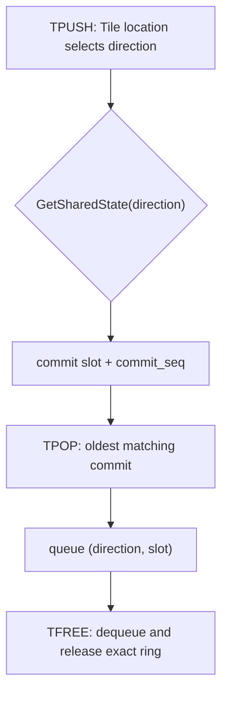
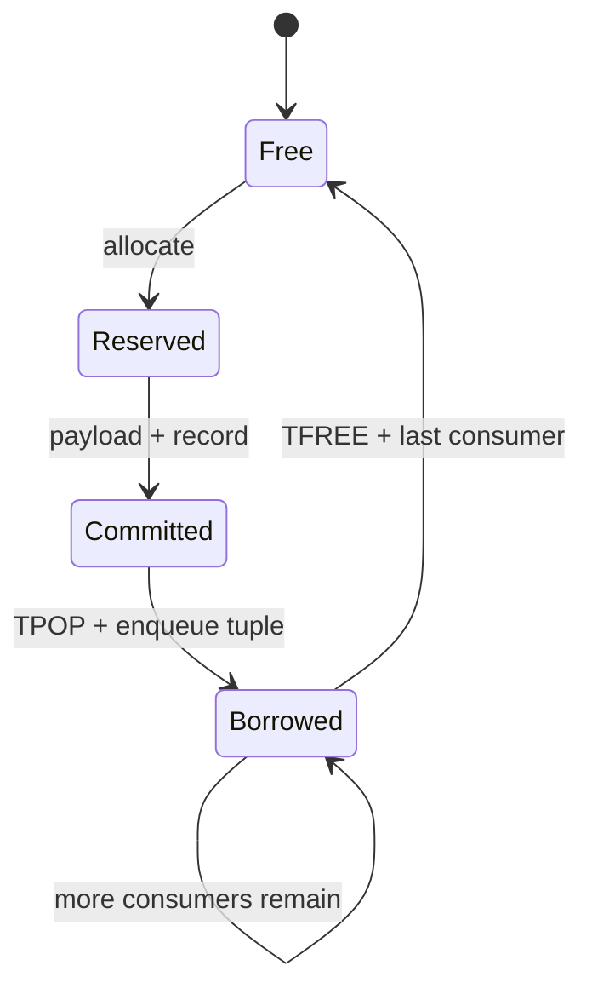

## 本篇在 PTO 课程路线中的位置

第 25～28 章已经建立 CPU_SIM FIFO、故障 census 与跨 dispatch generation；第 49 章结束 runtime 内存压力主线。本章不是重写第 28 章，而是检查它之后合入的实现修复：旧 CPU_SIM 曾让 `DIR_BOTH` 的 C2V/V2C 共享容量和释放状态，无法充当 generation-aware Golden 的可靠 oracle。当前代码已用 per-direction state、`commit_seq` 和 outstanding-pop queue 闭合正常路径。

课程位置：

```text
双向 TPipe 语义 → per-direction FIFO（本篇） → abnormal-exit snapshot → cross-dispatch generation Golden
```

分析基于 pto-isa 默认分支 [`27807720`](https://github.com/hw-native-sys/pto-isa/commit/2780772019759781706fd156f4e0a1218dbd9c12)。直接相关的已合入修复是 [`de6964a6`](https://github.com/hw-native-sys/pto-isa/commit/de6964a6c71d1c3ddc604b0f200a11c808d6bd0c)（按提交序恢复 FIFO）与 [`8e0f3124`](https://github.com/hw-native-sys/pto-isa/commit/8e0f3124a51c151206725336bbbb5383c0cc5e0b)（双向状态隔离）。本章只选 pto-isa，因为对象、状态机、文档和直接测试都在该仓库。

## 前置知识

`TPUSH` 完成 `allocate → payload write → record`；`TPOP` 等到 ready 后取得一个 entry；`TFREE` 才结束 CPU_SIM/A5 TileData 路径的借用。`DIR_BOTH` 不是一个带方向位的单队列，而是同一个 C++ pipe type 承载 C2V 与 V2C 两条独立通信关系。

第 28 章的时间不变量仍成立：正常路径归零不等于异常路径已有 generation。今天只回答更靠前的问题——**一代之内，方向和 slot 所有权是否先记对了？**

## 今日核心问题

1. 为什么 `DIR_BOTH` 必须给 C2V/V2C 各自 `SlotNum` 容量，而不能共享一个 tagged ring？
2. `TFREE(Pipe&)` 没有方向和 slot 参数，怎样保证它释放的正是最早尚未释放的 `TPOP`？

结论是：方向先由 Tile location 推导，`TPOP` 再把 `(direction, slot)` 写入消费者本地 outstanding queue；`TFREE` 从队头取回这两个字段，并只修改对应方向的 `SharedState`。任何只记“最近方向”或只看当前 cursor 的实现，在 overlapping pop 与 delayed free 下都会错误。

## PTO 全栈中的位置



上游是生成代码中的 `TPipe<FlagID, DIR_BOTH, SlotSize, SlotNum,...>` 与 Tile location；下游是测试 oracle：它必须准确报告每个方向的 `occupied/slot_busy/transfer_dirs/popped_not_freed`，否则后续 early-exit、timeout 和 graph replay 测试即使失败，也无法区分被测协议错误与 simulator 自身错误。

## 概念和精确语义

### Per-direction capacity

当前 [`include/pto/cpu/TPush.hpp`](https://github.com/hw-native-sys/pto-isa/blob/2780772019759781706fd156f4e0a1218dbd9c12/include/pto/cpu/TPush.hpp) 令：

```cpp
STATE_COUNT = (is_c2v && is_v2c) ? 2 : 1;
```

`SharedStateStorage` 随后保存 `STATE_COUNT` 份 `SharedState`。`GetSharedState(V2C)` 取索引 1，其余取索引 0。因此 `DIR_BOTH, SlotNum=2` 的语义容量是 C2V 两格加 V2C 两格；一向占满不会偷走另一向的 credit。

每份 `SharedState` 拥有自己的 `mutex/cv`、producer/consumer cursor、`occupied`、payload、`slot_busy`、`transfer_dirs` 与 `commit_seq`。这不是性能优化，而是正确性边界：等待谓词、payload ownership 和释放计数必须属于同一方向。

### `commit_seq` 不是 slot index

ring wrap 后，slot index 只说明物理位置。若 slot 0 延迟释放而 slot 1 先变空，新的提交可能在 ring 中形成空洞；“从 cursor 找第一个 matching direction”不能证明它是最老 entry。producer 在完整 commit 时写：

```cpp
commit_seq[slot] = next_commit_seq++;
```

no-split 与 V2C consumer 通过 `FindOldestTransferSlot` 选择最小非零 `commit_seq`，同时排除已经 pop、尚未 free 的 slot。`TPOP` 是 reserve，不是 release；否则第二个 overlapping pop 可能再次取得第一个 slot。

### 无类型 `TFREE` 的所有权恢复

TileData API 的 `TFREE(Pipe&)` 没有 Tile 参数。Consumer 因而维护：

- `pendingDirections[]`：每次 pop 的方向；
- `pendingSlots[]`：同次 pop 的物理 slot；
- `pendingDirectionCount`：未 free 借用数。

`TPOP` 将 tuple 追加到尾部；`TFREE` 取队头，再进入 `GetSharedState(direction)`。只有 `remaining_consumers` 降为零时，才清空 `transfer_dirs/commit_seq/slot_busy` 并减少 `occupied`。这使 API 表面的“无类型 free”在内部仍是精确的线性借用归还。

## 真实文件、类型、API 或指令逐段解读

### `Producer::allocate/record`

`allocate<TileProd>()` 用 producer Tile 类型推导方向，然后在该方向的 mutex 下等待：ring 未满、cursor slot 未 busy、也没有未消费 transfer。输出是被当前 producer 临时拥有的 `tileIndex`；它尚不可见。

`record<TileProd>()` 在 payload 已写完后设置方向、consumer 数、`commit_seq`，推进 producer cursor 并增加 `occupied`，最后 `notify_all()`。split V2C 必须等活跃 lane 全部完成才 commit，避免 Cube 读到半个 Tile。

### `Consumer::wait/free`

`wait<TileCons>()` 的输入是目标 Tile 类型与 split mode，输出通过修改 `tileIndex` 和调用方 Tile 实现。它在对应方向等待最老可取得 slot，并立刻将 `(direction, slot)` 加入 outstanding queue。

`free()` 消费最老 tuple。前置条件是调用次数不能超过成功 `TPOP` 数；后置条件是该 borrow 被移除，最后一个 consumer 归还 slot。共享 ring state 受 mutex 保护，但 `Consumer` 内部 queue 没有独立锁，所以同一个 `TPipe` 对象不应被多个 host thread 并发调用；并发参与者应像测试那样持有各自 pipe object，共享底层 `SharedState`。

### 与 NPU backend 的边界

CPU_SIM 每个有效 `TFREE` 释放一个具体 slot；A2/A3 TileData 把 free notification 折叠进 `TPOP`，A5 local FIFO 的通知又按 `SyncPeriod` 稀疏发生。CPU_SIM 可作为 payload/order/borrow oracle，**不能**据此声称复现 NPU flag cadence。A2/A3 的 [`countPendingFreeCredits`](https://github.com/hw-native-sys/pto-isa/blob/2780772019759781706fd156f4e0a1218dbd9c12/include/pto/npu/a2a3/TPush.hpp) 仍单独结算 `notified - waited`；例如 depth 8、40 transfer 时是 `10-8=2`，这属于设备 credit 账本，不是 CPU slot 数。

## 对象、Tile、Buffer 与状态生命周期



payload 自 `record` 起对 consumer 可见，直到最后一个 `TFREE` 才可覆盖。`commit_seq` 在 commit 时创建、final free 时清零；pending tuple 在 pop 时创建、对应 free 时销毁。`reset_for_cpu_sim()` 会同时清两向状态，但那是测试隔离工具，不是生产 cancel 或 quiescence 证明。

## 端到端调用链或指令链

一条真实 TileData 链是：

```text
TPUSH<Pipe, AccTile>
→ TPush_impl
→ Producer::allocate(C2V)
→ host slot payload copy
→ Producer::record / commit_seq
→ TPOP<Pipe, VecTile>
→ Consumer::wait(C2V) / FindOldestTransferSlot
→ host slot → VecTile logical-coordinate copy
→ Consumer::pushPendingPop(C2V, slot)
→ TFREE
→ Consumer::free
→ final slot release / notify_all
```

V2C 路径结构相同，只是 producer/consumer Tile location 将状态选择到第二个 ring。

## 具体 shape、Tile 和状态演算

取当前回归相同的 `16×16xf32`，每 Tile `16×16×4=1024 B`，`SlotNum=2`，`DIR_BOTH`：

| 步骤 | 操作 | C2V 状态 | V2C 状态 | consumer outstanding queue |
| ---: | --- | --- | --- | --- |
| 1 | push C2V `A` | slot0, seq1, occ1 | empty | empty |
| 2 | push C2V `B` | slot0/1, seq1/2, occ2 | empty | empty |
| 3 | push V2C `X` | 仍为 occ2 | slot0, seq1, occ1 | empty |
| 4 | pop C2V `A` | slot0 borrowed | 不变 | `(C2V,0)` |
| 5 | pop V2C `X` | 不变 | slot0 borrowed | `(C2V,0),(V2C,0)` |
| 6 | free | C2V slot0 free, occ1 | 不变 | `(V2C,0)` |
| 7 | free | 不变 | V2C slot0 free, occ0 | empty |

关键在步骤 3：C2V 已满，V2C 仍可提交，因为两向各有两格。关键也在步骤 6：若只记“最近一次 pop 的方向”，第一次 free 会错误释放 V2C；队列把 API 调用顺序还原为精确 owner。

## 为什么这样设计及替代方案

**共享 tagged ring** 可以让空闲容量被任一方向借用，host storage 更省；代价是 head-of-line blocking、方向间容量耦合、扫描/公平性策略，以及 delayed free 下更复杂的证明。旧实现已经展示这些风险。独立 ring 固定每向容量，浪费可能出现，但等待谓词与 ownership 更局部，测试也能分别断言。

另一种方案是让 `TPOP` 返回 `PopHandle{direction,slot,generation}`，并要求 `TFREE(handle)`。它把隐式 queue 变为显式能力，支持乱序 free 和更强 verifier；代价是破坏现有 API、生成链和 backend 统一表面。当前 FIFO queue 是维持 API 兼容的最小实现，但它把 free 顺序限定为 pop 顺序。

性能上，独立 mutex 降低两向无关操作的锁竞争；`FindOldestTransferSlot` 对固定小 `SlotNum` 做线性扫描，维护成本低。若将来 slot 深度显著增大，可用 ready queue 降低扫描，但必须同步维护 split-lane claim、outstanding borrow 与 reset 语义，未必更便宜。

## 访存、计算、流水、并行和硬件约束

- CPU_SIM payload 位于 host-owned slot storage，即使构造函数收到非空 GM workspace 也不访问它；状态与数据因此由同一 mutex/cv 生命周期覆盖。
- logical-coordinate copy 可以验证数值与 shape，却不等于 A5 本地 FIFO 的地址绑定或布局转换；NPU-equivalent V2C 应使用匹配 layout。
- 双向独立容量允许 Cube→Vector 与 Vector→Cube 同时满载，不以串行化换正确性。
- missing `TFREE` 会保留 `slot_busy/occupied` 并最终阻塞 producer，这是协议失败的可观测结果，不应由偷偷 reset 掩盖。

## 测试证据与未覆盖风险

**当前测试事实：**

- [`dir_both_full_capacity_and_delayed_free`](https://github.com/hw-native-sys/pto-isa/blob/2780772019759781706fd156f4e0a1218dbd9c12/tests/cpu/st/testcase/tpushpop/main.cpp#L1211) 连续 8 轮让两向各持有两个 `16×16xf32` Tile，完成四次 `TFREE` 后分别断言两向 `occupied==0`。
- [`dir_both_four_push_pipeline_round_trip`](https://github.com/hw-native-sys/pto-isa/blob/2780772019759781706fd156f4e0a1218dbd9c12/tests/cpu/st/testcase/tpushpop/main.cpp#L1258) 用 Cube/Vector 两线程跑 32 次双向 round trip，并断言两向归零。
- overlapping-pop 回归先 pop 两个 C2V slot、再按序 free，并验证 `slot_busy/transfer_dirs/remaining_consumers` 全部复位；hook test 证明两向 `SharedState` 地址不同且 reset 同时生效。
- 合入提交记录 CPU tpushpop 32/32、fixpipe 3/3 与文档构建通过。这是提交时测试事实，不等于本文重新执行了设备测试。

**仍未覆盖：**同 key 且不调用 reset 的 early-exit、blocked waiter 的 bounded cancel/join、旧线程迟到写入、显式 generation、graph replay、A2/A3/A5 与 CPU_SIM 共用的 snapshot schema，以及真机 missing-ready/missing-free fault matrix。CPU 正向测试证明状态机正常闭合，不能证明异常后可安全复用。

## 与前后章节的连接

本章把第 28 章的“两个方向必须分别 quiescent”落到可执行状态：两套 ring 给出分方向 census，outstanding queue 给出 borrow owner，`commit_seq` 给出方向内顺序。它仍没有时间身份，因此下一章才能在可靠 oracle 上加入 `PipeEpoch` 与 no-reset abnormal-exit Golden。

## 本篇结论、知识债、三个理解检查问题和下一章

结论：

1. `DIR_BOTH` 的正确抽象是两套容量、payload 和同步状态；共享 type 不等于共享 ring。
2. `commit_seq` 解决 delayed free 后的方向内 FIFO；它不表示 dispatch generation。
3. 无类型 `TFREE` 依靠 `(direction,slot)` outstanding queue 恢复精确 owner；last-direction 标量不够。

知识债：`PipeEpoch`、bounded waiter cancellation、snapshot schema、same-key/no-reset fault injection、graph replay、跨 backend Golden，以及显式 `PopHandle` 的成本评估。

理解检查：

1. C2V ring 已满时，为什么 V2C push 仍应成功？
2. 为什么 `next_consumer_slot` 不能替代 `commit_seq`？
3. `commit_seq` 与 dispatch generation 分别解决哪一条时间轴？

下一章：**同一个 FlagID 再次出现——`PipeEpoch`、No-reset Early-exit 与 Graph Replay Golden。**

## 课程账本增量

- 源码基线：pto-isa [`27807720`](https://github.com/hw-native-sys/pto-isa/commit/2780772019759781706fd156f4e0a1218dbd9c12)。
- 直接相关提交：[`de6964a6`](https://github.com/hw-native-sys/pto-isa/commit/de6964a6c71d1c3ddc604b0f200a11c808d6bd0c)、[`8e0f3124`](https://github.com/hw-native-sys/pto-isa/commit/8e0f3124a51c151206725336bbbb5383c0cc5e0b)。
- 新覆盖文件：CPU `TPush.hpp`，TPUSH/TPOP/TFREE 文档，CPU tpushpop 回归；对照 A2/A3 `TPush.hpp`。
- 新覆盖符号：`SharedState/SharedStateStorage/GetSharedState`、`commit_seq/next_commit_seq`、`FindOldestTransferSlot`、`pendingDirections/pendingSlots`、`Consumer::wait/free`。
- 新确认不变量：per-direction capacity；commit-before-visible；pop-before-free；untyped free 必须恢复 direction+slot；CPU concrete-slot release 不等于 NPU `SyncPeriod` cadence。
- 下一章：`PipeEpoch`、no-reset early-exit 与 graph replay Golden。
