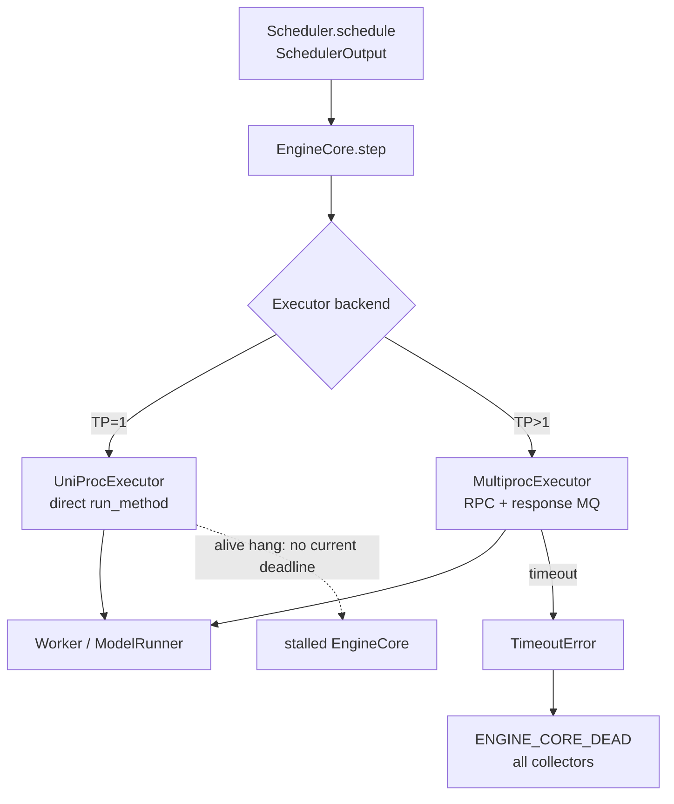
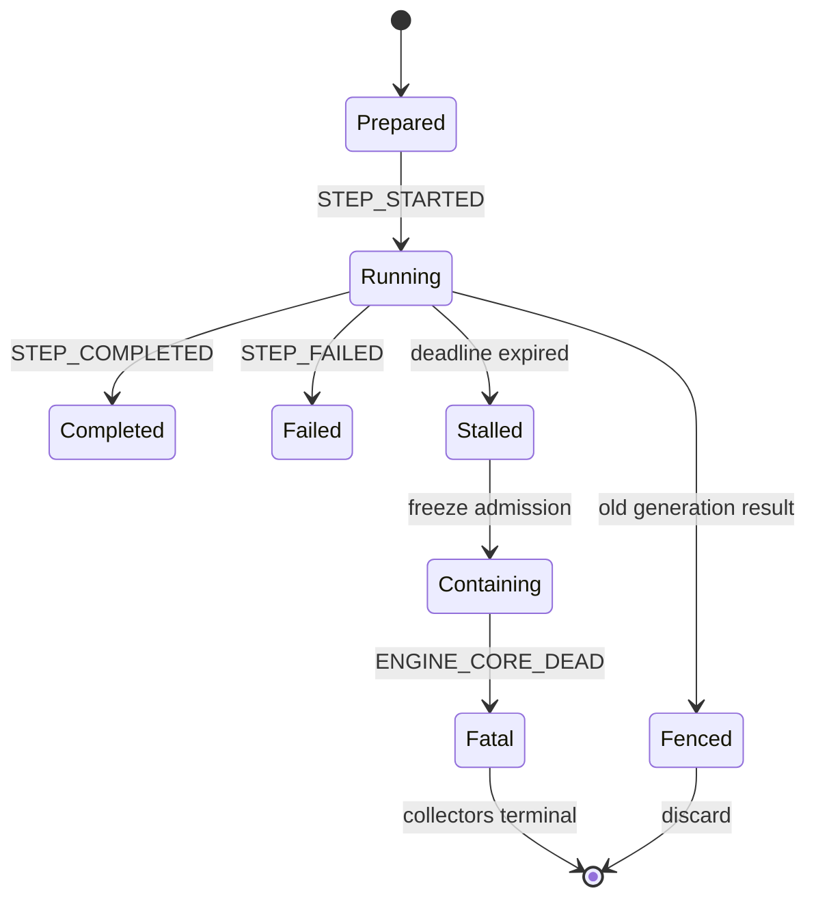

> 本文基于 vLLM `main` 的提交 [`869278cb`](https://github.com/vllm-project/vllm/commit/869278cbb02fc04a5f10d2eaba2bb251939e1eab)。当前代码事实、测试事实、已关闭 PR 的规划和本文建议协议会分开标注；`StepLease` 不是当前 vLLM 已实现的类型。

## 本篇在课程路线中的位置

第 36–42 章从 KILL、reap 一路推到 owner takeover 与 `ACTION_UNKNOWN` reconciliation，回答了“已经进入回收阶段，怎样避免旧 owner 误杀新 generation”。本章回到更早的触发点：**进程还活着，执行却永远不返回时，谁把请求从无限等待推进到统一 fatal 终态？**

课程位置是：

`ACTION_UNKNOWN reconciliation → alive-but-stalled detection → supervisor StepLease → fatal fan-out → backend deadline parity`。

## 前置知识回顾

已有三条结论直接约束今天的设计：

1. `MultiprocExecutor` 的 response MQ 有 deadline，超时可进入 `TimeoutError → ENGINE_CORE_DEAD → collectors`。
2. process monitor 只能发现 EngineCore 退出；“PID 仍在”不等于 Scheduler 正在推进。
3. fatal 之后不仅要拒绝新请求，还要对 Scheduler/KV/connector/device 给出 completed、failed 或 `completion_unknown`，不能把失联伪装成释放完成。

## 本篇要回答的核心问题

- 为什么 TP=1 比 TP>1 多一个 alive-but-stalled 盲区？
- 什么信号才足以证明一步执行“有进展”，普通 heartbeat 为什么不够？
- 怎样让 TP=1、MP、Ray/external launcher 共享 deadline 与 fatal 语义，同时保留 backend-specific evidence？
- 一个 withheld-response E2E 应证明哪些不变量，而不只是“测试最终超时”？

## 组件在全局架构中的位置

公开请求先进入 EngineCore，Scheduler 生成 `SchedulerOutput`，Executor 再调用 Worker。关键差异发生在 Executor 边界：

- TP=1 的 `UniProcExecutor` 与 Worker 同处 EngineCore 进程；调用是同步函数调用。
- TP>1 的 `MultiprocExecutor` 经 worker command queue / response MQ；等待可被绝对 deadline 截断。



真实入口见 [`EngineCore.step`](https://github.com/vllm-project/vllm/blob/869278cbb02fc04a5f10d2eaba2bb251939e1eab/vllm/v1/engine/core.py)、[`Executor` 接口](https://github.com/vllm-project/vllm/blob/869278cbb02fc04a5f10d2eaba2bb251939e1eab/vllm/v1/executor/abstract.py)、[`UniProcExecutor`](https://github.com/vllm-project/vllm/blob/869278cbb02fc04a5f10d2eaba2bb251939e1eab/vllm/v1/executor/uniproc_executor.py) 与 [`MultiprocExecutor`](https://github.com/vllm-project/vllm/blob/869278cbb02fc04a5f10d2eaba2bb251939e1eab/vllm/v1/executor/multiproc_executor.py)。
## 完整调用链

一次普通 step 的当前代码链是：

1. `EngineCore.step` 调 `Scheduler.schedule()`，得到控制面对象 `SchedulerOutput`。
2. 它调用 `model_executor.execute_model(..., non_block=True)`，随后对返回值执行 `future.result()`。
3. `MultiprocExecutor.execute_model` 把 `VLLM_EXECUTE_MODEL_TIMEOUT_SECONDS` 传给 `collective_rpc`。后者只计算一次 `monotonic()+timeout`，每次 dequeue 使用剩余时间；超时抛出 `TimeoutError`。
4. 异常越过 `run_busy_loop` 后，被 `EngineCoreProc.run_engine_core` 捕获；进程调用 `_send_engine_dead()`，输出线程把 byte sentinel 发给客户端。
5. `BackgroundResources.validate_alive` 将 sentinel 转成 `EngineDeadError`；`AsyncLLM.output_handler` 再调用 `OutputProcessor.propagate_error`，让所有 request collectors 收到同一 fatal。

这条链的代码证据分别在 [Core 主循环](https://github.com/vllm-project/vllm/blob/869278cbb02fc04a5f10d2eaba2bb251939e1eab/vllm/v1/engine/core.py)、[client sentinel 处理](https://github.com/vllm-project/vllm/blob/869278cbb02fc04a5f10d2eaba2bb251939e1eab/vllm/v1/engine/core_client.py) 与 [collector fan-out](https://github.com/vllm-project/vllm/blob/869278cbb02fc04a5f10d2eaba2bb251939e1eab/vllm/v1/engine/async_llm.py)。

TP=1 在第 2 步分叉。`UniProcExecutor.collective_rpc` 虽接受 `timeout` 参数，却直接 `run_method(self.driver_worker, ...)`；`non_block=True` 也是先执行完同步方法，再把结果包装成已完成 future。若 native kernel、driver 或 collective 不返回，控制流甚至来不及获得 future，`run_engine_core` 也没有异常可捕获。

还有一个容易混淆的配置：[`envs.py`](https://github.com/vllm-project/vllm/blob/869278cbb02fc04a5f10d2eaba2bb251939e1eab/vllm/envs.py) 声明 `VLLM_ENGINE_ITERATION_TIMEOUT_S=60`，但本文对当前默认分支的代码搜索只找到声明、环境映射和测试/benchmark 覆盖，没有找到 V1 主循环的运行时消费者。它不能被当成 TP=1 已有保护。

## 关键类型、字段和状态生命周期

### 真实对象：SchedulerOutput

`SchedulerOutput` 在 `Scheduler.schedule` 创建，持有本轮 new/cached request data、每请求 scheduled-token 数、KV connector 元数据等；`EngineCore.step` 是其 owner，将它交给 Worker，成功返回后才调用 `Scheduler.update_from_output` 提交 token 与完成状态。

withheld response 时，对象停在“物理资源已安排、设备结果未提交”的中间态。此时不能因为 frontend 等不到 token，就假定 KV block、connector job 或设备写已安全释放；fatal cleanup 最差只能报告 `completion_unknown`。

### 建议对象：StepLease

最小建议不是“每秒发一次还活着”，而是 supervisor 持有的里程碑租约：

```text
StepLease {
  engine_generation,
  step_seq,
  phase,                 # execute_model / sample_tokens / draft readback
  started_at_monotonic,
  absolute_deadline,
  workload_class
}
```

EngineCore 在进入可能阻塞的 backend action **之前**发布 `STEP_STARTED(generation, seq)`，正常路径发布唯一的 `STEP_COMPLETED` 或 `STEP_FAILED`。独立于 EngineCore 主线程的 parent supervisor 检查绝对 deadline；普通周期 heartbeat 只能证明某线程还在运行，不能续期 step lease。



严格不变量是：每个已开始的 `(engine_generation, step_seq)` 最终要么只有一个 matched completion/failure，要么由 supervisor 在 deadline 后产生 fatal terminal。**process alive 不是这个不变量的证据。**
## 逐函数源码解读

### UniProcExecutor：timeout 形参没有形成隔离边界

[`UniProcExecutor.collective_rpc`](https://github.com/vllm-project/vllm/blob/869278cbb02fc04a5f10d2eaba2bb251939e1eab/vllm/v1/executor/uniproc_executor.py) 的输入是 method、args/kwargs、timeout；输出是 Worker 方法的直接返回值。timeout 没有被消费，所有权仍在 EngineCore 主线程。其 `check_health` 也明确采用“只要运行就健康”的假设。这对无 IPC 的低延迟路径合理，却使同进程 native hang 没有观察者。

### MultiprocExecutor：deadline 是 response 边界

[`MultiprocExecutor.collective_rpc`](https://github.com/vllm-project/vllm/blob/869278cbb02fc04a5f10d2eaba2bb251939e1eab/vllm/v1/executor/multiproc_executor.py) 在发命令后等待 response MQ，并复用同一个 deadline，而不是每个 rank 重开 timeout。当前 [提交 `8a236460`](https://github.com/vllm-project/vllm/commit/8a2364605c0b0581ea5d0d3720cb1125b47abc6f) 又把 speculative `take_draft_token_ids` 纳入同一 execute-model timeout。这证明项目正在收紧“所有阻塞 readback 都必须有界”，但保护仍依赖进程间 response 边界。

### EngineCoreProc：只有异常才能触发 fatal wire

[`run_engine_core` 与 `_send_engine_dead`](https://github.com/vllm-project/vllm/blob/869278cbb02fc04a5f10d2eaba2bb251939e1eab/vllm/v1/engine/core.py) 会在异常后广播 fatal；[`run_busy_loop`](https://github.com/vllm-project/vllm/blob/869278cbb02fc04a5f10d2eaba2bb251939e1eab/vllm/v1/engine/core.py) 则在 step 前后发布 request count。卡在 step 内部时，“after step”里程碑永远不会出现，但当前 parent monitor [只观察进程退出](https://github.com/vllm-project/vllm/blob/869278cbb02fc04a5f10d2eaba2bb251939e1eab/vllm/v1/engine/core_client.py)，并不会把缺失里程碑变成异常。

## 具体示例与 shape/状态演算

假设 TP=1 有三个请求，Scheduler 在 step `418` 共安排 8 个 token：`r0=4, r1=2, r2=2`。GPUModelRunner 的持久输入 buffer 是 CUDA-graph 友好的 `input_ids: int32[max_num_tokens]`，本轮切片 shape 为 `[8]`；`positions` 是 device 上的 `int64[max_num_tokens]`，本轮同为 `[8]`。证据见 [GPUModelRunner persistent buffers](https://github.com/vllm-project/vllm/blob/869278cbb02fc04a5f10d2eaba2bb251939e1eab/vllm/v1/worker/gpu_model_runner.py)。

下面的数字只用于演算，不是仓库默认值：请求剩余总预算 10 秒，预留 fatal fan-out 1 秒、containment/reap 2 秒，因此 `D_step ≤ 10-1-2 = 7s`。

- `t=0`：supervisor 持久/可靠记录 `STEP_STARTED(g7,s418,deadline=t+7s)`。
- Worker 已拿到 `SchedulerOutput` 与 `[8]` 输入，但故障注入让响应永久 withheld；进程仍 alive。
- `t=7s`：supervisor 看到同一 lease 无 terminal，冻结 admission，标记 `STEP_STALLED`，进入 containment。
- `t≤10s`：向三个 collectors 各传播一次 fatal；新请求被拒绝；进程被终止并 reap。
- restart 后 generation 为 `g8`。若迟到结果 `(g7,s418)` 到达，generation fence 必须丢弃，不能调用 `Scheduler.update_from_output`，也不能覆盖新 generation 的 KV 状态。

阈值的下界也不能拍脑袋：`D_step ≥ max(可信的合法 prefill/compile/collective service time) + margin`。因此应按 workload class 用实测 service-time 分布与请求 SLA 校准，而不是让“收到任意 heartbeat 就续期”把故障再次变成无限等待。

## 为什么这样设计及替代方案

| 方案 | 能发现 TP=1 alive hang | 能产生统一 fatal | 主要代价/缺口 |
| --- | --- | --- | --- |
| process monitor | 否 | 进程退出后可以 | 最简单，但把存活误当进展 |
| frontend token freshness | 可告警 | 否 | 太下游；长 prefill、排队和单请求饥饿需额外语义 |
| 同进程 periodic heartbeat | 不可靠 | 否 | 可能在 GPU 卡住时继续跳，也可能因 GIL/调度停止 |
| 把 TP=1 Worker 强制拆进程 | 是 | 可复用 MP timeout | IPC、内存与启动开销，改变 fast path |
| parent-owned StepLease | 是 | 是 | 需要可靠里程碑、deadline 校准与 generation fence |

已关闭且未合入的 [PR #45526](https://github.com/vllm-project/vllm/pull/45526) 提议 `/health/decode`，用 API 进程本地 admission age、last progress age 与 inflight 数识别“进程活着但没有输出”。这是有价值的运维可观测方案，也专门处理从未产生首个输出的请求；但它返回 health verdict，并不拥有 EngineCore kill/fatal 权，也不绑定具体 `SchedulerOutput`、backend action 或 generation。它适合作为观测面，不能替代 StepLease 的控制面。
### StepLease 的前置条件、后置条件与失败方式

建议接口必须把“开始执行”定义成可判定的线性化点。前置条件是：`SchedulerOutput` 已冻结、本轮 `(generation, step_seq)` 尚未出现 terminal、supervisor mailbox 仍可写、请求剩余预算足以覆盖 step 与 fatal reserve。只有 `STEP_STARTED` 被 supervisor 接受后，EngineCore 才能进入可能阻塞的 Worker 调用；否则宁可在设备动作前失败，也不能制造“已经提交但无人知道”的 untracked step。

成功后置条件不是“Worker 返回了 Python 对象”这么简单，而是三件事同时成立：返回值属于同一 generation/seq，`Scheduler.update_from_output` 尚未被旧 generation fence 禁止，并且 `STEP_COMPLETED` 与 commit 顺序有明确约束。最保守的顺序是先验证 token，再提交 Scheduler 状态，最后发布 completion；若进程在中间崩溃，恢复方必须把它视为 commit-unknown，而不是重放设备动作。

失败方式至少分四类：

1. **before-start failure**：里程碑写入失败，Worker 尚未调用，可以安全 reject。
2. **running timeout**：设备动作可能仍在运行，supervisor 触发 fatal，但资源 verdict 只能是 unknown/quarantine。
3. **late terminal**：deadline 后旧结果返回；只能记录诊断证据，不得重新开放 admission 或提交 KV。
4. **supervisor loss**：watchdog 自己崩溃；新的 owner 必须从 generation-safe lease 记录恢复，不能仅凭 PID alive 重新计时。

这也是为什么 `last_token_age` 与 `StepLease` 不能合并成一个字段：前者回答“用户最近看到输出了吗”，后者回答“哪一次已提交的 backend action 尚无终态，谁有权在何时终止它”。二者的对象、所有权和失败语义不同。

### 跨 Executor 的最小适配面

共享协议只需三个动作：`begin_step(key, deadline)`、`finish_step(key, verdict)`、`contain_expired(key)`。UniProc adapter 的 containment target 是整个 EngineCore 进程；MP adapter 可先消费既有 MQ timeout evidence，再让 parent 统一 fan-out；Ray adapter 查询 actor/run attempt；external launcher adapter 依赖 job-attempt 与 global rank。它们不能伪装成同一种 `join()`，但应该对同一 Golden 给出相同的上层 verdict：在 deadline 内完成，或 generation 被 fence 且所有 collectors 终止。

deadline 也必须是端到端剩余预算的一次切片，而不是层层重开。若上层只剩 `R`，则 `D_step ≤ R - D_fanout - D_containment`；MP 的 response wait、supervisor 的 StepLease 和 shutdown escalation 都从同一个绝对终点计算 remaining。这样 timeout 发生在任何 backend，都不会再额外获得一整段 300 秒。
### 为什么不能在同一线程里用 timer 包住 direct call

Python 层给 `run_method` 套 `asyncio.wait_for` 或 signal timer 看似最小，但它不能中断已经进入 C++/CUDA/NCCL 的阻塞调用；即便 coroutine 被标记取消，底层工作仍可能继续写 device memory。线程 watchdog 也只能让另一个线程知道超时，若最终 containment 仍依赖被卡住的线程执行 cleanup，协议依旧没有闭合。把观察者放在 parent process，才能在 EngineCore 主线程完全失去调度机会时仍冻结 admission、广播 fatal 并启动进程级 containment。

这并不意味着一超时就断言硬件故障。supervisor 应随 `STEP_STARTED` 保存 phase、scheduled-token 数、是否首次 compile/capture、模型/并行配置等低基数分类，超时日志再关联最近 SchedulerOutput 摘要。阈值校准读取的是“合法 service time”，而不是把排队时间、frontend 慢读或 collector backpressure 混进来。若某类首次 CUDA Graph capture 合法地更慢，应给该 workload class 更宽预算；不能让任意周期心跳无限延长同一 step。

### 从 withheld-response 到资源终态

故障注入不能只在测试线程 `sleep`，而应在真实所有权边界设置 gate。gate 前确认 Worker 已接收 `SchedulerOutput`；gate 后阻止 `ModelRunnerOutput`/response 发布，但保持 PID 与健康探针可响应。oracle 同时检查五层：frontend collectors 全部 fatal、Scheduler request registry 不再增长、KV block 不被新 generation 误复用、connector job 有 terminal 或 unknown、EngineCore direct child 被 reap。只有这五层一起成立，测试才证明 timeout 是一次完整故障事务，而不是把等待者叫醒后留下孤儿工作。
### 观测信号的语义边界

可以同时保留三类信号，但不能互相冒充：process liveness 只说明 OS 仍能观察到进程；frontend progress 说明某些请求最近得到输出；StepLease terminal 才说明某个已提交 backend action 已收敛。告警系统可以组合前两者降低误报，正确性路径必须依赖第三者与 generation fence。若信号冲突，例如 frontend 仍有旧缓冲输出而新 step 已超时，控制面应以 lease/generation 为准，旧输出只能作为诊断材料。
## 性能、并发、正确性与边界条件

- **延迟与吞吐**：每 step 两个短小里程碑会增加控制面写入；应使用 bounded mailbox/共享内存槽，不能同步 fsync 热路径。
- **graphability**：StepLease 位于 Python/runtime 调度边界，不改变 model tensor shape 或 CUDA Graph key。
- **并发**：async scheduling、PP 或 speculative path 可能同时存在多个 phase；key 必须包含 phase/seq，不能只存“最后心跳时间”。
- **正确性**：deadline 到达意味着“本 generation 不再接受结果”，不是“设备绝不会迟到写”。真实设备 completion 未知时仍需 quarantine/reset fence。
- **时钟**：deadline 计算使用单机 monotonic clock；跨节点只传 duration/remaining budget，不比较 wall clock。
- **跨 backend parity**：统一的是 start/terminal/deadline/fatal oracle；MP 保留 response-timeout evidence，Ray 保留 actor/run-attempt evidence，external launcher 保留 job-attempt evidence。

## 测试证据与未覆盖风险

**测试事实：**

- [`test_forward_error.py`](https://github.com/vllm-project/vllm/blob/869278cbb02fc04a5f10d2eaba2bb251939e1eab/tests/v1/shutdown/test_forward_error.py) 同时覆盖 TP=1/2：在模型 forward 主动抛异常后，三个并发请求都收到 `EngineDeadError`，新请求被拒绝并检查显存回落。它证明 exception fan-out，不证明 alive withheld response。
- [`test_multiproc_executor.py`](https://github.com/vllm-project/vllm/blob/869278cbb02fc04a5f10d2eaba2bb251939e1eab/tests/v1/executor/test_multiproc_executor.py) 验证 stalled `take_draft_token_ids` 使用 timeout；它不是 TP=1 或完整 `execute_model` E2E。
- [fault-tolerance E2E](https://github.com/vllm-project/vllm/blob/869278cbb02fc04a5f10d2eaba2bb251939e1eab/tests/v1/fault_tolerance/test_fault_tolerance_e2e.py) 会杀死独立 Worker 并观察存活 EngineCore 的状态；TP=1 Worker 与 Core 同进程，无法用同一注入方式覆盖。
- [startup watch tests](https://github.com/vllm-project/vllm/blob/869278cbb02fc04a5f10d2eaba2bb251939e1eab/tests/v1/engine/test_startup_watch_processes.py) 覆盖进程启动/死亡监控，不覆盖 alive-but-stalled。

**应新增的 Golden：** 在 `SchedulerOutput` 已交给 Worker、response 尚未发布处放 deterministic gate；保持 TP=1 EngineCore PID alive。断言统一绝对 deadline 内：supervisor 宣布 stalled、所有 collectors 恰收一次 fatal、新 admission 拒绝、进程终止并 reap、资源只发布可证明的 terminal、旧 generation 的迟到 output 被拒绝。随后对 MP 使用同一 oracle，仅把 gate 放到 response MQ 前。

尚未覆盖的风险包括：Python fake wait 与真实 CUDA/NCCL uninterruptible hang 的差异、CUDA Graph 首次编译造成的合法长 step、PP/connector sideband 仍在推进但主 output 停滞，以及 parent supervisor 自身崩溃后的 lease 恢复。

## 与前后章节的连接

上一章的 generation-safe reconciliation 解决“动作结果未知”；本章的 `StepLease` 解决“何时有足够证据启动 fatal 动作”。二者通过同一个 `engine_generation` 相接：deadline 触发 containment 后，迟到 completion 必须进入上一章的 query/quarantine 语义，不能直接提交。

下一章将继续回答：**heartbeat 之后谁能动手**——supervisor 的 kill authority 如何绑定 owner epoch、StepLease generation 与 backend member token，并在 late completion 与 supervisor restart 下保持 fencing。

## 本篇结论、知识债、三个理解检查问题和下一章

结论只有一句：**TP=1 的低开销 direct call 删除了 IPC timeout 边界，因此必须在 EngineCore 进程之外重建可证伪的 step-progress contract；heartbeat 是观测，绝对 deadline、fatal fan-out 与 generation fence 才是正确性闭环。**

知识债：真实 `StepLease` wire/schema、parent watchdog、TP=1 native-like withheld-response failpoint、MP/Ray/launcher parity、动态 workload budget、device reset/quarantine、supervisor crash recovery 与真实 CUDA/NCCL hang 校准。

理解检查：

1. 为什么 `UniProcExecutor.collective_rpc(timeout=...)` 的形参不能证明 TP=1 有 timeout？
2. 为什么 API 层 last-token age 能报警，却不能授权释放 Scheduler/KV 资源？
3. supervisor 宣布 `g7/s418` stalled 后，迟到的成功结果为什么仍必须丢弃或进入 reconciliation？

下一章：**Heartbeat 之后谁动手——Supervisor Kill Authority、StepLease Generation 与 Late Completion Fencing。**

## 课程账本增量

- 第 43 章补齐 `SchedulerOutput → UniProc/Multiproc → Worker → fatal fan-out` 的 TP=1/TP>1 差异。
- 新确认不变量：process alive 不等于 progress；step terminal 必须匹配 generation/seq；普通 heartbeat 不得自动续期 destructive deadline。
- 新测试债：alive Worker withheld-response、三个 collector exactly-once fatal、old-generation late output、TP=1/MP 共用 oracle。
