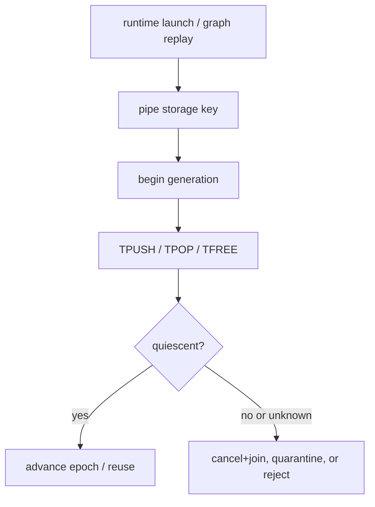
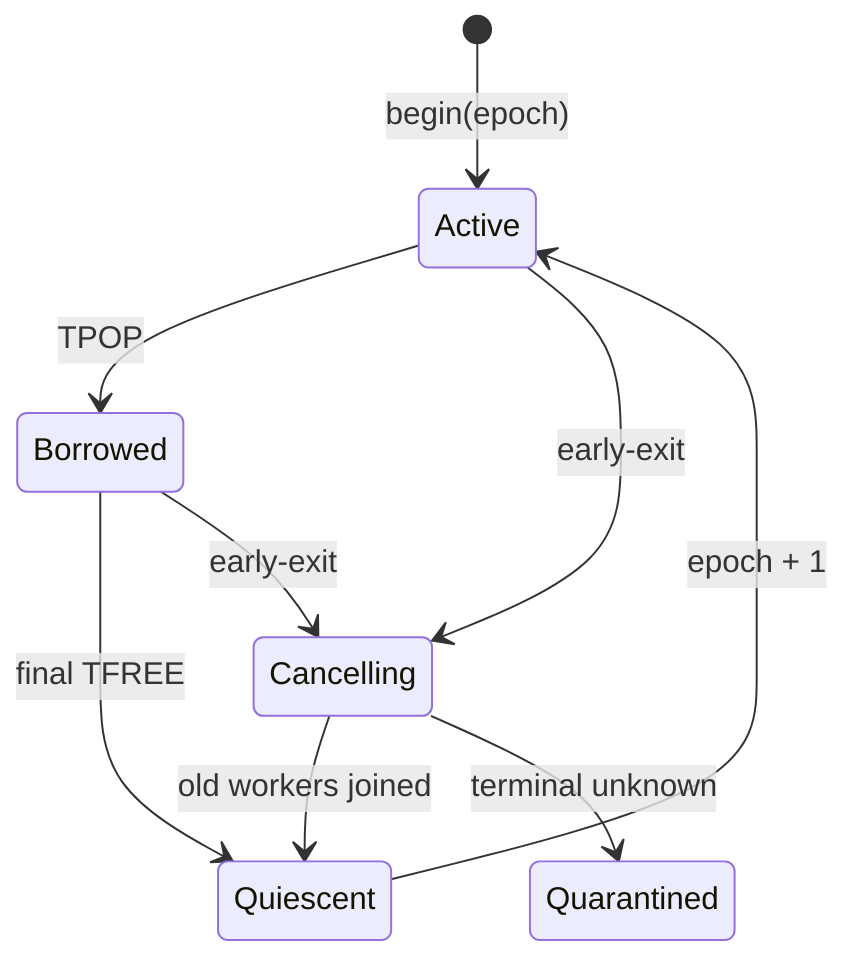

## 本篇在 PTO 课程路线中的位置

第 50 章确认了 `DIR_BOTH` 在**一代之内**已有两套独立 ring、`commit_seq` 和 `(direction, slot)` pop ownership。本篇继续问时间轴上的问题：一次 dispatch 提前退出后，相同 `FlagID`、shape 和 block 再次出现，旧 ready entry、borrow 或 waiter 能否被新执行误认？

课程位置：

```text
per-direction FIFO → abnormal-exit census → PipeEpoch fence（本篇） → A2/A3/A5 replay Golden
```

分析基于 pto-isa 默认分支 [`15a9e0a0`](https://github.com/hw-native-sys/pto-isa/commit/15a9e0a0845955f5d7a409a7f4d1609a263b5d25)。该 head 的最新同步未改变本文路径；直接相关的既有实现仍来自 [`de6964a6`](https://github.com/hw-native-sys/pto-isa/commit/de6964a6c71d1c3ddc604b0f200a11c808d6bd0c) 与 [`8e0f3124`](https://github.com/hw-native-sys/pto-isa/commit/8e0f3124a51c151206725336bbbb5383c0cc5e0b)。本篇只选 pto-isa，因为 state key、FIFO 状态和直接回归都在该仓库。

## 前置知识

`TPUSH` 的 `allocate → payload write → record` 使 slot 可见；`TPOP` reserve 一个已提交 slot；最后一个 `TFREE` 才允许覆盖。`commit_seq` 只回答“本方向哪个 entry 更老”，不能回答“这个 entry 属于哪次 dispatch”。

安全复用至少需要三件事同时成立：

1. **spatial identity**：这是哪个 pipe、block、方向和 backing；
2. **quiescence**：旧代没有 committed、borrowed、allocated、blocked waiter 或迟到操作者；
3. **temporal identity**：即使物理 key 相同，也能区分 generation 41 与 42。

## 今日核心问题

1. 当前 `pipeKey`、`task_cookie` 与 `reset_for_cpu_sim()` 分别能证明什么，不能证明什么？
2. early-exit 后如何让下一次 same-key dispatch **失败得可诊断**，而不是挂死、吃到旧 payload，或靠危险的原地清零“恢复”？

先给结论：当前代码没有 `PipeEpoch`。`reset_for_cpu_sim()` 是测试隔离工具，不是并发 cancel；只有在旧参与者已经停止后，它才可安全清零。Graph replay 若复用同一 storage，必须由 runtime 提供新的 generation，并在状态提交、wait、free 三处拒绝旧代操作。

## PTO 全栈中的位置



上游是 runtime 对 launch、graph instance、block 和 worker 的身份管理；中间是 `TPipe` 的共享状态；下游是下一次 kernel/replay 能否安全复用 flag、slot storage 与 payload。ISA API 表面仍是 `TPUSH/TPOP/TFREE`，generation 应由 runtime 与 backend adapter 注入，而不是让 kernel 作者手写一个随意递增的整数。

## 概念和精确语义

### 当前 key 是空间身份，不是完整时间身份

当前 [`TPipe::GetSharedState`](https://github.com/hw-native-sys/pto-isa/blob/15a9e0a0845955f5d7a409a7f4d1609a263b5d25/include/pto/cpu/TPush.hpp#L609-L646) 有三条路径：

- injected/dynamically resolved numeric hook 收到由 `FlagID、DirType、SlotNum、LocalSlotNum、SlotSize` 拼成的 `pipeKey`；它不含 block、task 或 generation；
- string shared-storage fallback 使用 `pto-pipe-<task_cookie>-<block_idx>-...`；
- 没有 hook 时退回进程内 `static SharedStateStorage`。

`task_cookie` 能成为 runtime run identity 的一部分，但当前 `TPipe` 不验证 cookie 单调、唯一或与 graph replay 一一对应；numeric hook 甚至看不到它。因此“key 不同”可以隔离状态，“key 相同”却不能证明仍是同一合法 generation。

### 一次性初始化不等于每次 launch 初始化

[`SharedStateStorage`](https://github.com/hw-native-sys/pto-isa/blob/15a9e0a0845955f5d7a409a7f4d1609a263b5d25/include/pto/cpu/TPush.hpp#L593-L607) 只有 `init_state` 与若干 `SharedState` payload。`EnsureSharedStateInitialized` 通过 CAS placement-new 一次，之后同一 storage 会保留 `occupied`、`slot_busy`、`transfer_dirs`、`commit_seq` 与 payload。

这正是 producer/consumer 跨 host thread 共享 FIFO 所需的所有权；但它也意味着 early-exit 残留不会因下一次函数调用自动消失。

### `reset_for_cpu_sim()` 不是 quiescence 证明

[`reset_for_cpu_sim`](https://github.com/hw-native-sys/pto-isa/blob/15a9e0a0845955f5d7a409a7f4d1609a263b5d25/include/pto/cpu/TPush.hpp#L649-L679) 分方向加锁，清零 cursor、occupancy、borrow、payload、commit sequence 等，再 `notify_all()`。它没有：

- 标记“旧 generation 已取消”；
- 统计并 join 正在 `cv.wait` 的线程；
- 阻止已通过谓词、尚未完成 payload copy 的旧线程继续运行；
- 清除旧 `TPipe::Consumer` 对象里的 `pendingDirections/pendingSlots`。

因此活线程存在时原地 reset 会制造 ABA：旧线程醒来后看到一份“像新的一样”的状态，可能把旧操作提交进新 dispatch。**代码事实**是 reset 会清状态；“旧参与者停止后才能 reset/replace”是由 mutex/cv 生命周期和旧对象本地状态推导的安全前置条件。

## 真实文件、类型、API 或指令逐段解读

### `SharedStateStorage → SharedState`

`SharedStateStorage` 是 storage owner 提供的稳定、对齐 backing；`init_state` 只保护构造。每个方向的 `SharedState` 才拥有 mutex/cv、payload、slot 状态和序号。`DIR_BOTH` 的 `STATE_COUNT=2` 已解决方向互相污染，却没有任何字段描述 run generation。

### `Producer::allocate/record`

`allocate` 在 `cv.wait` 中等待 cursor slot 可用，获得一个临时 reservation；`record` 在 split lane 全部完成后写 `transfer_dirs`、`remaining_consumers`、`commit_seq`，增加 `occupied` 并唤醒 consumer。建议中的 epoch 必须在 **wait 返回后、commit 前**再次核验；只在进入函数时核验无法挡住 cancel 与 wake 之间的竞态。

### `Consumer::wait/free`

`wait` 选择最老 committed slot并把 `(direction,slot)`写入对象本地 queue；`free` 从队头恢复 owner 并归还共享 slot。这里需要两次 fence：取得 slot 前拒绝 stale epoch，归还 slot 前再次确认 token 仍属于同代。否则旧 `free` 可降低新代 `remaining_consumers`。

建议的最小 token 是：

```text
PipeToken = (storage_identity, epoch, block_idx, direction, optional slot)
```

这是本篇设计建议，不是当前 API。

## 对象、Tile、Buffer 与状态生命周期



当前实现只有 slot 的 `Free/Committed/Borrowed` 生命周期；建议增加 storage 级 lifecycle。epoch 在 `begin` 创建，由所有本代 producer/consumer 持有；正常 free 或 cancel+join 使状态 quiescent；只有这时才能在同一 backing 上递增。无法证明旧线程、设备 flag 或 DMA 已终止时，不得靠软件数字强行复用，应 quarantine 或重建执行域。

## 端到端调用链或指令链

当前真实链：

```text
runtime hook
→ GetSharedState(pipeKey or task_cookie key)
→ EnsureSharedStateInitialized (only once)
→ TPUSH / Producer::allocate + record
→ TPOP / Consumer::wait + pushPendingPop
→ TFREE / Consumer::free
→ test calls reset_for_cpu_sim before another case
```

建议的 replay 链：

```text
launch/replay obtains epoch
→ begin_dispatch checks previous snapshot
→ every wait/commit/free carries epoch
→ early-exit sets cancel(epoch)
→ wake + join old participants
→ quiescent snapshot persisted
→ epoch+1 may reuse storage
```

## 具体 shape、Tile 和状态演算

取 `DIR_BOTH`、`SlotNum=2`、`16×16xf32`，每 Tile `1024 B`。dispatch D41 使用 epoch 41：

1. Cube `TPUSH(A)` 到 C2V slot 0：`occupied=1, commit_seq=1`。
2. Vector `TPOP(A)` 后提前退出，未 `TFREE`：slot 0 仍 busy，consumer 对象保留 `(C2V,0)`。
3. replay D42 使用同 `FlagID=3`、同 shape 和同 storage key。

若直接继续：新 consumer 可能把旧 committed A 当作 D42 输入；若旧 A 已被 pop，则新 producer 只有一个空 slot，继续两次 push 后阻塞。若先在旧线程仍活着时 reset，旧 `TFREE` 迟到又可能修改新代 slot 0。

有 `PipeEpoch` 时，D42 的 `begin(42)` 先读取 D41 snapshot：`borrowed=1`，因此 verdict 是 `NOT_QUIESCENT`。runtime 只能 cancel+join D41，或隔离旧 backing；在获得 quiescent witness 前不能把 1024 B slot 0 分给 D42。旧线程携带 `(storage,41,C2V,0)`，任何迟到 commit/free 都因 `41 != current_epoch` 被拒绝。

## 为什么这样设计及替代方案

**每次 dispatch 分配全新 storage/key** 最简单：把 `task_cookie` 当不可复用 run identity，旧代 backing 保留到参与者终止。它减少共享状态机复杂度，但增加 allocation、map 和缓存压力；更重要的是仍需要知道何时可释放旧 storage。

**原地 hard reset** 成本最低，却只有在外部已经证明 quiescent 时安全；把 reset 当 cancel 会引入 ABA。

**显式 epoch + cancel/join** 允许稳定 backing 与 graph replay，元数据和分支成本很小，但要求 runtime、CPU_SIM、A2/A3/A5 共享 token/verdict 语义，并为设备侧不可查询状态提供 quarantine/reset。维护成本高于裸 reset，却把错误从随机挂死变成稳定 reason code。

性能上，epoch 比较不是主要瓶颈；真正影响吞吐的是 abnormal path 为旧 backing 保留容量，以及 graph replay 前的 quiescence barrier。正常完成路径应只在 launch boundary 取 epoch，不应给每个元素或每个 DMA 增加同步。

## 访存、计算、流水、并行和硬件约束

- CPU_SIM 的 mutex/cv 与 host payload 能精确验证 ownership/order，不能证明 A2/A3/A5 flag 或 DMA 已停止。
- graph replay 保证命令拓扑可复用，不保证上次异常执行的 flag、ring 和 payload 自动归零。
- epoch 必须约束 destructive reuse，而不只是过滤输出；否则旧设备写仍可覆盖新 Tile。
- `DIR_BOTH` 应以两向联合 quiescence 才允许整体 key reuse；单向 idle 不足以升级 pipe epoch。

## 测试证据与未覆盖风险

**当前测试事实：**[`tests/cpu/st/testcase/tpushpop/main.cpp`](https://github.com/hw-native-sys/pto-isa/blob/15a9e0a0845955f5d7a409a7f4d1609a263b5d25/tests/cpu/st/testcase/tpushpop/main.cpp) 的双向满容量、32 次 round trip、overlapping pop 与 hook storage 用例验证正常状态闭合；相关提交记录 focused tpushpop 32/32、fixpipe 3/3。测试普遍在 case 开始调用 `reset_for_cpu_sim()`；hook reset 用例也先人工写 occupancy，再同步 reset，没有存活 waiter 或旧对象。

**建议的最小 Golden：**

1. 固定同一 numeric key/storage，D41 在 `after_record`、`after_pop`、`before_free` 三个 failpoint 分别提前退出；
2. 不调用 reset，启动 D42；期望有界返回 `NOT_QUIESCENT` 或 `STALE_EPOCH`，不得消费 poison payload，也不得永久阻塞；
3. cooperative cancel 后 join 全部 D41 thread，再记录 immutable snapshot；
4. 只有 snapshot 两向均无 occupied/busy/borrow/waiter 时允许 epoch 42；
5. 重放 100 次，并让 D41 的迟到 callback 在 D42 启动后到达，验证其不能改变 D42 state。

尚未覆盖的风险包括：waiter cancellation 的内存序、epoch wrap、storage provider 重用地址造成 ABA、graph executor crash、A2/A3 pending credit、A5 local FIFO、设备迟到写，以及 reset/quarantine 的真实性能成本。

## 与前后章节的连接

第 50 章解决“同代方向与 slot 归谁”；本章解决“跨代这份所有权是否仍有效”。下一章应把 CPU_SIM token 扩展到 A2/A3 ready/free flag 与 A5 local FIFO，建立同一 replay scenario 下的 backend-specific evidence，而不是强行要求三代硬件暴露相同内部计数。

## 本篇结论、知识债、三个理解检查问题和下一章

结论：

1. `task_cookie`/pipe key 是 namespace 素材，不自动构成可验证的 generation lease。
2. `reset_for_cpu_sim()` 只有在旧参与者已停止时才是安全清理；它不能替代 cancel+join 与 quiescent witness。
3. Graph replay 的安全条件是旧代终止证据加新 epoch，而不是“再次调用同一 kernel”。

知识债：真实 `PipeEpoch/PipeToken` schema、waiter census、cooperative cancel、bounded join、stable verdict、numeric hook run identity、epoch wrap、A2/A3/A5 adapter、graph executor failpoint，以及迟到 DMA/flag poison E2E。

理解检查：

1. 为什么 `commit_seq` 即使单调，也不能充当 dispatch epoch？
2. `reset_for_cpu_sim()` 在什么前置条件下才不会产生 ABA？
3. Graph replay 若每次换 `task_cookie`，为什么仍需旧 backing 的终止/释放证据？

下一章：**一份 Epoch，三种证据——A2/A3 Pending Credit、A5 Local FIFO 与 CPU_SIM Replay Adapter。**

## 课程账本增量

- 源码基线：pto-isa [`15a9e0a0`](https://github.com/hw-native-sys/pto-isa/commit/15a9e0a0845955f5d7a409a7f4d1609a263b5d25)。
- 新覆盖文件：`include/pto/cpu/TPush.hpp`、`include/pto/common/cpu_stub.hpp`、`docs/coding/cpu_sim.md`、CPU tpushpop 回归。
- 新覆盖符号：`SharedStateStorage::init_state`、`EnsureSharedStateInitialized`、`GetSharedState` 的 numeric/string/static 三路径、`reset_for_cpu_sim`、`pendingDirections/pendingSlots`。
- 新确认不变量：storage 初始化与 dispatch 初始化不同；reset-before-quiescence 不安全；generation 必须同时 fence wait、commit、free；两向联合 quiescence 后才能复用整体 pipe identity。
- 测试结论：当前正向与同步 reset 回归不覆盖 same-key/no-reset early-exit、存活 waiter、old-object late free 或 graph replay。
- 下一章：A2/A3、A5 与 CPU_SIM 的 generation evidence adapter 和 replay Golden。
