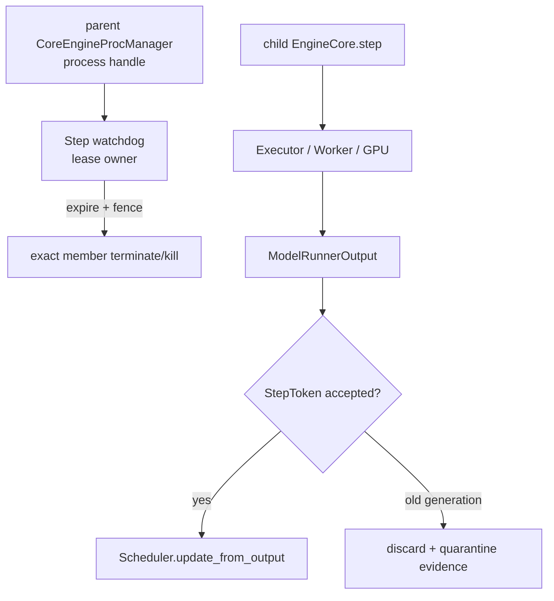
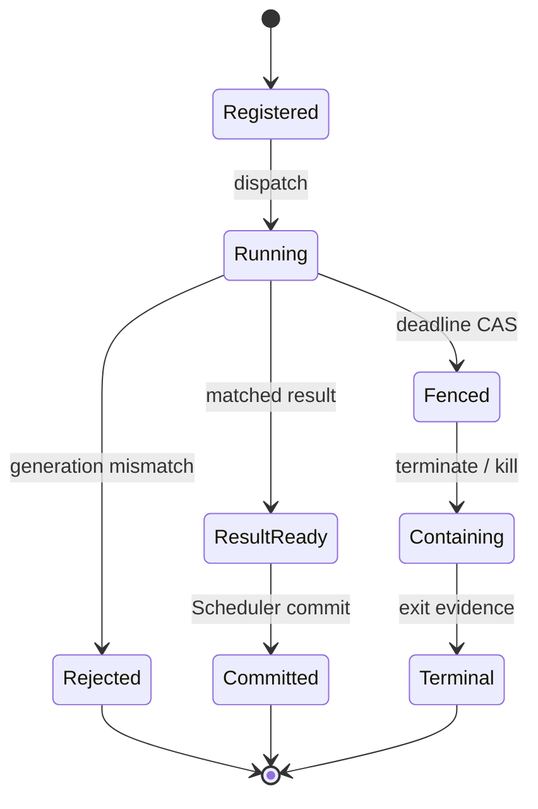

> 本文基于 vLLM `main` 的提交 [`09c47db1`](https://github.com/vllm-project/vllm/commit/09c47db1ca080793dc2351144cb39513fd7984ca)。该提交本身是 XPU CI 调整，与本文路径无语义关系。文中把当前代码、测试、历史已合入 PR 与建议协议分开陈述；`StepLease`、`StepToken` 和 supervisor generation 仍是本文建议，不是现有 vLLM 类型。

## 本篇在课程路线中的位置

第 43 章确认：TP=1 的 `UniProcExecutor` 直接调用 Worker，`timeout` 形参并未形成可中断的 response boundary；因此 EngineCore 可能“进程活着、step 永不返回”。本章只推进一个边界：**独立观察者判定 step 超时以后，谁有权终止它，以及迟到结果如何失去提交权？**

课程位置：

`alive-but-stalled detection → supervisor kill authority → Step generation fence → late output/KV reuse gate`。

## 前置知识回顾

先保留三条已有结论：

1. heartbeat、step progress、process terminal 是三类证据；heartbeat 不能替 step 续期。
2. `EngineCore.step` 的成功路径是 `schedule → execute_model → future.result → update_from_output`；最后一步才把设备结果提交进 Scheduler。
3. timeout 只说明 deadline 已过，不说明 CUDA/NCCL 已停止，也不自动授予任何观察者 KILL 权限。

## 本篇要回答的核心问题

- parent、EngineCore、Executor 和 Worker 中，谁实际持有可终止对象？
- 为什么 `step_seq` 不能单独防住 restart 后的旧结果？
- 现有 Scheduler deferred-free fence 已经保证了什么，又缺什么？
- 软件丢弃迟到 output 后，为什么显存块仍可能不能立即复用？

## 组件在全局架构中的位置

当前 parent 的 [`CoreEngineProcManager`](https://github.com/vllm-project/vllm/blob/09c47db1ca080793dc2351144cb39513fd7984ca/vllm/v1/engine/utils.py) 创建并保存 `BaseProcess`；其 monitor 只等待 process sentinel。真正执行 `Scheduler.update_from_output` 的则是 child EngineCore。两者能力不同：parent 能发信号，child 能修改 Scheduler；任何单边方案都不完整。



当前代码只有图中的 parent process handle、child commit path 与局部 block fence；独立 watchdog、`StepToken` 检查和跨 restart generation 尚不存在。

## 完整调用链

公开请求经 `AsyncLLM.generate` 和 EngineCore wire 到达 child 后，一次正常 step 的链路是：

1. [`EngineCore.step`](https://github.com/vllm-project/vllm/blob/09c47db1ca080793dc2351144cb39513fd7984ca/vllm/v1/engine/core.py) 调 `Scheduler.schedule()`，产生 `SchedulerOutput`。
2. `model_executor.execute_model(..., non_block=True)` 把该对象交给 Worker；TP=1 由 [`UniProcExecutor.collective_rpc`](https://github.com/vllm-project/vllm/blob/09c47db1ca080793dc2351144cb39513fd7984ca/vllm/v1/executor/uniproc_executor.py) 同步执行，MP 则经 [`MultiprocExecutor.collective_rpc`](https://github.com/vllm-project/vllm/blob/09c47db1ca080793dc2351144cb39513fd7984ca/vllm/v1/executor/multiproc_executor.py) 的 MQ deadline 等待 response。
3. `future.result()` 或 `sample_tokens()` 得到 `ModelRunnerOutput`。异步输出还可能在 [`AsyncGPUModelRunnerOutput.get_output`](https://github.com/vllm-project/vllm/blob/09c47db1ca080793dc2351144cb39513fd7984ca/vllm/v1/worker/gpu_model_runner.py) 阻塞于 CUDA event，再把 token/logprobs 搬到 Host。
4. `Scheduler.update_from_output(scheduler_output, model_output)` 减少 `num_in_flight_tokens`、提交 sampled token、推进完成状态，并在安全时归还 deferred KV blocks。
5. `EngineCoreOutputs` 经 ZMQ 返回 frontend；[`BackgroundResources.validate_alive`](https://github.com/vllm-project/vllm/blob/09c47db1ca080793dc2351144cb39513fd7984ca/vllm/v1/engine/core_client.py) 只把单帧 `ENGINE_CORE_DEAD` 识别为 fatal。

异常若能回到 `EngineCoreProc.run_engine_core`，child 会 `_send_engine_dead()` 再 teardown。问题是 TP=1 native hang 不返回，child 无法自报；parent monitor 又只观察进程退出。parent 虽可在 shutdown 中调用 `terminate → join → kill_process_tree`，却没有 step identity、超时 CAS 或 late-output gate。

## 关键类型、字段和状态生命周期

### 当前对象：本地 Scheduler step fence

当前 [`Scheduler`](https://github.com/vllm-project/vllm/blob/09c47db1ca080793dc2351144cb39513fd7984ca/vllm/v1/core/sched/scheduler.py) 有：

- `sched_step_seq`：只在非空 step schedule 后递增；
- `processed_step_seq`：`update_from_output` 处理非空 step 时递增；
- `Request.last_sched_seq`：记录该 request 最近可能写其 blocks 的 step；
- `deferred_frees: deque[(fence_seq, blocks)]`：只有 `processed_step_seq >= fence_seq` 才归还 block pool。

生命周期是 `schedule` 分配/标记 block → GPU step 可能写入 → request abort/finish 时移除逻辑所有权但延迟物理复用 → 对应 output 被处理后 drain。它精准解决“旧 GPU 写覆盖刚收到的 PD KV”这一进程内竞态。

但当前 [`SchedulerOutput`](https://github.com/vllm-project/vllm/blob/09c47db1ca080793dc2351144cb39513fd7984ca/vllm/v1/core/sched/output.py) 没有 generation/step 字段；[`ModelRunnerOutput`](https://github.com/vllm-project/vllm/blob/09c47db1ca080793dc2351144cb39513fd7984ca/vllm/v1/outputs.py) 只有 `req_ids`、`req_id_to_index`、sampled tokens/logprobs 等；[`EngineCoreOutputs`](https://github.com/vllm-project/vllm/blob/09c47db1ca080793dc2351144cb39513fd7984ca/vllm/v1/engine/__init__.py) 只有 `engine_index`，没有 process generation。计数器 restart 后从 0 重来，不能证明一个 output 属于哪次 Engine 实例。

### 建议对象：StepToken 与 authority

最小 token 应绑定：

```text
StepToken = {
  engine_generation,
  step_seq,
  supervisor_epoch,
  member_token,
  absolute_deadline
}
```

`member_token` 不能只是 PID；MP 可用 parent 持有的 process handle/pidfd identity，Ray 要用 actor run attempt，external launcher 要用 job attempt + rank。token 的 owner 是能够同时原子 fence generation、停止 admission、发布 fatal、定位进程的 supervisor，而不是发送 heartbeat 的线程。



关键线性化点是 `Running → Fenced`。只有成功完成这次 CAS 的当前 supervisor epoch 才能发 destructive action；CAS 失败者只能读取 final。KILL 也必须瞄准 token 中的 exact member，避免 PID/actor/rank reuse。

## 逐函数源码解读

### `CoreEngineProcManager`：有 handle，没有 step verdict

manager 的 `self.processes` 是 parent 的直接能力；`shutdown()` 通过通用 [`vllm.v1.utils.shutdown`](https://github.com/vllm-project/vllm/blob/09c47db1ca080793dc2351144cb39513fd7984ca/vllm/v1/utils.py) 先 `terminate()`，共用 deadline `join()`，再对残留 PID 调 `kill_process_tree()`。这说明 parent 是 TP=1 hang 的天然 containment owner。但 `monitor_engine_liveness()` 等待的是 sentinel，只能在“已经死”后反应，不能判定“活着但 step 失联”。

### `EngineCore.step`：commit gate 目前只有控制流顺序

当前唯一门槛是 `future.result()` 必须先返回，随后才调用 `update_from_output`。没有 `(generation, step_seq)` 比对。只要旧结果在 KILL 生效前抢先返回，它仍可进入 Scheduler；只在 frontend 丢弃 token 也不够，因为 `update_from_output` 已可能减少 in-flight 计数、推进 `processed_step_seq` 和释放 block。

建议在两个边界检查同一 token：child 在 `update_from_output` 前检查“仍是 RUNNING”；parent/frontend 在接收 `EngineCoreOutputs` 时再次检查 generation。前者保护 Scheduler/KV，后者保护 stream/collector。旧 child 即使在被杀前完成本地 mutation，它发出的 output 也不能跨 generation 生效。

### `Scheduler.update_from_output`：output 即 completion witness 的假设

代码注释明确把“本步 output 被处理”当成“此前 GPU writes 已完成”的证据，并据此 `processed_step_seq += 1`、drain deferred frees。该假设在同一活跃 Engine 的 FIFO 路径成立；一旦 supervisor 已宣布该 generation 失效，旧 output 就不能再提升新实例的 completion watermark。跨 restart fence 必须包在现有局部 fence之外，而不是替换它。

## 具体示例与 shape/状态演算

设 Engine generation `g17` 的 step `s42` 调度三请求：`r0=4`、`r1=2`、`r2=2`，共 8 token。`GPUModelRunner` 的持久 `input_ids` buffer 是 `int32[max_num_tokens]`，本轮有效切片 `[8]`；`positions` 是 device 上 `int64[max_num_tokens]`，本轮同为 `[8]`。假设输出为三个 decode token：`sampled_token_ids=[[101],[202],[303]]`。

1. supervisor 先接受 `StepToken(g17,s42,epoch9,M7,D)`，child 才 dispatch。
2. `D` 到期仍无 matched result；epoch 9 的 supervisor CAS：`RUNNING → FENCED`，冻结 admission，fatal fan-out，然后对 `M7` 终止/升级 KILL。
3. restart 产生 `g18`。此时旧 output `(g17,s42)` 恰好从 D2H copy 返回。
4. token gate 必须在 `update_from_output` 前拒绝它：不能把各 request 的 `num_in_flight_tokens` 分别减 `4/2/2`，不能令 `processed_step_seq` 前进，不能 stream `101/202/303`，也不能据此归还 deferred blocks。
5. 软件 gate 只能阻止状态提交。若 g17 的 GPU/NIC 写是否停止仍未知，其物理 allocation 必须保持隔离，直到旧 context teardown、backend completion query 或 scoped reset 给出可信证据。

这里没有给 deadline 拍固定秒数。可部署条件应是：

`D_step ≤ request_remaining - fatal_fanout_reserve - containment_reserve`，同时 `D_step` 不小于该 workload class 的可信 prefill/compile/collective 尾延迟加 margin。两边数据不足时，应先测 service-time 分布与 P99 goodput，而不是用 heartbeat 无限续期。

## 为什么这样设计及替代方案

| 方案 | 阻止旧 Scheduler commit | 精确 KILL target | 代价/缺口 |
| --- | --- | --- | --- |
| child 自己超时 | 可能 | 只有未卡死时 | native hang 时执行不到 timeout handler |
| parent 按裸 PID KILL | 否 | 否 | PID reuse；KILL 前返回仍可提交 |
| frontend 只过滤旧 stream | 否 | 不涉及 | 用户看不到旧 token，但 KV/计数已可能改变 |
| 每 step 单独进程 | 是 | 是 | IPC、启动、权重/graph cache 成本不可接受 |
| supervisor lease + 双 gate | 是 | 是 | 增加 sideband、CAS、generation 传播与测试矩阵 |

最小充分设计不是把 generation 塞进 GPU tensor；token 留在 Host control plane，不改变 model shape、dtype、device address 或 CUDA Graph key。每 step 的 durable 写也未必必要：可以让同一 supervisor epoch 的 mailbox/WAL group commit，但“register-before-dispatch”与“fence-before-kill”两条因果边不能被优化掉。

## 性能、并发、正确性与边界条件

- **延迟/吞吐**：每 step 同步远程 registry 会放大 decode 固定开销；实现应把 owner epoch 本地租约化，并批量持久化事件，但以丢失 authority 为代价的缓存不可接受。
- **并发**：async scheduling/PP 可同时有多个 in-flight seq，watchdog 状态必须是有序集合，不能只有一个 `last_heartbeat`。同 generation 内仍维持当前 FIFO output 假设。
- **graphability**：Host token gate 不进入 CUDA Graph，避免 padding、地址稳定性或 recapture 成本；真正有风险的是 timeout 后过早复用 graph/KV workspace。
- **正确性**：`expired` 是检测事实，`fenced` 是 authority 转移，`killed` 是动作事实，`reaped/context reset` 才是不同层级的终态证据，不能合并成一个布尔值。
- **失败边界**：supervisor 在 CAS 后、KILL 前崩溃时，新 owner只能续用同 operation id 查询/重放；旧 owner恢复后因 epoch 过期必须 fail closed。

## 测试证据与未覆盖风险

当前最直接的正面证据是 [`tests/v1/core/test_deferred_block_free.py`](https://github.com/vllm-project/vllm/blob/09c47db1ca080793dc2351144cb39513fd7984ca/tests/v1/core/test_deferred_block_free.py)：使用 33-token prompt、block size 16（3 blocks），先 schedule prefill 与一个超前 decode；stop/abort 后断言 blocks 仍在 `deferred_frees`，直到最新 step output 被 `update_from_output` 处理才回 pool。它验证进程内 FIFO fence，根因与修复来自已合入 [PR #45357](https://github.com/vllm-project/vllm/pull/45357) / [commit `d467a2a7`](https://github.com/vllm-project/vllm/commit/d467a2a7f2f088dd360c7bef2f3cf5c59a1ffde8)。

另外：

- [`test_take_draft_token_ids_uses_execute_model_timeout`](https://github.com/vllm-project/vllm/blob/09c47db1ca080793dc2351144cb39513fd7984ca/tests/v1/executor/test_multiproc_executor.py) 用 7 秒环境值断言 MP readback 传递剩余 timeout，并覆盖 stalled `TimeoutError`；它不覆盖 TP=1。
- [`test_forward_error.py`](https://github.com/vllm-project/vllm/blob/09c47db1ca080793dc2351144cb39513fd7984ca/tests/v1/shutdown/test_forward_error.py) 在第 11 次 rank-0 forward 抛异常，对 TP=1/2 验证三个 collectors 都收到 `EngineDeadError`、新请求拒绝和显存回落；它测试“异常返回”，不是“永不返回”。
- startup/process tests 只验证进程退出或 shutdown timeout，不验证 alive-but-stalled lease。

尚缺的关键 Golden 是：在 `before dispatch / after dispatch / before result gate / after result gate / before Scheduler commit / after commit` 六点崩溃或暂停；deadline 后释放伪造的旧 `(g17,s42)`，断言零 token 泄漏、零 `processed_step_seq` 前进、零 block reuse，并分别校准 MP、Ray、external launcher 的 target evidence。真实 CUDA/NCCL hang 还必须观察 device/context reset，而不是只观察 Python future。

## 与前后章节的连接

上一章解决“何时宣布 stalled”；本章解决“谁能把 stalled 变成 fenced，并让旧结果失权”。下一章将继续物理资源侧：即使 output 已被软件丢弃，GPU/NIC 仍可能迟到写，怎样用 device completion witness、context reset 或 KV/activation quarantine 决定显存何时可复用。

## 本篇结论、知识债、三个理解检查问题和下一章

结论：vLLM 已有 parent process owner 和 Scheduler 本地 step fence，但两者尚未通过 generation-bound authority 连接。可辩护的最小协议必须同时满足：当前 supervisor epoch 才能 fence、destructive action 绑定 exact member、Scheduler/frontend 双 gate 拒绝旧结果、物理内存复用等待独立 device evidence。

知识债：真实 `StepToken/StepLease` wire、parent watchdog、CAS/operation id、EngineCoreOutputs generation、Scheduler commit gate、MP/Ray/launcher adapter、supervisor crash recovery、pidfd/actor/job-attempt identity、device reset/quarantine 与 native-hang E2E。

理解检查：

1. 为什么 `processed_step_seq=42` 不能证明 restart 后收到的 output 属于当前 Engine？
2. 为什么只在 frontend 丢弃旧 token，仍可能造成 KV corruption 或 block 过早复用？
3. supervisor 观察到 deadline expired 后，还缺哪两类证据才能安全 KILL 并重新分配显存？

下一章：**KILL 了，GPU 就停了吗——Device Completion Witness、KV/Activation Quarantine 与 Reset Fence。**

## 课程账本增量

- 第 44 章；源码基线 `09c47db1`。
- 新覆盖：`CoreEngineProcManager` process ownership、`BackgroundResources` fatal/shutdown 边界、`Scheduler.sched_step_seq/processed_step_seq/last_sched_seq/deferred_frees`、`ModelRunnerOutput/EngineCoreOutputs` identity 缺口、`AsyncGPUModelRunnerOutput` D2H event 生命周期。
- 新不变量：deadline expiry 不等于 kill authority；fence 必须先于 destructive action；旧 generation 不能推进 Scheduler commit watermark；软件 output fence 与 device-memory reuse fence 正交。
- 测试边界：现有 deferred-free suite 证明单进程 FIFO block fence，forward-error suite 证明异常 fatal；仍无 alive-hang、restart late output 和 device late-write Golden。
