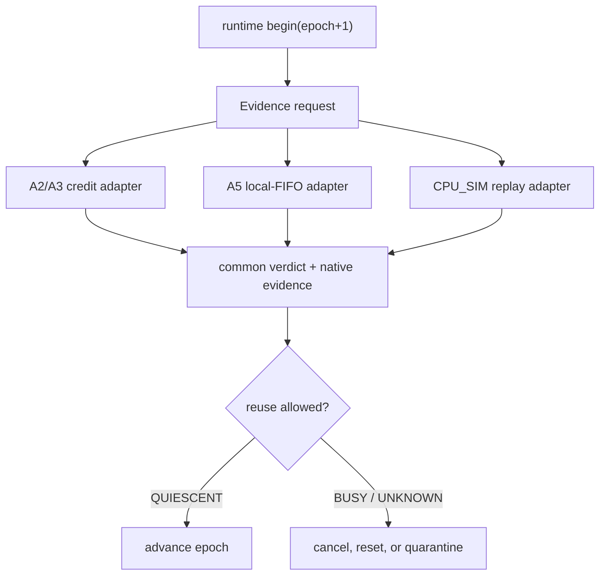
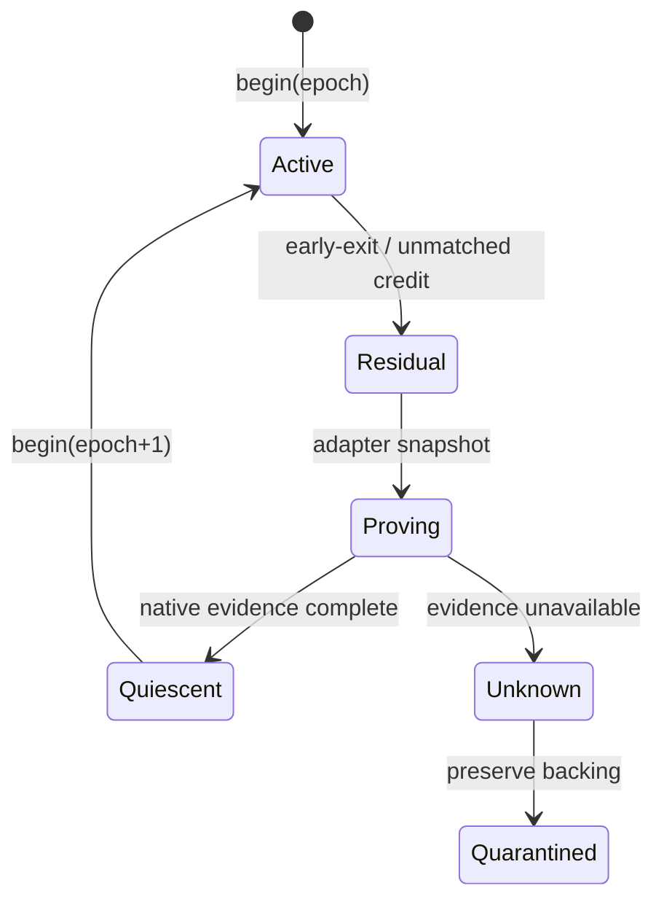

## 本篇在 PTO 课程路线中的位置

第 51 章已经建立时间身份：相同 `FlagID`、shape 和 storage key 再次出现时，只有旧代 quiescent，`PipeEpoch` 才能前进。本篇不再重复“为什么需要 epoch”，而是回答落地时最容易犯错的一点：**三种 backend 可以共享同一个安全 verdict，却不能伪装成拥有同一种内部证据。**

课程位置：

```text
PipeEpoch contract → backend evidence adapter（本篇） → cancel / waiter join / reset scope
```

分析基于 pto-isa 默认分支 [`15a9e0a0`](https://github.com/hw-native-sys/pto-isa/commit/15a9e0a0845955f5d7a409a7f4d1609a263b5d25)。该 head 的最近同步没有修改本文 TPipe 路径；直接相关实现来自 A2/A3 pending-credit 修复 [`0a15e15c`](https://github.com/hw-native-sys/pto-isa/commit/0a15e15c627deef86b4281fb08e84d39dad793de)、A5 local no-split credit 修复 [`dc6449e4`](https://github.com/hw-native-sys/pto-isa/commit/dc6449e48d33756e619db7087ff9852f59ed1504)，以及 CPU_SIM 双向隔离 [`8e0f3124`](https://github.com/hw-native-sys/pto-isa/commit/8e0f3124a51c151206725336bbbb5383c0cc5e0b)。本篇只选 pto-isa，因为三种 adapter 的语义源头、规范与测试都在同一仓库。

## 前置知识

`TPUSH` 发布数据，`TPOP` 获取数据，`TFREE` 或 TileData `TPOP` 内部的 free notification 归还容量。第 50 章区分了方向与 slot ownership；第 51 章又区分 spatial key 与 temporal epoch。

现在再增加一条不可放松的不变量：

> `epoch+1` 的准入条件不是“某个计数为零”，而是旧 epoch 已没有 payload/borrow、没有可迟到的参与者，并且同步介质回到该 backend 定义的基线；无法取得这份证据时，结果必须是 `UNKNOWN`，不能猜成 `QUIESCENT`。

## 今日核心问题

1. A2/A3、A5 local FIFO 与 CPU_SIM 分别能用什么事实证明旧 epoch 已闭合？
2. runtime 怎样消费三种不同证据，同时保持统一的 `QUIESCENT / BUSY / STALE_EPOCH / UNKNOWN` 判定？

结论先行：A2/A3 的核心残留是 batched free credit；A5 local FIFO 还必须约束本地 UB/L1 slot 与 intra-block flag；CPU_SIM 能看到 concrete slot、borrow 和 commit order，却目前没有 epoch、waiter census 或只读 snapshot API。统一层应规定**证明目标**，backend adapter 保留**证明方法和 scope**。

## PTO 全栈中的位置



上游输入是 runtime 持有的 pipe identity、epoch、dispatch completion/cancel 状态；adapter 检查 backend-native 状态；下游消费者是 storage/flag/local-buffer 的复用决策。它不应由 kernel 作者凭一个 `bool drained` 决定。

## 概念和精确语义

### 统一的是 verdict，不是 counter

建议的最小结果可写成：

```text
PipeEpochEvidence = {
  pipe_identity, epoch, direction,
  backend_kind, evidence_seq,
  native_snapshot,
  reset_scope?, verdict, reason
}
```

其中 `native_snapshot` 必须保留原始证据：A2/A3 的 published/waited free credits，A5 的 local/GM mode、flag baseline 与参与者终态，CPU_SIM 的 occupied/busy/borrow/commit/waiter。该 schema 是本文设计建议，不是当前公开类型。

共同判定规则是：

- `QUIESCENT`：旧代所有方向都闭合，且 adapter 能证明不会再有旧操作改变 slot/flag；
- `BUSY`：明确看到 committed payload、borrow、未消费 credit 或活跃参与者；
- `STALE_EPOCH`：操作 token 的 epoch 与当前 storage epoch 不同；
- `UNKNOWN`：backend 状态不可查询、证据丢失或 reset scope 不足。

`UNKNOWN` 不是“当前没看到问题”，而是禁止复用的事实。

### Adapter contract：查询本身也要有边界

一个可执行的 adapter 不能只暴露 `is_idle()`。它的输入至少应包含不可变的 `pipe_identity`、待关闭的 `epoch`、方向集合、查询开始时的 backend generation，以及 runtime 已掌握的 participant completion/cancel witness。输出除了 verdict，还要带 `evidence_seq` 或同等的单调版本，避免 runtime 把两次不同时间取得的局部快照拼成一份从未同时成立的“全零状态”。

前置条件是：adapter 只能查询自己有权解释的资源域，不能拿 A5 某个 block 内的 flag 去证明另一个 block 或整个 device 已安静。后置条件则更强：若返回 `QUIESCENT`，从快照线性化点到 epoch 交棒之间，旧 token 必须失去再次 `record/pop/free` 的能力；否则即使快照当时全零，也只是瞬时 observation。`BUSY` 可以携带可重试原因；`UNKNOWN` 必须携带缺失证据与建议动作；token 不匹配要在接触 payload 和 flag 之前返回 `STALE_EPOCH`。

这也是为什么 runtime 需要把“查询”“取消”“reset”“复用”分成四个动作。查询只产生证据；取消请求旧参与者停止；reset 必须有明确 scope 和完成 witness；只有复用动作才推进 generation。把四者压成 `reset_and_reuse()` 会隐藏最危险的窗口：旧 waiter 刚被唤醒、新 storage 已经投入下一代。

### A2/A3：pending credit 是算术账本，不是设备完成证书

[`include/pto/npu/a2a3/TPush.hpp`](https://github.com/hw-native-sys/pto-isa/blob/15a9e0a0845955f5d7a409a7f4d1609a263b5d25/include/pto/npu/a2a3/TPush.hpp) 定义：

- `SyncPeriod = SlotNum <= 2 ? SlotNum : SlotNum / 2`；
- 前 `SlotNum` 次 push 使用启动容量，不等 free flag；之后只在 aligned index 等待；
- consumer 每 `SyncPeriod` 次 pop 发一次 batched free；
- `countPendingFreeCredits(tileCount)` 计算“已通知但 steady-state 尚未等待”的余额；析构只消费这部分。

[`TPOP.hpp`](https://github.com/hw-native-sys/pto-isa/blob/15a9e0a0845955f5d7a409a7f4d1609a263b5d25/include/pto/npu/a2a3/TPop.hpp) 对每个 TileData pop 等 ready flag，并在 `shouldNotifyFree` 为真时发送 free；[`TFree.hpp`](https://github.com/hw-native-sys/pto-isa/blob/15a9e0a0845955f5d7a409a7f4d1609a263b5d25/include/pto/npu/a2a3/TFree.hpp) 的 TileData `TFREE` 则是 no-op。

所以正常返回时，producer 的 `tileIndex` 足以算出应 drain 的 credit；但 recovery adapter 不能把这个纯函数升级成 crash proof。当前 host/runtime 看不到某次 ready/free flag 是否真正到达，也没有 durable consumer count。异常退出、设备 hang 或对象析构未完成时，只凭计划的 `tileCount` 最多得到 expected balance，不能得到 observed terminal。

更精确地说，设已完成 consumer notification 数为

```text
N_notify(T) = floor(T / SyncPeriod)
```

而 steady-state producer 在启动窗口之后已经消费的 free credit 数取决于 `shouldWaitFree` 的对齐点。`countPendingFreeCredits(T)` 计算的是二者差值，因此只在“这 T 次协议动作确实按程序顺序发生、对象能走到析构、没有迟到 participant”时成立。若 kernel 在 ready record 后停止，`T` 本身就可能只有 host 侧计划值而非设备侧已提交值。恢复层若仍用计划 `T` drain，可能等待一枚从未产生的 credit；若用较小 `T`，又可能把真实残留留给下一次 dispatch。故 A2/A3 adapter 至少需要把 arithmetic expectation 与 backend-observed flag/device terminal 分列，不能用一个 `pending` 字段混写。

### A5：local FIFO 的 payload 地址和 free 时刻都不同

[`include/pto/npu/a5/TPush.hpp`](https://github.com/hw-native-sys/pto-isa/blob/15a9e0a0845955f5d7a409a7f4d1609a263b5d25/include/pto/npu/a5/TPush.hpp) 把 local no-split 与 GM/split protocol 分开：

- local C2V/V2C push 直接把结果写入 `C2V_CONSUMER_BUF` 或 `V2C_CONSUMER_BUF` 的 slot；
- local `TPOP` 只把 Tile 绑定到该 slot，`pop()` 返回 `false`，因此不会在 `TPOP` 内提前释放；
- [`A5 TFree.hpp`](https://github.com/hw-native-sys/pto-isa/blob/15a9e0a0845955f5d7a409a7f4d1609a263b5d25/include/pto/npu/a5/TFree.hpp) 在最后使用之后按 `shouldNotifyFree(tileIndex-1)` 发 free；
- local no-split 依靠 `shouldWaitFree` 的启动窗口，析构只 drain 已通知、未等待的余额；GM/split 路径则由构造/析构显式 seed 与收回 `SyncPeriod` credits。

因此 A5 adapter 不能只复用 A2/A3 的 `pending_credit=0`。它还要证明：绑定到本地 slot 的 Tile 已结束最后使用、对应方向的 intra-block flag 回到基线，并且旧 core 不会再次 `set_intra_block`。当前代码没有 host-query API；异常路径若没有可信 kernel/context completion 或 scoped reset，只能返回 `UNKNOWN`。

这里还要避免把 A5 的两条路径混在一起。local no-split 的启动容量来自 `shouldWaitFree` 窗口，producer 并不在构造时预注入同样的 credit；GM/split 路径则由构造和析构显式建立、回收一组 `SyncPeriod` credit。两者都可能在代码中出现 `tileIndex` 和 cadence，但初始基线不同。adapter 若只检查“析构期应 wait 几次”，会漏掉构造期基线是否真的建立，也无法判断 local Tile 的最后读是否完成。

对 local FIFO，`TFREE` 更不是普通的生命周期提示。consumer 仍在 UB/L1 slot 上计算时，这个地址就是活跃 operand；一旦 free flag 发出，producer 便可能覆盖同一 slot。于是正确顺序必须是“最后一次读取完成 → release fence/协议要求满足 → free notification”，而不能为了缩短流水尾巴把 `TFREE` 前移。公开代码证明了显式 last-use 边界，却没有公开硬件级 fence 的全部细节；本文只把“不能早于最后使用”视为代码事实，具体微架构映射仍是推断。

### CPU_SIM：状态最丰富，却仍少三项

[`include/pto/cpu/TPush.hpp`](https://github.com/hw-native-sys/pto-isa/blob/15a9e0a0845955f5d7a409a7f4d1609a263b5d25/include/pto/cpu/TPush.hpp) 的每方向 `SharedState` 已记录 `occupied`、`slot_busy`、`transfer_dirs`、`commit_seq`、`remaining_consumers`、`popped_not_freed` 和 pending slot FIFO。CPU_SIM 每次 `TFREE` 精确释放 concrete slot，不模拟 NPU 的 `SyncPeriod` cadence。

这让它适合作为 replay oracle，但还缺：

1. storage 当前 `epoch`；
2. 阻塞在 condition variable 上的 waiter census；
3. 只读、不可变的 snapshot API。

现有 `reset_for_cpu_sim()` 是原地写零并 `notify_all`，不是证据查询。若旧线程仍活着，reset 后它还可能继续提交或 free。因此 CPU_SIM adapter 应先 snapshot，再 cancel/wake，bounded join，最后复核 snapshot；不能把 reset 本身当成 quiescence。

只读 snapshot 还必须是一致快照，而不是逐字段无锁采样。例如先读到 `occupied=0`，随后旧 producer commit，再读到 `popped_not_freed=0`，组合结果看似全零，实际中间已有新 payload。最简单的 CPU_SIM 实现可以在同一 mutex 下复制状态和递增的 `state_seq`；runtime 释放锁后执行 cancel/join，再以相同 epoch 重查。如果两次之间 `state_seq` 变化，第一次证据只能用于诊断，不能授权复用。

此外，`notify_all` 只说明 waiter 获得重新检查条件的机会，不说明 waiter 已退出。waiter census 应覆盖等待进入、从 wait 醒来、检查 cancel/epoch、离开协议区这几个状态转移。只有 census 归零且具体 slot/borrow 均清空，CPU_SIM 才能给出可线性化的 `QUIESCENT`；否则应继续 `BUSY`，超出 bounded join 预算后降级为 `UNKNOWN` 或隔离 backing。

## 真实文件、类型、API 或指令逐段解读

| Backend | 当前真实状态 | 正常闭合机制 | recovery 时缺的证据 |
| --- | --- | --- | --- |
| A2/A3 | `prod/cons.tileIndex`、ready/free flag cadence、GM ring | destructor 用 `countPendingFreeCredits` 精确 drain | flag/consumer/device terminal query |
| A5 local | local slot 地址、`tileIndex`、intra-block flags | explicit `TFREE` + local-no-split residual drain | last-use、flag baseline、旧 core terminal |
| CPU_SIM | concrete slot、commit order、borrow、host payload | 每次 `TFREE` 精确释放，mutex/cv 可观测 | epoch、waiter census、immutable snapshot/cancel |

关键不是把缺口补成同一个整数，而是让三个 adapter 对同一安全命题负责：**旧 epoch 已不再拥有任何可影响新 epoch 的执行权或存储权。**

## 对象、Tile、Buffer 与证据生命周期



以一个 Tile 为例：A2/A3 的 payload 从 Acc/Vec 经 GM ring 到 local consumer Tile，TileData pop 同时推进 free cadence；A5 local path 的生产者直接写 UB/L1 slot，consumer Tile 绑定该地址直到 `TFREE`；CPU_SIM 把 payload 保存在 host-owned slot，pop 记录具体 `(direction, slot)`。三者的 Tile 生命周期不同，但 epoch 生命周期都必须覆盖从 publish 到最后 release，以及所有可能迟到的 participant。

## 端到端调用链或指令链

真实正常链：

```text
runtime launch
→ construct TPipe
→ TPUSH: optional free wait → payload write → ready record
→ TPOP: ready wait → bind/load slot
→ A2/A3: batched free inside TPOP
  A5 local / CPU_SIM: explicit TFREE after last use
→ backend-specific destructor drain
→ kernel/threads complete
```

建议的 replay 链：

```text
begin(epoch+1)
→ request evidence(epoch)
→ adapter emits native snapshot + verdict
→ QUIESCENT: persist witness, then reuse
→ BUSY: cooperative cancel and recheck
→ UNKNOWN: scoped reset witness or quarantine
→ stale operation arrives: reject by epoch before commit/free
```

## 具体 shape、Tile 和状态演算

取 `16×16xf32`，每 Tile 1024 B，`SlotNum=8`，于是每方向 payload ring 为 8192 B，`SyncPeriod=4`。先看 10 次完整传输：

- consumer 在 pop index 3、7 各通知一次 free，共 2 个 credit；
- producer 的前 8 次 push 不等待，push index 8 消费 1 个 credit；
- 因此 `pending = 2 - 1 = 1`。

A2/A3 析构应再 wait 一次；A5 local no-split 析构也按对应公式 drain 一次。CPU_SIM 没有这枚 batched credit：若 10 次 `TFREE` 都完成，8 个 concrete slots 已全部 free。由此可见，公共字段若只叫 `outstanding=1` 会误导；必须写成 backend-native residual。

把三个结果放在一起看会更清楚：

| 场景 | A2/A3 证据 | A5 local no-split 证据 | CPU_SIM 证据 | common verdict |
| --- | --- | --- | --- | --- |
| 10 次完整传输且对象正常析构 | 1 枚 residual credit 被 drain | 1 枚 residual credit 被 drain，last-use 已 free | concrete slots 全 free | `QUIESCENT` |
| 第 10 次 record 后停止 | ready/consumer terminal 不可证 | slot 1 已发布，旧 core 终态不可证 | `occupied=1` | 前两者 `UNKNOWN`，CPU `BUSY` |
| 旧 epoch token 在新代 commit | token 先于 flag/payload 被拒绝 | token 先于 local slot/flag 被拒绝 | token 先于 slot mutation 被拒绝 | `STALE_EPOCH` |

表中的第一行要求“正常析构和 completion witness”同时成立，不能只看到析构公式。第二行也说明 common verdict 并不要求 backend 得到相同答案：`BUSY` 是看到明确残留，`UNKNOWN` 是缺少观察能力；两者都禁止复用，但诊断和后续恢复动作不同。

再让 epoch 41 在第 10 次 `TPUSH` record 后、`TPOP` 前退出：

- A2/A3：存在未消费 ready，且 host 无法确认 flag/consumer terminal；不能仅用 `countPendingFreeCredits(10)` 宣告安全；
- A5 local：slot `9 mod 8 = 1` 已被覆盖为第 10 个 payload，旧 core 仍可能 set/free flag；
- CPU_SIM：snapshot 能看到该方向 `occupied=1`、slot 1 committed，因此稳定返回 `BUSY`。

epoch 42 只有在 adapter 分别取得“free credit/ready baseline + device terminal”“local slot last-use + flag baseline + core terminal”“occupied/busy/borrow/waiter 全零”后才可进入。任一方向 `UNKNOWN`，整个 `DIR_BOTH` pipe 都不得升级。

## 为什么这样设计及替代方案

**一个通用 outstanding counter** 实现便宜，但把 A2/A3 batched flag、A5 local last-use 和 CPU concrete borrow 混为一谈；counter 为零仍可能有迟到 core/thread，counter 非零也可能只是待 drain 的正常 credit。

**每次 replay 换全新 key/backing** 能隔离数据，但仍需决定旧 backing 何时释放；它把 proof 延后，没有消除 proof。容量压力和 graph address stability 也更差。

**统一 verdict + backend-native evidence** 让上层策略简单：只有 `QUIESCENT` 可复用，其余 cancel/reset/quarantine；同时保留可诊断字段。代价是每个 backend 都要维护 adapter 和 Golden，但这正是不能由一段模板算术替代的硬件差异。

从维护成本看，推荐把公共层限制在两件事：校验 token/epoch，并根据 verdict 驱动状态机。不要让公共层理解 `SyncPeriod`、intra-block flag 或 CPU condition variable；这些规则一旦复制到 runtime，就会与头文件实现漂移。反过来，backend adapter 也不应自行推进全局 epoch，因为它只看见局部资源，无法判断同一 dispatch 的其他方向、buffer 或 participant 是否闭合。这个分工使安全责任可审计：adapter 对证据真实性负责，runtime 对证据组合、持久化和复用时序负责。

性能上，evidence query 不应进入每个 Tile 的稳态热路径。正常完成可由 dispatch completion 携带一次终态 witness；只有 crash、timeout、replay 或同 key 重用时才执行较重的 snapshot/cancel/join。若查询成本仍高，可以缓存 `QUIESCENT` witness，但缓存键必须包含 backend generation、epoch、direction scope 和 `evidence_seq`，任何新提交或 reset 都使缓存失效。不能用超时本身推导安全：超时只能触发恢复，不能证明旧工作已经停止。

## 访存、计算、流水、并行和硬件约束

- 正常路径不应为每个元素增加 epoch 检查；token 获取在 dispatch boundary，关键复核放在 wait 返回、commit/free 前。
- A2/A3 batched credit 降低跨核同步频率，但 residual drain 是协议成本，不能从基准中忽略。
- A5 local FIFO 避免 GM round trip，却把 payload lifetime 绑定到 UB/L1 slot；过早 `TFREE` 会直接授权覆盖。
- CPU_SIM mutex/cv 能验证顺序和 ownership，不代表设备 flag、DMA 或 core termination；它是语义 oracle，不是硬件完成替身。
- 对 `DIR_BOTH`，四个 flag identity 和两向 backing 必须作为同一 epoch scope 联合判定；单向 quiescent 不能释放整体 identity。

## 测试证据与未覆盖风险

**A2/A3 测试事实：**[`tpushpop_cv_nosplit_kernel.cpp`](https://github.com/hw-native-sys/pto-isa/blob/15a9e0a0845955f5d7a409a7f4d1609a263b5d25/tests/npu/a2a3/src/st/testcase/tpushpop_cv_nosplit/tpushpop_cv_nosplit_kernel.cpp) 固定 depth 8、40 次传输时 `countPendingFreeCredits(40)==2`；相关提交还记录连续 dispatch 80 次，用来防止旧 fixed-drain 留下 stale credit。它验证正常返回的算术与连续 dispatch，不覆盖 kernel kill 或 flag query 丢失。

**A5 测试事实：**[`tpushpop_dir_both_kernel.cpp`](https://github.com/hw-native-sys/pto-isa/blob/15a9e0a0845955f5d7a409a7f4d1609a263b5d25/tests/npu/a5/src/st/testcase/tpushpop_dir_both/tpushpop_dir_both_kernel.cpp) 以 `M=128,K=64,N=128`、depth 2，覆盖 `UP_DOWN` 和 `LEFT_RIGHT`；Vector 先 V2C push，Cube pop/free 后 matmul，再 C2V push，Vector pop/使用/free。它证明正常 local FIFO 数据链与显式 last-use release，不覆盖 early-exit、flag poison 或 same-key replay。

**CPU_SIM 测试事实：**[`tests/cpu/st/testcase/tpushpop/main.cpp`](https://github.com/hw-native-sys/pto-isa/blob/15a9e0a0845955f5d7a409a7f4d1609a263b5d25/tests/cpu/st/testcase/tpushpop/main.cpp) 覆盖双向独立容量、重叠 pop、commit order 与 hook reset；提交记录定向 `tpushpop 32/32`、`fixpipe 3/3`。这些 case 在安全时机 reset，并没有旧 waiter、epoch token 或 no-reset replay。

建议新增同一 Golden：在 `after_record`、`after_pop`、`before_free` 注入退出；三 adapter 必须映射到同一 verdict，但保留各自 native evidence；`UNKNOWN` 不得静默变 `QUIESCENT`；迟到操作必须命中 `STALE_EPOCH`，并以 canary 验证没有旧写污染新 1024 B payload。

Golden 不应只断言返回枚举值。每个 failpoint 都要保存输入 token、native snapshot、reason code、是否执行 cancel/reset、最终 backing generation 和 canary。`after_pop` 尤其重要：payload 可能已从队列移除，但 consumer 仍持有 borrow；若只检查 queue length，会把在用 Tile 判成空闲。`before_free` 则验证 last-use 与容量归还之间的边界。对 `DIR_BOTH`，还应构造一向完全闭合、另一向卡在 `before_free` 的 case，确认聚合 verdict 仍为 `BUSY/UNKNOWN`，且不会只重置“看起来有问题”的单向 flag 后释放共享 identity。

真机测试与 CPU oracle 应分层：CPU_SIM 负责穷举顺序、waiter 与 stale-token interleaving；A2/A3/A5 真机只选少量高价值故障点，校准 flag/reset scope 与 late-write canary。这样能把确定性的协议验证和昂贵的设备故障实验结合起来，而不是让偶现 timeout 充当正确性证明。

未覆盖风险还有：A2/A3/A5 可查询 flag/reset API 是否存在及 scope、waiter cancel 内存序、设备异常是否执行析构、epoch wrap、numeric hook 地址 ABA、graph executor crash、真实 late DMA，以及 adapter 查询本身的时延。

## 与前后章节的连接

第 51 章给出了 `PipeEpoch` 的时间身份；本章把它映射成三份不同证据，补上“相同 verdict 如何不丢失 backend 语义”。下一章应解决 adapter 遇到 `BUSY/UNKNOWN` 后谁负责把旧参与者停下来：cooperative cancel、waiter census、bounded join 与 scoped reset。

## 本篇结论、知识债、三个理解检查问题和下一章

结论：

1. A2/A3 pending credit 是正常 drain 的算术账本，不是异常退出后的 device terminal witness。
2. A5 local FIFO 的安全释放必须覆盖 local Tile last-use、flag baseline 与旧 core terminal；`TFREE` 的位置是 ownership 边界。
3. CPU_SIM 能构造最强的 concrete-slot oracle，但当前仍缺 epoch、waiter census 与 immutable snapshot；reset 不能冒充证据。

知识债：真实 `PipeEpochEvidence/Adapter` schema、A2/A3/A5 flag query 与 reset scope、CPU waiter census/cancel/snapshot、stable reason code、epoch wrap、graph replay failpoint、跨 backend canary 与查询开销测量。

理解检查：

1. 为什么 `countPendingFreeCredits(10)==1` 不能单独证明 A2/A3 epoch 41 已终止？
2. A5 local `TPOP` 为什么不能像 GM TileData path 那样立即发 free？
3. CPU_SIM 的 `occupied==0` 若没有 waiter census，为什么仍不足以允许 reset 和 epoch+1？

下一章：**Epoch 什么时候能交棒——Cooperative Cancel、Waiter Census、Bounded Join 与 Scoped Reset。**

## 课程账本增量

- 源码基线：pto-isa [`15a9e0a0`](https://github.com/hw-native-sys/pto-isa/commit/15a9e0a0845955f5d7a409a7f4d1609a263b5d25)。
- 新覆盖文件：A2/A3、A5、CPU 的 `TPush/TPop/TFree`，A2/A3 no-split 与 A5 DIR_BOTH NPU 回归，CPU tpushpop 回归。
- 新覆盖符号：`SyncPeriod/shouldWaitFree/shouldNotifyFree/countPendingFreeCredits`、A5 `uses_local_no_split_credit_protocol`、constructor/destructor drain、CPU `SharedState` 与建议的 `PipeEpochEvidence`。
- 新确认不变量：统一 verdict 不等于统一 counter；normal drain 不等于 crash witness；A5 local last-use 是复用边界；CPU exact slot state 仍需 epoch/waiter fence；`DIR_BOTH` 两向联合判定。
- 具体演算：`16×16xf32`、1024 B、depth 8、10 次传输产生一枚正常 pending credit；同场景 CPU_SIM 没有 batched credit，异常 `after_record` 则以 concrete `occupied=1` 返回 `BUSY`。
- 测试结论：现有三类测试只覆盖正常 drain/dataflow/slot ownership，未覆盖同一 failpoint 下的 cross-backend verdict、early-exit、late operation 或 scoped reset。
- 下一章：cooperative cancel、waiter census、bounded join 与 reset authority。
