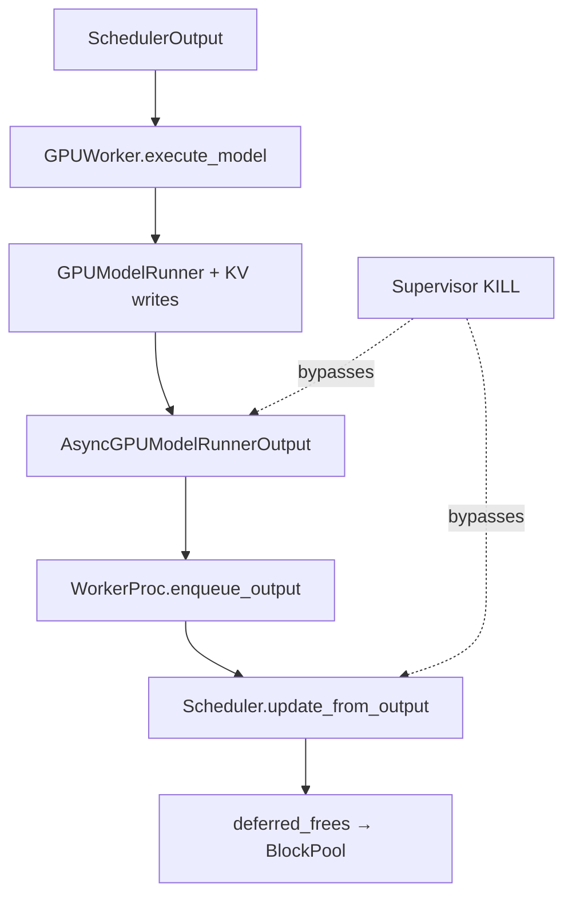
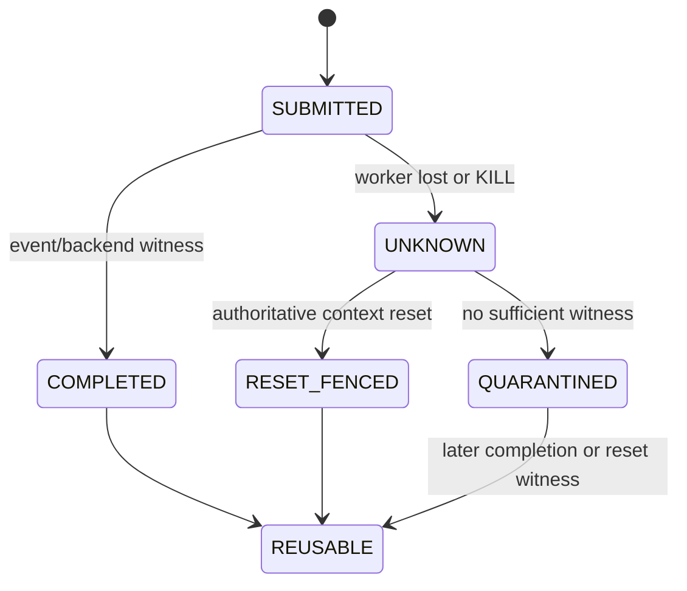

> 本文基于 vLLM `main` 的提交 [`37d61740`](https://github.com/vllm-project/vllm/commit/37d6174096fd99a8d362c9f5b379f7ec59deedb8)。该提交增加 metrics histogram 配置，与本文设备完成路径无语义关系。直接相关的已合入修复是 [PR #45357](https://github.com/vllm-project/vllm/pull/45357) / [`d467a2a7`](https://github.com/vllm-project/vllm/commit/d467a2a7f2f088dd360c7bef2f3cf5c59a1ffde8)。文中把当前代码事实、测试事实、后端保证和建议协议严格分开；`DeviceWorkToken`、`DeviceCompletionWitness` 与 quarantine registry 都不是现有 vLLM 类型。

## 本篇在课程路线中的位置

第 44 章已经把 `StepLease expiry → supervisor fence → exact member kill → late-output gate` 串起来，但留下一个更底层的问题：Host 拒绝旧结果，只能阻止逻辑提交；它能否阻止旧 GPU work 写入已被新请求复用的 KV page？

本章只推进这一条边界：

`process KILL → device completion evidence → KV/activation reuse authorization`。

## 前置知识回顾

先保留三条结论：

1. `Scheduler.update_from_output()` 才是一次 step 的 Host commit 边界。
2. `sched_step_seq/processed_step_seq` 是同一 Scheduler 生命周期内的 FIFO fence，不是 engine generation。
3. KILL authority、output validity 与 device-memory reuse authority 是三种权限，不能互相代替。

## 本篇要回答的核心问题

- 正常执行时，vLLM 用什么证据认定当前 step 的 GPU 写已经完成？
- `SIGKILL`、worker exit、显存占用下降、CUDA event 完成分别能证明什么？
- completion 无法确认时，KV page、activation/workspace 应何时 quarantine、何时可复用？

## 组件在全局架构中的位置

正常路径把“设备完成”投影为可消费的 `ModelRunnerOutput`；异常 KILL 路径只产生进程侧事实。两条路径在当前实现中没有共同的结构化 `DeviceCompletionWitness`。

## 完整调用链

以 async scheduling 的生成请求为例：

1. `Scheduler.schedule()` 分配/沿用 KV blocks，并在启用 deferred-free gate 时递增 `sched_step_seq`，把该值写入 `Request.last_sched_seq`。[`scheduler.py`](https://github.com/vllm-project/vllm/blob/37d6174096fd99a8d362c9f5b379f7ec59deedb8/vllm/v1/core/sched/scheduler.py)
2. `MultiprocExecutor.execute_model()` 把同一 `SchedulerOutput` 发给 workers；`GPUWorker.execute_model()` 等待上一轮 PP send handle 后进入 ModelRunner。[`multiproc_executor.py`](https://github.com/vllm-project/vllm/blob/37d6174096fd99a8d362c9f5b379f7ec59deedb8/vllm/v1/executor/multiproc_executor.py) / [`gpu_worker.py`](https://github.com/vllm-project/vllm/blob/37d6174096fd99a8d362c9f5b379f7ec59deedb8/vllm/v1/worker/gpu_worker.py)
3. model forward 在默认 stream 上读取输入/历史 KV，并把新 K/V 写到 `slot_mapping` 指定的物理页；sampling 产生 `sampled_token_ids`。
4. `AsyncGPUModelRunnerOutput` 让独立 copy stream `wait_stream(default_stream)`，异步 D2H 后在 copy stream 记录 blocking CUDA event。[`gpu_model_runner.py`](https://github.com/vllm-project/vllm/blob/37d6174096fd99a8d362c9f5b379f7ec59deedb8/vllm/v1/worker/gpu_model_runner.py)
5. `WorkerProc.enqueue_output()` 遇到 `AsyncModelRunnerOutput` 必先调用 `get_output()`；后者 `event.synchronize()`，再释放持有的 device tensors，随后才把普通 `ModelRunnerOutput` 放入 response MQ。
6. EngineCore 收到 output 后调用 `Scheduler.update_from_output()`。当 `processed_step_seq` 越过 fence，`_drain_deferred_frees()` 才把 blocks 还给 `BlockPool`。

这条链的关键不是“Python 收到了 token”，而是：**copy stream event 位于 default-stream work 之后；只有 event 完成，worker 才发送 output，Scheduler 才推进 fence。**

## 关键类型、字段和状态生命周期

### `AsyncGPUModelRunnerOutput`

- 输入：`sampled_token_ids` 是 CUDA 上的 `torch.Tensor`，语义 shape 为 `[num_reqs, max_num_generated_tokens]`，当前 sampling 路径使用 `int32`；可选 logprobs/NaN tensor 也驻留 device。
- 所有权：对象保持源 device tensor 引用，防止 D2H 结束前释放；其 pinned CPU 副本与 CUDA event 同寿命。
- 并发假设：copy stream 先等待 default stream，然后发起 non-blocking D2H 并记录 event。
- 后置条件：`get_output()` 返回前 event 已完成；device tensor 引用可以释放，CPU 数据可以解析。
- 失败方式：event synchronize、D2H 或 EP fault query 抛异常时，worker 返回 failure；若进程被 KILL，则对象、event 与 Python 后置条件一起消失。

### `deferred_frees`

- 元素是 `(fence_seq, blocks)`；blocks 已从 request bookkeeping 移出，但尚未返回 free pool。
- `last_sched_seq <= processed_step_seq` 才允许立即 free，否则进入 FIFO。
- gate 当前只在 `max_concurrent_batches > 1` 且实例是 KV consumer 时打开，因为外部 NIC/RDMA load 与旧 GPU stream write 没有天然顺序。
- 生命周期终点是 `_drain_deferred_frees()`；若 worker KILL 后永远没有 output，这个进程内队列也不会得到正常 drain 证据。

### 建议的 device work 状态

`UNKNOWN` 不能直接变成 `REUSABLE`。建议 token 至少绑定 `engine_generation、rank、device/context generation、step_seq、stream/event identity、owner/range set`；witness 必须来自同一 generation。

## 逐函数源码解读

### 1. `AsyncGPUModelRunnerOutput.__init__/get_output`

这里的 event 不只是“token copy 完成”。由于 copy stream 先 `wait_stream(default_stream)`，它还形成了此前 default-stream 工作的 happens-before 边。但证据是**进程内 CUDA object**：没有持久 ID，也不会越过 worker crash 自动出现在 parent。

接口的物理输出是 CPU tensor/list；它不携带 stream、event、context generation 或被写 KV block 集合。因此 Scheduler 能利用 FIFO 关系推断“该 step 及更早 GPU 写已完成”，却不能在 worker 丢失后独立查询同一事件。

### 2. `WorkerProc.enqueue_output`

这一步把设备事件转成 MQ 可见性：只有 `get_output()` 完成，response 才出队。正常路径因此无需 Scheduler 直接持有 CUDA event。代价是 worker 一旦消失，parent 只看到“没有 response”，无法区分 event 未完成、event 已完成但 MQ 未发送、还是 response 已发送但 ACK 丢失。

### 3. `Scheduler.update_from_output/_free_request_blocks`

[PR #45357](https://github.com/vllm-project/vllm/pull/45357) 修复的是真实 race：async step N+1 仍写旧请求 KV 时，step N 让请求结束并提前 free；PD consumer 随后通过 NIC/RDMA 把新 KV 写进同一 block，旧 GPU write 再覆盖它。当前实现用最新 scheduled step 作为 fence，正常 output 到达后再 free。

这已经证明两点：其一，Host request finished 不等于 page 可复用；其二，跨执行域写入必须共享物理复用 fence。缺口是该 fence 依赖 output 到达，强制 KILL 没有 recovery branch。

### 4. `GPUWorker.shutdown/GPUModelRunner.shutdown`

graceful cleanup 会关闭 transfer/profiler/elastic EP，调用 `model_runner.shutdown()`；后者先经 `_cleanup_profiling_kv_cache()` 执行 `torch.accelerator.synchronize()`，再清 KV/cache bindings 与 workspace。在 ROCm/XPU 分支还会 `empty_cache()` 后再次 synchronize。CuMem allocator 的 release callback也在 unmap 前 `torch.cuda.synchronize(device)`。[`cumem.py`](https://github.com/vllm-project/vllm/blob/37d6174096fd99a8d362c9f5b379f7ec59deedb8/vllm/device_allocator/cumem.py)

但 `MultiprocExecutor._ensure_worker_termination()` 的末级动作是 `proc.kill()`；KILL 后不会执行上述 Python cleanup，也没有从 backend 读取 context-destroy/reset 证明。**代码事实只能到“signal sent / process eventually not alive”；设备侧如何收敛由 CUDA/ROCm、驱动与部署形态决定，不能从 vLLM 当前代码推出。**

## 具体示例与 shape/状态演算

沿用测试中的一个请求：prompt 33 tokens，`block_size=16`，所以占 3 个逻辑 blocks：`B0=[0..15]`、`B1=[16..31]`、`B2=[32..47]`。

为便于计算，假设 32 层、每层 8 个 KV heads、`head_size=128`、FP16。忽略 backend-specific physical layout，一个 block 每层的逻辑 K+V payload 为：

\[
2\times16\times8\times128\times2\text{ B}=65{,}536\text{ B}=64\text{ KiB}
\]

32 层约为 `2 MiB/block`，3 blocks 约 `6 MiB/request`。

时间线：

1. generation `g17` 的 step 2 已提交，准备把 token 32 的 K/V 写入 `B2`。
2. step 1 output 让请求命中 stop；正常代码把三 blocks 放入 `deferred_frees(fence=2)`，不复用。
3. worker hang，supervisor KILL；step 2 output 永远不会到达。
4. 若恢复逻辑仅因“旧 PID 已退出”就把 `B2` 交给 `g18`，新请求可能在同一物理 range 接收 RDMA KV。
5. 只有两类证据能授权复用：`g17/step2` 的 completion witness，或覆盖该 context/range 的 authoritative reset/teardown witness。否则 `B2` 必须 quarantine。

第 4 步是否真的允许旧 kernel/DMA 迟到，取决于 backend 和资源共享方式；这是需要 adapter/真机测试确认的后端事实。vLLM 当前缺少的是**在不能确认时 fail closed 的统一状态**，不是证明所有 GPU 都必然迟到写。

## 为什么这样设计及替代方案

| 方案 | 延迟/吞吐 | 显存 | 正确性证据 | 维护成本 |
| --- | --- | --- | --- | --- |
| 每 step 全设备 synchronize | 高同步开销，破坏 overlap/graph pipeline | 低额外占用 | 强，但过度串行 | 低 |
| 当前 output event + deferred free | 正常路径开销小，保留 overlap | 只暂存 in-flight blocks | 同进程 FIFO 内强 | 中 |
| KILL 后立即复用 | 恢复最快 | 最省 | 无 device witness 时不安全 | 低但风险高 |
| range quarantine | 只阻塞冲突 allocation | 占用随故障累积 | completion unknown 时 fail closed | 需要 interval index/水位 |
| context/device reset fence | 恢复后可批量释放 | reset 期间容量下降 | 取决于 backend reset scope 与 generation | 高，且影响同卡邻居 |

最小可行设计不是每步持久化 CUDA event，而是：正常路径继续使用现有 event/FIFO；异常路径把 outstanding owner ranges转入 registry，只有 backend adapter 发布 generation-matched completion 或 reset witness 才 retire。这样把故障税留在故障路径。

## 性能、并发、正确性与边界条件

- **延迟**：正常 step 不应新增 device-wide synchronize；复用现有 event 作为 local witness。
- **吞吐**：quarantine 只应封锁与 outstanding work 相交的 KV/activation range，不应冻结整个 pool；但无法识别 scope 时必须升级为 context/device 级隔离。
- **显存**：容量约束变为 `weights + live KV + graph/workspace + quarantine + fragmentation <= usable`。admission 必须把 quarantine 纳入 free-block 口径。
- **并发**：GPU compute、copy stream、PP send、KV connector RDMA 是不同执行域；某一 stream event不能证明未被其依赖链覆盖的外部写已结束。
- **graphability**：CUDA Graph 依赖稳定地址；quarantine 会缩小可复用地址池，reset 可能清空 graph context，恢复逻辑必须显式 recapture，不能把旧 graph handle 带入新 generation。
- **失败边界**：event query error、worker loss、context status unavailable、reset scope 不明都进入 `UNKNOWN/QUARANTINED`，不能解释为 completed。

## 测试证据与未覆盖风险

**当前测试事实：**

- [`test_deferred_block_free.py`](https://github.com/vllm-project/vllm/blob/37d6174096fd99a8d362c9f5b379f7ec59deedb8/tests/v1/core/test_deferred_block_free.py) 用 33-token prompt、16-token block 和两个/多个 in-flight steps，验证 stop、abort、preempt 后 blocks 直到最新 output 处理才回 pool；但它是 CPU/fake-output 测试，不发真实 kernel、RDMA 或 KILL。
- [`test_forward_error.py`](https://github.com/vllm-project/vllm/blob/37d6174096fd99a8d362c9f5b379f7ec59deedb8/tests/v1/shutdown/test_forward_error.py) 在第 11 次 forward 于 rank 0 抛异常，验证 TP=1/2 的 collectors 收到 `EngineDeadError`、新请求拒绝，并轮询显存低于阈值。
- `wait_for_gpu_memory_to_clear()` 验证的是 NVML/AMDSMI 观测到的 used bytes；它没有 canary、旧 generation late-write、event identity 或 reset scope 断言。

**仍未覆盖：** kill 发生在 kernel launch/event record/D2H/MQ enqueue 的每个边界；context teardown 前后地址复用；PP send、NCCL、RDMA 与 KV page 同时在途；MPS/共享 context/外部 allocator；reset 失败或只覆盖部分 device；quarantine 水位耗尽时 admission backpressure；旧 CUDA Graph replay 或 IPC handle 迟到。

建议 golden 至少记录 `(engine_gen, context_gen, step_seq, range, action, witness)`，对每个 crash point 校验两条断言：无 witness 时 range 不进 free list；可信 reset 后旧 generation 的任何 completion 都不能改变新 generation 数据。真机用 guard/canary 检测 late write，不能只看显存下降。

## 与前后章节的连接

上一章解决“旧 output 不得提交”，本章补上“旧 device work 未证终止时，旧 range 不得复用”。两者合在一起才同时保护 Scheduler state 与物理 KV。

下一章将继续异常路径：当 completion 永远不可查询时，如何定义 CUDA/ROCm/Ray/external launcher 各自的 `ResetWitness` scope、generation 与可信来源，并用同一 golden 判断哪些 quarantined ranges 可以释放。

## 本篇结论、知识债、三个理解检查问题和下一章

结论只有一句：**KILL 是 host containment action，不是 vLLM 当前可消费的 device completion witness；显存复用必须等待同代 completion 或足够范围的 reset/teardown 证据。**

知识债：真实 `DeviceWorkToken/CompletionWitness/ResetWitness` schema；KV/activation/workspace range registry；backend query；context generation；quarantine interval index与容量水位；CUDA Graph recapture；MPS/IPC/RDMA scope；crash-at-every-boundary 与 late-write canary。

理解检查：

1. 为什么 `AsyncGPUModelRunnerOutput` 的 event 能支撑正常 `processed_step_seq`，却不能支撑 worker crash 后的 recovery？
2. 为什么“NVML 显存已下降”仍弱于绑定 context generation 与 reset scope 的 witness？
3. 若一个 reset 只覆盖 rank 0 的 CUDA context，TP=2 的 rank 1 quarantined ranges 能否一起释放？为什么？

下一章：**Reset 到底重置了谁——Context Generation、Backend Reset Witness 与 Cross-backend Golden。**

## 课程账本增量

- 源码基线：`37d6174096fd99a8d362c9f5b379f7ec59deedb8`。
- 新覆盖：`AsyncGPUModelRunnerOutput.__init__/get_output`、`WorkerProc.enqueue_output`、`Scheduler.defer_block_free/sched_step_seq/processed_step_seq/_free_request_blocks/_drain_deferred_frees`、`GPUWorker.shutdown`、`GPUModelRunner.shutdown/_cleanup_profiling_kv_cache`、`CuMemAllocator.release_pools/_python_free_callback`。
- 新不变量：process terminal、output fence、device completion 与 physical range reuse 是四种不同证据；没有同 generation completion/reset witness 时，range 只能 quarantine。
- 测试缺口：KILL×真实 kernel/RDMA/graph/IPC 的 late-write canary 与 backend reset scope golden。
