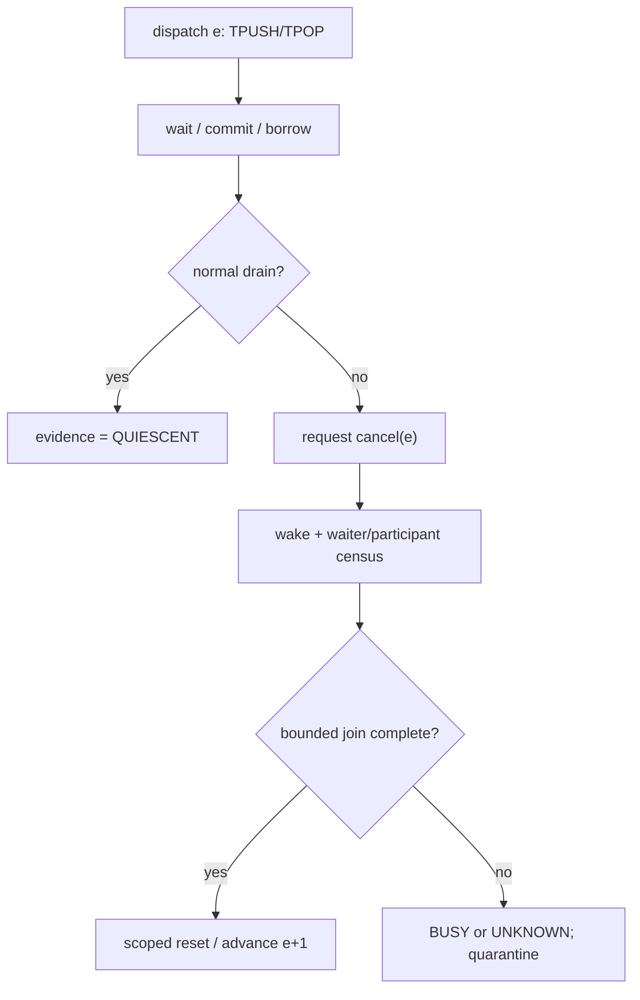
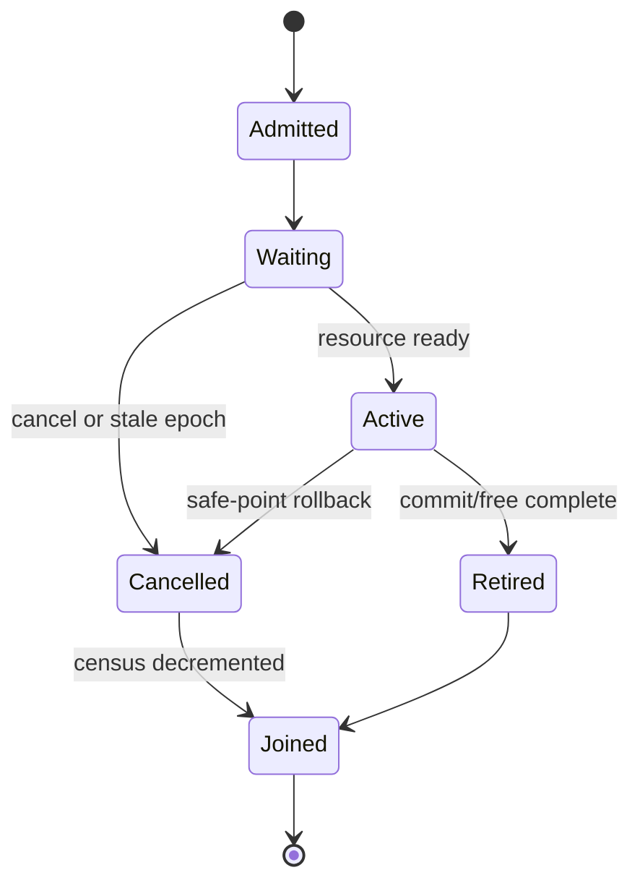

## 本篇在 PTO 课程路线中的位置

第 52 章把同一 `PipeEpoch` contract 映射为 A2/A3 pending credit、A5 local FIFO 与 CPU_SIM concrete-slot 三类证据。本篇继续回答账本留下的主问题：**旧 epoch 仍有线程或 core 卡在 `TPUSH/TPOP` 时，runtime 怎样让它们退出，并证明下一代可以接管同一个 pipe key？**

课程位置：

```text
backend-native evidence → cooperative cancel / waiter join（本篇）
→ scoped reset authority → cross-dispatch replay
```

分析基于 pto-isa 默认分支 [`15a9e0a0`](https://github.com/hw-native-sys/pto-isa/commit/15a9e0a0845955f5d7a409a7f4d1609a263b5d25)，其最新同步没有修改 TPipe 路径。本篇只选 pto-isa：问题发生在 ISA/runtime seam，而当前可逐字段观察的 oracle 正是 CPU_SIM。

## 前置知识

`DIR_BOTH` 的 C2V、V2C 各有独立 `SharedState`；一个 state 包含 `occupied`、`slot_busy`、`transfer_dirs`、`commit_seq`、producer/consumer cursor 和 `condition_variable`。`TPOP` 把 `(direction, slot)` 记入 consumer 的 pending FIFO，`TFREE` 才清 slot 并减少 `occupied`。

前两章已经确认：

- 相同 `FlagID/DirType/SlotSize/SlotNum` 只是空间 key，不是时间身份；
- `occupied==0` 只说明某次观察时没有已发布 payload，不证明没有阻塞 waiter 或迟到对象；
- A2/A3、A5 和 CPU_SIM 可以共享 verdict，不能共享一套虚构的 counter。

## 今日 1–2 个核心问题

1. 为什么当前 `notify_all()+reset` 不能取消旧 waiter，反而可能让它在新状态上继续等待或提交？
2. 一个可恢复的交棒协议，怎样组合 cooperative cancel、waiter census、bounded join 与 scoped reset？

不可放松的不变量是：

> epoch `e+1` 开放前，epoch `e` 的任何 producer、consumer、waiter、borrow 或迟到 free 都不得再改变新代状态；若无法证明，只能隔离旧 backing，不能原地清零后复用。

## PTO 全栈中的位置

上游是 kernel/graph dispatch 为 TPipe 选择 key 和 epoch；本层负责 ring/flag 的传输与容量；下游消费者是 runtime 的 replay、reset 与下一次 dispatch admission。



关键是 `H` 必须发生在 join/evidence 之后，而不是先 reset 再希望旧参与者自行消失。

## 概念和精确语义

### Cooperative cancel

cancel 不是异步杀线程，而是为旧 epoch 发布一个可观察状态。所有可能阻塞的 wait predicate 都必须变成：

```cpp
resource_ready || cancel_requested || token.epoch != control.epoch
```

wait 返回后仍要再次检查 token；producer 在 `record()` 前、consumer 在 claim 后和 `free()` 前也要检查。这样 cancel 只要求参与者走到安全点，不在任意指令处破坏对象不变量。

### Waiter census

`waiter_count` 统计进入阻塞协议、尚未退出的参与者；`active_producers/active_consumers` 统计可能 commit/free 的对象；`outstanding_borrows` 统计已经 pop 尚未 free 的 ownership。计数必须由 RAII guard 在同一 mutex 下增减，否则 cancel 恰好发生在“检查 predicate”和“真正 sleep”之间时会漏记。

### Bounded join

join 等待：

\[
waiters=0 \land active=0 \land borrows=0
\]

并受绝对 deadline 限制。超时不等于旧执行已终止，只能返回 `BUSY`；若 backend 已失联且无法查询，则返回 `UNKNOWN`。无限 join 会把一次 early-exit 变成 runtime 永久挂死。

### Scoped reset

reset witness 必须写明 `epoch_before/after`、direction、slots/flags、execution domain 与 authority。CPU_SIM 可重建 Host shared state；A2/A3 还需覆盖 batched credit 对应的 device flag；A5 还需证明 local FIFO last-use、free baseline 与旧 core terminal。只清 Host counter 不能替设备宣布 quiescent。

## 真实文件、类型、API 或指令逐段解读

CPU [`TPush.hpp`](https://github.com/hw-native-sys/pto-isa/blob/15a9e0a0845955f5d7a409a7f4d1609a263b5d25/include/pto/cpu/TPush.hpp#L561-L588) 的 `SharedState` 有 mutex/cv 和 slot 账本，却没有 epoch、cancel、waiter 或 active-participant 字段。[`EnsureSharedStateInitialized`](https://github.com/hw-native-sys/pto-isa/blob/15a9e0a0845955f5d7a409a7f4d1609a263b5d25/include/pto/cpu/TPush.hpp#L598-L611) 只保证 storage 构造一次，不能代表每次 dispatch 初始化。

[`Producer::allocate`](https://github.com/hw-native-sys/pto-isa/blob/15a9e0a0845955f5d7a409a7f4d1609a263b5d25/include/pto/cpu/TPush.hpp#L710-L746) 等待 ring 有空间且 cursor slot 空闲；predicate 没有取消分支。[`Producer::record`](https://github.com/hw-native-sys/pto-isa/blob/15a9e0a0845955f5d7a409a7f4d1609a263b5d25/include/pto/cpu/TPush.hpp#L748-L777) 发布 direction、consumer count、`commit_seq` 并增加 `occupied`，也没有在 commit 点复核 generation。

[`Consumer::wait`](https://github.com/hw-native-sys/pto-isa/blob/15a9e0a0845955f5d7a409a7f4d1609a263b5d25/include/pto/cpu/TPush.hpp#L822-L921) 的多条路径都只等 payload/方向/slot 可见；[`Consumer::free`](https://github.com/hw-native-sys/pto-isa/blob/15a9e0a0845955f5d7a409a7f4d1609a263b5d25/include/pto/cpu/TPush.hpp#L923-L971) 直接根据对象内 pending FIFO 清 slot。若旧 consumer 跨 reset 执行迟到 `free()`，当前结构没有 token 阻止它修改新代 slot。

最关键的是 [`reset_for_cpu_sim`](https://github.com/hw-native-sys/pto-isa/blob/15a9e0a0845955f5d7a409a7f4d1609a263b5d25/include/pto/cpu/TPush.hpp#L649-L679)：它逐方向加锁，把 cursor、`occupied`、borrow、slot、direction 和 `commit_seq` 全部清零，随后 `notify_all()`。这能为**已经 quiescent** 的测试恢复基线；它既不请求 cancel，也不等待旧对象退出。被唤醒的 waiter 重新检查原 predicate，若仍不满足会再次 sleep；若新 epoch 恰好发布数据，它甚至可能消费新代 payload。

## 对象/Tile/Buffer/IR 生命周期

建议引入 `PipeToken{key, epoch, direction, role, slot?}`。dispatch 创建 token；进入 wait 时登记 waiter guard；allocate/claim 后升级为 active ownership；record 或 free 成功后释放 ownership；cancel 后 token 只能退出，不能再 commit；join 完成或 scoped reset 之后，旧 token 永久 `STALE_EPOCH`。



已经发布的 payload 不能凭空 rollback：要么由旧 consumer drain/free，要么由覆盖该 backing 的 reset witness 宣告失效。已经 pop 的 borrow 也不能在 epoch 前进后“补 free”，否则会释放新代同编号 slot。

## 端到端调用链或指令链

建议恢复链是：

1. runtime 将 `(pipe key, e)` 从 `RUNNING` 原子改为 `CANCELLING`，停止新 participant admission；
2. 锁内设置 `cancel_requested`，`notify_all()`；
3. 每个 wait predicate 因 cancel 返回；wait 后、record 前、free 前复核 token；
4. waiter/active/borrow RAII guard 退出并通知 join cv；
5. owner 在共享 deadline 内等待 census 为零；
6. adapter 读取 immutable snapshot；normal drain 返回 `QUIESCENT`；
7. join 超时后，只有覆盖旧 execution domain 和 pipe backing 的 authoritative reset 才能返回 `RESET_COMPLETE`；
8. 持久化证据后才递增 epoch、初始化新 state，并开放下一 dispatch。

顺序不能改成“先 `epoch++` 再 join”：旧对象虽然 stale，但它保存的 pending slot 仍可能执行无检查的 `free()`；也不能先清 slot 再 cancel，因为旧 producer 可能在清零后提交。

## 具体 shape、Tile 和状态演算

取 `Tile=16×16xf32`，每 Tile 1024 B，`SlotNum=2`，C2V epoch 41：

- slot 0 已 commit A：`commit_seq=7`；
- slot 1 已 commit B：`commit_seq=8`；
- consumer 已 pop A、尚未 `TFREE`；
- producer P2 要写 C，在 `allocate()` 因 ring 满而等待。

此时 `occupied=2`、`borrows=1`、`waiters=1`。runtime 请求 cancel：

1. P2 被唤醒，看到 `cancel(41)`，不分配、不 record，waiter 从 1 降为 0；
2. consumer 若仍存活，在安全点完成 A 的旧代 free 或返回可证明 rollback，borrow 归零；
3. B 仍是已发布 payload；旧 consumer必须 drain，或 reset scope 必须覆盖该 slot；
4. 若 consumer 在 device/native 路径失联，50 ms join 到期只能得到 `BUSY/UNKNOWN`，不能调用无条件 reset 模拟成功；
5. 只有 `occupied=borrow=waiter=active=0`，或 adapter 给出覆盖 C2V slots/flags 和旧 core 的 `RESET_COMPLETE`，才建立 epoch 42。

若直接 reset，P2 可能在新 epoch 发布 D，而旧 consumer迟到 `free(slot0)`；它会把 epoch 42 的 slot 0 清空。这正是 temporal ABA：slot 编号相同，owner generation 已不同。

## 为什么这样设计及替代方案

| 方案 | 延迟/资源 | 正确性 | 维护成本 |
| --- | --- | --- | --- |
| cooperative cancel + bounded join | 正常路径只多 token/census；异常路径等待 deadline | 保留正常 drain 与 ownership | 所有 wait/commit/free 安全点要一致接入 |
| detach 旧线程后原地 reset | 看似最快 | 旧对象可迟到 commit/free | 故障偶发且难复现 |
| 无限 join | 不需 reset adapter | native hang 时永不返回 | 简单但不可用 |
| 新 epoch 分配新 backing | 占用更多内存 | 天然隔离旧迟到访问 | 需 quarantine 与容量水位 |
| device/domain scoped reset | 重建 flag/graph/core 有成本 | scope 足够时解除 unknown | 各 backend authority 不同 |

优先级应是 normal drain → cooperative cancel/join → scoped reset → 新 backing quarantine；不能为了回收 2 KiB ring 就无边界重置整个设备，也不能为低延迟牺牲 generation safety。

## 访存、计算、流水、并行和硬件约束

cancel/census 不改变 Tile payload 的 1024 B 搬运量，也不应进入正常 NPU inner loop 的每元素路径。CPU_SIM 可用 mutex/RAII 精确建模；A2/A3、A5 需要 runtime/launch 边界持 token，并在 flag/credit 操作前后建立 backend-native evidence。

bounded join 延长故障恢复时间，却给 drain 留出机会，减少昂贵 reset。deadline 太短会把可完成的 pipeline 误升级为 reset；太长会占住 pipe/UB/L1 backing。因此参数应由最慢合法 Tile、depth、`SyncPeriod` 和实测尾延迟校准，而不是写死为所有 kernel 共用的毫秒数。

`DIR_BOTH` 必须分别 census C2V/V2C，再做联合 verdict。一个方向 quiescent 不能释放另一个方向；shared core reset 只有 scope 同时覆盖两向时才可一次交棒。

## 测试证据与未覆盖风险

当前 [`dir_both_four_push_pipeline_round_trip`](https://github.com/hw-native-sys/pto-isa/blob/15a9e0a0845955f5d7a409a7f4d1609a263b5d25/tests/cpu/st/testcase/tpushpop/main.cpp#L1258-L1305) 先 reset，再启动 cube/vector 两线程，完成 32 次 round trip 后 join，最终断言两向 `occupied==0`。它证明正常并发闭合，不证明 active reset。

[`dir_both_hook_storage_initializes_and_resets_both_directions`](https://github.com/hw-native-sys/pto-isa/blob/15a9e0a0845955f5d7a409a7f4d1609a263b5d25/tests/cpu/st/testcase/tpushpop/main.cpp#L1307-L1323) 人工把两向 `occupied` 设为 1/2，再同步 reset 并检查归零；没有 waiter、borrow 或旧对象。其他 wait 测试会 sleep 30 ms 验证错误方向不能唤醒，再由匹配 producer完成并 join；仍是正常完成。

因此尚缺：

- producer 在 full ring、consumer 在 empty/wrong-direction 上阻塞时 cancel；
- cancel 恰好发生在 predicate 检查与 sleep 之间的 lost-wakeup；
- pop 后未 free、record 前 cancel、旧 token 迟到 free/commit；
- join deadline、重复 cancel、epoch wrap 与双向 partial quiescence；
- A2/A3 pending credit、A5 flag/local FIFO 的 scoped reset 真机证据；
- graph replay same-key early-exit 与迟到 DMA/flag poison canary。

建议 deterministic failpoint 放在 `after_wait_register / after_allocate / before_record / after_pop / before_free`，每个点都验证旧 token 不能改变 epoch 42 state。

## 与前后章节的连接

第 51 章说明 key 不能代替 epoch，第 52 章说明三 backend 的 quiescence 证据不同；本章补齐从 `BUSY` 主动收敛到 `QUIESCENT/RESET_COMPLETE` 的控制协议。下一章将把 failpoint、immutable snapshot 与 replay oracle 做成跨 CPU_SIM/A2/A3/A5 的同一 Golden。

## 本篇结论、知识债、三个理解检查问题和下一章

结论：

1. 当前 `reset_for_cpu_sim()` 是 quiescent 后的测试清零器，不是 cancel/join 恢复协议。
2. `notify_all()` 只让 waiter 重检 predicate；没有 cancel/epoch 条件时，不能让旧 waiter安全退出。
3. epoch 交棒需要冻结 admission、cooperative cancel、waiter/active/borrow census、bounded join 和 backend-scoped reset evidence。
4. join 超时是 `BUSY/UNKNOWN`，不是“可以强制清零”；证据不足时必须换 backing 或 quarantine。

知识债：真实 `PipeToken/PipeControl` schema、RAII census、stable verdict、absolute deadline、A2/A3/A5 reset authority、graph executor integration、epoch wrap、late-write canary 与性能标定。

理解检查：

1. 为什么 `reset_for_cpu_sim()` 的 `notify_all()` 可能让旧 consumer继续等待甚至消费新代数据？
2. 为什么 `waiters==0` 仍不足以交棒，还要检查 active participant、borrow 与已发布 payload？
3. consumer失联且 join 超时时，什么 scope 的 reset witness 才能让 `DIR_BOTH` epoch 前进？

下一章：**Failpoint 落在哪——PipeToken Immutable Snapshot、Replay Oracle 与 Cross-backend Golden。**

## 课程账本增量

- 第 53 章完成：从当前 cv/reset 实现证明 cancel、census、join 缺口，定义 epoch 交棒的有界控制协议。
- 新不变量：旧 token 在 wait 返回后、record 前、free 前必须复核 epoch；`notify_all`、计数归零或 join timeout 都不能单独授权复用。
- 新测试债：五个 deterministic failpoint、双向 partial quiescence、lost-wakeup、late commit/free、scoped reset 与 graph replay。

