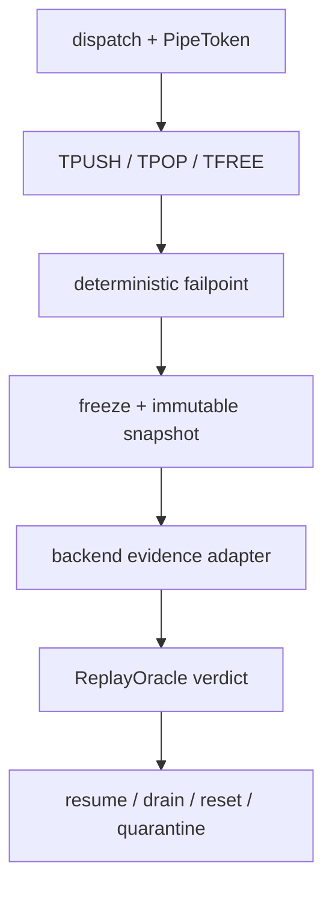
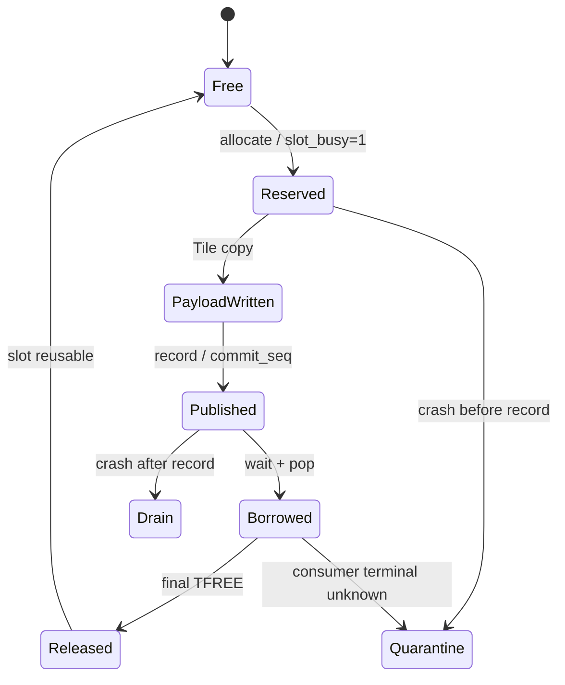

## 本篇在 PTO 课程路线中的位置

第 53 章建立了 `freeze admission → cooperative cancel → waiter/active/borrow census → bounded join → scoped reset` 的 epoch 交棒顺序。本篇只深入一个紧邻问题：

> 故障恰好发生在 `allocate`、payload copy、`record`、`pop` 或 `free` 的哪一边，恢复器怎样从一份不会继续变化的证据中得出可重放结论？

课程位置：

`PipeEpoch handoff → deterministic failpoint → immutable snapshot → replay oracle → cross-backend golden`。

分析基于 pto-isa 默认分支 [`15a9e0a0`](https://github.com/hw-native-sys/pto-isa/commit/15a9e0a0845955f5d7a409a7f4d1609a263b5d25)。该 head 来自同步 PR [#339](https://github.com/hw-native-sys/pto-isa/pull/339)，TPipe 相关语义仍来自已合入提交 [`8e0f3124`](https://github.com/hw-native-sys/pto-isa/commit/8e0f3124a51c151206725336bbbb5383c0cc5e0b)。`PipeToken`、`PipeSnapshot`、`ReplayOracle` 是本文建议协议，不是当前公开代码中的类型。

## 前置知识

CPU_SIM 的 `DIR_BOTH` 为 C2V、V2C 各持有一个 [`SharedState`](https://github.com/hw-native-sys/pto-isa/blob/15a9e0a0845955f5d7a409a7f4d1609a263b5d25/include/pto/cpu/TPush.hpp)。每个 state 保存：

- `next_producer_slot` 与 consumer cursor；
- `occupied`、`slot_busy[]`、`transfer_dirs[]`；
- `commit_seq[]` 与 `next_commit_seq`；
- `remaining_consumers[]`、`consumers_claimed[]`；
- pending pop 队列和 Host payload；
- mutex 与 condition variable。

这些字段足以描述正常 FIFO，却没有 dispatch epoch、参与者 identity、cancel 状态和 waiter 数量。[`reset_for_cpu_sim()`](https://github.com/hw-native-sys/pto-isa/blob/15a9e0a0845955f5d7a409a7f4d1609a263b5d25/include/pto/cpu/TPush.hpp) 在 mutex 下把字段直接清零并 `notify_all()`；它要求调用方已经保证旧对象不再运行，不能自己证明这个前提。

## 今日 1–2 个核心问题

1. failpoint 应落在什么“状态提交边界”，才能准确区分尚未 publish、已经 publish、已经 borrow 和已经 release？
2. CPU_SIM 有 concrete slot，A2/A3 只有 pending-credit/flag 语义，A5 又依赖 local FIFO 与 core terminal；如何共享 oracle 而不伪造同构证据？

## PTO 全栈中的位置

上游是 compiler/runtime 为一次 dispatch 选择的 pipe key、direction、slot 参数与参与 core；下游是同一 backing、FlagID 和 FIFO 是否允许交给下一 dispatch。

oracle 不执行 Tile 计算，也不决定硬件如何 reset。它只回答：给定旧 token、故障前缀与 backend 证据，下一代是否有权复用同一 pipe backing。

## 概念和精确语义

### 接口契约与非法组合

虽然 `PipeSnapshot` 是控制对象，它仍必须携带足够的数据面描述，否则两个外观相同的 FIFO 可能指向不同 backing：

| 字段 | 要求 |
| --- | --- |
| Tile shape/dtype | 本例为 `16×16xf32`；用于计算 1024 B semantic payload，并校验 SlotSize 不小于实际写入范围 |
| layout/location | 记录 producer/consumer 的 Acc、Vec、Mat 或 Global 路径；决定 payload copy 与释放发生在哪一层 |
| memory backing | Host storage、GM ring、UB/L1/local FIFO 的 owner identity 与 generation |
| 输入 | expected `PipeToken`、冻结 revision、direction snapshots、participant terminal evidence |
| 输出 | verdict、reason code、被消费的 evidence IDs；不直接返回可变 state 引用 |
| 所有权 | snapshot collector 只读；reset executor 持 destructive authority；allocator 只有在 `RESUME` 后才能复用 |
| 前置条件 | admission 已冻结，旧 participant 集合封闭，snapshot 使用一致的 epoch |
| 后置条件 | 判定自身无副作用；任何 drain/reset action 都必须生成新 revision 和新 evidence |
| 并发假设 | 多个 observer 可以重放 oracle，但只能有一个 owner 通过 CAS 提交 action |
| 失败方式 | token 不匹配、revision 改变、direction 缺失、backend query 不支持、证据冲突或超时 |

以下组合必须直接拒绝，而不是“尽量恢复”：

- snapshot 标为 epoch42，但 pending pop token 来自 epoch41；
- `slot_busy=0`，同时 direction/`commit_seq` 仍表示已发布 entry；
- 同一 slot 在两个 direction snapshot 中被声明为同一 backing 的独占 owner；
- payload hash 已变化，但没有对应的 producer operation；
- A2/A3 adapter 只给出公式计算的 pending credit，却声称已经读取真实 flag baseline；
- A5 adapter 只证明一个 vector core 退出，却把整个 C2V/V2C execution domain 标为 reset。

这些矛盾应返回 `CONFLICT` 并保留原 backing。自动清零会抹掉定位信息，同时把不一致状态带入下一代。

### PipeToken：把空间 identity 与时间 identity 合在一起

建议 token 至少包含：

~~~text
PipeToken {
  backend;
  task_or_run_id;
  block_or_core_group;
  pipe_key;          // FlagID, Direction, SlotSize, SlotNum, LocalSlotNum
  epoch;
  participant_id;
  role;              // producer / consumer
  operation_seq;
}
~~~

`pipe_key` 回答“哪条 pipe”，`epoch` 回答“哪次 dispatch”，`operation_seq` 区分同一参与者的第几次 push/pop。当前 CPU numeric hook key 只编码 FlagID、direction 与容量参数；string fallback 还带 task cookie 和 block index，但两者都没有 epoch。

### Immutable Snapshot：不是锁外打印字段

不可变快照必须满足三个条件：

1. **同一线性化点**：所有相关字段在持有对应 state mutex 时复制；
2. **冻结旧参与者**：snapshot 前先禁止新 allocate/wait 注册，并发线程只能退出或停在可枚举边界；
3. **值语义**：快照复制 scalar、array、token 和 evidence revision，不保存 `SharedState*`、payload pointer 或可继续变化的引用。

建议 CPU_SIM snapshot 为：

~~~text
PipeSnapshot {
  token_prefix;
  direction;
  occupied;
  next_producer_slot;
  consumer_cursors;
  slot_busy[SlotNum];
  transfer_dirs[SlotNum];
  commit_seq[SlotNum];
  remaining_consumers[SlotNum];
  producer_claims[SlotNum];
  pending_pop_slots[];
  waiters;
  active_ops;
  cancel_requested;
  revision;
}
~~~

payload 不必默认全量复制。恢复判定主要关心 ownership；需要验证 stale payload 时，再记录每槽 hash/canary 与 generation，而不是把大 Tile 塞进控制面。

### 判定规则：先证明 identity，再判断 debt

oracle 不应先问“看起来是否为空”，而应按以下顺序执行：

1. 校验 snapshot 的 `pipe_key/epoch/direction` 与 expected token 完全一致；snapshot 若来自旧 epoch，立即返回 `CONFLICT`。
2. 校验 snapshot revision 已被冻结，且其前后没有未计入的 participant registration。若 freeze 与 snapshot 之间允许新 waiter 进入，返回 `QUARANTINE`。
3. 把每个 slot 分类为 `FREE`、`RESERVED`、`PUBLISHED` 或 `BORROWED`。分类不能只用一个字段：
   - `slot_busy=0` 且 direction 为空，才可能是 FREE；
   - `slot_busy=1`、direction 为空，是 RESERVED；
   - direction 非空、`commit_seq>0` 且没有 pending pop，是 PUBLISHED；
   - pending pop 或 `remaining_consumers` 未闭合，是 BORROWED。
4. 把 waiter、active operation 和 slot debt 与 participant terminal evidence 做连接。participant 已被权威 join，只说明它不会继续动作；它留下的 RESERVED/PUBLISHED/BORROWED debt 仍需 rollback、drain 或 reset。
5. 只有 debt 全为 FREE 且旧 participant 已 terminal，才返回 `RESUME`；有活跃的同代 participant 且能继续闭合，返回 `DRAIN`；需要 destructive reset 且 authority 可用，返回 `RESET_REQUIRED`；证据不足返回 `QUARANTINE`。

这一顺序挑战了一个常见但错误的假设：“线程已经退出，所以它占用的 slot 自动消失。”线程终态只关闭 future actions，不会自动撤销已经 publish 的 payload，也不会把旧 borrow 转换成合法 free。恢复协议必须同时处理 actor terminal 与 resource debt。

### Replay Oracle：纯函数，不执行 destructive action

~~~text
verdict = ReplayOracle(
    durable_event_prefix,
    immutable_snapshot,
    backend_terminal_evidence,
    expected_token)
~~~

输出建议固定为 `RESUME`、`DRAIN`、`RESET_REQUIRED`、`QUARANTINE`、`CONFLICT`。相同输入必须得到相同输出；oracle 不读 wall clock，不在判定中等待线程，也不直接清 flag。这样 crash 后可以重放，Golden 也不依赖调度时序。

## 真实文件、类型、API 与指令逐段解读

### `TPUSH`：allocate、payload、record 是三个提交层次

[`TPush_impl`](https://github.com/hw-native-sys/pto-isa/blob/15a9e0a0845955f5d7a409a7f4d1609a263b5d25/include/pto/cpu/TPush.hpp) 顺序是：

1. `Producer::allocate` 等待 ring 有容量且目标 cursor slot 可用，然后设置 `slot_busy=1`；
2. `TPush_c2v/TPush_v2c` 把 Tile payload 写入该 slot 的 Host storage；
3. `Producer::record` 设置 direction、consumer count、`commit_seq`，推进 producer cursor 并增加 `occupied`。

因此 `after_allocate` 不能等价于 `after_record`。前者是“已保留但不可消费”，后者才是 publish。如果恢复器只看 `occupied`，会漏掉 `slot_busy=1, occupied=0` 的 reservation debt。

### `TPOP` 与 `TFREE`：读取完成不等于 ownership 结束

[`TPOP_IMPL`](https://github.com/hw-native-sys/pto-isa/blob/15a9e0a0845955f5d7a409a7f4d1609a263b5d25/include/pto/cpu/TPop.hpp) 先 `Consumer::wait` 选择 direction 内最老 `commit_seq`，再拷贝 payload。wait 同时把 slot 加入 pending pop 队列。`TFREE_IMPL` 才进入 `Consumer::free`，递减 `remaining_consumers`；最后一个 consumer 释放时清 direction、commit sequence、busy，并减少 `occupied`。

所以 `after_pop/before_free` 是明确的 borrow 状态。旧 consumer 即使已经把 Tile 拷入本地寄存/Host 对象，仍可能迟到执行 `free(slot0)`；若 epoch 42 已复用 slot0，这次 free 会破坏新一代账本。

### A2/A3 与 A5：不能照抄 CPU 字段

[A2/A3 `TPush.hpp`](https://github.com/hw-native-sys/pto-isa/blob/15a9e0a0845955f5d7a409a7f4d1609a263b5d25/include/pto/npu/a2a3/TPush.hpp) 用 `SyncPeriod`、`shouldWaitFree`、`shouldNotifyFree` 和 `countPendingFreeCredits` 描述稀疏 credit。这个算术能推导正常 drain 还剩多少 notification，却不能提供 concrete slot 的 Host snapshot。

[A5 `TPush.hpp`](https://github.com/hw-native-sys/pto-isa/blob/15a9e0a0845955f5d7a409a7f4d1609a263b5d25/include/pto/npu/a5/TPush.hpp) 同样按 `SyncPeriod` 降低同步频率，但 local FIFO、UB/L1 payload 和 device flag 的终态需要 core/runtime 证据。公开头文件没有“读取完整 PipeSnapshot”的统一 API。

## 对象、Tile、Buffer 与状态生命周期

以一次 C2V push/pop 为例：

Tile 语义值在 payload copy 时产生，但 ring ownership 在 final `TFREE` 后才结束。`commit_seq` 在 publish 时产生，在最终 release 时归零；pending pop 则属于具体 consumer 对象。若 consumer 对象失效而 state 仍保留 borrow，只有旧 participant terminal 或覆盖该 slot/backing 的 reset 能关闭生命周期。

### snapshot 自身的生命周期

`PipeSnapshot` 也有明确生命周期，而不是一次临时 dump：

1. supervisor 先把 epoch41 的 admission 状态从 `OPEN` 原子改为 `FROZEN`；
2. 已登记 participant 观察 cancel，阻塞中的 waiter 被唤醒并注销；
3. runtime 在 state mutex 下读取 revision R7，复制全部 ownership 字段，再次确认 revision 仍是 R7；
4. snapshot 与 expected `PipeToken`、terminal evidence 一起交给 oracle；
5. oracle 产生 verdict 后，把 snapshot hash、input revision 与 verdict 作为恢复记录保存；
6. 一旦任何同代 drain action 修改 state，revision 前进，旧 snapshot 立即失效，必须重新采样后再判定。

这样可以避免 ABA：第一次 snapshot 看见 slot0 FREE，随后旧 consumer late free、producer 又占用 slot0，第二次仍看见相同字段组合。如果没有单调 revision 与 token generation，两份外观相同的状态会被误认为同一个历史时刻。

对于 `DIR_BOTH`，应先分别在 C2V、V2C mutex 下形成 direction snapshot，再由上层生成带共同 freeze revision 的 group envelope。若不能原子锁住两个方向，必须使用“读 group revision—复制两向—复核 group revision”的 seqlock 风格协议；否则两向字段可能来自不同时间点。这里是建议设计，当前代码并没有 group revision。

## 端到端调用链与 failpoint

建议 failpoint 对齐真实状态变换，而不是任意代码行：

| Failpoint | 已发生 | 尚未发生 | Snapshot 必须暴露 |
| --- | --- | --- | --- |
| `before_wait_sleep` | waiter 已注册并持旧 token | predicate 未满足 | waiter、cancel、epoch |
| `after_allocate` | slot reservation | payload publish | busy、producer claim |
| `after_payload` | bytes 已写 | direction/commit 未发布 | reserved slot、payload hash |
| `after_record` | entry 已 publish | consumer borrow/release | direction、commit、remaining |
| `after_pop` | consumer 已借用并读出 | final free | pending pop、remaining |
| `before_free` | free action 即将提交 | ownership 清除 | token 再校验点 |

故障注入器在命中后应阻塞当前 participant，由 supervisor 冻结 admission、请求 cancel、收集快照，再决定释放或恢复线程。若 failpoint 自己修改状态，测试就不再验证真实路径。

## 具体 shape、Tile 与状态演算

设 `TPipe<7, DIR_C2V, 1024, 2>`，Tile 为 `16×16×f32 = 1024 B`，epoch=41。

1. P0 完成 slot0 record：`commit_seq=[11,0]`、`occupied=1`。
2. P1 完成 slot1 record：`commit_seq=[11,12]`、`occupied=2`。
3. C0 pop slot0 后停在 `before_free`：
   - `slot_busy=[1,1]`；
   - `transfer_dirs=[C2V,C2V]`；
   - `remaining_consumers=[1,1]`；
   - `pending_pop_slots=[0]`；
   - `occupied=2`。
4. P2 在下一次 allocate 等容量，登记为 waiter。
5. supervisor cancel epoch41，P2 退出，得到 immutable S41。

S41 不能输出 `RESUME`：slot0 有 borrow，slot1 有 published payload。若 C0 明确继续运行，oracle 输出 `DRAIN`，允许它 free slot0、再消费/释放 slot1；若 C0 terminal unknown，输出 `QUARANTINE`；只有权威 reset 覆盖 C2V backing、旧 consumer 执行域和相关 flag 后，才输出 `RESET_REQUIRED` 的完成态并创建 epoch42。

反例是只看 `waiters=0`。P2 退出后 waiter 确实为零，但两份 1024 B payload 与一个旧 borrow 仍存在，清零并复用会让迟到 `free(slot0)` 修改新一代。

### 将 S41 真正重放一遍

假设 durable event prefix 只有：

~~~text
E1: epoch41 P0 record(slot0, commit=11)
E2: epoch41 P1 record(slot1, commit=12)
E3: epoch41 C0 pop(slot0)
E4: cancel requested
~~~

没有 `free(slot0)`。snapshot S41 与这个前缀一致，因此第一次 oracle 返回 `DRAIN`，授权仍存活的 C0 完成同代 free，但绝不授权 epoch42 producer。C0 随后提交 `E5: free(slot0)`，state revision 从 R7 变为 R8；S41 随之失效。

第二份 snapshot S42 显示 slot0 FREE、slot1 PUBLISHED。oracle 仍返回 `DRAIN`，要求消费 slot1。若 C0 在此时崩溃，backend adapter 只能证明 participant terminal，不能证明 slot1 已释放；第三次判定转为 `RESET_REQUIRED` 或 `QUARANTINE`。

如果恢复日志意外出现 `E5` 两次，oracle 必须用 `PipeToken + operation_seq` 判断它们是同一 action 的幂等重放还是两个不同 free。相同 operation id、相同 slot/epoch 可以折叠；相同 id、不同 payload 是 `CONFLICT`；不同 id 对同一 borrow 的第二次 free 同样是协议错误。这个规则让测试能够重放 crash-before-ack，而不会把重复 action 当成两枚 credit。

## 为什么这样设计及替代方案

| 方案 | 正确性 | 成本 | 适用性 |
| --- | --- | --- | --- |
| 打印 mutable state 后重试 | 日志字段可能来自不同时刻 | 最低 | 只能诊断 |
| 加锁复制完整 Host state | CPU_SIM 可得到一致 snapshot | 复制 O(SlotNum) 元数据 | 单元 replay oracle |
| 记录每一步 durable event | crash 恢复强，但写放大 | 高 | runtime/WAL |
| backend adapter 输出 verdict evidence | 保留平台差异 | 需维护 adapter | 跨 A2/A3/A5 |
| 任何异常都重建 execution domain | 证据强 | 延迟、容量和共租户代价最大 | 无 query 时兜底 |

最小方案是“CPU_SIM 精确 snapshot + backend-native evidence + 纯 replay oracle”。不应为了统一测试而假装 A2/A3 也有 `slot_busy[]`；统一的是 token、failpoint 语义和 verdict。

### 正常路径为什么不应支付恢复成本

`PipeToken` 的 epoch 与 operation sequence 可以在 dispatch 构造时一次生成，正常 TPUSH/TPOP 只携带紧凑 token 或在测试构建中启用完整检查；大数组 snapshot、payload hash 和 backend query 都应留在 freeze 后的冷路径。若为了故障恢复在每个 Tile 上持久化完整 snapshot，控制流与内存流量会反过来破坏原有 pipeline。

需要实测的不是“snapshot 是否快”，而是三个独立预算：正常路径新增指令与同步、故障路径冻结到 verdict 的延迟、quarantine 占用的 backing 容量。只有当完整 snapshot 的额外信息能减少 reset 范围或 quarantine 时，它的复杂度才有收益；否则最小 token 加强 reset 更简单。

## 访存、计算、流水、并行和硬件约束

- snapshot 复制的是 O(SlotNum) 控制元数据，不进入正常 TPUSH/TPOP 热路径；只在故障或测试冻结后执行。
- 全量 payload copy 会增加 `SlotNum×SlotSize` Host 流量，默认用 per-slot hash/canary 更合适。
- failpoint 必须位于 publish/release 线性化点两侧；插在 Tile copy 内部只能得到 partial-write，需额外 byte-range evidence。
- A2/A3 credit batching减少同步次数，但使“第几个 entry 已物理释放”不能从单个计数反推；这是信息边界，不是 Host 模型遗漏。
- A5 的 local FIFO 和 flag 可能映射到平台专用同步资源。本文只根据公开头文件说明协议，具体 flag 微架构、reset scope 与迟到 DMA 行为仍是硬件推断，必须真机确认。
- graph replay 会重复命令拓扑，却不自动重置 state backing。相同地址、FlagID 和 graph executable 必须与 epoch token 一起校验。

### 硬件映射推断的边界

从公开头文件可以确认 A2/A3 与 A5 都把 producer/consumer 节奏压缩成 periodic flag/credit 交互，也能确认 Tile payload 位于 GM、UB/L1 或 local storage 的不同路径。但以下内容无法从公开材料直接确认：

- flag register 在 core reset、kernel abort 或 graph replay 后是否自动回到 baseline；
- 已发起的数据搬运在 core terminal 后是否还能向旧 GM/UB backing 写入；
- device 侧是否存在可按 FlagID 查询 pending credit 的稳定 runtime API；
- reset 的最小 scope 是单 pipe、单 core、单 kernel、单 stream 还是整个 execution domain。

因此文章中的 A2/A3/A5 adapter 不是对硬件实现的描述，而是上层需要的证据接口。若 backend 无法查询，就必须返回 `UNKNOWN`，由 runtime 选择 quarantine 或更强 reset；不能根据 CPU_SIM 测试成功推断设备端也已经 clean。

### 测试 harness 怎样保证可重复

确定性测试不能依赖“sleep 10 ms，希望线程刚好停在某行”。建议每个 failpoint 使用双向 latch：

1. participant 到达真实状态边界后，先完成被测写入，再发布 `ARRIVED(token, failpoint, revision)`；
2. participant 阻塞在 test-only gate，不再持有 state mutex；
3. supervisor 等待精确 ARRIVED，冻结 admission 并采样；
4. oracle 产生期望 verdict；
5. 测试选择 `CONTINUE`、`CRASH` 或 `DROP_ACK`，再放行 participant；
6. 最终比较事件前缀、state snapshot、输出 Tile 与下一代第一次 push/pop。

gate 若在 participant 仍持 mutex 时阻塞，snapshot collector 会被测试工具自身死锁；gate 若先发布 ARRIVED、后修改 state，又会产生虚假的观察窗口。正确位置是“真实状态变换已经完成、锁已经释放、下一状态变换尚未开始”。

每个 Golden 至少要执行三次：原始执行、在 failpoint 处 crash 后 replay、以及对同一 action 重复 replay。三次最终 state、payload hash 和 verdict 必须一致。对 `DIR_BOTH` 还要交换 C2V/V2C 的到达顺序，证明 oracle 不依赖线程调度偶然性。

## 测试证据与未覆盖风险

[`tests/cpu/st/testcase/tpushpop/main.cpp`](https://github.com/hw-native-sys/pto-isa/blob/15a9e0a0845955f5d7a409a7f4d1609a263b5d25/tests/cpu/st/testcase/tpushpop/main.cpp) 已覆盖：

- C2V delayed free 能逐一释放正确 slot；
- `DIR_BOTH` overlapping pop、交错 V2C/C2V 与 full-capacity round trip；
- hook storage 能为两个方向独立初始化并由 `reset_for_cpu_sim` 清零；
- 32 次并发 round trip 正常闭合；
- undersized slot 被拒绝。

这些测试验证正常 FIFO、布局和方向隔离，但 failpoint 都不在活跃线程中。hook reset test 是先人工改 `occupied` 再同步 reset，没有 waiter、reservation、borrow 或迟到对象。

建议新增确定性 Golden：

| 前缀/故障 | CPU_SIM 期望 | A2/A3 adapter | A5 adapter |
| --- | --- | --- | --- |
| after_allocate | `QUARANTINE` 或同代 rollback | reservation 不可直接观测则 `UNKNOWN` | 需 local reservation/core 证据 |
| after_record | `DRAIN` | pending credit + producer terminal | published flag + payload owner |
| after_pop | borrow 未闭合 | TileData 可能已在 TPOP 内释放，按真实路径判定 | 显式 TFREE 未到则不可复用 |
| old epoch late free | `CONFLICT` | stale token/flag evidence | stale token/core generation |
| 两向一边 quiescent | group `QUARANTINE` | 任一方向 unknown 即拒绝 | 同左 |

未覆盖风险包括：snapshot 与 cancel 的 lost-wakeup、snapshot revision 撕裂、epoch wrap、旧 token 重放、direction 部分 reset、graph replay、真实 flag poison、late DMA，以及 adapter 把“不支持查询”错误翻译为 clean。

## 与前后章节的连接

第 51–53 章依次建立 PipeEpoch、backend evidence 和 cancel/join/reset 交棒；本章把它们压成一个可确定性重放的判定输入。它也回扣第 25–28 章：当时的 FIFO census 和跨 dispatch generation 还是抽象协议，现在已经能明确指出真实 `allocate/record/wait/free` 的线性化边界。

下一章需要解决 durability：如果 snapshot 已生成，但 verdict 或 reset action 之间进程崩溃，新的 supervisor 怎样判断 action 是否执行过，并避免对同一 execution domain 做冲突 reset？

## 本篇结论、知识债、三个理解检查问题和下一章

结论：这是一条安全边界。

> failpoint 必须落在 ownership 状态变换边界；snapshot 必须在冻结后以值语义原子复制；oracle 必须是只依赖 token、durable prefix、snapshot 和 backend evidence 的纯函数。

**知识债**

- 真实 `PipeToken/PipeSnapshot` schema；
- freeze/cancel/waiter RAII 与单调 revision；
- CPU_SIM snapshot API 和 test-only deterministic failpoint；
- A2/A3 flag/pending-credit query adapter；
- A5 local FIFO/core terminal adapter；
- stable reason code、epoch wrap 与 stale-token fencing；
- snapshot/action durability、scoped reset WAL；
- graph replay、late DMA 与 flag poison 真机 Golden。

**理解检查**

1. 为什么 `occupied=0` 仍可能存在 `after_allocate` 的 reservation debt？
2. 为什么 CPU_SIM 的 concrete-slot snapshot 不能直接规定 A2/A3 adapter 也返回 `slot_busy[]`？
3. epoch41 的 consumer 已 pop 但未 free，waiter 又已全部退出；为什么仍不能建立 epoch42？

**下一章**

**Snapshot 写下了，Action 做过吗——ResetIntent WAL、Idempotent Replay 与 Torn-checkpoint Golden。**

## 课程账本增量

- 章节：第 54 章
- 源码基线：pto-isa `15a9e0a0845955f5d7a409a7f4d1609a263b5d25`
- 新覆盖：`TPush_impl`、`Producer::allocate/record`、`Consumer::wait/free`、`TPOP_IMPL`、`TFREE_IMPL`、A2/A3 `countPendingFreeCredits`、A5 `SyncPeriod`
- 新确认不变量：failpoint 对齐 ownership linearization；snapshot 必须 freeze 后同锁值复制；oracle 必须确定性、无副作用、保留 backend-native evidence
- 当前代码事实：CPU_SIM 没有 epoch/waiter/snapshot API；A2/A3/A5 也没有统一 Host state query
- 建议协议：`PipeToken`、`PipeSnapshot`、`ReplayOracle`、`RESUME/DRAIN/RESET_REQUIRED/QUARANTINE/CONFLICT`
- 下一章：ResetIntent WAL、幂等 replay 与 torn checkpoint
