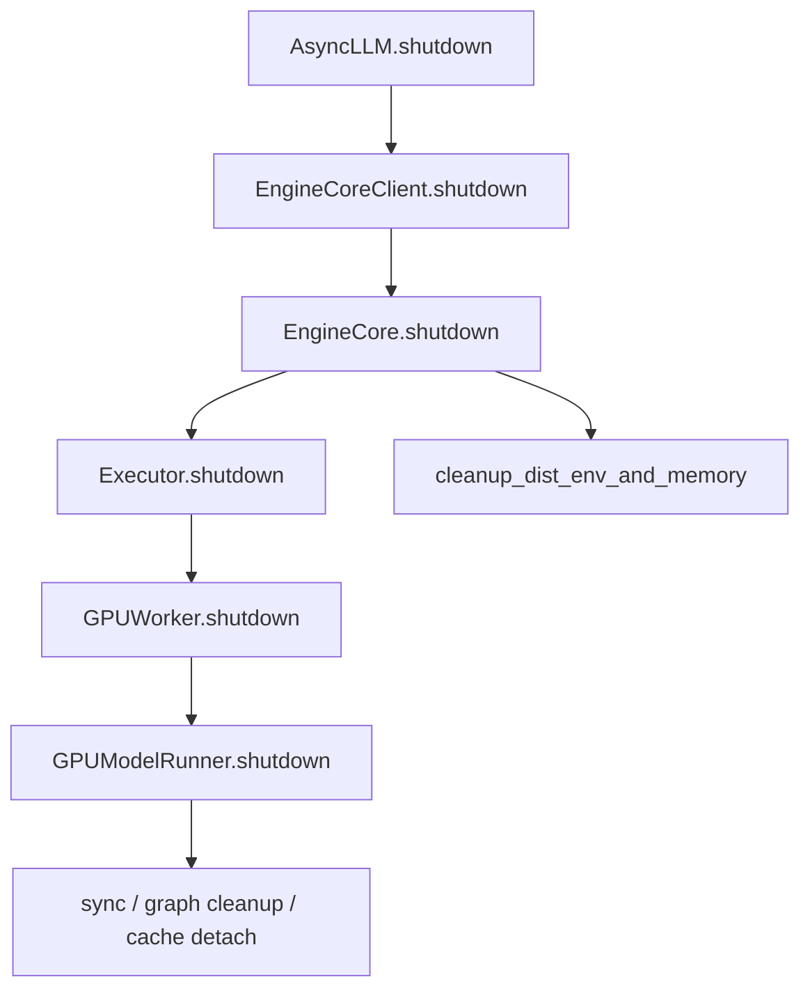
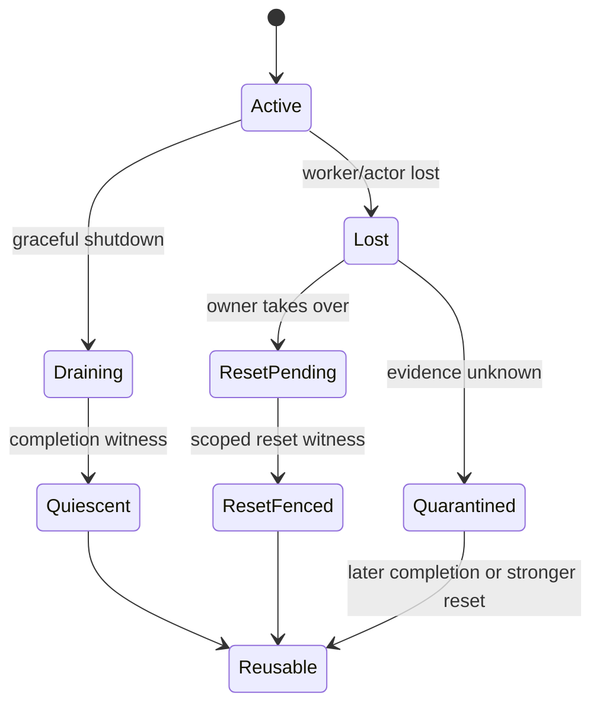

> 本文基于 vLLM 默认分支提交 [`44198f57`](https://github.com/vllm-project/vllm/commit/44198f577fe5cfb4b02297bf6ff7235eb31d742b) 分析。该提交本身修复 Qwen3-Omni 的 M-RoPE offset，与本文主题无直接关系；本文以该 commit 上已经合入的代码和测试为准。文中 `ContextToken`、`ResetWitness`、`GroupResetFinal` 是建议协议，不是当前 vLLM 已存在的类型。

## 本篇在课程路线中的位置

上一章把“进程死了”和“GPU work 不再触碰旧地址”分开：只有同 generation 的 completion，或覆盖相关执行域的 reset fence，才能解除 KV/activation quarantine。本章只追问一个边界清晰的问题：

> “reset 完成”究竟重置了哪个 backend、哪个 rank、哪个 device/context，以及哪一代未完成工作？

课程位置是：

`KILL/actor terminal → device work unknown → context generation → backend reset witness → cross-backend golden`。

这一步不是新增清理技巧，而是给上一章的安全条件补上可比较、可持久化的证据格式。

## 前置知识回顾

我们已经确认四个终态不能混用：

1. API 已返回；
2. worker 进程或 Ray actor 已终止；
3. OS 直接子进程已 reap；
4. 能写入旧 KV/activation 地址的 device work 已完成或失效。

前三项都不能自动推出第四项。`torch.accelerator.synchronize()` 可以证明调用者可见执行域在某一时刻已排空，但它不是跨进程、跨 rank 的持久化凭证；`SIGKILL`、`ray.kill` 更只说明控制平面采取了终止动作。

## 本篇要回答的核心问题

1. 一个足以授权地址复用的 reset witness 至少要绑定哪些 identity 与 scope？
2. UniProc、Multiproc、Ray 和 External Launcher 的现有 shutdown 路径各自最多能证明什么？
3. TP=2 时若只有一个 rank 得到 reset witness，为什么整个 request group 仍不能恢复？

## 组件在全局架构中的位置

当前公开入口到 device cleanup 的正常链路如下：

[`AsyncLLM.shutdown`](https://github.com/vllm-project/vllm/blob/44198f577fe5cfb4b02297bf6ff7235eb31d742b/vllm/v1/engine/async_llm.py) 关闭 renderer，并把 timeout 交给 `EngineCoreClient`；[`EngineCore.shutdown`](https://github.com/vllm-project/vllm/blob/44198f577fe5cfb4b02297bf6ff7235eb31d742b/vllm/v1/engine/core.py) 先关 `model_executor` 和 scheduler，再调用 `cleanup_dist_env_and_memory()`。真正的 GPU 对象释放下沉到 worker/model runner。

这条链只有在控制流顺利抵达每一层时才成立。强制 kill 会在中途切断它。

## 完整调用链

### 正常路径

`Executor.shutdown()` 的基类实现通过 `collective_rpc("shutdown")` 调各 worker。UniProc 直接进入 [`GPUWorker.shutdown`](https://github.com/vllm-project/vllm/blob/44198f577fe5cfb4b02297bf6ff7235eb31d742b/vllm/v1/worker/gpu_worker.py)：

- 关闭 KV、EC、weight transfer 与 elastic EP；
- 调用 `model_runner.shutdown()`；
- 对 CUDA-like 平台释放 CuMem pool。

[`GPUModelRunner.shutdown`](https://github.com/vllm-project/vllm/blob/44198f577fe5cfb4b02297bf6ff7235eb31d742b/vllm/v1/worker/gpu_model_runner.py) 会通过 `_cleanup_profiling_kv_cache()` 执行 `torch.accelerator.synchronize()`，解绑 layer 上的 KV cache；ROCm 路径还会先清 captured graph，再做 GC、`empty_cache` 与 synchronize。代码注释明确说明：ROCm 若把 graph 销毁拖到 distributed teardown 之后，下一次启动可能出现 HSA fault。

这证明 cleanup 顺序已经考虑 backend 差异，但函数返回值仍是 `None`，没有发布 generation、scope 或可由上层持久化的 witness。

### 强制路径

[`MultiprocExecutor._ensure_worker_termination`](https://github.com/vllm-project/vllm/blob/44198f577fe5cfb4b02297bf6ff7235eb31d742b/vllm/v1/executor/multiproc_executor.py) 依次等待 graceful exit、发送 `terminate()`、再对残留进程 `kill()`。KILL 之后既没有统一的同步 `join/reap`，也没有查询 device/context 是否已失效。

[`RayDistributedExecutorV2.shutdown`](https://github.com/vllm-project/vllm/blob/44198f577fe5cfb4b02297bf6ff7235eb31d742b/vllm/v1/executor/ray_executor_v2.py) 先等待 monitor thread，随后对 actor 调 `ray.kill` 并拆消息队列。这个调用能表达 Ray 控制平面的终止意图，不能直接表达 CUDA/HIP context 的代际变化。

[`ExecutorWithExternalLauncher`](https://github.com/vllm-project/vllm/blob/44198f577fe5cfb4b02297bf6ff7235eb31d742b/vllm/v1/executor/uniproc_executor.py) 在每个 torchrun rank 内仍是单 worker；本地 executor 只能清理本 rank。整组 rank 是否终止、是否换了 launcher attempt，只能由外部 supervisor 证明。

## 概念和精确语义

这里的 `context generation` 不是 CUDA/HIP 官方对象名称，而是控制平面给“一组可能继续向既有地址发起 work 的 backend state”分配的逻辑代次。它必须和真实 backend identity 绑定：若进程重启后仍把同一张卡标成 generation 9，旧 witness 就可能误伤新实例；若每次 RPC 都随意加一，则 generation 又失去执行语义。

`completion witness` 与 `reset witness` 的后置条件不同：

- completion 证明某个已提交 operation，或某个明确定义的 stream/context frontier，已经越过完成点；它不必改变 generation；
- reset 证明旧 generation 的 operation 已无法再产生副作用，并建立一个新的执行代次；
- quarantine 不是失败重试状态，而是“证据不足时禁止物理区间被赋给新 owner”的资源状态；
- memory freed 只说明 allocator/driver 的当前统计，不说明旧 command queue、远端注册或 captured executable 已全部失效。

建议 adapter 的输入输出契约如下：

| 项目 | 精确要求 |
|---|---|
| 输入 | `ContextToken`、待隔离物理区间集合、已知 outstanding operation、shared deadline |
| 输出 | `QUIESCENT` / `RESET_FENCED` / `QUARANTINED` / `CONFLICT`，以及可审计 witness |
| shape/dtype/device | 不直接改变张量 shape/dtype；但 witness 必须绑定这些张量背后的 device UUID、物理 range 与 writer 集合 |
| 所有权 | 只有当前 `owner_attempt` 或其经 CAS 获得授权的 takeover owner 可执行 reset |
| 前置条件 | destructive intent 已持久化，scope 已解析，旧 owner 已 fenced |
| 后置条件 | 成功时旧 generation 不再能写覆盖范围；未知时区间继续 quarantine |
| 并发假设 | 多个 owner 可能重试同一 operation；同 ID 同 payload 必须幂等，冲突 payload 必须拒绝 |
| 失败方式 | timeout、driver query unsupported、partial rank、scope 不足、witness 丢失或 generation 冲突 |

注意 `shape/dtype` 仍然重要：它们决定一次迟到写可能污染多少字节，却不能替代物理 range。两个逻辑张量即使 shape 相同，也可能位于不同 allocation；反之，同一地址被不同 generation 复用时，shape 已变也不能阻止旧 work 覆盖新内容。

## 关键类型、字段和状态生命周期

从第一性原理出发，地址区间 `R` 可复用的硬约束是：

\[
Reusable(R) \Rightarrow
\forall op,\; MayWrite(op,R) \Rightarrow
Completed(op) \lor Invalidated(op, W)
\]

其中 `W` 必须是有权覆盖 `op` 所在执行域的 witness。建议最小结构为：

~~~text
ContextToken = {
  backend, owner_attempt, rank,
  device_uuid, context_generation
}

ResetWitness = {
  operation_id, authority,
  scope,                 # stream / context / device / node / job
  from_generation,
  to_generation,
  terminal_evidence,
  observed_at
}
~~~

`scope` 不能省略。一次 stream synchronize 不能失效另一个 stream 的 work；单 rank context reset 不能证明 TP group 的其他 rank；本机 device reset 更不能证明远端 RDMA producer 已停止。

建议生命周期如下：

generation 只在权威 reset 成功后递增。单纯把软件计数从 17 改成 18，不会阻止 generation 17 的迟到 kernel 或 DMA 写回旧地址。

## 逐函数源码解读

### `EngineCore.shutdown`：编排 cleanup，不生成证明

它先清 structured-output backend，再关 executor 与 scheduler，最后 unfreeze GC、销毁 distributed state、清 allocator cache。这里的顺序有利于释放引用，但上层得不到“哪些 worker 已完成 device drain”。

### `GPUModelRunner.shutdown`：正常路径上最接近 device quiescence

`_cleanup_profiling_kv_cache()` 的 synchronize 是强证据，但只在该 worker 正常执行到这里时存在。随后解绑 cache、清 static context/model/ROPE/workspace，解决的是对象可达性和 allocator 回收。近期合入的 [#54162](https://github.com/vllm-project/vllm/pull/54162)、[#54246](https://github.com/vllm-project/vllm/pull/54246) 与 [#57834](https://github.com/vllm-project/vllm/pull/57834) 分别修复 model cache、layer-bound KV cache 和 weight offloader 的释放；它们强化了正常 cleanup，但都没有把 backend reset 变成可持久化 witness。

### `MultiprocExecutor` / `RayDistributedExecutorV2`：owner 看到的是进程，不是 context

MP parent 持有 `BaseProcess`，有资格终止和 reap 直接子进程；Ray driver 持有 actor handle，终态由 Ray runtime 管理。二者的 ownership 不同，因此 adapter 不能统一为同一个 `join()`。可以统一的是输出语义：返回“观察到了什么”，而不是用 `killed=true` 伪装成 `device_fenced=true`。

## 具体示例与 shape/状态演算

设模型 32 层，总 KV heads=8，TP=2，因此每 rank 4 个 KV heads；head size=128，dtype=FP16，block size=16。每 rank、每层、每 block 的 K+V 空间是：

\[
2 \times 16 \times 4 \times 128 \times 2
= 32768\ \text{B}=32\ \text{KiB}
\]

跨 32 层是 1 MiB/rank/block。一个 33-token 请求占 3 blocks，即两个 rank 合计 6 MiB。

现在 rank 0 正常进入 `GPUModelRunner.shutdown`，完成 synchronize，并由可信 adapter 形成：

~~~text
rank0: context_generation 9 -> 10, scope=context, VALID
~~~

rank 1 卡在 native kernel，driver 只观察到 `ray.kill(actor1)` 返回：

~~~text
rank1: actor terminal requested, device generation UNKNOWN
~~~

此时 rank 0 的 3 MiB 物理区间若由独立 allocator 管理，可以解除本地 quarantine；rank 1 的 3 MiB 不能复用。更重要的是，TP request group 不能重新 admission：新 rank 0 若开始 collective，而 rank 1 仍处于未知 generation，系统既可能读到不一致 KV，也可能在 collective 上再次挂死。

因此 `GroupResetFinal` 必须是所有成员 witness 的收敛，而不是“任一 rank reset 成功”：

~~~text
group reusable =
  every rank has completion/reset evidence
  AND all witnesses name the same owner_attempt
  AND no overlapping remote producer remains
~~~

### 四种 backend 的证据边界

| Backend | 直接 owner | 正常路径可观察事实 | 强制路径可观察事实 | 仍缺的证明 |
|---|---|---|---|---|
| UniProc | EngineCore 进程 | worker cleanup、局部 synchronize、对象解绑 | 同进程异常会同时破坏控制面 | 可持久化的 context generation 与 completion scope |
| Multiproc | parent manager | worker RPC 返回、子进程退出 | TERM/KILL、直接子进程状态 | KILL 后 reap、driver/context terminal、后代进程 containment |
| Ray | Ray driver/runtime | actor RPC 返回 | `ray.kill`、actor terminal | actor attempt 到 device context 的权威映射 |
| External Launcher | torchrun 等 supervisor | 本 rank cleanup 返回 | rank/process terminal | job attempt、全 rank 收敛和 launcher-reaped 证据 |

这里最容易犯的错误，是把“更强的进程证据”误当成“更强的设备证据”。例如 MP parent 确实比普通观察者更有资格证明 direct child 已 reap，但它仍未必拥有 GPU driver 对 context terminal 的查询接口。反过来，某个 worker 在退出前完成 synchronize，也只能证明自己所覆盖的执行域；如果该 worker 曾把目标地址注册给远端 connector，这个本地同步并不天然覆盖远端 producer。

### witness 的验证顺序

建议 verifier 不接受单个 `reset_ok: bool`，而是执行以下 fail-closed 检查：

~~~text
verify(witness, quarantined_range, current_owner):
  1. authority 是否被当前 backend 信任
  2. owner_attempt / rank / device_uuid 是否精确匹配
  3. from_generation 是否等于区间记录的 writer generation
  4. to_generation 是否严格单调
  5. scope 是否覆盖所有 MayWrite source
  6. operation_id 是否首次出现，或为同 payload 的幂等重放
  7. 将 member verdict 持久化
  8. 只有 group policy 收敛后才重新开放 admission
~~~

第 3 步防止拿 generation 16 的 reset 去释放 generation 17 的地址；第 4 步防止“重置”退回旧代；第 5 步是安全核心：context-scope witness 不能清除另一个 context 或远端 RDMA queue 的 lease；第 6 步则把上一阶段的 operation lease 带入设备侧破坏性动作，避免旧 owner 回归后再次 reset 新实例。

scope 更适合被建模为偏序，而不是简单枚举强弱。`device` 通常覆盖该 device 上的多个 context，却不一定覆盖远端 NIC；`job` 可以覆盖所有 rank 的 owner identity，却未必由自身完成设备 reset。verifier 应检查“覆盖集合是否包含所有 writer”，不能武断规定 `job > device > context > stream`。

## 为什么这样设计及替代方案

| 设计 | 延迟/吞吐 | 正确性 | 维护成本 |
|---|---|---|---|
| kill 后立即复用 | 恢复最快 | 迟到写可污染新请求，fail-open | 表面最低，事故最高 |
| 所有未知区间永久 quarantine | 吞吐与容量持续下降 | 安全但不可用 | 需要容量治理 |
| backend-specific witness + 统一 verdict | 正常路径开销小，故障恢复可控 | scope/generation 可审计 | 需要 adapter 与 schema |
| 整 device/node reset | 恢复慢、影响共租户 | 若 authority 与 scope 可信，证据强 | 运维与隔离成本高 |

最小可行设计不是强迫所有 backend 提供同一种 reset API，而是统一 verdict：

- `QUIESCENT`：同 generation 的 completion 已观察；
- `RESET_FENCED`：旧 generation 被覆盖 scope 的权威 reset 失效；
- `QUARANTINED`：终态未知，不允许地址复用；
- `CONFLICT`：witness 的 owner attempt、rank 或 generation 不匹配，fail closed。

## 性能、并发、正确性与边界条件

- **延迟**：正常 shutdown 多一次 witness 发布几乎不是关键路径；真正成本在强 reset 和等待跨 rank 收敛。
- **显存**：quarantine 保护正确性，却会造成有效容量下降；需要水位、admission backpressure 与最大隔离预算。
- **并发**：witness 必须绑定 `owner_attempt` 和单调 operation id，避免旧 owner 的迟到结果释放新 owner 的区间。
- **graphability**：captured graph 持有静态地址与 backend state。context generation 改变后，旧 graph 不能仅凭地址相同继续 replay；这正是下一章要验证的 recapture fence。
- **远端写入**：CUDA/HIP context reset 未必覆盖 NIXL/RDMA/外部 producer。公开代码未提供可统一确认这种覆盖关系的证据；这是未知项，不应臆测为已解决。
- **失败方式**：reset API 返回、actor 消失、显存下降都可能是真实观测，但单独都不足以证明所有旧 work 已失效。

## 测试证据与未覆盖风险

[`test_delete.py`](https://github.com/vllm-project/vllm/blob/44198f577fe5cfb4b02297bf6ff7235eb31d742b/tests/v1/shutdown/test_delete.py) 覆盖 AsyncLLM、LLM 与 in-process engine 的删除，TP=1/2，最终调用 `wait_for_gpu_memory_to_clear`。它验证“引用和 allocator 最终释放到阈值以下”。

[`test_forward_error.py`](https://github.com/vllm-project/vllm/blob/44198f577fe5cfb4b02297bf6ff7235eb31d742b/tests/v1/shutdown/test_forward_error.py) 注入 forward 异常，检查 EngineDeadError 与 GPU memory 回落。`tests/utils.py` 中的 helper 轮询每张卡的 used bytes；ROCm 还允许最多 4 GiB 的 runtime/driver 常驻阈值。

这些是重要的测试事实，但尚未验证：

1. KILL/`ray.kill` 后旧 generation 不再写；
2. reset scope 与 rank/device identity 匹配；
3. 旧 witness、重复 witness、冲突 witness 的 fencing；
4. TP group 只完成部分 reset 时 fail closed；
5. NIXL/RDMA、IPC、captured graph 与 native hang 的联合故障；
6. 同一虚拟地址被新 generation 复用后的 late-write canary。

建议增加一套 cross-backend golden：对 MP、Ray、External Launcher 统一输入 `member token + owner attempt + backend snapshot`，断言 verdict；再用少量真实 CUDA/ROCm fault injection 校准 adapter，而不是把所有状态机都押在昂贵 E2E 上。

### 建议的 golden matrix

| 场景 | 输入证据 | 期望 verdict | 必须保持的不变量 |
|---|---|---|---|
| 两 rank 正常 drain | 两个同 attempt completion witness | `QUIESCENT` | 所有区间才可同时复用 |
| rank 0 reset、rank 1 unknown | 一个 reset witness + 一个空缺 | `QUARANTINED` | group admission 不开放 |
| 旧 Ray actor 迟到上报 | owner attempt 不匹配 | `CONFLICT` | 不修改当前 generation |
| 同 operation id、同 payload 重放 | 完全一致 witness | 原 verdict | 幂等、不重复递增 generation |
| 同 operation id、不同 payload | generation 或 scope 冲突 | `CONFLICT` | fail closed 并告警 |
| external rank 全退出、launcher 未确认 | member terminal 齐全 | `QUARANTINED` | 不伪造 launcher-reaped |
| device reset、RDMA producer 未隔离 | scope 不覆盖远端 writer | `QUARANTINED` | 远端 lease 仍阻止复用 |

单元 golden 应注入确定性的 journal 与 backend snapshot，验证纯状态机；真机测试只负责回答 adapter 是否把真实 driver/runtime 状态翻译正确。这样既避免用大量慢 E2E 穷举组合，又不会用 mock 证明硬件语义。

## 与前后章节的连接

前一章提出 device completion witness 与 quarantine；本章补齐“reset 必须绑定 scope 和 generation”。它也回扣第 37–40 章的 backend owner adapter、takeover epoch 和 replay oracle：只有当前 owner 才能发布 destructive reset，旧 owner 的 witness 必须被 fencing。

下一步自然落到 graph：context generation 变化后，CUDA Graph/ROCm graph 里记录的地址、stream 与 communicator 还能否复用？如果不能，谁触发 recapture，谁证明旧 executable 已销毁？

## 本篇结论、知识债、三个理解检查问题和下一章

结论只有一句：

> reset 不是布尔值，而是一份由权威 owner 发布、绑定 backend/scope/rank/device/owner-attempt、并把旧 context generation 推进到新 generation 的证据。

当前 vLLM 已有扎实的正常 cleanup、引用解绑、distributed teardown 和显存回落测试；但尚无统一 `ContextToken`、`ResetWitness` 或 `GroupResetFinal`。

**知识债**

- backend-specific reset/query adapter；
- context/device/remote-producer scope taxonomy；
- durable witness schema、CAS 与 operation id；
- partial-rank reset 的 group convergence；
- CUDA/ROCm/XPU/Ray/torchrun golden；
- native hang、late kernel、RDMA late write 与地址复用 canary；
- context generation 变化后的 graph/communicator recapture。

**理解检查**

1. 为什么 `ray.kill(actor)` 成功不能直接推出该 rank 的 KV block 可复用？
2. TP=2 时 rank 0 得到 context reset witness，而 rank 1 仍 UNKNOWN，哪些资源可以局部释放，哪些 admission 必须继续阻塞？
3. 为什么软件 generation 自增本身不能阻止旧 kernel 写入同一物理地址？

**下一章**

**Reset 以后 Graph 还能 replay 吗——Graph Context Generation、Recapture Fence 与 Address Rebinding Golden。**

## 课程账本增量

- 章节：第 46 章
- 源码基线：`44198f577fe5cfb4b02297bf6ff7235eb31d742b`
- 新覆盖：`AsyncLLM.shutdown`、`EngineCore.shutdown`、`GPUWorker.shutdown`、`GPUModelRunner.shutdown`、`MultiprocExecutor._ensure_worker_termination`、`RayDistributedExecutorV2.shutdown`、`ExecutorWithExternalLauncher`
- 新确认不变量：只有同 generation completion，或覆盖所有潜在 writer 的权威 reset witness，才能解除相交物理区间的 quarantine
- 新待验证推断：不同 driver/runtime 对“进程退出后 context/device work 的终态”保证不同，必须由 backend adapter 和真机故障测试确认
- 下一章：Graph context generation、recapture fence 与 address rebinding
