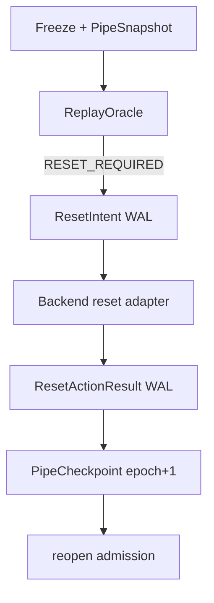
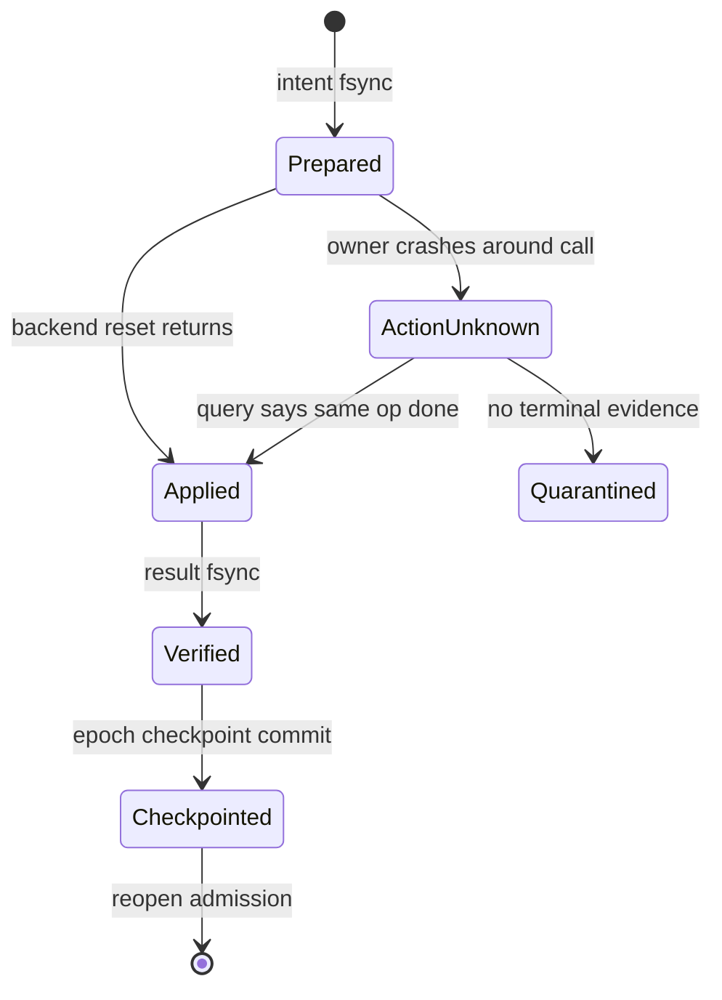

## 本篇在 PTO 课程路线中的位置

第 54 章把 `allocate → payload → record → wait/pop → free` 拆成 ownership linearization failpoint，并要求恢复判定只读取冻结后的 immutable snapshot。本篇只追问它的下一步：

> Snapshot 已经持久化，但 reset owner 在“准备执行、真正执行、写回结果、提交新 epoch”的哪一步崩溃了？重启后怎样避免漏 reset，也避免把 reset 重放到新一代 pipe 上？

课程位置：

`immutable snapshot → ResetIntent WAL → idempotent action replay → atomic epoch checkpoint`。

分析基于 pto-isa 默认分支 [`15a9e0a0`](https://github.com/hw-native-sys/pto-isa/commit/15a9e0a0845955f5d7a409a7f4d1609a263b5d25)。该 head 是同步 PR [#339](https://github.com/hw-native-sys/pto-isa/pull/339) 的合入结果；与本章直接相关的 CPU_SIM pipe 语义仍来自 [`8e0f3124`](https://github.com/hw-native-sys/pto-isa/commit/8e0f3124a51c151206725336bbbb5383c0cc5e0b)。`ResetIntent`、`ResetActionResult`、`PipeCheckpoint` 和 WAL 都是建议协议，当前公开代码中不存在。

## 前置知识

CPU_SIM 的 [`TPipe::SharedState`](https://github.com/hw-native-sys/pto-isa/blob/15a9e0a0845955f5d7a409a7f4d1609a263b5d25/include/pto/cpu/TPush.hpp#L561) 保存 cursor、`occupied`、`slot_busy[]`、direction、`commit_seq[]`、consumer/producer claim、pending pop 与 Host payload。`DIR_BOTH` 为 C2V/V2C 各保留独立 state。

第 54 章已确认：snapshot 必须在 freeze admission 后、持有 state mutex 时按值复制，并带 revision；oracle 本身是无副作用纯函数，只输出 `RESUME/DRAIN/RESET_REQUIRED/QUARANTINE/CONFLICT`。但“oracle 判定需要 reset”不等于 reset 已安全完成。判定与 destructive action 之间仍有崩溃窗口。

## 今日 1–2 个核心问题

1. 为什么 register-before-reset WAL 仍不能消除“reset 可能已执行”的歧义？
2. 什么样的 action identity、backend precondition 与 checkpoint 提交顺序，才能让 crash replay 同时避免漏执行、双执行和跨 epoch 误执行？

## PTO 全栈中的位置

上游是 Pipe snapshot/oracle；下游是 CPU_SIM state、A2/A3 flag/credit、A5 local FIFO 与 graph replay backing 是否能交给新 dispatch。

WAL 位于 runtime/control plane，不改变 `TPUSH/TPOP/TFREE` 的 ISA 语义。它解决的是恢复所有权：谁对哪个 pipe generation、哪份 snapshot、哪种 backend scope 发起了哪一次 destructive action。

## 概念和精确语义

### `reset_for_cpu_sim()` 的当前事实

[`reset_for_cpu_sim()`](https://github.com/hw-native-sys/pto-isa/blob/15a9e0a0845955f5d7a409a7f4d1609a263b5d25/include/pto/cpu/TPush.hpp#L649) 依次锁住 C2V/V2C state，把 cursor、occupancy、pending pop、Host slot bytes、claim、busy、direction 与 `commit_seq` 清零，最后 `notify_all()`。它没有：

- expected epoch 或 expected snapshot hash；
- operation id；
- compare-and-reset 前置条件；
- `APPLIED/ALREADY_APPLIED/CONFLICT` 返回值；
- 跨两个 direction 的原子 group commit。

因此它在“旧线程已 join、调用者独占 backing”的正常测试夹具里是确定的；在 crash recovery 中却不是幂等 action。若 epoch 41 的 reset 已执行、epoch 42 已开始生产，恢复器再次调用同一函数会清掉 epoch 42 的合法 payload。

### 建议 WAL 记录

最小 `ResetIntent` 应包含：

~~~text
ResetIntent {
  operation_id;
  PipeToken;              // backend/run/block/pipe_key/epoch
  expected_snapshot_hash;
  expected_revision;
  scope;                  // direction/backing/flag/execution domain
  target_epoch;
  action_payload_hash;
}
~~~

接口输入还必须带 Tile/pipe 数据面契约。本例是 `16×16xf32`、1024 B/Tile、`SlotSize=1024`、`SlotNum=2`、`DIR_BOTH`；CPU_SIM backing 是两组 Host slot storage，A2/A3 可能是 GM ring 加 ready/free flag，A5 还可能包含 UB/L1 local FIFO。WAL 不存整块 payload，但必须引用 backing identity、generation、shape/dtype/layout/location 与 snapshot hash，才能证明 intent 没被移用到另一条 pipe。

建议 adapter 输出固定 verdict：

| Verdict | 含义 | 是否可建立新 epoch |
| --- | --- | --- |
| `APPLIED` | 本 operation 首次完成 reset，scope 与前置条件匹配 | 还需持久化 result/checkpoint |
| `ALREADY_APPLIED` | backend 能证明同 ID 同 payload 已完成 | 可以继续提交 |
| `NOT_APPLIED` | 能证明 action 未发生，旧 state 仍可查询 | 可按同 ID 重试 |
| `CONFLICT` | epoch/revision/scope/payload 不匹配 | 不可 |
| `UNKNOWN` | action 可能已发生，无法查询 | quarantine 或更强 reset |

同 operation id、不同 payload 必须 fail closed；相同 payload 的重放只有在 backend 原子核验 expected epoch/revision 后才安全。

### register-before-action 仍留下歧义

正确顺序必须先 durable intent，再 destructive action，否则 action 已发生但没有任何恢复线索。但即使如此，owner 仍可能在 backend 返回前崩溃：WAL 只有 `PREPARED`，action 却可能没发生、完成了一半或已经完成。

所以：

\[
Durable(PREPARED) \not\Rightarrow NotApplied(action)
\]

恢复器不能把 `PREPARED` 当成“安全重试”，而应把它解释成 `MAY_HAVE_APPLIED`。只有 backend query、原子 compare-and-reset、或覆盖旧/new ambiguity 的更强 execution-domain reset，才能收敛；否则 backing 必须 quarantine。

## 真实文件、类型、API 或指令逐段解读

### `SharedStateStorage`：一次初始化不是一次 dispatch

[`EnsureSharedStateInitialized`](https://github.com/hw-native-sys/pto-isa/blob/15a9e0a0845955f5d7a409a7f4d1609a263b5d25/include/pto/cpu/TPush.hpp#L598) 用 `init_state` placement-new state；初始化完成后同一 hook storage 持续复用。numeric hook key 编码 `FlagID/DirType/SlotNum/LocalSlotNum/SlotSize`，不含 dispatch epoch。故而重启恢复时看见同一个 storage address/key，不能推导 reset 是否已经执行。

### `Producer::allocate/record`：reset 的并发危险来自两次线性化

[`allocate`](https://github.com/hw-native-sys/pto-isa/blob/15a9e0a0845955f5d7a409a7f4d1609a263b5d25/include/pto/cpu/TPush.hpp#L710) 在 mutex 下等待容量并设 `slot_busy=1`；[`record`](https://github.com/hw-native-sys/pto-isa/blob/15a9e0a0845955f5d7a409a7f4d1609a263b5d25/include/pto/cpu/TPush.hpp#L748) 再写 direction、consumer count、`commit_seq`，推进 cursor 与 `occupied`。reset 若发生在两者之间，会抹掉 reservation，却不能阻止旧 producer 之后继续 `record()`。

所以 WAL 不能替代前一章的 cancel/join/epoch check。安全前置条件仍是旧 participant 已 fenced；WAL 只让 action 自身可恢复。

### `Consumer::wait/free`：action replay 也必须防 late free

`wait()` 把具体 `(direction, slot)` 记录进 consumer pending 队列；`free()` 最终清 direction、busy、commit 并减少 occupancy。若旧 consumer 在 reset 后迟到 free，单纯“reset 已持久化”也无法保护 epoch 42。adapter 的 `APPLIED` 必须意味着 scope 同时覆盖旧 participant 的 future action，或这些 participant 已经 bounded join。

### A2/A3 与 A5：同一 WAL，不同执行证据

A2/A3 [`TPush`](https://github.com/hw-native-sys/pto-isa/blob/15a9e0a0845955f5d7a409a7f4d1609a263b5d25/include/pto/npu/a2a3/TPush.hpp) 以 `SyncPeriod` 和 flag 实现 batched credit；A5 [`TPush`](https://github.com/hw-native-sys/pto-isa/blob/15a9e0a0845955f5d7a409a7f4d1609a263b5d25/include/pto/npu/a5/TPush.hpp) 还区分 local no-split 与 GM/split credit protocol。当前都没有接受 `ResetIntent` 的公开 query/reset API。

因此 cross-backend 只能统一 WAL frame、operation id 与 verdict，不能宣称 CPU mutex 清零等价于 NPU flag/core reset。NPU adapter 若无法证明 old core terminal 和 flag baseline，只能返回 `UNKNOWN`。

## 对象/Tile/Buffer/IR 生命周期

真实 slot 生命周期仍是：`FREE → RESERVED → PAYLOAD_WRITTEN → PUBLISHED → BORROWED → FREE`。恢复控制对象在其外层增加另一条状态机：

`PipeSnapshot` 在 intent 创建时被 hash 固定；任何 drain 导致 revision 前进，旧 intent 即失效。`ResetActionResult` 只有在 authority、operation id、snapshot hash、scope、from/to epoch 全部匹配时才能被 checkpoint 消费。checkpoint 一旦提交 epoch 42，epoch 41 的任何 intent/result 都只能作为历史审计记录，不能再次执行。

## 端到端调用链或指令链

建议恢复链如下：

1. CAS 将 epoch 41 admission 置为 `FROZEN`，cancel 并 join 旧参与者；
2. 在一致 revision 上生成 S41，oracle 返回 `RESET_REQUIRED`；
3. append `INTENT(op7, epoch41, hash(S41), target42)`，`fsync`；
4. adapter 执行 `reset(op7, expected_epoch=41, expected_revision=R7)`；
5. append `RESULT(op7, APPLIED, witness)`，`fsync`；
6. 原子写 `CHECKPOINT(epoch42, consumes=op7)`；
7. 重建 pipe/graph state，最后 reopen admission。

WAL frame 至少要有 `length/type/sequence/payload/CRC`，并把前一 frame digest 纳入当前 frame，避免截断后把两个合法前缀拼接。checkpoint 使用 temp-write、file fsync、atomic rename、directory fsync；启动时先恢复最后一个 checksum-valid checkpoint，再重放其后的完整 WAL frame。

## 具体 shape、Tile 和状态演算

设 `TPipe<7, DIR_BOTH, 1024, 2>`，Tile=`16×16xf32=1024 B`，epoch 41：

- C2V slot0 已 pop 未 free，slot1 已 publish；
- V2C 两槽为空；
- S41 revision=R7，hash=`H41`；
- oracle 要求 reset C2V state 与旧 consumer execution scope。

owner 写入 `PREPARED(op7, e41, R7, H41, target=e42)` 并 fsync。CPU adapter 清完 state 后，owner 在写 `RESULT` 前崩溃。重启只看到 PREPARED。

错误做法是直接再调用 `reset_for_cpu_sim()`。若另一 owner 已经把 admission 打开、epoch42 的 producer 刚把 Tile X 写入 slot0，第二次 reset 会把 X、busy 与 commit 一起清掉。

正确恢复有三种：

1. backend 的 compare-and-reset ledger 返回 `ALREADY_APPLIED(op7)`，补写 RESULT 与 checkpoint；
2. admission 始终冻结，snapshot 仍精确等于“reset 后空 state”，且 authoritative participant census 证明无人能写，可把它升级为同 op 的完成证据；
3. 无 query、无 census 或状态可能属于 epoch42，则返回 `UNKNOWN`，隔离旧 storage，不能猜。

再看 torn checkpoint：RESULT 已 fsync，但 checkpoint 只写了一半。恢复器必须丢弃 checksum/length 不完整的 checkpoint，回到 epoch41 的完整 checkpoint，再重放 WAL 中的 RESULT；它能以同 op7 重新生成 epoch42 checkpoint，却不能再次执行 reset。

## 为什么这样设计及替代方案

| 方案 | 延迟/吞吐 | 正确性 | 维护成本 |
| --- | --- | --- | --- |
| reset 后再记日志 | 正常快 | crash 后 action 无身份，可能漏/双执行 | 表面低，无法可靠恢复 |
| PREPARED 后盲重试 | 恢复快 | 会清除新 epoch，fail-open | 低但危险 |
| PREPARED + backend query/CAS | 多一次 durable write/query | 可区分首次、重复与冲突 | 需每 backend adapter |
| unknown 时换 backing/quarantine | 占用容量、可能降吞吐 | 最保守，避免猜测 | 需水位与回收策略 |

WAL 每次都同步写会增加 recovery 控制路径延迟，但它不在每个 Tile 热路径上。可 batch 同一 recovery transaction 的 metadata，却不能把 intent fsync 推迟到 reset 之后。checkpoint 用于缩短 replay，不是 correctness 唯一来源；WAL 的合法 durable prefix 才是。

## 访存、计算、流水、并行和硬件约束

- WAL 不改变 1024 B Tile 的 GM/UB/L1 访存量；它增加的是 Host durable metadata I/O。
- reset 前必须 freeze admission，会暂时打断 pipeline；允许旧 producer/consumer继续流动则 snapshot 与 precondition立即失效。
- `DIR_BOTH` 两向虽有独立 FIFO，但若共享 flag namespace、execution domain 或 checkpoint epoch，action/result 必须以 group scope 提交；不能一向 checkpoint、一向 unknown 后仍整体 reopen。
- A2/A3 batched credit 的算术余额不是 reset witness；A5 local FIFO 的空也不证明旧 core 不会迟到 set/wait flag。
- graph replay 若复用同一 FlagID，graph generation 也必须进入 token；Host checkpoint 完成不能让旧 device graph 自动失效。
- `operation_id` 比物理地址稳定：地址、FlagID、slot0 都会复用，而相同 ID/相同 payload 才允许幂等补记结果。

## 测试证据与未覆盖风险

当前 [`dir_both_full_capacity_and_delayed_free`](https://github.com/hw-native-sys/pto-isa/blob/15a9e0a0845955f5d7a409a7f4d1609a263b5d25/tests/cpu/st/testcase/tpushpop/main.cpp#L1211) 使用 `16×16xf32`、两槽、八轮：每轮两向各填满两格，先 pop 后统一四次 free，验证两方向容量独立且最终 `occupied=0`。

`dir_both_four_push_pipeline_round_trip` 用两个线程完成 32 次 C2V→计算→V2C 往返，验证正常并发闭合；`dir_both_hook_storage_initializes_and_resets_both_directions` 把两向 occupancy 人工设为 1/2，再同步调用 reset，验证两向归零且 storage identity 不变。split-hook 测试还验证双 lane 全部写完之前 `occupied` 保持 0。

这些是正常路径测试事实，未覆盖 WAL。仍缺：

- intent fsync 前后、backend call 前后、result fsync 前后的 crash failpoint；
- 相同 operation id/不同 payload 的冲突；
- reset 已执行但 result 丢失的 `ALREADY_APPLIED` query；
- epoch42 已写 slot 后旧 op 重放的 negative test；
- frame 截断、CRC 错误、重复 frame、checkpoint rename 前后崩溃；
- C2V 已 applied、V2C unknown 的 partial group reset；
- A2/A3/A5 真机 flag/core reset 与 graph replay late action。

建议 Golden 对每个 durable/action 边界运行 `original → crash → recover → recover again`：第二次 recovery 必须无副作用；最终 verdict 要么唯一到达 epoch42，要么稳定 quarantine，绝不能随重放次数变化。

## 与前后章节的连接

前一章解决“从哪份静态证据判定需要什么 action”；本章解决“action 与 checkpoint 如何跨 owner crash 收敛”。两者之间的关键分界是：snapshot/oracle 是 read-only，reset 是 destructive，必须先持久化 intent。

下一章需要解决 durable log 本身的 compaction 与 ownership：当 checkpoint、WAL segment、backend witness 和 quarantine registry 不在同一原子事务里，怎样安全截断旧 segment，并防止旧 owner 删除新 owner 仍需要的恢复证据。

## 本篇结论、知识债、三个理解检查问题和下一章

结论：当前 `reset_for_cpu_sim()` 是同步清零器，不是可恢复 action。register-before-action 消除了“无记录 reset”，却不能消除 action-return 边界的歧义。安全恢复必须把 `operation_id + expected epoch/revision + snapshot hash + scope` 交给可查询或 compare-and-reset 的 backend adapter；无法证明时只能 quarantine。

知识债：真实 `PipeToken/ResetIntent/Result/Checkpoint` schema、WAL frame/CRC/hash chain、backend operation ledger、group-scope atomicity、epoch CAS、quarantine registry、A2/A3/A5 reset query、graph generation，以及 torn-write/late-flag 真机 Golden。

理解检查：

1. 为什么 durable `PREPARED` 不能证明 reset 尚未执行？
2. 为什么重复调用当前 `reset_for_cpu_sim()` 在无并发测试里看似幂等，在跨 epoch 恢复里却不幂等？
3. RESULT 已持久化但 checkpoint torn 时，恢复器应重做 checkpoint，还是重做 reset？为什么？

下一章：**WAL 什么时候能截断——Checkpoint Ownership、Segment Compaction 与 Quarantine Registry Atomicity。**

## 课程账本增量

- 章节：第 55 章
- 源码基线：pto-isa `15a9e0a0845955f5d7a409a7f4d1609a263b5d25`
- 新覆盖：`TPipe::SharedState/SharedStateStorage/reset_for_cpu_sim`、`Producer::allocate/record`、`Consumer::wait/free`、DIR_BOTH hook/reset 与 pipeline tests
- 新确认不变量：durable intent 必须先于 destructive action；`PREPARED` 只能解释为 `MAY_HAVE_APPLIED`；幂等 replay 必须绑定 operation id、expected epoch/revision、snapshot hash 与 scope
- 新待验证推断：A2/A3/A5 backend 能否提供 generation-safe query/compare-and-reset，需要 runtime API 与真机 fault injection 证明
- 下一章：checkpoint ownership、WAL segment compaction 与 quarantine registry atomicity
