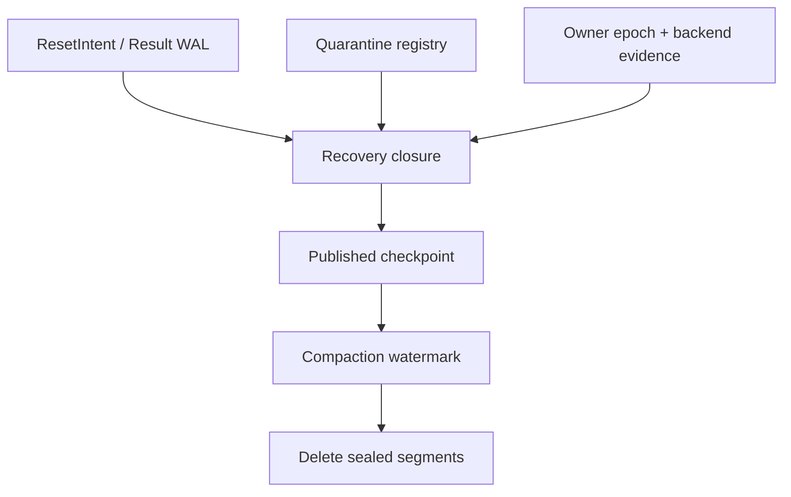
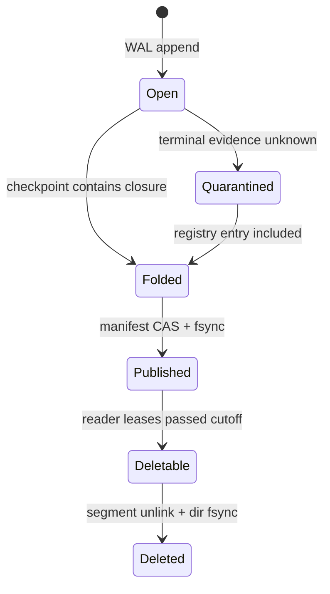

## 本篇在 PTO 课程路线中的位置

第 55 章建立了 `intent fsync → destructive reset → result fsync → epoch checkpoint`：`PREPARED` 只能表示 `MAY_HAVE_APPLIED`，RESULT 已持久化而 checkpoint torn 时只能重做 checkpoint，不能盲重做 reset。本篇只追问下一层：

> checkpoint 已经存在时，旧 WAL segment 何时才真的可以删除？谁有权宣布 cutoff？若 `UNKNOWN` operation 的唯一证据随 segment 一起消失，quarantine 会不会被错误释放？

课程位置是：`idempotent replay → recovery closure checkpoint → owner-fenced compaction → bounded WAL`。

分析基于 pto-isa 默认分支 [`15a9e0a0`](https://github.com/hw-native-sys/pto-isa/commit/15a9e0a0845955f5d7a409a7f4d1609a263b5d25)。该 head 由同步 PR [#339](https://github.com/hw-native-sys/pto-isa/pull/339) 合入；相对其父提交，本文直接引用的 `TPush.hpp` 与 CPU `tpushpop` tests 没有变化。当前公开仓库没有 WAL、checkpoint、segment compactor 或 quarantine registry；这些名称均是从现有 TPipe ownership 事实推导出的建议 runtime 协议，不是“代码已经实现”。

## 前置知识

CPU_SIM [`TPipe::SharedState`](https://github.com/hw-native-sys/pto-isa/blob/15a9e0a0845955f5d7a409a7f4d1609a263b5d25/include/pto/cpu/TPush.hpp#L561-L588) 同时保存 cursor、`occupied`、`slot_busy[]`、direction、consumer claim、`commit_seq[]` 与 Host payload。[`SharedStateStorage`](https://github.com/hw-native-sys/pto-isa/blob/15a9e0a0845955f5d7a409a7f4d1609a263b5d25/include/pto/cpu/TPush.hpp#L593-L646) 只做一次 placement-new；numeric hook key 由 FlagID、direction、slot 数与大小组成，不含 dispatch epoch。

因此，WAL 的目的不是保存 Tile payload，而是保存控制面的“谁对哪一代 backing 做过什么”。checkpoint 也不能只是为了启动快一点；一旦旧日志被物理删除，checkpoint 就成为证明哪些旧 action 已经结案、哪些 range 仍不可复用的唯一权威入口。

## 今日 1–2 个核心问题

1. 一个 checkpoint 至少要覆盖哪些状态，才能成为 WAL compaction 的安全证明？
2. 当前 owner、旧 owner、后台 compactor 与 quarantine registry 之间，怎样建立一个不会因 crash 或 split-brain 而误删证据的原子边界？

## PTO 全栈中的位置

上游是第 55 章的 `ResetIntent/ResetActionResult`；下游是 Pipe backing、FlagID、graph generation 或 allocation 何时可重新交给 epoch 42。编译器可提供 shape、dtype、layout 与 scope，真正拥有 WAL、checkpoint manifest、free list 与 backend evidence 的 runtime owner 才能做 compaction。

这里的方向很重要：segment deletion 消费 checkpoint，不能反过来以“日志不存在”证明 operation 已安全退休。

## 概念和精确语义

### checkpoint 保存的是恢复闭包，不只是业务状态

建议的最小 checkpoint：

~~~text
PipeCheckpoint {
  checkpoint_id;
  PipeToken;                 // pipe identity + committed epoch
  owner_epoch;               // 谁发布此 checkpoint
  covered_lsn;               // 已折叠的最大连续 WAL sequence
  snapshot_revision;
  canonical_pipe_state;
  unresolved_operations[];   // PREPARED / UNKNOWN / partial group
  quarantine_root;           // immutable set/hash + generation
  backend_witnesses[];
  checksum;
}
~~~

`covered_lsn=N` 的精确定义不是“看过 N 以前的记录”，而是：从这个 checkpoint 加上 `N` 之后的合法 WAL 前缀，能够重建与从头 replay 相同的 canonical state、outstanding operation 集与 quarantine 集。若 checkpoint 只保存 epoch42 的空 ring，却漏掉 epoch41 `op7=UNKNOWN` 对 slot0 的隔离义务，它就没有覆盖 op7 所在的 LSN。

### 安全 cutoff 是多个下界的最小值

设 checkpoint 声明覆盖到 `C`，最早 unresolved operation 仍需要 `U`，最早 quarantine provenance 仍需要 `Q`，最老 active recovery reader 需要 `R`。可删除上界应满足：

\[
L_{compact} = \min(C, U-1, Q-1, R-1)
\]

若 checkpoint 已把 operation/quarantine **完整物化**进自身 immutable closure，则对应的 `U/Q` 可提升到 checkpoint 之后；否则它们会钉住旧 segment。这个公式不是要求永远保留原日志，而是要求“先把债务搬进新的权威对象，再删除旧证据”。

### ownership fence

建议 checkpoint manifest 用 `(pipe_key, owner_epoch, checkpoint_seq)` 做 CAS。只有当前 `owner_epoch` 能推进 canonical manifest 与 compaction watermark；旧 owner 即使写完一个 checksum-valid snapshot，也只能留下 orphan candidate，不能删除新 owner 仍需的 segment。

compaction 本身也应有 operation identity：

~~~text
CompactionLease {
  owner_epoch;
  checkpoint_id;
  through_lsn;
  sealed_segment_ids[];
  manifest_hash;
}
~~~

删除同一 sealed segment 可以幂等重试，但相同 lease ID 配不同 checkpoint/cutoff 必须 `CONFLICT`。active segment 的 torn tail 应由 frame length/CRC 恢复，不能和 sealed segment 一起原地重写。

### closure verifier：证明“已吸收”，不能靠约定

checkpoint 发布前应运行一个 fail-closed verifier。输入是旧 canonical checkpoint、从其 `covered_lsn+1` 开始的完整 WAL 前缀、新 checkpoint candidate，以及当前 backend witness snapshot；输出只能是 `COVERS/INCOMPLETE/CONFLICT`。它至少核对：

- 每个 `PREPARED` 是否有同 operation identity 的 terminal result，或仍出现在 `unresolved_operations`；
- 每个 `UNKNOWN` 或 partial group action 触及的 owner-generation-range，是否被同 generation 的 quarantine entry 覆盖；
- candidate 的 `PipeToken/owner_epoch/snapshot_revision` 是否与 replay 后 canonical state 一致；
- `quarantine_root` 的内容 hash、entry 数与总 charge bytes 是否匹配，防止只写 root 名称却漏对象；
- 已退休 operation 的 witness 是否覆盖其完整 scope，而不是只覆盖同地址、同 FlagID 或另一 direction。

任何一项为 Unknown，都不能把 candidate 标为覆盖对应 LSN。这里宁可暂时保留 segment，也不能让后台 GC 把“不完整 checkpoint”升级成事实。verifier 还应是纯函数：相同旧 checkpoint、WAL prefix、candidate 和 witness snapshot 必须给出相同 verdict，不能在检查时顺手释放 quarantine。

### frame、segment 与 manifest 是三层不同原子性

WAL frame 用 `length/type/lsn/payload/CRC/previous_digest` 识别合法前缀；segment 是若干 frame 的 immutable 容器，只有写入 footer、末尾 LSN 与 segment digest 后才 sealed；manifest 才声明当前 canonical checkpoint 与可回收 segment 集。

三层不能混用：CRC-valid frame 不代表整个 segment sealed，sealed segment 不代表已被 checkpoint 覆盖，checkpoint 文件存在也不代表 manifest 已发布。恢复器必须从 manifest 开始，验证 checkpoint，再按 segment ID/LSN 连续 replay；遇到 gap、digest 冲突或同 LSN 不同 payload，应进入 `CONFLICT`，而不是挑一个“看起来更新”的文件。

### 前置条件、后置条件与非法组合

一次合法 checkpoint publish 的前置条件是：调用者仍持有 current owner epoch；admission 已冻结或 snapshot revision 在构造期间保持不变；WAL 从旧 `covered_lsn+1` 到 candidate cutoff 连续且校验通过；每个非 terminal action 都被 unresolved/quarantine closure 吸收；被标为 terminal 的 action 有同 scope、同 generation 的 witness。发布后的后置条件是：任意恢复器只读 candidate 加后续日志，就能重建相同 pipe epoch、direction state、outstanding debt 与 backing permission。

一次合法 segment delete 的前置条件更强：checkpoint manifest 已 durable；segment 已 sealed 且末尾 LSN 不大于 verified cutoff；没有 active reader lease需要它；compaction lease 的 owner epoch仍匹配 canonical manifest。删除后的后置条件不是“资源可用”，而只是“恢复不再需要此 segment”。

为了让这些条件可运维，拒绝不能只返回 `false`。建议稳定区分 `STALE_OWNER`、`WAL_GAP`、`CLOSURE_INCOMPLETE`、`QUARANTINE_ROOT_MISSING`、`READER_PINNED`、`UNSEALED_SEGMENT` 与 `MANIFEST_CONFLICT`。前五类需要不同动作：旧 owner 应停止，日志 gap/closure 损坏应关闭 admission 并等待人工或副本恢复，reader pinned 只需稍后重试，unsealed segment 应先完成或放弃 seal。reason code 不改变 correctness gate，却避免后台线程把所有失败都当成瞬时 I/O 重试，最终反复消耗带宽、扩大尾延迟甚至绕过真正的所有权冲突。

监控也应对应这些语义：`checkpoint_covered_lsn` 与 `wal_tail_lsn` 给出 replay debt，`oldest_pinned_lsn` 说明谁阻塞删除，`quarantine_bytes_by_reason` 区分真实 backend unknown 与 registry 损坏。只看磁盘使用率会把三种完全不同的故障混在一起，也无法决定应该加速 checkpoint、终止旧 reader，还是保持 admission closed 等待 reset evidence。

以下组合必须拒绝：C2V closure 完整而 V2C UNKNOWN 却提交整体 `admission=OPEN`；checkpoint 记录 quarantine count 却没有 entry/root hash；old owner 在新 manifest 上追加更大 checkpoint sequence；同一 operation ID 或 compaction lease ID 对应不同 payload；active segment 尚有 torn tail就原地截断并覆盖；先删 segment、后写 checkpoint；以及用 CPU mutex 空态替代 A2/A3/A5 device terminal。它们或破坏可重放性，或把 ownership unknown 错写成 reusable。

## 真实文件、类型、API 或指令逐段解读

### `SharedStateStorage`：地址稳定不等于历史完整

[`EnsureSharedStateInitialized`](https://github.com/hw-native-sys/pto-isa/blob/15a9e0a0845955f5d7a409a7f4d1609a263b5d25/include/pto/cpu/TPush.hpp#L598-L611) 通过 `init_state` 保证 placement-new 一次；[`GetSharedState`](https://github.com/hw-native-sys/pto-isa/blob/15a9e0a0845955f5d7a409a7f4d1609a263b5d25/include/pto/cpu/TPush.hpp#L613-L646) 会持续返回同一 hook/static storage。checkpoint 因而不能只记裸地址：同一地址可能先后承载 epoch41、epoch42，必须绑定 pipe token、owner epoch、snapshot revision 与 backing generation。

### `reset_for_cpu_sim()`：清空数据面，不清空恢复债务

[`reset_for_cpu_sim()`](https://github.com/hw-native-sys/pto-isa/blob/15a9e0a0845955f5d7a409a7f4d1609a263b5d25/include/pto/cpu/TPush.hpp#L649-L679) 在每个 direction 的 mutex 下清 cursor、occupancy、payload、claim、busy、direction 与 sequence，再 `notify_all()`。它没有 durable operation ledger，也不更新 checkpoint/registry。

所以“内存已经空”与“op7 的终态证据已 durable”是两件事。进程崩溃后只能从持久对象恢复；若日志已删且 checkpoint 漏记 op7，空态可能被错误解释成 reset 未发生、已完成或新代空态，三者无法区分。

### `allocate/record`：cutoff 不能越过活跃旧 generation

[`Producer::allocate`](https://github.com/hw-native-sys/pto-isa/blob/15a9e0a0845955f5d7a409a7f4d1609a263b5d25/include/pto/cpu/TPush.hpp#L710-L746) 先把具体 slot 标成 busy；[`record`](https://github.com/hw-native-sys/pto-isa/blob/15a9e0a0845955f5d7a409a7f4d1609a263b5d25/include/pto/cpu/TPush.hpp#L748-L777) 才发布 direction、consumer count、commit sequence 与 occupancy。若 epoch41 producer 仍可能在 checkpoint 后迟到 `record()`，checkpoint 的 canonical state立刻过时。

因此 publish checkpoint 的前置条件仍是 freeze/cancel/join 或权威 scoped reset；WAL compaction 不能弥补数据面 participant 未 fenced。compactor 也不能持有 pipe mutex 然后等待 backend terminal，因为那会阻塞产生 terminal evidence 的 progress path。

### `Consumer::wait/free`：quarantine 必须保留借用债务

[`Consumer`](https://github.com/hw-native-sys/pto-isa/blob/15a9e0a0845955f5d7a409a7f4d1609a263b5d25/include/pto/cpu/TPush.hpp#L780-L790) 把 outstanding pop 的 direction 与 slot 保存在对象内；后续 `free()` 才减少 occupancy、清 busy/direction 并唤醒 producer。若 owner 在 pop 后崩溃，checkpoint 只保存 `occupied=1` 仍不够：它还要保存“哪个旧 consumer generation 可能迟到 free”或保存覆盖该 participant 的 reset witness。

否则 segment 删除后，新 consumer 恰好复用同 slot 编号，旧对象的迟到 free 与新借用无法由物理索引区分。quarantine entry 因而至少需要 `PipeToken + direction + slot/range + participant/operation generation + reason`，不能只是 `slot0=true`；后者在 ring wrap 后会把历史隔离错误地套到新对象，或被新一轮清零误删。

## 对象、Tile、Buffer 与恢复对象生命周期

以一个 slot 为例，真实 Tile 生命周期仍是 `FREE → RESERVED → PAYLOAD_WRITTEN → PUBLISHED → BORROWED → FREE`。控制面则是：

`Quarantined → Folded` 不代表 backing 可复用，只表示隔离义务已经从旧 WAL frame迁移到 checkpoint 的 registry root。真正释放还要等同代 completion、confirmed cancel 或覆盖相应 execution domain 的 reset witness。

checkpoint 候选在 manifest CAS 前可丢弃；manifest 发布后成为 canonical；segment 删除后不可再依赖旧 frame。下一 checkpoint 只有在继承全部 unresolved/quarantine closure 后，才能推进 watermark。

## 端到端调用链或指令链

建议的完整链为：

1. 当前 owner CAS 获取 `owner_epoch=8`，冻结 pipe admission；
2. replay 上一 canonical checkpoint 与其后的完整 WAL frame；
3. backend query 将 operation 分类为 terminal 或 unresolved，先重建 quarantine registry；
4. 复制 pipe state、unresolved op、quarantine root 与 witness，写 checkpoint temp，file fsync；
5. atomic rename，directory fsync；再以 owner epoch CAS 发布 manifest；
6. 计算 `compact_through`，登记 `CompactionLease`；
7. 只删除完全落在 cutoff 内的 sealed segment，目录 fsync；
8. 最后才允许与 quarantine 不冲突的 backing/FlagID 进入 epoch42 admission。

crash 在第 4 步前：忽略临时文件，从旧 checkpoint replay。crash 在 rename 后、manifest CAS 前：新文件是 orphan，仍使用旧 manifest。crash 在 manifest 发布后、segment 删除前：重复删除即可。crash 在部分 segment 删除后：canonical checkpoint 已自足，扫描剩余 segment 并幂等完成 compaction。任何情况下都不能先推进 allocator free list、后恢复 quarantine。

这条链还隐含两个顺序。第一，删除文件与返还容量不是一个 action：文件系统 segment 已 unlink，不代表被隔离的 GM/Host backing 可回 free list。第二，新的 checkpoint 可以继承旧 quarantine，而不必永久保留原 frame；但 entry removal 必须作为一条新的 durable state transition，被后继 checkpoint覆盖后才允许物理复用。

## 具体 shape、Tile 和状态演算

仍取 `TPipe<7, DIR_BOTH, 1024, 2>`，Tile 为 `16×16xf32=1024 B`。假设 durable WAL：

| LSN | 记录 | 含义 |
| ---: | --- | --- |
| 100 | `PREPARED(op7,e41→e42,slot0)` | reset 可能执行 |
| 101 | `RESULT(op7,UNKNOWN)` | backend 无法确认 |
| 102 | `QUARANTINE(slot0,g41,op7)` | slot0/backing 不可复用 |
| 103 | `RESULT(op8,APPLIED)` | V2C reset 已确认 |

错误 checkpoint C42 只写 `pipe_epoch=42, occupied=0`，然后删除 segment `[100,103]`。重启后 registry 没有 slot0，allocator 把同一 1024 B backing 发给 epoch42 的 Tile X；迟到的 epoch41 reset/free 就可能清掉 X。磁盘更小了，但正确性证据被 compaction 删除。

安全 checkpoint C42 必须写入：`covered_lsn=103`、C2V 的 `op7 unresolved`、`quarantine(slot0,g41)`，以及 V2C `op8 APPLIED` 的 witness。manifest 发布后可删 `[100,103]`，因为恢复器仍能从 C42 重建隔离集合。slot0 继续 charge 1024 B；只有后续 C43 获得可信 domain reset、把 op7 终结并持久化 registry removal 后，才能让 1024 B 回到 free list。

若 `DIR_BOTH` 共用一个 PipeEpoch，C2V unknown、V2C applied 不能提交“整体可复用”。可提交的是 group state `{C2V=QUARANTINED,V2C=APPLIED,admission=CLOSED}`，而不是丢掉困难的一半。

把这一例放到 crash 边界看：

| 崩溃点 | 启动时可见事实 | 正确动作 |
| --- | --- | --- |
| C42 temp 写到一半 | C41 manifest + WAL 100–103 | 丢弃 temp，重放并继续 quarantine |
| C42 rename 后、manifest 前 | 完整 C42 文件但 canonical 仍是 C41 | 把 C42 当 orphan，不删 segment |
| manifest 已指向 C42、删除前 | C42 closure + 全部旧 segment | 可幂等执行 lease 指定的删除 |
| 只删了第一个 sealed segment | C42 closure + 剩余 segment | 不回退 C41；验证 cutoff 后继续删 |
| C42 缺 quarantine object | manifest 引用的 closure 不完整 | fail closed，停止 admission 与 compaction |

注意最后一行：即使 `occupied=0`、CRC 正确、epoch 数字更大，也不能“降级启动”。缺失 quarantine root 意味着恢复权威对象本身损坏，继续开放 pipe 会把未知旧 action 引入新 generation。

## 为什么这样设计及替代方案

| 方案 | 恢复/空间成本 | 正确性边界 | 维护成本 |
| --- | --- | --- | --- |
| WAL 永不截断 | replay 线性增长、磁盘无界 | 最少 compaction 风险 | 低起步，高运维成本 |
| stop-the-world 全量 snapshot 后 truncate | pause 大，逻辑直观 | 单 owner 下易证明 | 吞吐与尾延迟差 |
| 增量 checkpoint + owner-fenced segments | pause 小、可后台删 | 需 manifest CAS、reader lease、closure | 较高 |
| quarantine 独立数据库 | WAL 可更早删 | 两库需原子提交或 checkpoint 引用 immutable root | 最高 |

本章更推荐“immutable checkpoint + manifest CAS + sealed-segment deletion”。它不要求分布式事务：quarantine set 可以先写成内容寻址的 immutable object，checkpoint 只引用其 root hash；只有 manifest 发布后才删旧 segment。代价是 orphan object GC 与 reader lease 管理，但故障顺序更清楚。

## 访存、计算、流水、并行和硬件约束

- Tile 数据面仍搬运 1024 B；checkpoint/WAL 增加的是 Host metadata I/O，不改变 TPUSH/TPOP ISA payload。
- compaction 可后台做，但 checkpoint snapshot 必须与 admission freeze、revision 对齐；复制大 registry 时可用 immutable root/增量 page，缩短停顿。
- delete segment 不应占用 pipe state mutex；否则 producer/consumer 或 backend recovery 不能推进，形成控制面反压死锁。
- quarantine 继续占容量，故 bounded WAL 不等于 bounded memory。需要同时观测 `wal_bytes`、`replay_ms`、`quarantine_bytes/age` 与 compaction lag；不能用删日志掩盖隔离泄漏。
- segment 太小会放大 fsync/footer/目录操作，太大则让一个早期 unresolved frame钉住大量已终结记录；可按 byte/time rollover，并把 `oldest_pinned_lsn` 与 segment 利用率作为调参证据。
- A2/A3/A5 的 flag/core terminal 无公开统一 query API。把 CPU checkpoint 推广成“设备已停止”只能算推断；NPU adapter 无 witness 时必须保留 UNKNOWN。
- graph replay 若复用相同 FlagID/backing，checkpoint token 还必须包含 graph generation；host manifest CAS 不能自动 fence 旧 device graph。

## 测试证据与未覆盖风险

当前 [`dir_both_full_capacity_and_delayed_free`](https://github.com/hw-native-sys/pto-isa/blob/15a9e0a0845955f5d7a409a7f4d1609a263b5d25/tests/cpu/st/testcase/tpushpop/main.cpp#L1211-L1256) 用两条独立两槽 ring、八轮 `16×16xf32`，每轮两向各 push/pop 两 Tile，最后四次 free 并验证两向 `occupied=0`。它证明正常 borrow 可闭合，不证明 closure 被持久化。

[`dir_both_four_push_pipeline_round_trip`](https://github.com/hw-native-sys/pto-isa/blob/15a9e0a0845955f5d7a409a7f4d1609a263b5d25/tests/cpu/st/testcase/tpushpop/main.cpp#L1258-L1305) 以 Cube/Vector 两线程完成 32 次往返，证明正常并发终态；[`dir_both_hook_storage_initializes_and_resets_both_directions`](https://github.com/hw-native-sys/pto-isa/blob/15a9e0a0845955f5d7a409a7f4d1609a263b5d25/tests/cpu/st/testcase/tpushpop/main.cpp#L1307-L1323) 证明两向 state 分离、reset 后 storage identity 不变。它们都没有磁盘、owner epoch、manifest 或 compaction。

本章建议的 deterministic Golden 至少覆盖：

1. checkpoint temp write、file fsync、rename、directory fsync、manifest CAS 的每个 crash 边界；
2. manifest 已发布而零个/部分/全部 sealed segment 已删；
3. old owner 在 takeover 后尝试发布 checkpoint 或删除 segment，必须 `STALE_OWNER`；
4. checkpoint 漏掉一条 UNKNOWN/quarantine 时 verifier 拒绝推进 cutoff；
5. quarantine root 存在但对象缺页/checksum 错，恢复必须 fail closed；
6. reader 持有旧 checkpoint lease 时，compactor不得删其 replay 所需 segment；
7. `recover → compact → crash → recover again` 的 canonical state 与 quarantine set逐项相等。

还应增加“同 LSN 不同 payload”、segment gap、footer 合法但内部 frame digest 断链、checkpoint root 指向缺失对象、磁盘 `ENOSPC` 发生在 temp write/fsync/rename 后等负向例。预期不是尽量启动，而是稳定停在同一个 reason code，保留旧 manifest 与 admission closed。只有这样，运维重试次数才不会改变数据面结论。

当前测试无法直接运行这些 Golden，因为仓库尚无相应 runtime schema/harness；这属于明确覆盖缺口，不应把现有 CPU 正常路径测试写成“已验证 WAL”。

## 与前后章节的连接

课程 50–55 依次从 per-direction FIFO、跨 dispatch epoch、backend-native evidence、cancel/join、immutable snapshot 推到 recoverable reset。本文把这条链的持久化尾部闭合：日志只有在恢复闭包已进入当前 owner 发布的 checkpoint 后才可删。

下一章应处理 compaction 的长期失败模式：checkpoint 可正确却持续产不出来，quarantine 与 WAL 同时增长。届时需要把 `wal_bytes/replay_ms/quarantine_bytes` 变成结构化 admission signal，定义 compaction debt、容量水位与 fail-closed backpressure，而不是等磁盘满后再猜。

## 本篇结论、知识债、三个理解检查问题和下一章

结论：checkpoint 是 WAL 删除证书，不只是启动加速缓存。它必须由当前 owner epoch 发布，并原子覆盖 canonical pipe state、所有 unresolved operation、quarantine set 与 backend witness；`compact_through` 受 checkpoint coverage、未决债务和 reader lease 的共同下界约束。日志缺失永远不能反证债务已清零。

知识债：真实 `PipeCheckpoint/CompactionLease/QuarantineRoot` schema、frame/segment 格式、manifest CAS 与 fsync 协议、reader lease、orphan GC、registry closure verifier、A2/A3/A5 terminal adapter、graph generation，以及 torn filesystem/ENOSPC/partial delete/late-flag 真机 Golden。

理解检查：

1. 为什么 checkpoint 已写 `epoch=42, occupied=0`，仍不足以删除包含 `op7=UNKNOWN` 的 segment？
2. 为什么 old owner 生成的 checksum-valid checkpoint 不能推进 canonical compaction watermark？
3. quarantine 已被 checkpoint 物化后，删除旧 WAL 是否意味着对应 backing 可以立即复用？为什么？

下一章：**Compaction 追不上怎么办——Recovery Debt、磁盘/Quarantine 水位与 Fail-closed Admission。**

## 第八次七章知识图谱回顾（课程 50–56）

- **双向 FIFO（50）**：C2V/V2C 拥有独立 ring；pop 后的 outstanding tuple 决定准确 free。
- **时间身份（51）**：same key/storage 不等于 same generation；early-exit 后须 cancel、join、quiescence 或 quarantine。
- **原生证据（52）**：统一 verdict，不伪造 backend state；A2/A3 credit、A5 local FIFO 与 CPU slot census各自保留。
- **交棒条件（53）**：waiter 归零还不够；participant、borrow、published payload 与 reset scope 必须一同闭合。
- **确定性判定（54）**：freeze 后同锁复制 immutable snapshot，纯 replay oracle 才能稳定复现 verdict。
- **可恢复 action（55）**：intent 先于 reset；`PREPARED=MAY_HAVE_APPLIED`，RESULT 已落盘时只补 checkpoint。
- **可删除历史（56）**：checkpoint 吸收 canonical state 与全部未决债务，owner-fenced manifest 发布后才可推进 compaction watermark。
- 连续主链：`slot ownership → epoch fence → backend evidence → bounded quiescence → immutable snapshot → idempotent action → durable recovery closure`。

## 课程账本增量

- 章节：第 56 章
- 源码基线：pto-isa `15a9e0a0845955f5d7a409a7f4d1609a263b5d25`
- 新覆盖：`SharedStateStorage/GetSharedState/reset_for_cpu_sim` 的持久 identity 边界、`Producer::allocate/record` 的 checkpoint 前置条件、正常 DIR_BOTH tests 与持久化覆盖缺口
- 新确认不变量：checkpoint 必须包含 canonical state 与 unresolved/quarantine closure；只有当前 owner epoch 可发布 manifest/cutoff；segment absence 不证明 debt absence；allocator 开放必须晚于 registry recovery
- 新待验证推断：immutable quarantine root、reader lease 与 sealed-segment GC 是否适合实际 runtime，需要 filesystem crash、ENOSPC 与 A2/A3/A5 late-action 矩阵验证
- 下一章：recovery/compaction debt 的结构化 admission、磁盘/隔离容量水位与 fail-closed backpressure
