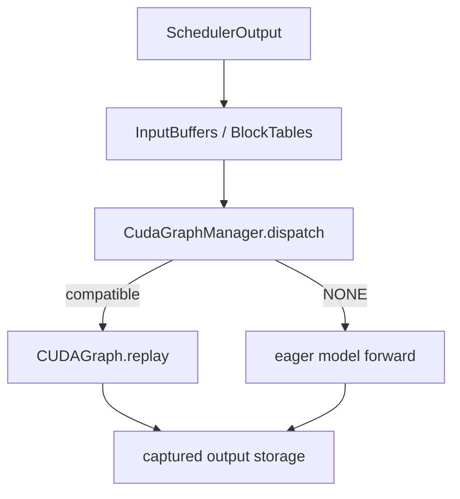
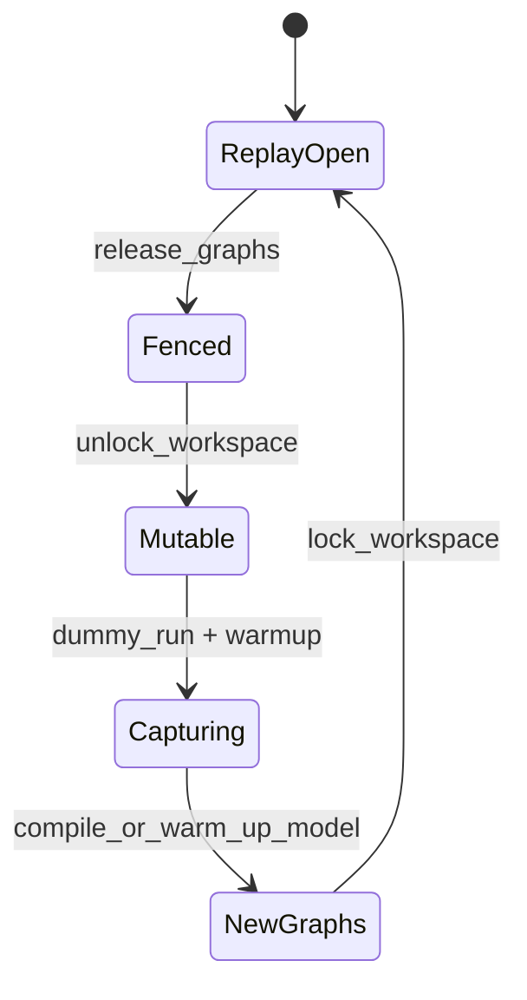

> 本文基于 vLLM 默认分支提交 [`13881005`](https://github.com/vllm-project/vllm/commit/138810056093301f4881050fcf2b1786939da387) 分析。直接相关的新变化是已合入的 [PR #59160](https://github.com/vllm-project/vllm/pull/59160) / [`5e56e9af`](https://github.com/vllm-project/vllm/commit/5e56e9af2aaede223a5f723cba88fa35999ac813)，它为 Sleep Mode 增加可原址恢复的 cuMem CUDA Graph pool。文中的 `GraphGenerationToken`、`RecaptureFinal` 是建议协议，不是当前已有类型。

## 本篇在课程路线中的位置

上一章把 process terminal、allocator 显存回落和 device/context generation 失效拆成三种证据。本章继续追问一个更具体的问题：旧 worker 或旧执行域已经 reset，缓存中的 CUDA Graph 能不能继续 replay？

课程位置是：

`ResetWitness → graph/address generation → preserve-or-recapture → replay admission`。

答案不是一律“不能”，而是分成两种协议：

1. **原址恢复**：同一进程、同一 graph executable，capture 时引用的 virtual address 和 pool 内容被完整恢复，可以保留 graph；
2. **重新绑定**：workspace、KV、communicator 或 context 发生换代，旧 graph 必须先变得不可达，再用新地址 warmup/capture，最后重新开放 replay。

## 前置知识回顾

CUDA Graph 不是“看到同一 shape 就重新执行 Python”。capture 会把一段 GPU work 固化为可 replay 的 executable，其中包含 kernel launch、stream dependency，以及执行时会访问的 device address。vLLM 为降低 launch overhead，先把请求数据复制到长期存在的 `InputBuffers`、`BlockTables`、workspace 和 KV cache，再让 graph 固定读取这些地址。

因此必须区分三件事：

- `BatchExecutionDescriptor`：这批请求在 shape、模式和 LoRA 等方面能否使用某个 graph；
- address binding：graph 内的指针是否仍指向本轮应使用的 storage；
- execution generation：graph、stream、communicator、context 与这些 storage 是否仍属于同一代执行域。

第一项成立，不能推出后两项成立。

## 本篇要回答的核心问题

1. vLLM 的 graph dispatch key 实际证明了什么，又没有证明什么？
2. Elastic EP 为什么必须 release/recapture，而 Sleep Mode 为什么可以恢复后直接 replay？
3. 怎样建立一个同时覆盖“地址改变”和“地址未变但 generation 已换”的 Golden？

## 组件在全局架构中的位置

MRV2 的正常路径可以压缩成四层：



[`InputBuffers`](https://github.com/vllm-project/vllm/blob/138810056093301f4881050fcf2b1786939da387/vllm/v1/worker/gpu/input_batch.py#L19-L35) 预分配 `input_ids: int32[max_num_tokens]`、`positions: int64[max_num_tokens]`、`query_start_loc: int32[max_num_reqs+1]` 等张量；[`BlockTables`](https://github.com/vllm-project/vllm/blob/138810056093301f4881050fcf2b1786939da387/vllm/v1/worker/gpu/block_table.py#L60-L90) 持有 `int32[max_num_reqs,max_num_blocks]` 的 block table 与 `int64[num_groups,max_num_tokens]` 的 slot mapping。这些稳定 storage 是 graph 能反复 replay 的物理前提。

## 完整调用链

### 正常 capture 与 replay

[`GPUModelRunner.capture_model`](https://github.com/vllm-project/vllm/blob/138810056093301f4881050fcf2b1786939da387/vllm/v1/worker/gpu/model_runner.py#L1034-L1109) 调 `CudaGraphManager.capture`，先 warmup，再为候选 descriptor 建 graph。capture 完成后调用 `lock_workspace()`；代码注释直接说明，capture 后若 workspace resize，会释放 graph 已固化的 static buffer。

运行时，`GPUModelRunner` 根据请求数、token 数、uniform decode、LoRA 和 microbatch 等状态构造 descriptor；[`CudaGraphManager.dispatch`](https://github.com/vllm-project/vllm/blob/138810056093301f4881050fcf2b1786939da387/vllm/v1/worker/gpu/cudagraph_utils.py#L517-L547) 只在 `_graphs_captured` 为真且候选兼容时返回 graph key，否则返回 `CUDAGraphMode.NONE`。FULL graph 最终进入 [`run_fullgraph`](https://github.com/vllm-project/vllm/blob/138810056093301f4881050fcf2b1786939da387/vllm/v1/worker/gpu/cudagraph_utils.py#L549-L562)，同步 offloader 后直接 `self.graphs[desc].replay()`。

旧版 wrapper 路径把关系写得更直白。[`CUDAGraphWrapper`](https://github.com/vllm-project/vllm/blob/138810056093301f4881050fcf2b1786939da387/vllm/compilation/cuda_graph.py#L145-L207) 会“blindly trust” forward context 给出的 mode 与 key；它不拥有 persistent input buffer，而是假定外部保证地址稳定。capture 时保存 `data_ptr()`，但 replay 的地址比较只在 DEBUG logger 开启时执行；生产语义不是每步动态检查地址。

### 地址改变：Elastic EP 的 recapture fence

Elastic EP 可能扩大 MoE workspace。当前代码明确认为这会让 captured graph 持有 stale data pointer。[`CudaGraphManager.release_graphs`](https://github.com/vllm-project/vllm/blob/138810056093301f4881050fcf2b1786939da387/vllm/v1/worker/gpu/cudagraph_utils.py#L395-L405) 清空 `graphs`，把 `_graphs_captured` 设为 `False`，并清 breakable graph；候选 descriptor 保留，供后续重新 capture。

[`ElasticEPScalingExecutor.warm_and_capture`](https://github.com/vllm-project/vllm/blob/138810056093301f4881050fcf2b1786939da387/vllm/distributed/elastic_ep/elastic_execute.py#L702-L732) 的顺序是：



这里最重要的不是某个函数名，而是提交顺序：**先让旧 graph 不可调度，再允许地址变化；新 graph 捕获完成并重新锁定地址之后，才恢复 replay。** `_release_cuda_graphs()` 还会 reset compiler wrapper、GC、device synchronize 和 empty cache；它不是一个单纯的 Python dict 清空。

### 地址保持：Sleep Mode 的原址恢复

最新合入的 [`capture_pool`](https://github.com/vllm-project/vllm/blob/138810056093301f4881050fcf2b1786939da387/vllm/compilation/cudagraph_pool.py) 提供另一条路径。启用 `sleep_mode_offload_cudagraph` 后，capture allocation 被路由到标记为 `cudagraph` 的 cuMem pool；sleep 把 pool 内容备份到 CPU，wake 再映射回原 virtual address。graph executable 保留，因此无需 recapture。

这不是“reset 后碰巧地址相同”。它的前置条件更强：同一 worker/context 中，allocator 维护原 address→allocation identity，graph pool 内容也被备份恢复；分布式 graph 还要求 communicator 保持或按支持的 suspend/resume 协议恢复。若只是进程重启后 malloc 恰好返回同一个十六进制地址，仍然存在 ABA，不能沿用旧 graph。

## 关键类型、字段和状态生命周期

[`BatchExecutionDescriptor`](https://github.com/vllm-project/vllm/blob/138810056093301f4881050fcf2b1786939da387/vllm/v1/worker/gpu/cudagraph_utils.py#L65-L80) 包含：

| 字段 | 证明的兼容性 | 不证明的事情 |
| --- | --- | --- |
| `cg_mode` | FULL/PIECEWISE 执行形态 | graph/context 仍有效 |
| `num_tokens`、`num_reqs` | padding 后 batch shape | input/KV/workspace 地址未变 |
| `uniform_token_count`、`max_query_len` | decode/prefill 语义可兼容 | captured metadata storage 未换代 |
| `num_active_loras` | 已捕获的 LoRA case 可覆盖 | LoRA weight/storage generation |
| `num_ubatches` | microbatch 拓扑一致 | stream/communicator generation |

graph 对象的真实生命周期则是：候选 descriptor 初始化 → warmup/capture → 放入 `graphs[desc]` → 多次 replay → 因 workspace/compile state 改变而 release，或随同原址可恢复 pool 暂停/恢复。这里缺少一个显式、可审计的 generation 字段；安全主要由对象生命周期、workspace lock 和特定控制流保证。

## 逐函数源码解读

### `CudaGraphManager.capture`

[`capture`](https://github.com/vllm-project/vllm/blob/138810056093301f4881050fcf2b1786939da387/vllm/v1/worker/gpu/cudagraph_utils.py#L417-L509) 对每个 descriptor 先执行 eager warmup，再创建 `torch.cuda.CUDAGraph`。它通过 `capture_pool(...)` 选择普通 global pool 或可 offload 的 cuMem pool，并在 capture 前后处理 offloader stream dependency。FULL graph 被存入 `graphs[desc]`，最后整体把 `_graphs_captured` 设为真。

### `release_graphs` 与 `lock_workspace`

`release_graphs()` 是 admission fence：`dispatch()` 检查 `_graphs_captured`，因此清理后会落到 eager/NONE，而不会命中旧图。`lock_workspace()` 是 address fence：它禁止增长和创建新的 persistent resource。两者缺一不可；只 lock 不清旧图，无法换地址；只清图不 lock，新 capture 后地址仍可能再次漂移。

### profiling 的 throwaway graph

[`profile_cudagraph_memory`](https://github.com/vllm-project/vllm/blob/138810056093301f4881050fcf2b1786939da387/vllm/v1/worker/gpu/cudagraph_utils.py#L871-L975) 是一个很强的反例证据：它先用 minimal KV 与 throwaway pool 捕获，只为测内存，然后明确清掉所有 wrapper graph，并重建真实 KV 后重新 capture。源码说明 FULL graph 会 bake in KV pointer；若 replay profiling state，可能 use-after-free。相同 descriptor 显然不能挽救错误的 backing storage。

## 具体示例与 shape/状态演算

设 TP=1，FULL decode 一次处理 8 个请求，每个请求 1 token：

- descriptor：`FULL, num_tokens=8, num_reqs=8, uniform_token_count=1`；
- `input_ids = int32[8]`，占 32 B，capture view 首地址记为 `I17`；
- `positions = int64[8]`，占 64 B，首地址 `P17`；
- 单 KV group 的 `slot_mapping = int64[8]`，占 64 B，首地址 `S17`；
- workspace 首地址 `W17`，KV base 记为 `K17`；
- graph generation 为 `g17`。

第一次 capture 得到：

```text
Graph(g17, desc=8×1) -> {I17, P17, S17, W17, K17, stream17, comm17}
```

随后有三种情况：

| 场景 | 变化 | 正确 verdict |
| --- | --- | --- |
| 普通下一步 decode | 只改 buffer 内容，地址和执行域不变 | replay |
| Sleep Mode 原址恢复 | graph pool 与 virtual mappings 原址恢复，context/graph 保留 | replay，先完成 wake barrier |
| Elastic EP 扩容 | workspace 变为 `W18`，可能还有新 communicator | release → eager/warmup → recapture |
| worker/context reset | 所有对象换代；即使 VA 又等于 `W17` | 旧 graph 永不 replay |

最后一行解释了为什么仅比较 `data_ptr()` 不够：`W18 == W17` 只说明数值相等，不说明 allocation、context 与 communicator identity 相同。建议的最小 token 应近似为：

```text
GraphGenerationToken = (
  worker_attempt, device, context_generation,
  model_generation, graph_pool_generation,
  communicator_generation, descriptor,
  address_fingerprint
)
```

replay 需要 token 全部匹配；如果系统能提供“同一 context 内原址保存并恢复”的强 witness，可以保持 generation。否则 generation 变化必须 fail closed。

## 为什么这样设计及替代方案

### 当前设计：稳定 buffer + 预捕获 ladder

收益是热路径只做 descriptor dispatch 和 replay，地址检查不进入每步生产开销。代价是初始化复杂、capture 占显存且通常需要 5–20 秒；任何可能重分配 workspace/KV 的特性都必须接入 graph 生命周期。

### 每次 replay 校验所有地址

它能发现显式 `data_ptr()` 漂移，但不能识别“相同 VA、不同 allocation/context”的 ABA，也难覆盖 graph 内部间接引用的 workspace、KV、communicator buffer。适合 DEBUG，不足以成为 recovery protocol。

### reset 后长期 eager

最简单且安全：generation 变化立刻关闭 graph，服务以 eager 恢复。但 decode launch overhead 回来，吞吐与延迟会退化。它适合作为 recapture 期间的可用性策略。

### blue/green graph registry

用新 buffer 和新 generation 后台 capture，完成后原子切换 registry，可缩短停顿；代价是 capture 期同时保留两套 graph/pool/KV/workspace，显存峰值和跨 rank 协调显著增加。

## 性能、并发、正确性与边界条件

- **延迟**：保留 graph 的 Sleep Mode 避免 5–20 秒 recapture；但文档记录 custom all-reduce 需要额外 capture copy，batch size 1 decode 约有 3% 延迟成本。这是特定实现测得值，不应外推到所有模型。
- **显存/Host 内存**：cuMem graph pool 可在 sleep 时释放 GPU 映射，但需要 pinned host backup；blue/green 则增加 GPU 峰值。
- **并发**：`release_graphs()` 必须发生在任何 workspace mutation 前，并阻断新 replay；否则可能一边 replay 旧图，一边释放/增长 backing storage。
- **分布式**：TP/PP graph 可能包含 collective。单 rank recapture 完成不代表整组可 admission；所有参与 rank 的 graph、communicator generation 必须一致。
- **graphability**：descriptor ladder 解决动态 batch shape，不解决动态 storage identity。更多 capture case 会扩大覆盖率，也会增加 capture 时间和 graph memory。
- **失败方式**：capture 中途失败时不能把半套 registry 标为 ready；wake 只恢复部分 tag 时，也不能在所需 weights/KV/graph/comm 未齐前 replay。

## 测试证据与未覆盖风险

**测试事实：**

1. [`test_capture_model_locks_workspace_after_capture`](https://github.com/vllm-project/vllm/blob/138810056093301f4881050fcf2b1786939da387/tests/v1/worker/test_gpu_model_runner_v2.py#L282-L334) 明确把“workspace resize 会释放 captured graph baked-in buffer”作为测试前提，并验证真实 capture 后必须 lock；无 graph 或 profile-only 不 lock。
2. [`test_profile_cudagraph_memory_clears_captured_graphs`](https://github.com/vllm-project/vllm/blob/138810056093301f4881050fcf2b1786939da387/tests/v1/worker/test_gpu_model_runner_v2_cudagraph_profiling.py#L246-L276) 验证 profiling graph 被丢弃，真实 KV 初始化后必须重捕获。
3. [`test_cudagraph_pool_sleep`](https://github.com/vllm-project/vllm/blob/138810056093301f4881050fcf2b1786939da387/tests/basic_correctness/memory/cumem/test_cumem.py#L428-L480) 对 level 1/2 验证 graph-pool pointer mapping 原址恢复后 replay 数值正确。
4. [`test_sleep_cudagraph_pool`](https://github.com/vllm-project/vllm/blob/138810056093301f4881050fcf2b1786939da387/tests/basic_correctness/memory/sleep_mode/test_sleep_mode.py#L213-L276) 覆盖 FULL、PIECEWISE、breakable，以及 TP=2 custom all-reduce，并比较 sleep 前后 greedy 文本。

**仍未覆盖：**

- Elastic EP 在 `release → workspace grow → recapture` 每个边界注入 crash，确认永不 replay 旧图；
- 同一个 VA 被新 allocation 复用的 ABA negative test；
- TP 某 rank recapture 失败、另一 rank ready 时的 group admission fence；
- context/communicator 真正重建后的旧 graph replay 必须被拒绝；
- sleep/wake 过程中 graph pool、weights、KV、communicator 只恢复一部分的组合矩阵；
- production 模式下 wrapper 地址漂移的 fail-closed 行为。当前 wrapper 的 address assert 只在 DEBUG 生效。

## 与前后章节的连接

上一章的 `ResetWitness` 现在可以细化为两类：

- `PRESERVED_IN_PLACE`：没有换 context generation，并证明 graph/address/communicator state 原址恢复；
- `INVALIDATED`：旧 generation 已不可执行，必须发布新 generation 的 recapture final。

下一章将继续处理 recapture 不是瞬时动作的问题：某些 descriptor 成功、某些失败，或 TP ranks 完成度不一致时，怎样用 per-key manifest 和 group commit 原子开放 replay。

## 本篇结论

1. `BatchExecutionDescriptor` 是 shape/模式兼容 key，不是 graph lifetime 证书。
2. graph replay 依赖稳定的 input、KV、workspace、pool、stream/communicator 与 context generation；地址数值相等也不能消除 ABA。
3. vLLM 已有两种正确方向：Elastic EP 对地址变化执行 release/recapture fence；Sleep Mode 用 cuMem 原址备份恢复保留 graph。
4. 安全顺序是 `close admission → invalidate/release → mutate/rebind → warmup/capture → lock → atomic reopen`。
5. 当前实现依赖进程内对象生命周期与专项控制流，尚无统一 `GraphGenerationToken/RecaptureFinal` 供 reset recovery、跨 rank 和 crash replay 使用。

## 知识债

- 可持久化的 graph/context/pool/communicator generation；
- 完整 address fingerprint 与间接 storage inventory；
- per-descriptor recapture manifest、失败回滚和 atomic publish；
- TP/PP group-wide recapture barrier；
- ABA、partial wake、partial-rank 与 crash-at-every-boundary Golden；
- eager fallback 的 SLO、recapture backpressure 与双 registry 显存预算。

## 三个理解检查问题

1. 为什么 `num_tokens=8`、`num_reqs=8` 完全相同，仍不能证明 reset 后可以 replay 旧 graph？
2. Sleep Mode 的“原址恢复”比“新进程恰好分配到相同地址”多了哪些关键保证？
3. Elastic EP 为什么必须先 `release_graphs()` 再 `unlock_workspace()`，顺序反过来会出现什么 race？

## 下一章

**Recapture 只成功一半怎么办——Per-key Manifest、TP Group Commit 与 Eager Fallback SLO。**

## 课程账本增量

- 日期：2026-10-05
- 章节：第 47 章
- 源码基线：`138810056093301f4881050fcf2b1786939da387`
- 直接相关变更：PR #59160 / `5e56e9af`
- 新确认不变量：descriptor 只证明执行形状；replay 必须同时拥有 graph lifetime、address identity 与 execution generation 证据。
- 新代码事实：Elastic EP 地址变化走 release/recapture；Sleep Mode 可选 cuMem graph pool 原址恢复后保留 replay。
- 新测试事实：workspace lock、profiling graph 丢弃、level 1/2 graph-pool 原址恢复、FULL/PIECEWISE/breakable/TP=2 sleep replay 已有覆盖。
- 下一章：per-key recapture manifest 与跨 rank atomic admission。
