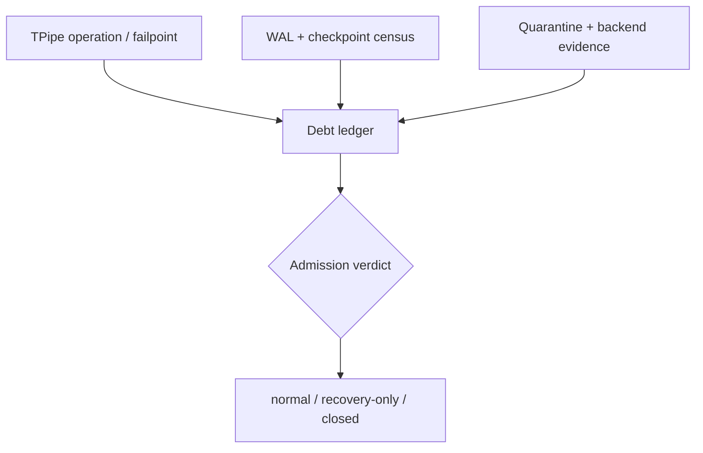
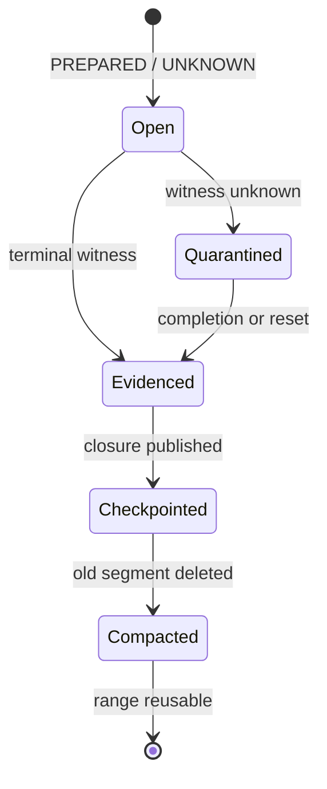

## 本篇在 PTO 课程路线中的位置

第 56 章把 checkpoint 定义成 WAL 删除证书：只有它完整吸收 canonical pipe state、未决 operation、quarantine 与 backend witness，sealed segment 才能删除。本篇只研究 checkpoint **长期追不上**时的活性边界：磁盘还剩一点空间、FIFO 也还有空 slot，为什么仍必须拒绝普通 `TPUSH`？什么工作还能放行？

课程位置是：`recovery closure → recovery debt census → vector admission verdict → recovery-only drain`。

分析基于 pto-isa 默认分支 [`15a9e0a0`](https://github.com/hw-native-sys/pto-isa/commit/15a9e0a0845955f5d7a409a7f4d1609a263b5d25)，并核对同步 PR [#339](https://github.com/hw-native-sys/pto-isa/pull/339) 与直接相关的 CPU 双向 FIFO 修复 [`8e0f3124`](https://github.com/hw-native-sys/pto-isa/commit/8e0f3124a51c151206725336bbbb5383c0cc5e0b)。当前公开代码没有 WAL、checkpoint、recovery-debt ledger、quarantine admission 或 backend recovery queue；本文把这些名字标为**建议设计**，不把推导写成已实现事实。

## 前置知识

CPU_SIM 的 [`TPipe::SharedState`](https://github.com/hw-native-sys/pto-isa/blob/15a9e0a0845955f5d7a409a7f4d1609a263b5d25/include/pto/cpu/TPush.hpp#L561-L588) 已有一份精确的内存态容量账：`occupied`、`slot_busy[]`、`remaining_consumers[]`、`commit_seq[]`。`DIR_BOTH` 为 C2V、V2C 创建两个独立 `SharedState`，每向各有 `SlotNum` 个逻辑槽位。

第 55–56 章又得到两条恢复不变量：`PREPARED` 只能解释为 `MAY_HAVE_APPLIED`；quarantine 被 checkpoint 吸收只迁移隔离义务，并不授权 backing 复用。因此“正常态还有几个空 slot”和“故障后还能否安全接纳一个新 operation”不是同一个问题。

## 今日 1–2 个核心问题

1. WAL bytes、quarantine bytes、unresolved backend evidence 能否折成一个百分比水位？
2. recovery work 自己也要追加 WAL、写 checkpoint、占临时空间时，怎样保证系统不会在试图自救时耗尽最后资源？

## PTO 全栈中的位置

上游是 `TPUSH/TPOP/TFREE` 与异常退出产生的 `PREPARED/UNKNOWN`；中间层是 runtime owner 持有的 WAL、checkpoint manifest、quarantine registry 和 backend adapter；下游是 allocator、PipeEpoch/graph generation 能否重新开放。

编译器可以告诉 runtime 每次 transaction 的 shape、dtype、方向与静态最大 footprint；只有 runtime owner 知道真实磁盘 headroom、物理 backing、未决 operation 和 backend query 进度，所以 admission authority 不能放在 ISA intrinsic 或 compiler pass 内。

## 概念和精确语义

### Recovery debt 是向量，不是单个分数

建议最少维护四个正交分量：

| 分量 | 精确定义 | 退休条件 |
| --- | --- | --- |
| `D_wal` | 被 checkpoint coverage、unresolved provenance 或 reader lease 钉住的 WAL bytes/segments | closure checkpoint 已发布且 reader 越过 cutoff |
| `D_quarantine` | 因 terminal evidence 不足而禁止复用的 owner-generation-range bytes | 同代 completion、confirmed cancel 或可信 scoped reset |
| `D_evidence` | 尚未取得 authoritative terminal verdict 的 operation 数、最老年龄与 scope | backend adapter 返回同 operation/scope/generation 的终态 |
| `D_compact` | canonical checkpoint 到 WAL tail 的 LSN/bytes 距离及待删 sealed segments | checkpoint、manifest CAS 与幂等 segment deletion 完成 |

它们不可相加成一个“72% debt”：删 WAL 不会释放设备 backing，domain reset 也不会自动让旧 segment 可删，backend query 数很小也可能钉住一个巨大的 range。一个聚合分数会允许“磁盘很空”掩盖 backing 用尽，或让“大量小日志”掩盖唯一的大范围 late-write 风险。

### 两套容量不变量

对可复用 backing，准入必须满足：

\[
B_{active}+B_{quarantine}+B_{new,peak}+B_{failure,peak}+B_{cleanup,reserve}\le B_{physical}
\]

`B_failure,peak` 是新工作失败后可能新增的隔离，不是平均值。对持久存储，必须独立满足：

\[
W_{live}+W_{new,peak}+W_{checkpoint,temp}+W_{manifest,reserve}\le W_{physical}
\]

`W_checkpoint,temp` 不能省略：checkpoint 通常先写 temp、校验、fsync、rename，再发布 manifest；如果普通流量吃掉最后空间，系统可能还有完整 WAL，却再也写不出删除证书。

### 水位只做策略，hard gate 才守安全

high/low watermark 可以触发批量、限流和 hysteresis，但阈值必须来自实测的最大 checkpoint temp、WAL burst、backend query latency 与 cleanup service rate，不能拍脑袋写成 80%/60%。真正的 correctness gate 是上面两个 worst-case 不等式，以及 owner/evidence 完整性。

建议 verdict 至少区分：

~~~text
NORMAL
SHED_NEW(reason, retry_after_revision)
RECOVERY_ONLY(reason, reserved_budget)
FAIL_CLOSED(reason)
~~~

稳定 reason 可包括 `WAL_HEADROOM_EXHAUSTED`、`CHECKPOINT_RESERVE_EXHAUSTED`、`QUARANTINE_HEADROOM_EXHAUSTED`、`EVIDENCE_STALLED`、`READER_PINNED` 与 `OWNER_CONFLICT`。`retry_after_revision` 必须绑定 debt ledger revision；否则无状态 sleep 会制造惊群，也可能错过一次真正的释放。

### “recovery 优先”不等于无条件放行

recovery work 只有满足下列之一才可从 reserve 入场：它能单调减少某个 debt 分量；或它是取得 authoritative terminal evidence 的必要步骤。即便如此，也要先 charge 它的临时峰值。checkpoint 会先增大磁盘占用，backend reset 可能先写 intent/result，compactor 也可能需要 manifest 与目录元数据空间。

因此 `RECOVERY_ONLY` 不是绕过预算，而是使用预留预算。若 `arrival debt rate λ_d ≥ retirement rate μ_d` 持续成立，任何 watermark 都不能稳定系统；必须降低普通 admission、增加 recovery service capacity，或修复永不 terminal 的 backend。水位只能提前暴露不稳定，不能创造吞吐。

## 真实文件、类型、API 或指令逐段解读

### `Producer::allocate/record`：正常容量有明确线性化点

[`allocate()`](https://github.com/hw-native-sys/pto-isa/blob/15a9e0a0845955f5d7a409a7f4d1609a263b5d25/include/pto/cpu/TPush.hpp#L710-L747) 在 mutex 下等待 `occupied < SlotNum`，并要求 producer cursor 指向的具体 slot 同时满足 `slot_busy==0`、`transfer_dirs==None`，随后把它标为 busy。[`record()`](https://github.com/hw-native-sys/pto-isa/blob/15a9e0a0845955f5d7a409a7f4d1609a263b5d25/include/pto/cpu/TPush.hpp#L749-L778) 才设置 direction、consumer count、commit sequence 并增加 `occupied`。

这证明“有空槽”必须是具体槽位事实，而不是只有 `occupied<SlotNum`。但函数等待条件里没有 PipeEpoch、quarantine range、WAL headroom 或 checkpoint reserve；把它直接当 crash-recovery admission 会允许旧 generation 的迟到 action 与新 payload 共址。

### `Consumer::wait/free`：释放会唤醒，但只在进程内成立

[`wait()`](https://github.com/hw-native-sys/pto-isa/blob/15a9e0a0845955f5d7a409a7f4d1609a263b5d25/include/pto/cpu/TPush.hpp#L816-L916) 记录 outstanding `(direction,slot)`；[`free()`](https://github.com/hw-native-sys/pto-isa/blob/15a9e0a0845955f5d7a409a7f4d1609a263b5d25/include/pto/cpu/TPush.hpp#L922-L974) 只有在最后 consumer 释放后才清 claim、direction、commit sequence 和 busy，减少 `occupied`，最后 `notify_all()`。

这是 debt revision 的好原型：状态修改与通知有同一 mutex 顺序。但它没有 durable revision；进程 crash 后 condition variable、pending queue 与 notification 都消失。建议 ledger 必须先 durable 地提交 terminal/quarantine/checkpoint transition，再递增 revision 唤醒 waiter；唤醒本身不是权限证书。

### `reset_for_cpu_sim()`：不能靠清零“偿债”

[`reset_for_cpu_sim()`](https://github.com/hw-native-sys/pto-isa/blob/15a9e0a0845955f5d7a409a7f4d1609a263b5d25/include/pto/cpu/TPush.hpp#L649-L679) 在两向 state 的锁内清空所有 cursor、occupancy、payload 与 claim，再唤醒 waiter。它没有 expected epoch、operation ID 或 backend witness。故障后盲调 reset 会让内存指标归零，却可能删除新 generation payload；`D_evidence` 也不会因此变成零。

## 对象、Tile、Buffer 与恢复对象生命周期

建议 `RecoveryDebtRecord` 在 operation 进入 `PREPARED` 或 backend verdict 变为 `UNKNOWN` 时创建，绑定 `PipeToken`、operation ID、owner-generation-range、WAL provenance 与 evidence key。它不是一个 bool；每个维度独立闭合：

图中 `Checkpointed` 不能跳过 `Evidenced` 来释放 range；相反，checkpoint 可以保存 `Quarantined` 记录并删除旧 WAL，但 record 仍存活，直到可信 evidence 到来。一个对象何时“失效”取决于消费者：compactor 只需 checkpoint coverage；allocator 还需 range terminal；operator/observability 还可能保留审计摘要。

## 端到端调用链或指令链

建议链路如下：

1. `TPUSH/TPOP/TFREE` 或 reset failpoint 产生 durable operation transition；
2. `DebtLedger.refresh()` 联合 WAL tail、canonical checkpoint、quarantine root、reader lease 与 backend query snapshot，生成 immutable revision；
3. `AdmissionController.decide(request_peak, failure_peak, revision)` 逐资源检查 hard gate；
4. `NORMAL` 才进入普通 producer；`RECOVERY_ONLY` 只调度 checkpoint、backend query/reset、registry retire 与 compaction；
5. recovery action 先预占 reserve，再执行并 durable 地提交结果；
6. debt 下降后发布新 revision，waiter 重新计算，不能沿用旧 verdict；
7. terminal evidence、checkpoint coverage、segment deletion 与 range release 各自完成后，record 才最终退休。

这条链要求 decision 与 reserve acquisition 原子化；若先读 census、后无条件提交，多个 producer 都会看到同一份 headroom 并超卖。owner epoch 变化或 ledger revision 不匹配时必须返回 `OWNER_CONFLICT/RETRY_AFTER_REVISION`。

## 具体 shape、Tile 和状态演算

取 `TPipe<7, DIR_BOTH, 1024, 2>`，单 Tile 为 `16×16xf32=1024 B`。逻辑上 C2V、V2C 各两个 slot，共 4096 B entry capacity。以下磁盘数字是**故障注入测试配置**，不是仓库常量：总 durable partition 12 KiB，当前 live WAL 4 KiB，free 8 KiB；写 C42 checkpoint 的 temp 峰值 6 KiB，manifest/目录安全完成预留 2 KiB，下一普通 operation 最坏追加 1 KiB。

磁盘 gate：普通 operation 需要 `6+2+1=9 KiB`，但 free 只有 8 KiB，所以必须 `RECOVERY_ONLY(CHECKPOINT_RESERVE_EXHAUSTED)`；checkpoint recovery 自身恰好使用保留的 8 KiB，发布后可删除 4 KiB 旧 segment。若因为“磁盘还有 66% 空闲”先接收普通请求，最后 1 KiB 可能让 checkpoint 无法完成，系统失去回收路径。

再看 backing：已有一个 epoch41 C2V slot 因 `op7=UNKNOWN` 被 quarantine，charge 1024 B；另有 1024 B active，cleanup reserve 为 1024 B。表面 free 为 `4096-1024-1024=2048 B`，刚好够一次双向 operation 各占一 slot。但若新 operation 失败，最坏还要 quarantine 2048 B，届时 reserve 被吃光。因此 admission 要 charge `B_new,peak+B_failure,peak`，而不是只看当前 allocation；正确 verdict 仍是拒绝普通工作。

两个 verdict 也不能互相抵消：checkpoint 成功能释放磁盘，却不释放 epoch41 的 1024 B backing；backend scoped reset 能释放 backing，但若结果尚未进入 checkpoint，旧 WAL 仍被 provenance 钉住。

## 为什么这样设计及替代方案

**单一 debt score** 实现简单，却假定磁盘、设备内存和 evidence 可互换，会把安全 gate 降成经验策略。**无限排队或无限 spill** 只是延后 ENOSPC/OOM，而且请求本身持续制造 WAL 与 timeout，可能使 `λ_d` 更大。**遇压立刻 reset 并清 registry** 能快速恢复数字，却没有 generation fence，风险是旧 action 污染新 Tile。

向量 hard gate 加 soft watermark 的代价是 schema、census、reason code 和预留记账更复杂；收益是拒绝可解释、恢复路径有预算，且可分别扩容磁盘、backing 或 backend query workers。另一个简单替代是固定大 reserve，维护成本低但浪费容量；它适合早期实现，之后再用真实峰值与 service-rate 数据校准，不能先假设百分比正确。

## 访存、计算、流水、并行和硬件约束

本章控制面不改变 Tile 的 1024 B payload 或 Cube/Vector 计算量，却直接影响并行度：quarantine 降低可复用 slot 数，WAL fsync/checkpoint 占 host I/O，backend query/reset 占控制通道；过早 admission 会让更多 producer 堵在 `cv.wait` 或设备 flag 上，吞吐和尾延迟同时恶化。

硬件映射需要谨慎区分。**代码事实**：CPU_SIM 用 mutex、condition variable 与 Host slot storage；A2/A3/A5 的真实 free/flag/local-FIFO 证据不同。**基于证据的推断**：runtime 可以统一 debt/verdict 外壳，但 `D_evidence` 的终态来源必须由 backend adapter 给出，不能把 CPU `occupied==0` 外推成设备 DMA/flag 已终止。真实的 reset scope、late write 和 graph replay fencing 仍需设备测试。

## 测试证据与未覆盖风险

本次在 `15a9e0a0` 上执行 `python3 tests/run_cpu.py -t tpushpop`，构建通过，`tpushpop` 通过。直接相关测试包括：[`dir_both_full_capacity_and_delayed_free`](https://github.com/hw-native-sys/pto-isa/blob/15a9e0a0845955f5d7a409a7f4d1609a263b5d25/tests/cpu/st/testcase/tpushpop/main.cpp#L1211-L1256) 验证两向各自满两 slot、延迟四次 free 后两向 `occupied==0`；[`dir_both_four_push_pipeline_round_trip`](https://github.com/hw-native-sys/pto-isa/blob/15a9e0a0845955f5d7a409a7f4d1609a263b5d25/tests/cpu/st/testcase/tpushpop/main.cpp#L1258-L1305) 验证两线程 32 次往返；[`dir_both_hook_storage_initializes_and_resets_both_directions`](https://github.com/hw-native-sys/pto-isa/blob/15a9e0a0845955f5d7a409a7f4d1609a263b5d25/tests/cpu/st/testcase/tpushpop/main.cpp#L1307-L1326) 验证双 state 隔离和同步 reset。

这些是**测试事实**：它们证明正常 FIFO 容量、顺序、释放和进程内唤醒。它们没有磁盘、WAL、checkpoint temp、ENOSPC、quarantine budget、backend stall 或 crash/restart，所以不能证明本文建议 admission。

应补的 deterministic Golden 是：磁盘健康而 quarantine exhausted；backing 健康而 checkpoint reserve exhausted；reader lease 钉住最旧 segment；backend query 永不 terminal；recovery action 临时扩容超过 reserve；owner epoch 在 decision/commit 间变化；completion 与 revision wake 并发且无 lost wake；以及 `λ_d>μ_d` 时从 `NORMAL→SHED_NEW→RECOVERY_ONLY→FAIL_CLOSED` 的可重复轨迹。少量 A2/A3/A5 真机测试再校准 late flag/write 与 reset scope。

## 与前后章节的连接

第 47–49 章研究 simpler workspace 的 whole-block quarantine、structured refusal 和 cleanup reserve；那里解决“一个 allocation manager 如何在内存压力下不超卖”。本章复用原则但不重复对象：它把 pto-isa TPipe 的 **durable WAL、range quarantine、backend evidence** 联成跨资源 recovery closure，说明磁盘与 backing 不可互换。

上一章回答“历史何时可删”；本章回答“历史删不动时何时停止制造新历史”。下一章将进入 `RECOVERY_ONLY` 内部：恢复任务也会争用 reserve，必须研究 cleanup queue 的优先级、fairness、取消与 starvation-free drain。

## 本篇结论、知识债、理解检查与下一章

结论只有三条：Recovery debt 必须按 WAL、quarantine、evidence/compaction 分量计量；hard gate 必须 charge 正常峰值、失败扩张与恢复预留；当 debt 到达不可逆水位时，只允许有预算且能推进 authoritative closure 的 recovery work。

知识债仍包括真实 `RecoveryDebtRecord/DebtCensus/AdmissionVerdict` schema、reserve 的原子预占、durable revision/wakeup、service-rate 观测、WAL ENOSPC/torn checkpoint、A2/A3/A5 terminal adapter、graph generation 与 late-action 真机 Golden。

三个理解检查问题：

1. 为什么删除 4 KiB WAL segment 不能让 1024 B quarantined slot 自动回到 free list？
2. 为什么 recovery checkpoint 也必须在 admission 前 charge 临时峰值？
3. 若 `λ_d` 长期大于 `μ_d`，调整 high/low watermark 能否使系统稳定？为什么？

下一章：**Recovery 也会抢资源——Cleanup Queue、Reserved Capacity 与 Starvation-free Drain。**

## 课程账本增量

- 章节：57。
- 源码基线：pto-isa `15a9e0a0`；同步 PR #339 未修改本文 TPipe 路径。
- 新覆盖：`Producer::allocate/record`、`Consumer::wait/free`、`reset_for_cpu_sim()` 与三项 DIR_BOTH 正常回归。
- 新不变量：recovery debt 是资源向量；普通工作必须预付 failure expansion；recovery reserve 不可被普通 admission 消耗；wake 只提示重查 revision，不授予权限；`λ_d≥μ_d` 时必须削减 arrival 或增加 retirement capacity。
- 测试结果：本地 `tpushpop` PASS；未覆盖持久化、压力状态机与设备 terminal。
- 下一章：Recovery-only queue 的调度与 drain 证明。
