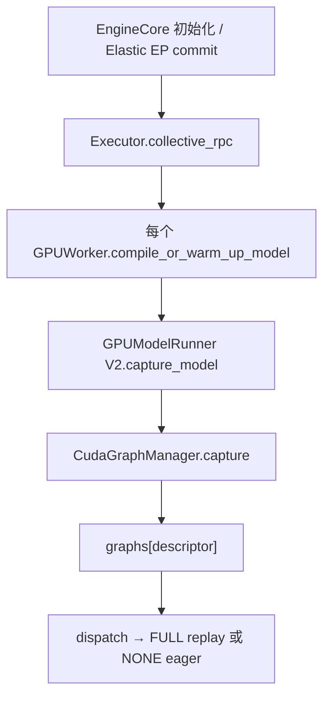
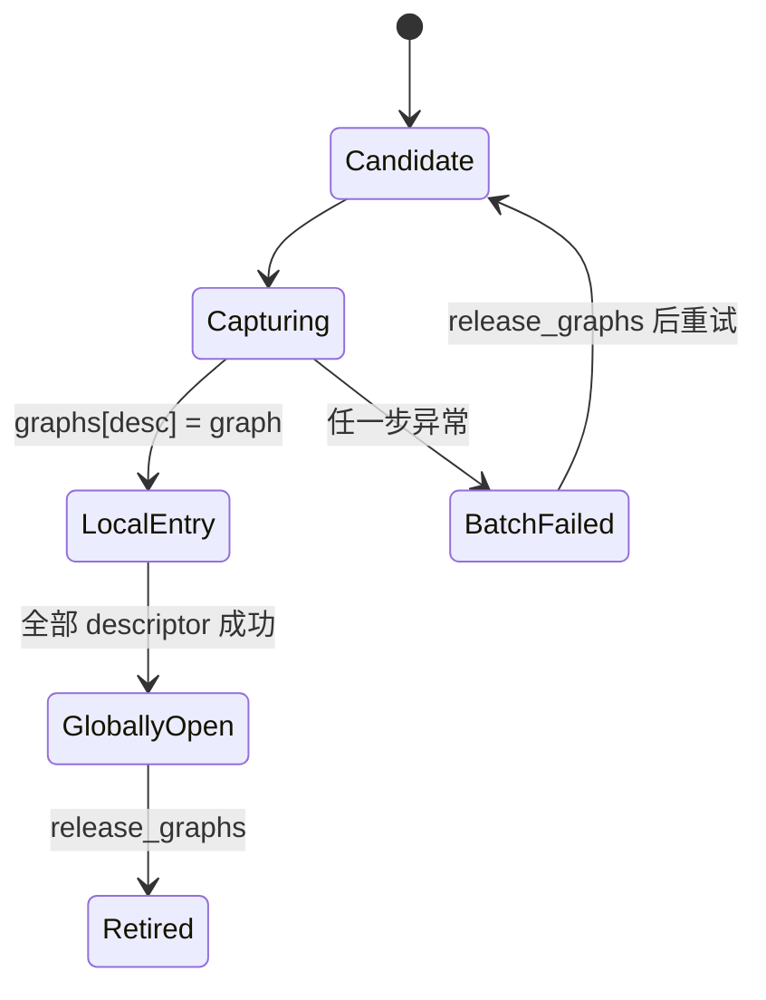

> 源码基线：vLLM [`97bd8c74`](https://github.com/vllm-project/vllm/commit/97bd8c74ebf12c3d847fb59f24966a83bf6f6920)。本文讨论的 Elastic EP + Model Runner V2 主路径来自已合入 [PR #53934](https://github.com/vllm-project/vllm/pull/53934)；前一章涉及的 CUDA Graph pool 生命周期来自 [PR #59160](https://github.com/vllm-project/vllm/pull/59160)。以下严格区分当前代码、测试事实和建议协议。

## 本篇在课程路线中的位置

上一章建立了一个底线：`BatchExecutionDescriptor` 只描述 shape/模式兼容性，不能证明 graph 仍绑定当前 address、workspace 和 execution context。Elastic EP 改变 workspace 时，必须先 `release_graphs()`，再 warmup/recapture，最后恢复 replay。

本篇只回答 recapture 的下一个问题：**若 capture size 8 已成功，size 16 在某个 TP rank 失败，哪些 key 可以重新开放 replay？**

课程位置是：

`GraphGenerationToken → partial recapture → per-key local final → TP group commit → graph/eager admission`

## 前置知识回顾

- FULL graph 把输入、KV、workspace 及通信相关地址固化进 executable；地址代际变化后不能凭 shape 相同继续 replay。
- V2 的 `CudaGraphManager` 维护候选 descriptor、`graphs[descriptor]` 和全局 `_graphs_captured`。
- TP rank 执行同一模型步骤；任何 rank 对 graph/eager 模式认识不一致，都可能令通信序列分叉，而不只是让某张卡慢一点。

## 本篇要回答的核心问题

1. 当前代码遇到“部分 key 已捕获、随后抛异常”时，已经提供了什么安全性，又缺少什么可恢复性？
2. per-key replay 为什么不能只看本 rank 的 `graphs`，而必须成为 TP group 的原子决定？
3. 何时应让已就绪 key 恢复 graph、未就绪 key 走 eager；何时继续使用整批 fail-closed？

## 组件在全局架构中的位置

公开入口不是某个 CUDA API，而是 Engine 初始化或 Elastic EP commit：



源码入口分别是 [`EngineCore._initialize_kv_caches`](https://github.com/vllm-project/vllm/blob/97bd8c74ebf12c3d847fb59f24966a83bf6f6920/vllm/v1/engine/core.py#L320-L357)、[`Executor.compile_or_warm_up_model`](https://github.com/vllm-project/vllm/blob/97bd8c74ebf12c3d847fb59f24966a83bf6f6920/vllm/v1/executor/abstract.py#L126-L141) 和 [`GPUWorker.compile_or_warm_up_model`](https://github.com/vllm-project/vllm/blob/97bd8c74ebf12c3d847fb59f24966a83bf6f6920/vllm/v1/worker/gpu_worker.py#L868-L924)。Elastic EP 则经 [`warm_and_capture`](https://github.com/vllm-project/vllm/blob/97bd8c74ebf12c3d847fb59f24966a83bf6f6920/vllm/distributed/elastic_ep/elastic_execute.py#L702-L732) 先释放旧 graph、解锁 workspace，再执行 dummy run 与 recapture。

## 完整调用链

### 1. 所有 worker 并发开始捕获

`Executor.compile_or_warm_up_model()` 用 `collective_rpc("compile_or_warm_up_model")` fan-out。MP executor 将同一 RPC 广播给 worker，再逐个读取 response MQ；任一 response 非 `SUCCESS` 就抛 `RuntimeError`。见 [`MultiprocExecutor.collective_rpc`](https://github.com/vllm-project/vllm/blob/97bd8c74ebf12c3d847fb59f24966a83bf6f6920/vllm/v1/executor/multiproc_executor.py#L377-L450)。

这里的事实是：调用者能知道“至少一个 worker 失败”，但返回值没有 `descriptor × rank` 的捕获清单，也没有一个在所有 worker 成功后才共同可见的 commit record。

### 2. 单 worker 逐 descriptor 构建 graph

V2 runner 的 [`capture_model`](https://github.com/vllm-project/vllm/blob/97bd8c74ebf12c3d847fb59f24966a83bf6f6920/vllm/v1/worker/gpu/model_runner.py#L1034-L1097) 将持久输入 buffer、block tables、attention groups 和 KV config 交给 manager。manager 按 `PIECEWISE → FULL`、同 mode 内大 shape 优先遍历 descriptor：

```python
for desc in capture_descs:
    forward_fn = create_forward_fn(desc, warmup=True)
    forward_fn(NONE)                 # warmup
    forward_fn = create_forward_fn(desc, warmup=False)
    graph = torch.cuda.CUDAGraph()
    with torch.cuda.graph(graph, ...):
        forward_fn(NONE)
    graphs[desc] = graph             # 当前 key 的本地结果可见

_graphs_captured = True              # 全部循环结束后才开总闸门
```

真实实现见 [`CudaGraphManager.capture`](https://github.com/vllm-project/vllm/blob/97bd8c74ebf12c3d847fb59f24966a83bf6f6920/vllm/v1/worker/gpu/cudagraph_utils.py#L418-L510)。关键顺序是：每个 graph 先写入 `self.graphs`，但 `_graphs_captured` 只在整个 `with` 正常退出后变成 `True`。

### 3. 运行时 dispatch 与 replay

[`dispatch`](https://github.com/vllm-project/vllm/blob/97bd8c74ebf12c3d847fb59f24966a83bf6f6920/vllm/v1/worker/gpu/cudagraph_utils.py#L518-L548) 只有在 `_graphs_captured` 为真时才从候选表返回 FULL/PIECEWISE descriptor，否则返回 `CUDAGraphMode.NONE`。FULL 分支再由 [`run_fullgraph`](https://github.com/vllm-project/vllm/blob/97bd8c74ebf12c3d847fb59f24966a83bf6f6920/vllm/v1/worker/gpu/cudagraph_utils.py#L550-L563) 断言 key 存在并 replay；NONE 则在 model runner 中直接执行原模型。

所以，**单 worker 内的当前发布粒度是“整套 graph”而不是 per-key**。

## 关键类型、字段和状态生命周期

追踪一个 `BatchExecutionDescriptor(size=8, FULL)`：

1. `_init_candidates()` 根据 capture sizes、decode query length、LoRA case 等创建它，放入 `_capture_descs` 与 `_candidates`。
2. `capture()` 先 warmup，再创建 `CUDAGraph`；成功后写入 `graphs[desc]`。
3. 全部 descriptor 成功后 `_graphs_captured=True`，`dispatch()` 才可能选择它。
4. `run_fullgraph()` 消费该对象并 replay。
5. Elastic EP address 变化前调用 `release_graphs()`，清空 `graphs` 并关闭 `_graphs_captured`；descriptor 候选保留，等待下一代 capture。

当前状态可概括为：



注意 `BatchFailed → Candidate` 在当前代码里**不是异常处理自动完成**：`capture()` 只为 ubatch 注册 `abort_pending_run`，没有清空已经写入的 graph。若 size 8 已写入、size 16 失败，同一 manager 直接再次 `capture()`，遇到 size 8 时会触发 `assert desc not in self.graphs`。Elastic EP 的正常入口在每次 `warm_and_capture()` 开头会 `release_graphs()`，因而通常能绕开；但 capture 内部没有一个自洽的 rollback transaction。

## 具体示例与 shape/状态演算

设 TP=2，只捕获两个 FULL decode key，均为每请求 1 token：

| key | `num_reqs` | 关键输入 | 单 rank 可见字节数 |
| --- | ---: | --- | ---: |
| K8 | 8 | `input_ids int32[8]`、`positions int64[8]`、`slot_mapping int64[8]` | 32 + 64 + 64 = 160 B |
| K16 | 16 | 三个 tensor 的长度均翻倍 | 320 B |

这些只是三项显式输入；真实 graph 还绑定 KV、workspace、通信 buffer 等地址。

现在 graph generation 从 `g17` 变成 `g18`：

1. rank 0 捕获 K16、K8 成功；本地 `_graphs_captured=True`。
2. rank 1 捕获 K16 成功，捕获 K8 时 OOM/通信 capture 失败；本地 `graphs` 已含 K16，但总闸门仍是 false。
3. MP parent 收到某个 worker 的失败 response，整次 RPC 抛异常。

若只看本地状态，rank 0 会认为 K8/K16 都可 replay，rank 1 则全部 eager；这会使 TP collective 的执行序列分叉。安全 verdict 必须是：

| key | rank 0 | rank 1 | TP group verdict |
| --- | --- | --- | --- |
| K16 | LOCAL_READY | LOCAL_READY | 可提交 `GROUP_READY` |
| K8 | LOCAL_READY | FAILED | 保持 EAGER / FAILED |

但“可以”不等于“当前实现已经这样做”。当前 V2 manager 没有 per-key group commit；失败路径由上层 fail closed。已合入 PR #53934 也明确把 commit retry/recovery 排除在范围外，并说明当时完整 4-GPU Elastic EP 验证受环境限制尚未完成。

## 为什么这样设计及替代方案

### 当前整批总闸门

优点是正确性简单：同一 worker 不会 replay 半套结果，运行期查一次布尔值即可。缺点是一个冷门大 key 失败，会让已经成功且常用的 K8 也失去 graph；同时局部 entry 没有 rollback，重试依赖外层先 release。

### 建议：per-key manifest + TP group commit

这不是当前代码，而是从不变量推导的最小协议：

```text
GraphKeyFinal = {
  worker_attempt, graph_generation, descriptor_hash,
  address_fingerprint, status, failure_reason
}

GraphManifest = {
  graph_generation, expected_descriptors, expected_ranks,
  rank_finals, committed_keys, manifest_hash
}
```

只有同一个 `(graph_generation, descriptor_hash, address_fingerprint)` 在 `expected_ranks` 全部 `LOCAL_READY`，控制面才能原子发布该 key 的 `GROUP_READY`。expected set 必须在开始前冻结；否则失败 rank 少报一个 key，就会把“缺失”误当成“不需要”。迟到的 `g17` final 不能改变 `g18` manifest。

### Blue/green graph registry

可继续用 `g17` 服务，后台建 `g18`，完成后切换；它能缩短 eager 窗口。但 Elastic EP 已改变 workspace 或通信拓扑时，旧 graph 的地址前提已失效，不能拿 availability 覆盖 correctness。只有旧 generation 的地址和 execution domain 仍有效时才成立。

### 永久 eager

reset 后不 recapture 最简单，也消除 graph 代际协议；代价是持续失去 launch-overhead 优化。它适合低频请求或 recapture 反复失败时的熔断，不应被伪装成正常恢复成功。

## 性能、并发、正确性与边界条件

per-key 提交并不天然更优。令：

\[
T_{recover}(k)=T_{fence}+T_{capture}(k)+T_{group\_commit}(k)
\]

只有当某个已就绪 key 提前开放所节省的 eager 代价，大于 manifest/collective 开销、保留局部 graph 的显存和额外测试成本时，才值得实现。源码没有提供可通用套用的毫秒阈值，因此本文不虚构 SLO；正确做法是记录 key 命中率、`capture_seconds`、fallback 窗口、eager/graph TPOT 和局部 graph HBM，再决定 strict batch 或 per-key policy。

运行时已有一条可复用原则：[`sync_cudagraph_and_dp_padding`](https://github.com/vllm-project/vllm/blob/97bd8c74ebf12c3d847fb59f24966a83bf6f6920/vllm/v1/worker/gpu/dp_utils.py#L44-L210) 会收集各 DP rank 的 mode；任何 rank 选择 NONE，则所有 rank eager。它证明“分布式执行模式必须达成共识”，但协调的是**运行期 DP batch shape/mode**，不是 recapture 时的 TP graph readiness，不能直接充当 group commit。

## 测试证据与未覆盖风险

当前直接测试能证明：

- [`test_capture_replay_bypass_logic`](https://github.com/vllm-project/vllm/blob/97bd8c74ebf12c3d847fb59f24966a83bf6f6920/tests/v1/cudagraph/test_cudagraph_dispatch.py#L417-L483) 验证 key 首次触发 capture、第二次 replay、未知 key eager，以及关闭 capture 后不能偷偷捕获新 key。它针对 legacy wrapper，不验证 V2 manager 的 partial rollback。
- [`test_microbatched_graph_needs_every_rank_to_reach_the_split`](https://github.com/vllm-project/vllm/blob/97bd8c74ebf12c3d847fb59f24966a83bf6f6920/tests/v1/worker/test_gpu_ubatch_slicing.py#L949-L971) 验证 DP 中任一 rank 无法满足 captured split 时，全组退回 eager。
- [`test_capture_model_locks_workspace_after_capture`](https://github.com/vllm-project/vllm/blob/97bd8c74ebf12c3d847fb59f24966a83bf6f6920/tests/v1/worker/test_gpu_model_runner_v2.py#L283-L302) 证明成功 capture 后必须锁住 workspace，避免 graph 指向的 buffer 被 resize/free。
- profiling 测试只验证 capture 抛错时 teardown 仍执行；并不检查真实 manager 中已插入的 per-key graph 是否回滚。

仍缺的 Golden：

1. 第二个 descriptor 注入异常，验证 `_graphs_captured` 仍 false、局部 entry 被清理且同实例可重试。
2. TP=2 中 rank 1 仅让 K8 失败，验证 rank 0 的 K8 永不单独 replay，而 K16 是否开放取决于明确 policy。
3. expected key/rank 缺失、同 descriptor 不同 address fingerprint、旧 generation late final 都必须 fail closed。
4. capture collective 中一 rank 抛错、另一 rank 阻塞时，验证 deadline、worker containment 与下一代恢复，而不只是 Python exception。
5. 用真实 workload 测量 graph HBM、fallback 时长、eager TPOT 与恢复 p99，形成可执行 SLO。

## 与前后章节的连接

前一章回答“旧 graph 为什么失效”；本章回答“新 graph 何时算发布”。两者合起来才得到完整 replay admission：

`旧 generation fenced → 新地址 inventory 固定 → per-rank capture → per-key group commit → replay`

下一章将处理 group commit 自己的失败：manifest 已 PREPARED，但 owner 在发布 CAS 前后崩溃时，怎样查询 rank-local graph、拒绝旧 generation final，并让 recovery 收敛而不是重复 capture 或误开 replay。

## 本篇结论

1. 当前 V2 manager 用 `_graphs_captured` 实现 worker 内整批 fail-closed；部分成功的 graph 不会被 `dispatch()` 使用。
2. capture 异常不会自动 rollback `graphs`，直接重试可能撞上已存在 descriptor；外层 release 是当前隐含恢复前提。
3. `collective_rpc` 能传播 worker 失败，却不是 `rank × key` 原子提交协议；本地 ready 不能授权 TP replay。
4. per-key availability 的安全单位是 group-committed key，不是某 worker 的 dict entry；失败 key 应 eager 或保持 admission closed。
5. 是否值得 per-key publish 必须由真实命中率、fallback 窗口、HBM 和 TPOT 数据决定，不能凭“部分成功别浪费”这一句直觉。

### 三个理解检查问题

1. 为什么 `_graphs_captured=False` 能阻止局部 graph replay，却不能保证同一 manager 可安全重试？
2. DP 运行时的“任一 rank eager → 全组 eager”为何不能直接证明 TP recapture 已原子提交？
3. 若 K16 在所有 rank ready、K8 仅一个 rank ready，最小 manifest 需要哪些字段才能只开放 K16？

## 知识债与下一章

新增知识债：真实 `GraphKeyFinal/GraphManifest` schema、expected-set freeze、capture rollback、TP/PP group CAS、rank hang deadline、stale-final fence、per-key graph HBM 计量、eager fallback SLO 和 partial-recapture 真机测试。

下一章：**Manifest 写了一半，Owner 崩了——Recapture WAL、Idempotent Publish 与 Stale-final Reconciliation。**

## 课程账本增量

- 第 48 章；源码基线 `97bd8c74`。
- 新覆盖 `Executor.compile_or_warm_up_model`、`MultiprocExecutor.collective_rpc`、`CudaGraphManager.capture/dispatch/release_graphs`、`GPUModelRunner V2.capture_model`、`dispatch_cg_and_sync_dp`。
- 新确认不变量：worker-local graph entry、worker batch-open、TP group-ready 是三层不同证据；任何跨 rank replay admission 都必须绑定相同 graph generation、descriptor 与 address fingerprint。
- 测试缺口：partial descriptor failure、partial rank failure、同实例 retry、stale final、capture collective hang 与 fallback SLO。

