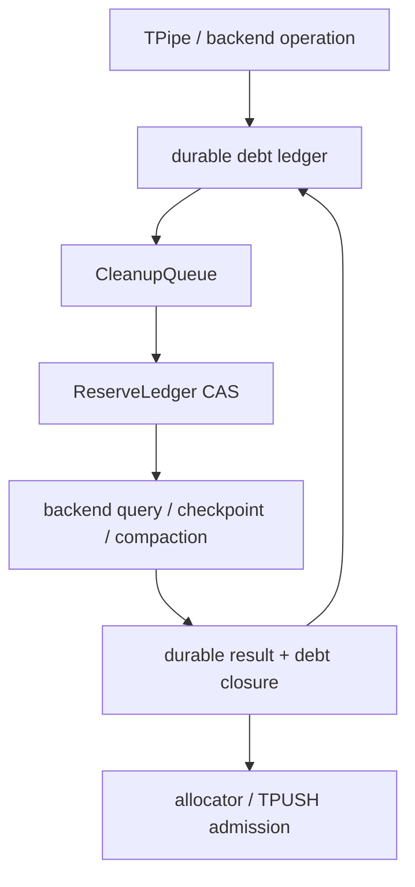
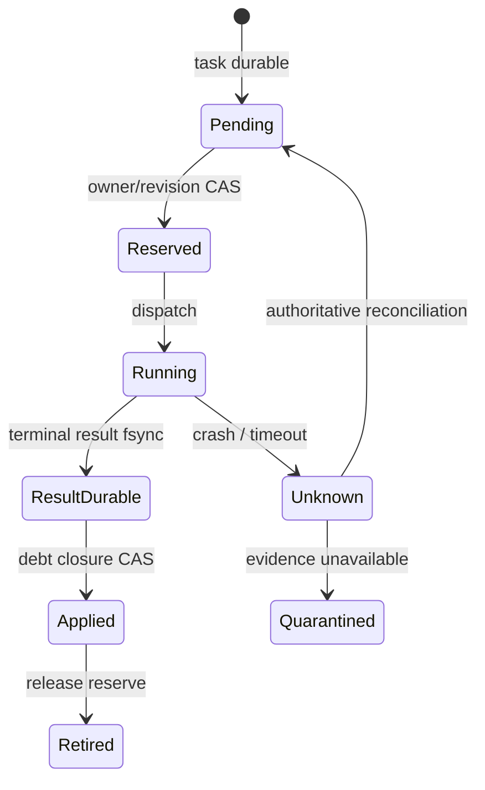

> 源码基线：pto-isa [`15a9e0a0`](https://github.com/hw-native-sys/pto-isa/commit/15a9e0a0845955f5d7a409a7f4d1609a263b5d25)。默认分支相对上一章没有新提交；最新合入 [PR #339](https://github.com/hw-native-sys/pto-isa/pull/339) 是 GitCode 同步，未改变本文直接引用的 CPU TPipe 路径。本文严格区分**当前代码事实**、**测试事实**与**建议恢复协议**；`CleanupTask` 等类型尚不存在于仓库。

## 本篇在 PTO 课程路线中的位置

第 57 章建立了 recovery debt 向量和 `NORMAL / SHED_NEW / RECOVERY_ONLY / FAIL_CLOSED` 准入状态，却留下一个关键问题：进入 `RECOVERY_ONLY` 后，checkpoint、backend query、reset、registry retire 与 compaction 仍会争抢 WAL 空间、临时磁盘、backend slot 和 quarantined backing。若只写“恢复优先”，小任务可能挤掉大 checkpoint；若严格 FIFO，队头又可能因前置证据缺失而堵死所有后继。

今天只回答这一个边界：**如何让 cleanup queue 在有限 reserve 内保持安全、可推进，并在持续小任务到来时仍保证老的大任务最终获得资源？**

课程位置：

`recovery debt → RECOVERY_ONLY → atomic reserve → protected head claim → priority inheritance → owner-fenced drain`

## 前置知识

- `DIR_BOTH` 的 C2V/V2C 是两条独立 FIFO；`16×16xf32`、`SlotNum=2` 时，两向逻辑 entry capacity 合计 4096 B。
- `TPUSH` 的 publish、`TPOP` 的 borrow 与 `TFREE` 的 release 是不同线性化点；slot 只有 final free 后才能复用。
- WAL、quarantine backing、terminal evidence 与 compaction lag 不能互换；普通工作和 recovery work 都必须按峰值预付资源。
- `notify_all()` 只提示条件可能变化，不授予资源所有权；crash recovery 还需要 durable revision 与 owner epoch。

## 今日两个核心问题

1. recovery task 如何在执行前原子预占多维峰值，避免“为了回收空间，先把最后空间耗尽”？
2. 如何同时避免 strict FIFO 的 head-of-line blocking 和 shortest-job-first 的大任务饥饿，并阻止旧 owner 的 cleanup 在换代后继续生效？

## PTO 全栈中的位置

本章仍以 pto-isa 的 CPU_SIM `TPipe` 为真实语义锚点，但 cleanup queue 位于 runtime recovery control plane：上游读取 durable debt ledger，下游调用 backend evidence/reset、checkpoint 与 compaction，最终才把可复用 slot 交还给 `TPUSH`。



这里的 `CleanupQueue`、`ReserveLedger` 是建议组件，不是当前 pto-isa API。当前仓库提供的是最底层 slot ownership 事实，不能凭空外推 durable scheduler 已存在。

## 概念和精确语义

### Reserve 是向量，不是一个“恢复线程数”

为每个任务 `t` 定义峰值需求：

\[
p(t)=(W_{temp}, W_{wal}, B_{backing}, Q_{backend}, \ldots)
\]

受保护 reserve 为 `R`，已被运行任务占用为 `U`。任务只有在逐维满足

\[
U+p(t)\le R
\]

时才能从 `PENDING` 原子转成 `RESERVED`。先读 free、后无条件 dispatch 会让并发 worker 对同一份 headroom 重复消费；因此 decision 与 reservation 必须通过同一 `owner_epoch + ledger_revision` 的 CAS 完成。

### 无饥饿不是“大家轮流跑”

建议使用**保护性头部声明**：队列中最老的 runnable task 为 `h`。年轻任务 `s` 只有在

\[
U+p(s)+p(h)\le R
\]

时才能 backfill。换言之，年轻任务只能使用不妨碍 `h` 的 slack。若 `h` 被前置任务 `d` 阻塞，`d` 继承 `h` 的 ticket；这使 backend evidence 不会被源源不断的新 compaction 排在后面。

在三个明确假设下可得到 starvation-free：运行任务最终终止或进入可恢复的 `UNKNOWN`；依赖图无环且有限；每个可运行任务的峰值 `p(t)` 本身不超过 `R`。若任一假设不成立，调度器应返回稳定 reason，而不是声称还能 drain。

### Owner lease 不是物理取消

建议最小对象为：

```text
CleanupTask = {
  task_id, owner_epoch, enqueue_revision, kind,
  prerequisites, peak_resource_vector,
  affected_operation_or_range, expected_debt_delta,
  payload_hash, status
}

CleanupLease = {
  task_id, owner_epoch, reserve_generation,
  reserved_resource_vector
}
```

`owner_epoch` 改变后，旧 lease 无权提交 ledger transition 或释放 backing；但这不证明旧 backend action 已停止。旧 `RUNNING` 必须恢复为 `MAY_HAVE_APPLIED`，由新 owner 查询同 operation/domain/generation 的 authoritative result，或继续 quarantine。

## 真实文件、类型、API 或指令逐段解读

### `SharedState`：具体 slot 才是所有权单位

[`TPipe::SharedState`](https://github.com/hw-native-sys/pto-isa/blob/15a9e0a0845955f5d7a409a7f4d1609a263b5d25/include/pto/cpu/TPush.hpp#L561-L588) 维护 `occupied`、`transfer_dirs`、`commit_seq`、consumer claims 与 `slot_busy`。全局计数小于容量仍不够；producer cursor 指向的具体 slot 也必须空闲。

[`Producer::allocate`](https://github.com/hw-native-sys/pto-isa/blob/15a9e0a0845955f5d7a409a7f4d1609a263b5d25/include/pto/cpu/TPush.hpp#L710-L746) 在 mutex 下同时检查 `occupied`、`slot_busy` 与 direction；[`record`](https://github.com/hw-native-sys/pto-isa/blob/15a9e0a0845955f5d7a409a7f4d1609a263b5d25/include/pto/cpu/TPush.hpp#L749-L776) 才写 `commit_seq`、推进 producer cursor 并增加 `occupied`。这正是 cleanup reserve 应复制的原则：**挑中任务不是获得容量，CAS 记账后才获得 lease。**

### `wait/free`：FIFO 公平不等于 cleanup 公平

[`Consumer::wait`](https://github.com/hw-native-sys/pto-isa/blob/15a9e0a0845955f5d7a409a7f4d1609a263b5d25/include/pto/cpu/TPush.hpp#L823-L920) 以最小 `commit_seq` 选择相应方向最老的已提交 slot，并把 `(direction,slot)` 放入 consumer 的 outstanding 队列。[`free`](https://github.com/hw-native-sys/pto-isa/blob/15a9e0a0845955f5d7a409a7f4d1609a263b5d25/include/pto/cpu/TPush.hpp#L924-L970) 仅在最后 consumer 释放后清 `commit_seq/slot_busy`、减少 `occupied` 并 `notify_all()`。

这证明正常数据 FIFO 的释放闭环，但不提供 cleanup fairness：`std::condition_variable` 不保证按等待年龄唤醒，现有对象也没有 task peak、依赖、owner epoch 或 durable ticket。`commit_seq` 可启发 queue ticket，却不能直接复用为跨 crash identity。

### `reset_for_cpu_sim`：清空不是恢复成功

[`reset_for_cpu_sim()`](https://github.com/hw-native-sys/pto-isa/blob/15a9e0a0845955f5d7a409a7f4d1609a263b5d25/include/pto/cpu/TPush.hpp#L649-L679) 在锁内清两向 cursor、payload、claim 与 occupancy，再唤醒 waiter。它没有 expected epoch 或 backend witness；因此不能在 recovery queue 中被当成“高优先级万能清理”。旧 device work 可能仍在运行，盲清只会把软件数字变为零。

## 对象、Tile、Buffer 与 CleanupTask 生命周期

建议任务状态机如下：



资源 lease 从 `Reserved` 一直持有到 `Applied`，而不是 action 返回就释放。若 action 后、result fsync 前崩溃，恢复者不能假定未执行；若 result 已 durable、debt closure 前崩溃，只能幂等补 `Applied`，不能再执行一次非幂等 reset。

## 端到端调用链或指令链

1. `TPUSH/TPOP/TFREE` 或 backend failpoint 形成 operation/debt record。
2. 当前 owner 在 revision `r` 持久化 `CleanupTask`；依赖和峰值向量在此冻结。
3. scheduler 找到最老 runnable head；被阻塞时将 ticket 继承给必要前置任务。
4. `ReserveLedger.compare_exchange(owner_epoch,r,U→U+p(t))` 成功后生成 `CleanupLease`。
5. worker 执行 backend query/reset、checkpoint 或 compaction；输出先持久化为同 task/payload hash 的 result。
6. owner CAS 应用 debt delta；range 只有在 terminal evidence 与 checkpoint/quarantine closure 都满足后才回 allocator。
7. reserve 释放并发布新 ledger revision；普通 admission 与其他 cleanup waiter 都必须重新计算。

## 具体 shape、Tile 和状态演算

仍取 `TPipe<7, DIR_BOTH, 1024, 2>`：单 Tile 为 `16×16xf32=1024 B`，C2V/V2C 各两个 slot。以下是**故障测试配置**，不是仓库常量：cleanup reserve 为 `(disk=10 KiB, backend_query=1, backing=1 KiB)`。

队列已有最老 checkpoint `C42`，峰值 `(8 KiB,0,0)`，但依赖 `E7` 确认 epoch41 的 slot0 是否 terminal；`E7` 峰值 `(1 KiB,1,0)`。之后持续到来小 compaction `K1,K2,...`，每个峰值 `(2 KiB,0,0)`。

1. `C42` 暂不可运行，`E7` 继承 `C42` 的最老 ticket，先预占 1 KiB 与唯一 backend query slot。
2. `E7` 得到同 operation/generation 的 completion，并持久化 result；它关闭 evidence debt，但 slot0 只有在 terminal result 原子应用到 allocation/quarantine registry 后才可复用。checkpoint 负责把这份 closure 吸收到 canonical state，避免旧 WAL 永久钉住。
3. `C42` 变为 runnable，先获得 8 KiB reservation。年轻 `K1` 只有在 `U+2+8≤10 KiB` 时可 backfill，因此最多占用剩余 2 KiB；`K2` 不能继续挤入。
4. `C42` 写 temp、fsync、发布 manifest；随后 compaction 才能删除旧 4 KiB segment。即使 `K1` 持续被新的小任务替换，受保护的 8 KiB 也不会被侵占。

若 owner epoch 在步骤 2 后从 7 变为 8，旧 owner 的 `E7 result` 即使迟到也不能直接 apply；新 owner 核对 task ID、payload hash 与 backend operation key。若物理 action 仍未知，1024 B slot 继续 quarantine。软件 lease 换代不能取消真实迟到写。

## 为什么这样设计及替代方案

| 方案 | 优点 | 失败方式 |
| --- | --- | --- |
| strict FIFO | 简单、年龄直观 | 队头缺 evidence 时所有可推进任务停摆 |
| shortest-job-first | 短期释放快 | 连续小任务可永久饿死大 checkpoint |
| 固定 query/checkpoint/compaction 三条 lane | 隔离直观 | 跨 lane 依赖复杂，空闲容量不能安全借用 |
| recovery 无条件 bypass | 似乎“总能自救” | 多个恢复任务可共同耗尽 temp/WAL/backing |
| 保护性 head claim + 依赖继承 | work-conserving 且可证明老任务推进 | 需要峰值模型、durable ticket、CAS 与依赖图校验 |

本方案不承诺平均等待最短，而是优先保证安全与可推进。具体是否允许 slack backfill，应由队列等待、reserve 利用率、checkpoint service time 与 debt retirement rate 验证；源码没有通用时间或百分比阈值，本文不虚构。

## 访存、计算、流水、并行和硬件约束

cleanup control plane 不改变 1024 B Tile 的计算语义，却决定可用并行度：quarantine 减少可复用 slot，checkpoint 占 host I/O，backend query/reset 占控制通道。应分别记录 `queue_wait`、`service_time`、`oldest_blocking_revision`、各维 reserve utilization、实际 peak 与 debt delta；不能只看“cleanup TPS”。

硬件边界仍需保守：CPU_SIM 的 mutex、condition variable、具体 slot 和 `notify_all()` 是代码事实；A2/A3 credit、A5 local FIFO、SDMA/设备 completion 是不同 native evidence。本文的统一 queue 只能统一任务身份、预算与 verdict，不能把 CPU `occupied==0` 当成设备已停止写入。

## 测试证据与未覆盖风险

本次在 `15a9e0a0` 执行 `python3 tests/run_cpu.py -t tpushpop`：构建通过，`tpushpop` 通过。现有直接证据包括：

- [`dir_both_full_capacity_and_delayed_free`](https://github.com/hw-native-sys/pto-isa/blob/15a9e0a0845955f5d7a409a7f4d1609a263b5d25/tests/cpu/st/testcase/tpushpop/main.cpp#L1211-L1256)：两向各占满两 slot，四次延迟 `TFREE` 后两向 `occupied==0`。
- [`dir_both_four_push_pipeline_round_trip`](https://github.com/hw-native-sys/pto-isa/blob/15a9e0a0845955f5d7a409a7f4d1609a263b5d25/tests/cpu/st/testcase/tpushpop/main.cpp#L1258-L1305)：Cube/Vector 两线程完成 32 次双向往返，验证容量、方向 FIFO 和并发唤醒。
- [`dir_both_hook_storage_initializes_and_resets_both_directions`](https://github.com/hw-native-sys/pto-isa/blob/15a9e0a0845955f5d7a409a7f4d1609a263b5d25/tests/cpu/st/testcase/tpushpop/main.cpp#L1307-L1326)：两向 state 独立并可同步 reset。

这些测试不含 CleanupQueue、WAL、multi-resource reserve、owner takeover 或饥饿轨迹。应新增 deterministic Golden：老 checkpoint 被 evidence 阻塞时的 priority inheritance；连续小任务到达而大任务仍在有限完成数后启动；两 worker 争同 reserve 只能一方 CAS 成功；action 后 crash 恢复为 `MAY_HAVE_APPLIED`；result durable 后 crash 只补 apply；owner 换代拒绝旧 lease/stale result；dependency cycle 与 `p(t)>R` 稳定 fail closed；以及 A2/A3/A5 少量真机 late-action 校准。

## 与前后章节的连接

第 55–57 章依次建立 recoverable action、可删历史和 fail-closed admission。本章补上“谁先消费 recovery reserve”：

`durable intent → debt vector → recovery-only gate → fair cleanup lease → durable result → closure/compaction`

下一章将处理任务完成后的交接：durable revision 怎样避免 notify-before-wait 与 crash 间隙造成 lost wake，系统又如何从 `RECOVERY_ONLY` 原子回到 `NORMAL`。

## 本篇结论、知识债、三个理解检查问题和下一章

结论：recovery task 不能绕过预算；多维 reserve 必须与 owner/revision 原子预占；最老 runnable task 的保护性声明加 prerequisite priority inheritance，才能同时避免 HOL blocking 与大任务饥饿；owner lease 失效只撤销提交权限，不等于物理 action 已取消。

知识债仍包括真实 `CleanupTask/CleanupLease/ReserveLedger` schema、dependency cycle verifier、task peak 校准、durable ticket/priority inheritance、跨进程 worker、owner takeover reconciliation、backend adapter、reserve leak repair、revision no-lost-wake，以及磁盘 ENOSPC、control-plane partition 与 late-write 真机 Golden。

三个理解检查问题：

1. 为什么 `U+p(s)≤R` 仍不足以允许年轻小任务 backfill？
2. checkpoint 因 backend evidence 缺失而阻塞时，为什么应该让 evidence task 继承 checkpoint ticket，而不是继续 strict FIFO？
3. owner epoch 换代后，为什么旧 cleanup lease 失效仍不能立即释放其 quarantined backing？

下一章：**Cleanup 做完，谁来唤醒——Durable Revision、No-lost-wake 与 Recovery-to-Normal Handoff。**

## 课程账本增量

- 章节：58；源码基线 `15a9e0a0`。
- 新覆盖：`SharedState`、`Producer::allocate/record`、`Consumer::wait/free`、`reset_for_cpu_sim()`、`commit_seq` 与 `notify_all()` 的 ownership/fairness 边界。
- 新建议对象：`CleanupTask`、`CleanupLease`、`ReserveLedger`、protected head claim 与 dependency priority inheritance。
- 新不变量：recovery 也必须预付多维 peak；reservation 与 verdict 同 revision CAS；年轻任务只能使用不侵占 oldest runnable head 的 slack；前置任务继承被阻塞 head 的 ticket；旧 owner 失去 apply/free 权但物理 action 保持 unknown。
- 测试结果：`tpushpop` 构建及测试 PASS；cleanup fairness、durability、takeover 与设备 late-action 尚未覆盖。
- 下一章：durable revision、无丢失唤醒与 recovery-to-normal 交接。
