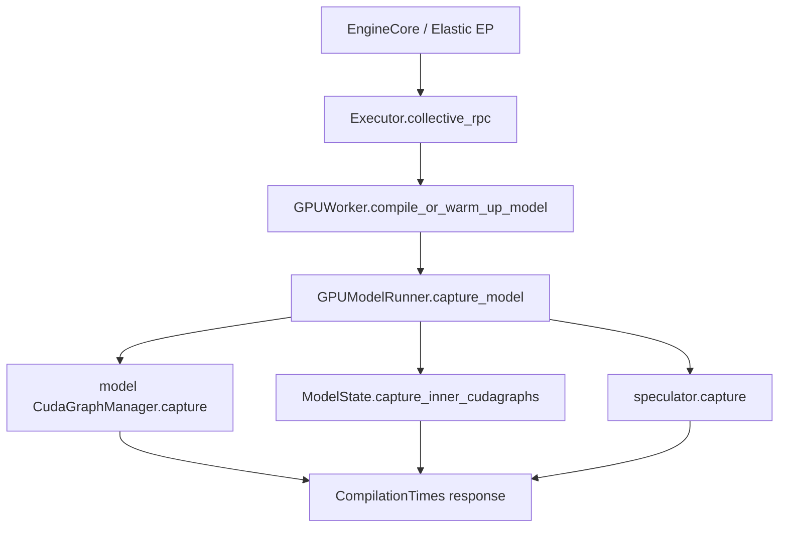
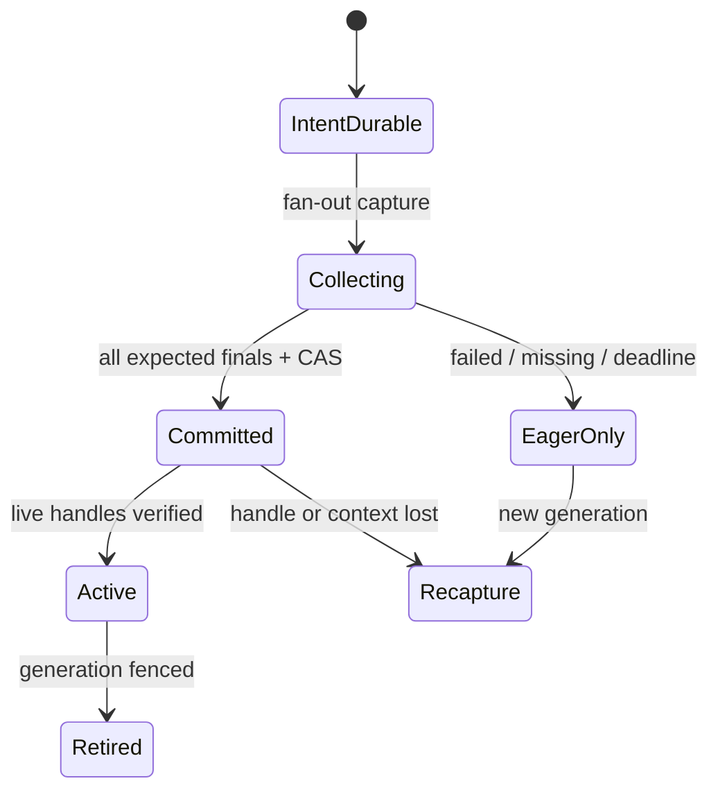

> 源码基线：vLLM [`db6e3cd8`](https://github.com/vllm-project/vllm/commit/db6e3cd8c4f9b84c39fe3c44fab0b1d3117f758b)。相对上一章前进 69 个提交；`CudaGraphManager` 与 MP `collective_rpc` 的关键语义未变。直接相关变化是已合入 [PR #59532](https://github.com/vllm-project/vllm/pull/59532)（commit [`eb2901b7`](https://github.com/vllm-project/vllm/commit/eb2901b7356dd6782b7418ac071d3cf56ce018f7)）新增 inner decoder-replay CUDA Graph。本文把“当前代码事实”“测试事实”和“建议协议”明确分开。

## 本篇在课程路线中的位置

上一章把 replay admission 拆成三层：worker-local graph、worker 批次开放、TP group-ready，并提出 per-key manifest。今天只追问一个边界：**manifest 已记录部分 rank/key，协调者在 commit 前后崩溃，恢复者凭什么判断“继续发布、重新捕获还是保持 eager”？**

课程位置：

`per-key manifest → durable intent/final → group CAS → live-handle validation → stale-final reconciliation`

## 前置知识回顾

- CUDA Graph executable 绑定静态地址、捕获上下文和进程内对象；shape 相同不等于可复用。
- `graphs[desc]` 是本地结果，`_graphs_captured` 是 worker 内总闸门；它们都不是跨 rank 持久证据。
- TP rank 必须对 graph/eager 模式达成一致，否则 collective 序列可能分叉。
- `generation` fence 解决“旧结果不能污染新一代”，但若没有可恢复的提交记录，owner 重启仍不知道旧操作停在哪一步。

## 本篇要回答的核心问题

1. WAL 应持久化什么，为什么不能把 CUDA graph handle 当作可恢复对象？
2. owner 在 `GROUP_READY` 前后崩溃时，怎样让重放幂等收敛？
3. 新 owner 如何处理旧 rank 的迟到 final，并区分“final 丢了”和“graph 也没了”？

## 组件在全局架构中的位置

当前公开链路从 Engine 初始化或 Elastic EP recapture 开始，最终只向 parent 返回 `CompilationTimes`：



事实依据是 [`EngineCore`](https://github.com/vllm-project/vllm/blob/db6e3cd8c4f9b84c39fe3c44fab0b1d3117f758b/vllm/v1/engine/core.py#L355-L357)、[`Executor.compile_or_warm_up_model`](https://github.com/vllm-project/vllm/blob/db6e3cd8c4f9b84c39fe3c44fab0b1d3117f758b/vllm/v1/executor/abstract.py#L139-L154)、[`GPUWorker`](https://github.com/vllm-project/vllm/blob/db6e3cd8c4f9b84c39fe3c44fab0b1d3117f758b/vllm/v1/worker/gpu_worker.py#L869-L925) 与 [`GPUModelRunner.capture_model`](https://github.com/vllm-project/vllm/blob/db6e3cd8c4f9b84c39fe3c44fab0b1d3117f758b/vllm/v1/worker/gpu/model_runner.py#L1033-L1113)。当前返回值只有语言模型/encoder 编译时间，没有 `rank × graph key` final，也没有 WAL 或 group commit。

## 完整调用链

### 1. parent 广播，但不形成事务日志

[`MultiprocExecutor.collective_rpc`](https://github.com/vllm-project/vllm/blob/db6e3cd8c4f9b84c39fe3c44fab0b1d3117f758b/vllm/v1/executor/multiproc_executor.py#L377-L450) 先 enqueue 一条广播，再按 response MQ 顺序读取 worker 结果。worker 失败或超时会抛异常，但 parent 没有 durable `capture_id`，也无法区分：

- worker 尚未开始；
- graph 已创建但 response 丢失；
- 某些 key 已创建、后续 key 失败；
- response 已到 parent 内存、parent 在持久化前崩溃。

### 2. 单 worker 依次创建多种 graph domain

主模型 manager 在 [`capture`](https://github.com/vllm-project/vllm/blob/db6e3cd8c4f9b84c39fe3c44fab0b1d3117f758b/vllm/v1/worker/gpu/cudagraph_utils.py#L418-L510) 中按 descriptor 捕获；FULL graph 成功后立即写入 `graphs[desc]`，全部循环结束才置 `_graphs_captured=True`。异常仍不会自动 rollback 已写 entry。

最新 main 又在主模型 capture 之后调用 `model_state.capture_inner_cudagraphs()`，再捕获 speculator。DeepSeek-V4.1 的 [`DecoderReplayCudaGraphManager`](https://github.com/vllm-project/vllm/blob/db6e3cd8c4f9b84c39fe3c44fab0b1d3117f758b/vllm/models/deepseek_v41/nvidia/decoder_replay_cudagraph.py#L22-L101) 继承同一 manager，以 padded replay token 数为 key，并持有七类静态输入 buffer。于是一次逻辑 recapture 至少可能包含：

`MODEL/FULL(K8)`、`MODEL/PIECEWISE(K)`、`INNER_REPLAY/PW(R128)`、`SPECULATOR/K`

这也是今天新增的不变量：**manifest key 必须包含 graph domain，不能只存 `BatchExecutionDescriptor`。**

### 3. release 能清内存，不能回答 crash 历史

[`release_graphs()`](https://github.com/vllm-project/vllm/blob/db6e3cd8c4f9b84c39fe3c44fab0b1d3117f758b/vllm/v1/worker/gpu/cudagraph_utils.py#L396-L406) 清空本地 dict、关闭总闸门，并清理 breakable graph。Elastic EP 的 [`warm_and_capture`](https://github.com/vllm-project/vllm/blob/db6e3cd8c4f9b84c39fe3c44fab0b1d3117f758b/vllm/distributed/elastic_ep/elastic_execute.py#L702-L731) 先 release，再 unlock workspace、dummy run、recapture。它适合进程内正常控制流；owner 已崩溃时，新 owner 仍缺少“旧 capture 是否可能发布过”的持久证据。

## 关键类型、字段和状态生命周期

以下是建议协议，不是当前 vLLM 类型：

```text
RecaptureIntent = {
  capture_id, owner_epoch, graph_generation,
  expected_ranks, expected_keys,
  worker_attempts, address_fingerprints
}

RankKeyFinal = {
  capture_id, owner_epoch, graph_generation,
  rank, worker_attempt, graph_domain, descriptor_hash,
  address_fingerprint, status, live_handle_token, payload_hash
}

GroupKeyCommit = {
  capture_id, graph_generation, graph_key,
  final_hashes, verdict, commit_version
}
```

`live_handle_token` 只引用 worker 当前进程中的 registry entry；WAL 不序列化 `torch.cuda.CUDAGraph`。进程退出、CUDA context reset 或静态地址换代后，这个 token 必须失效。WAL 能恢复“曾经提交了什么决定”，不能复活已经消失的 executable。

状态机应是：



关键顺序是 `intent durable → capture → final durable → group CAS → live activation`。只有 `Committed + live handle verified` 才能进入 `Active`。

## 逐函数源码解读

### `CudaGraphManager.capture`

它把 GPU object 写入本地 `graphs`，但没有 operation id、generation 或 durable final。`_graphs_captured=True` 只是当前 Python 对象的内存状态；进程崩溃后归零，不能作为 recovery oracle。

### `GPUModelRunner.capture_model`

当前顺序是 encoder → model graphs → inner graphs → speculator → adaptive-verification profile → KV connector reset → workspace lock。任何相邻步骤之间都可能形成“前一 domain 已成功、后一 domain 未知”的 crash boundary。PR #59532 的测试更新证明 inner graph 已进入真实 capture 链，却没有把返回值扩展为 per-domain manifest。

### `collective_rpc`

它保证调用者看到 worker error，却不是 two-phase commit：读取前几个 MQ 后 parent 崩溃，其他 reply 是否已生成无法从新进程判断；同一次 RPC 也没有可幂等重放的 stable id。因此不能用“RPC 返回过 success”替代 durable publish。

## 具体示例与状态演算

设 TP=2，generation `g42`，`capture_id=c91`，只看两个 key：

| key | domain | shape/静态输入 | expected ranks |
| --- | --- | --- | --- |
| K8 | `MODEL/FULL` | decode 8 tokens；`input_ids int32[8]` 等 | {0,1} |
| R128 | `INNER_REPLAY/PW` | 7 个静态 buffer 的首 128 行 | {0,1} |

执行轨迹：

1. owner epoch 7 先持久化 `INTENT(c91,g42,{K8,R128},{r0,r1})`。
2. r0 为 K8、R128 写入 `LOCAL_READY`；r1 为 K8 写入 `LOCAL_READY`。
3. owner 已收齐 K8 两份 final，但在 `GROUP_READY(K8)` CAS 前崩溃；r1 的 R128 仍未知。
4. 新 owner 通过 durable CAS 取得 epoch 8。它重放 WAL：K8 final 完整，因此可幂等提交 K8；R128 不能因 r0 成功而开放。
5. 发布 K8 前还要向 r0/r1 查询 `live_handle_token`：若 worker attempt、CUDA context 与 address fingerprint 都匹配，可激活；任一 worker 已重启，则旧 handle 不存在，K8 也必须进入新 generation recapture。
6. 旧 r1 随后送达 `(epoch=7,g42,R128,READY)`。它与当前 epoch/generation 不匹配，只能记为 `STALE_FINAL`，不能补齐新 manifest。

若 owner 恰在 `GROUP_READY(K8)` 已持久化、内存 registry 尚未打开时崩溃，epoch 8 重放相同 commit：同 operation id、同 payload hash 是幂等成功；同 id、不同 final hashes 是协议冲突，必须 fail closed。

## 为什么这样设计及替代方案

### 建议：per-key WAL + CAS publish

优点是 K8 和 R128 独立收敛，owner crash 后不会重复发布，也不必因一个冷门 key 永久牺牲全部 graph。成本是 WAL、live-registry query、跨 rank final 与更多状态测试。WAL 位于 capture/recovery 控制面，不进入每次 replay 热路径；但每 key 单独 sync 可能放大启动时间，应测量后决定 group commit 批量。

### 整批 blue/green registry

先完整构建 green，成功后一次切换，协议更简单、rollback 清晰；代价是捕获期同时保留两代 graph pool，峰值显存更高。若旧 workspace 已失效，blue 也不能继续服务。

### crash 后全部 eager 并放弃恢复

最容易证明安全，适合反复失败时熔断；代价是持续失去 graph launch 优势。是否接受必须由 graph/eager 的 TPOT、P99 与 key 命中率决定，源码没有通用阈值，本文不虚构数字。

### 只依赖 worker 查询

查询能发现 live handle，却无法证明 owner 是否已对外发布过旧 commit；WAL 能恢复决定，却无法证明 handle 仍活着。二者必须同时存在，不能互相替代。

## 性能、并发、正确性与边界条件

- **正确性**：replay admission 的充分条件是 durable commit 与 live-handle witness 同时成立；只有一项都不够。
- **并发**：expected ranks/keys 必须在 intent 中冻结。owner takeover 后，旧 epoch 无权提交 final 或执行 release/publish。
- **地址安全**：payload hash 应覆盖 graph domain、descriptor、worker attempt、CUDA context generation 与静态地址 fingerprint；不能只 hash shape。
- **内存**：未提交 local graphs 仍占 graph pool。recovery 需要按 key/domain 统计 HBM，并在 deadline 后 release 或 quarantine，不能让 orphan capture 无限积累。
- **延迟**：优化目标不是“WAL 越细越好”，而是最小化 `recapture + commit + eager fallback` 对 SLA 的损失。应分别测量 capture 时长、WAL sync、live query、fallback TPOT/P99 和 graph pool 峰值。

## 测试证据与未覆盖风险

当前测试直接证明的范围：

- [`test_replay_graph_matches_eager`](https://github.com/vllm-project/vllm/blob/db6e3cd8c4f9b84c39fe3c44fab0b1d3117f758b/tests/models/test_deepseek_v41_decoder_replay_layers.py#L128-L160) 在 CUDA 上捕获 R4，运行 3 行输入并与 eager 逐元素比较，验证 inner graph 的数值与 padding/row gather 语义。
- [`test_dp_ranks_pad_to_one_replay_graph`](https://github.com/vllm-project/vllm/blob/db6e3cd8c4f9b84c39fe3c44fab0b1d3117f758b/tests/models/test_deepseek_v41_replay_batch.py#L264-L276) 验证 DP rank 以最大 replay batch 300 选择 R512，所有 rank metadata 都填 512；它验证运行期 mode/shape 共识，不验证 durable commit。
- [`test_capture_model_locks_workspace_after_capture`](https://github.com/vllm-project/vllm/blob/db6e3cd8c4f9b84c39fe3c44fab0b1d3117f758b/tests/v1/worker/test_gpu_model_runner_v2.py#L285-L304) 验证真实 capture 返回前锁 workspace。
- profiling 测试验证临时 capture 后会清理 piecewise/breakable entries，但没有 owner crash、部分 rank final 或 stale generation。

最小 crash golden 应在五个确定性 failpoint 注入进程退出：`intent fsync 后`、`local final 持久化后`、`group CAS 后`、`live activation 后`、`response 前`。oracle 必须验证：相同 payload 重放只提交一次；冲突 payload fail closed；旧 epoch final 被拒；worker/context 丢失时 durable commit 不能授权 replay；K8 committed 不会误带 R128；未提交 graph 最终释放。仍需少量真实 TP+CUDA E2E 校准 live-handle/query 与迟到 device work，纯 mock 不能覆盖这些事实。

## 与前后章节的连接

第 47 章建立 `GraphGenerationToken`，第 48 章建立 per-key group commit，本章补上 crash recovery：

`地址代际 → key/domain manifest → WAL/CAS → live-handle witness → replay`

下一章将处理 recovery 一直等不到某个 rank 的情况：deadline 到期后谁有权把 key 固化为 eager-only，迟到 rank 如何被 fence，以及未提交 graph pool 如何有界回收。

## 本篇结论

1. 当前 vLLM 的 capture success、`_graphs_captured` 与 RPC success 都是进程内事实，不是可恢复的 group commit。
2. 最新 inner graph 支持使一次 capture 包含多个 graph domain；manifest key 必须是 `(domain, descriptor)`。
3. WAL 持久化 intent、final 与 commit，不持久化 CUDA graph object；worker/context 消失后只能 recapture。
4. 幂等 publish 要求 stable `capture_id` 与 payload hash；同 id 异 payload 必须 fail closed。
5. 迟到 final 必须同时通过 owner epoch、graph generation、worker attempt 和 address fingerprint fence。

### 三个理解检查问题

1. 为什么 WAL 已有 `GROUP_READY(K8)`，worker 重启后仍不能直接恢复 replay？
2. owner 在 CAS 后、内存 activation 前崩溃时，哪两类证据允许新 owner 幂等完成发布？
3. 为什么 PR #59532 引入 inner graph 后，单独以 `BatchExecutionDescriptor` 为 manifest key 会产生歧义？

## 知识债与下一章

仍欠真实 `RecaptureIntent/RankKeyFinal/GroupKeyCommit` schema、WAL frame/CRC/fsync、TP/PP transport、live graph registry/query、outer/inner/speculator rollback、owner election、per-domain HBM 计量、rank hang deadline、graph pool quarantine 与真机 crash golden。

下一章：**Rank 一直不回怎么办——Recapture Deadline、Eager-only Final 与 Orphan Graph 回收。**

## 课程账本增量

- 第 49 章；源码基线 `db6e3cd8`。
- 新覆盖 `ModelState.capture_inner_cudagraphs`、`DecoderReplayCudaGraphManager.capture_replay_graphs/run` 与 PR #59532。
- 新确认不变量：durable commit 与 live handle 是两种正交证据；WAL 不能复活 CUDA object；manifest key 必须带 graph domain；旧 epoch/generation/worker attempt final 不可补写当前提交。
- 测试缺口：crash-at-every-boundary、同 operation id 冲突、commit 后 activation 丢失、worker/context 重启、stale final、outer/inner 混合成功与 orphan graph 回收。
