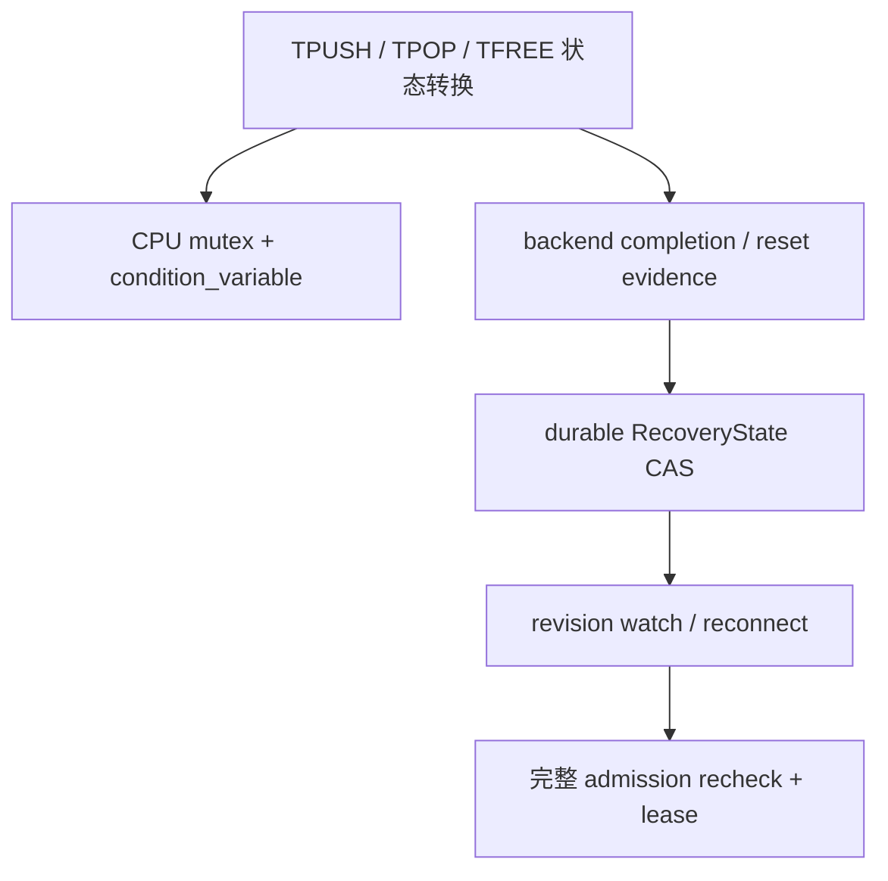
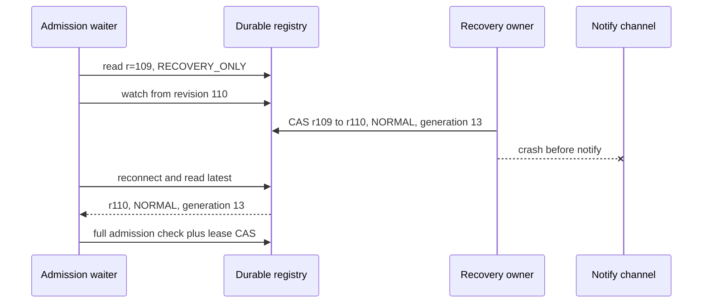

> 源码基线：pto-isa [`15a9e0a0`](https://github.com/hw-native-sys/pto-isa/commit/15a9e0a0845955f5d7a409a7f4d1609a263b5d25)。截至 2026-10-08，默认分支相对上一章没有新提交；最新合入 [PR #339](https://github.com/hw-native-sys/pto-isa/pull/339) 未修改本文引用的 CPU TPipe 路径。本文严格区分**当前代码事实**、**本次测试事实**与**建议恢复协议**；`RecoveryState`、`RevisionCursor` 和 `AdmissionGeneration` 尚不存在于仓库。

## 本篇在 PTO 课程路线中的位置

第 58 章让 cleanup task 在有限 reserve 内安全、无饥饿地执行，但任务完成并不等于普通请求已经可以重新进入：cleanup result 可能尚未持久化，checkpoint 可能未覆盖新事实，旧 owner 可能还在提交迟到结果，通知也可能恰好丢在进程崩溃前。

本章只补这一段交接：**以 durable revision 作为状态真相，以 notification 作为可丢失的加速提示；只有同一次原子提交同时关闭 recovery debt、发布 `NORMAL` 并换出新的 admission generation，普通工作才能重新准入。**

课程位置：

`starvation-free cleanup → durable state transition → revision watch → atomic NORMAL handoff → admission recheck`

## 前置知识

- `TPUSH` 的 publish、`TPOP` 的 borrow 与 `TFREE` 的 release 是不同线性化点；一次唤醒不能替代 slot ownership 检查。
- cleanup lease 从 reserve 成功开始，一直持有到 durable result 被应用；action 返回不等于 debt 已闭合。
- `owner_epoch` 只撤销旧 owner 的提交权限，不取消已经提交到设备的物理 action。
- 第 48 章讲的是单进程 `AdmissionTicket` 的 revision recheck；本章进一步处理**进程崩溃、通知丢失、owner 换代和模式重开**，不是重复讲 condition variable 模板。

## 今日两个核心问题

1. cleanup 已把状态从 revision `r` 推进到 `r+1`，但进程在 `notify` 前崩溃，等待者怎样仍然发现进展？
2. 从 `RECOVERY_ONLY` 回到 `NORMAL` 时，怎样避免普通请求看到“debt 已清零、mode 尚未更新”或“mode 已开放、reserve 尚未归还”的撕裂快照？

## PTO 全栈中的位置

真实 PTO 指令链产生 slot、credit 和 backend operation；runtime recovery control plane 将 completion、quarantine、checkpoint、reserve 与 admission mode 收敛成可恢复状态。两层不能混为一谈：CPU `cv.notify_all()` 只服务当前进程中的 host 线程，durable revision 才能跨 crash 说明“权威状态已经变化”。



图中 `RecoveryState` 是建议 runtime 对象，不是 `TPipe::SharedState` 的别名。前者必须持久化并按 owner epoch fencing；后者是 CPU_SIM 进程内 FIFO 状态。

## 概念和精确语义

### Revision 是状态版本，不是通知序号

建议最小权威记录包含：

```text
RecoveryState = {
  owner_epoch,
  revision,
  mode,                    // NORMAL / SHED_NEW / RECOVERY_ONLY / FAIL_CLOSED
  critical_debt_digest,
  cleanup_inflight,
  cleanup_reserve_used,
  checkpoint_id,
  admission_generation
}
```

`revision` 必须与被修改的状态在同一 durable transaction 中递增；不能先写 debt、后单独递增计数。若底层 revision 只在 owner 内单调，则比较键必须是 `(owner_epoch, revision)`，进程重启后把内存计数重新置零会产生 ABA。

notification 可以重复、乱序或丢失。它只表达“值得重新读取”；真正的判定来自最新 `RecoveryState`。因此 waiter 观察 `r` 后，应从 `r+1` 建立 watch，并在 watch 建立后再次读取权威状态。若 watch history 已被 compaction，正确动作是 full reload，而不是把缺失事件解释为“没有变化”。

### NORMAL 必须由单次 CAS 发布

本课程当前 contract 要求，恢复到 `NORMAL` 前至少同时成立：

1. 当前 owner epoch 与预期 revision 仍匹配；
2. correctness-critical debt 为零，所有 unknown action 已有 terminal/reset witness 或仍被安全隔离且不再依赖 recovery-only progress；
3. cleanup task 没有 `RESERVED/RUNNING/UNKNOWN`，其 reserve 已归还；
4. canonical checkpoint 已覆盖本轮 closure，allocator/admission 读取的是同一份状态。

最小实现不需要额外引入一个长期 `NORMAL_PENDING` 状态。若上述字段位于同一原子记录，可直接执行：

```text
CAS(
  owner=o, revision=r, mode=RECOVERY_ONLY,
  debt=0, inflight=0, reserve=0
)
→ {
  revision=r+1,
  mode=NORMAL,
  admission_generation=g+1
}
```

只有存储后端无法原子覆盖这些事实时，才需要 staging record；即便如此，普通 admission 也只能以最终 manifest CAS 为开放点。

## 真实文件、类型、API 或指令逐段解读

### `SharedState`：当前只有进程内谓词，没有 durable revision

[`TPipe::SharedState`](https://github.com/hw-native-sys/pto-isa/blob/15a9e0a0845955f5d7a409a7f4d1609a263b5d25/include/pto/cpu/TPush.hpp#L560-L588) 持有 mutex、condition variable、`occupied`、borrow 队列、`commit_seq`、consumer claim 与 `slot_busy`。其中 `commit_seq` 只决定当前 FIFO 中哪个 entry 更老；slot final free 后它会被清零，不能充当跨 crash ledger revision。

[`GetSharedState`](https://github.com/hw-native-sys/pto-isa/blob/15a9e0a0845955f5d7a409a7f4d1609a263b5d25/include/pto/cpu/TPush.hpp#L603-L647) 可通过 numeric hook、string hook 或静态 storage 返回共享状态。`EnsureSharedStateInitialized` 只保证 placement construction 完成一次；key 中没有 recovery owner epoch 或 admission generation。因此“找到了同一个 storage”不等于“它属于同一次安全 dispatch”。

### `record/free`：先改状态，再通知，这是正确方向

[`Producer::record`](https://github.com/hw-native-sys/pto-isa/blob/15a9e0a0845955f5d7a409a7f4d1609a263b5d25/include/pto/cpu/TPush.hpp#L749-L776) 在 mutex 内写 direction、consumer count、`commit_seq`、producer cursor 与 `occupied`，释放锁后 `notify_all()`。[`Consumer::free`](https://github.com/hw-native-sys/pto-isa/blob/15a9e0a0845955f5d7a409a7f4d1609a263b5d25/include/pto/cpu/TPush.hpp#L924-L970) 在最后 consumer 释放时清 claim/busy/direction、减少 `occupied`，然后通知。

当前 `cv.wait(lock, predicate)` 会在同一 mutex 下重新检查条件，因此单进程线程不会因为 notify 恰好发生在检查与睡眠之间而永久错过可用 slot。但 crash 后 mutex、cv 与 waiter 全部消失；这条保证不能外推为 durable no-lost-wake。

### `reset_for_cpu_sim`：唤醒不等于交接

[`reset_for_cpu_sim()`](https://github.com/hw-native-sys/pto-isa/blob/15a9e0a0845955f5d7a409a7f4d1609a263b5d25/include/pto/cpu/TPush.hpp#L649-L679) 逐方向加锁、清 cursor/occupancy/claim/busy/sequence，并调用 `notify_all()`。它没有 expected revision、owner epoch、participant join 或 backend reset witness；而且 `DIR_BOTH` 两个方向分别提交，不形成跨方向原子快照。它适合已 quiescent 的测试隔离，不是 `RECOVERY_ONLY→NORMAL` 协议。

## 对象、Tile、Buffer 与 RevisionCursor 生命周期

先看真实 `16×16xf32` Tile 的 CPU_SIM 生命周期。`TPipe<7, DIR_BOTH, 1024, 2>` 中，C2V/V2C 各有两个 1024 B slot：

1. `Producer::allocate` 在 mutex 下等待目标 cursor slot 同时满足 capacity、`slot_busy==0` 和 direction empty，随后把 slot 标为 busy；
2. payload 写入 host FIFO storage；
3. `record` 才使 entry 可见，赋予 `commit_seq` 并增加 `occupied`；
4. `Consumer::wait` 选择相应方向最老 committed slot，记录 outstanding `(direction,slot)`；
5. `free` 在最后 consumer 后释放具体 slot，状态先改变，通知随后发生。

建议的 `RevisionCursor` 生命周期与 slot 不同：它在 refusal 时保存 `(owner_epoch, observed_revision, request_fingerprint)`，不持有 slot、reserve 或 device pointer；watch/reconnect 后只获得 recheck 权；只有同一最新 revision 上的 admission CAS 成功，才生成绑定 `admission_generation` 的真正 lease。cursor cancel 后的迟到通知不能复活请求。

## 端到端调用链或指令链

1. `TPUSH/TPOP/TFREE`、backend query 或 reset result 产生新的 ownership 事实。
2. cleanup worker 先持久化 result，再由当前 owner 以 expected `(owner_epoch, revision)` 应用 debt delta。
3. transaction 同时写 canonical state 并推进 revision；提交成功后才发送 best-effort notification。
4. waiter 从 observed revision 建立 watch；注册后立即重读，通知丢失、重复或进程重连都走同一 full recheck。
5. 最后一个 cleanup closure 满足 handoff gate 时，owner 用一次 CAS 发布 `NORMAL + revision+1 + admission_generation+1`。
6. 普通请求重新计算 capacity、permission 与 generation，并在同一 revision 上原子取得 lease；旧 verdict、旧 generation 和旧 owner result 全部 fail closed。

关键 crash 窗口如下：



崩溃只损失通知边，不能回滚已提交的状态边。相反，若 crash 发生在 CAS 前，registry 仍是 `RECOVERY_ONLY@109`，新 owner 必须继续 closure，不能根据“cleanup 函数返回过”猜测系统已恢复。

## 具体 shape、Tile 和状态演算

仍取 `16×16xf32=1024 B`、`SlotNum=2`、`DIR_BOTH`，两向物理 FIFO capacity 合计 4096 B。故障后 registry 为：

```text
owner_epoch=8, revision=107, mode=RECOVERY_ONLY
admission_generation=12
critical_debt=(wal=4 KiB, quarantine=1024 B, unknown_action=1)
cleanup_inflight=E7, cleanup_reserve_used=1 KiB + 1 query slot
```

普通 dispatch `N` 需要 C2V/V2C 各一个 Tile，共 2048 B。它在 revision 107 得到 `RetryAfterRevision(107)`，只保存 cursor。

1. `E7` 查询 epoch 41 的迟到 action，持久化 terminal witness；owner 应用后得到 revision 108，`unknown_action=0`。即使 N 错过通知，也没有获得 slot。
2. `C42` 把 closure 写入 checkpoint，并安全 compact 4 KiB WAL；revision 109 时 debt、inflight 和 reserve 都归零。
3. owner 以 `RECOVERY_ONLY@109/g12` 为 expected value，单次 CAS 到 `NORMAL@110/g13`，随后恰好在 notify 前崩溃。
4. N 重连后读取 revision 110，重新验证 2048 B capacity 和两向 ownership，再取得 generation 13 lease。任何 generation 12 的迟到 admission 或 epoch 7 的旧 owner apply 都因 expected value 不匹配而失败。

若 E7 只能得到 `UNKNOWN`，步骤 2 的 quarantine backing 不能归零，handoff CAS 不成立。若未来策略允许带残余 quarantine 进入 `NORMAL`，也必须把它永久计入 hard budget，并证明普通请求不依赖 recovery-only 工作才能完成；这属于新的 policy contract，不能暗中放宽本章 gate。

## 为什么这样设计及替代方案

| 方案 | 延迟与吞吐 | 正确性与维护成本 |
| --- | --- | --- |
| 固定 sleep 后重试 | 无需通知设施，但恢复慢且会惊群 | 不能区分永久 debt；sleep 不证明状态变化 |
| 仅进程内 condition variable | 热路径很轻 | crash 后状态与通知同时消失，无法接管 |
| 每个 waiter 都写 durable queue | 可精确恢复单个 waiter | 写放大、cancel/GC/隐私和 ABA 状态复杂 |
| durable revision + best-effort watch | 无 waiter 时零 per-request durable 写；通知只加速 | 要求线性化 registry、watch compaction 处理和完整 recheck |
| 分步写 `debt=0`、`mode=NORMAL` | 实现表面简单 | 暴露撕裂快照，旧请求可能抢跑 |
| 单次 handoff CAS | 一次控制面事务 | 必须把 gate 所需摘要放入同一原子边界 |

最小可辩护设计是“durable level state + 可丢失 edge notification + admission CAS”。它不保证最少唤醒次数，却把 correctness 从通知可靠性中剥离出来。性能应测 watch reconnect、recheck 次数、CAS 冲突、惊群规模与 recovery-to-normal 延迟；源码没有数据支持固定轮询周期，本文不虚构毫秒参数。

## 访存、计算、流水、并行和硬件约束

本章不改变 Tile 的 shape、dtype、layout 或 device placement：CPU_SIM payload 仍位于 host FIFO storage；A2/A3/A5 的真实 payload、flag 与 local FIFO 仍由各 backend 负责。新增成本发生在 host control plane：durable record、CAS、watch cursor 和 recheck。

模式交接会影响并行度：过早开放会让普通任务侵占 cleanup reserve或触碰旧 backing；过晚开放则让设备空闲、拉长 queue delay。因此应分别观测 `closure_ready→NORMAL_commit`、`NORMAL_commit→first_admission`、watch reconnect、stale CAS、wake 后仍拒绝比例和 device idle gap。notification latency 可以优化，revision correctness 不能因性能压力删除。

## 测试证据与未覆盖风险

本次在 `15a9e0a0` 执行 `python3 tests/run_cpu.py -t tpushpop`：构建通过，`tpushpop` 在本次环境中 85 ms 通过。直接测试证据包括：

- [`dir_both_full_capacity_and_delayed_free`](https://github.com/hw-native-sys/pto-isa/blob/15a9e0a0845955f5d7a409a7f4d1609a263b5d25/tests/cpu/st/testcase/tpushpop/main.cpp#L1211-L1256)：两向各占满两个 slot，延迟 free 后分别回到 `occupied==0`；
- [`dir_both_four_push_pipeline_round_trip`](https://github.com/hw-native-sys/pto-isa/blob/15a9e0a0845955f5d7a409a7f4d1609a263b5d25/tests/cpu/st/testcase/tpushpop/main.cpp#L1258-L1305)：Cube/Vector 两线程完成 32 次往返，覆盖进程内 wait/notify 与方向 FIFO；
- [`dir_both_hook_storage_initializes_and_resets_both_directions`](https://github.com/hw-native-sys/pto-isa/blob/15a9e0a0845955f5d7a409a7f4d1609a263b5d25/tests/cpu/st/testcase/tpushpop/main.cpp#L1307-L1326)：hook storage 一次初始化，并验证两向同步 reset 后归零。

这些测试证明当前正常路径，不证明 durable revision。应新增 deterministic Golden：状态在 watch 注册前推进；CAS 成功后、notify 前 crash；重复和乱序 notify；watch history compact 后 full reload；旧 owner/stale revision CAS 被拒；两个普通 waiter 竞争最后 capacity 只有一个获得 lease；handoff 前任一 unknown/reserve 非零都 fail closed；以及 A2/A3/A5 上 terminal/reset witness 与 late flag/write 的少量真机校准。

## 与前后章节的连接

第 55–58 章依次回答 action 如何恢复、历史何时可删、什么时候停止普通 admission，以及 recovery reserve 中谁先执行。本章把最后一个控制面断点闭合：

`durable result → debt closure → revision commit → atomic NORMAL handoff → generation-bound admission`

下一章将回到可观测性与验证：仅看 revision 前进仍不知道是哪类 debt 被关闭，需要设计 stable reason、transition audit 与 crash-replay trace，才能定位系统为何长期停留在 `RECOVERY_ONLY`。

## 本篇结论、知识债、三个理解检查问题和下一章

结论：notification 是可丢失的加速边，不是状态证书；durable revision 必须与权威状态同事务推进；`RECOVERY_ONLY→NORMAL` 必须以当前 owner/revision 为 expected value，原子发布 mode、revision 与新的 admission generation；所有 waiter 醒来后都要重新检查容量、权限和 generation。

知识债仍包括真实 `RecoveryState/RevisionCursor/AdmissionLease` schema、线性化 store/watch、watch compaction 与 cursor GC、跨进程通知 adapter、handoff CAS、device-wide gate 摘要、旧 generation lease 回收、owner takeover，以及 notify-before-crash、store partition、late action 与 A2/A3/A5 真机 Golden。

三个理解检查问题：

1. 为什么 `commit_seq` 能决定 CPU FIFO 顺序，却不能直接充当 durable recovery revision？
2. owner 在 `NORMAL@110` 提交成功后、notify 前崩溃，为什么 waiter 仍不会永久睡眠？
3. 为什么 debt、cleanup reserve 与 mode 分三次写，即使最终值都正确，也可能让普通请求错误抢跑？

下一章：**Revision 前进了，谁改了什么——Stable Reason、Transition Audit 与 Crash-replay Trace。**

## 课程账本增量

- 章节：59；源码基线 `15a9e0a0`。
- 新覆盖：`SharedState`、`GetSharedState/EnsureSharedStateInitialized`、`Producer::record`、`Consumer::wait/free`、`reset_for_cpu_sim()` 与 `notify_all()` 的进程内语义边界。
- 新建议对象：`RecoveryState`、`RevisionCursor`、generation-bound `AdmissionLease` 与 atomic recovery-to-normal CAS。
- 新不变量：durable state 先于 best-effort notify；watch 建立后必须重读；revision 与状态同事务推进；NORMAL handoff 同时关闭 critical debt、归还 cleanup reserve 并换 admission generation；醒来只获得 recheck 权。
- 测试结果：`tpushpop` 构建及测试 PASS（本次 test 85 ms）；当前测试不覆盖 crash、durable watch、owner takeover 或 atomic mode handoff。
- 下一章：stable reason、transition audit 与 crash-replay trace。
