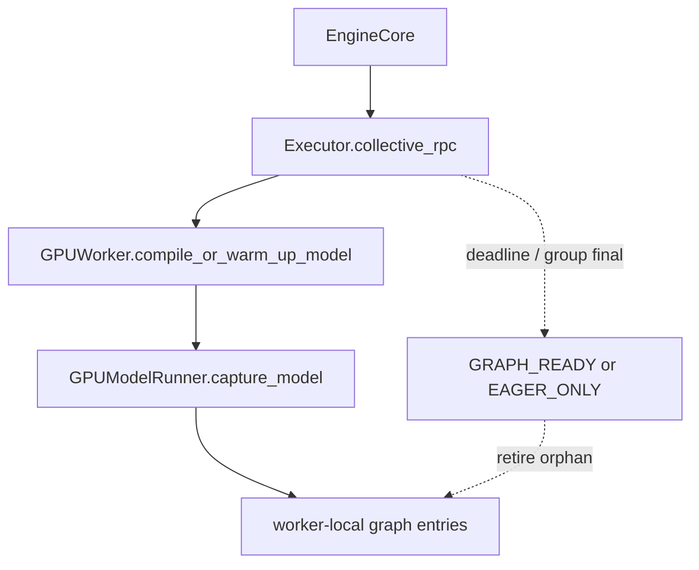
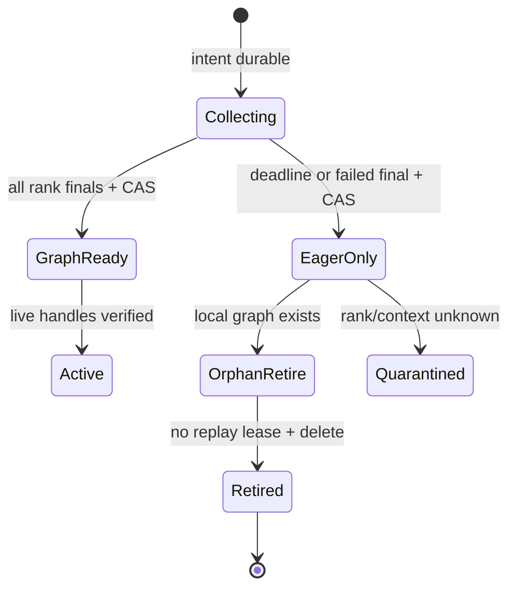

> 源码基线：vLLM [`9e3e37cb`](https://github.com/vllm-project/vllm/commit/9e3e37cb3c041fa3cb7dc578bca1fa0a004b715a)。相对上一章前进 61 个提交；recapture、`collective_rpc` 与 graph release 的关键语义没有改变。当天合入的 [PR #56775](https://github.com/vllm-project/vllm/pull/56775) 只把 H200 CUDAGraph **CI job** 的预算从 30 分钟调到 45 分钟并补齐选测路径，不是运行时 recapture deadline。本文继续严格区分当前代码事实、测试/CI 事实与建议协议。

## 本篇在课程路线中的位置

第 48 章建立 per-key TP group commit；第 49 章补上 owner crash 后的 WAL、幂等发布与 stale final。今天只处理剩余的活性问题：**rank 没有报错，也永远不返回时，谁结束等待、怎样安全退化为 eager，以及其他 rank 已捕获但未提交的 graph 怎样退出显存生命周期。**

课程位置：

`Recapture WAL → absolute decision deadline → EAGER_ONLY final → late-final fence → orphan retirement`

## 前置知识回顾

- `LOCAL_READY` 只证明某个 worker 进程里有 graph；只有所有 expected ranks 对同一 `(generation, domain, key)` 收敛，才可 group-ready。
- durable commit 不能复活 `torch.cuda.CUDAGraph`；激活还要验证 worker attempt、CUDA context generation 与静态地址。
- timeout、cancel requested、设备工作终止和显存可复用是四种不同事实。
- `EAGER_ONLY` 不是“暂时没找到 graph”，而应是当前 generation 的不可逆发布决定；否则迟到 rank 会让不同 TP rank 在 graph/eager 之间分叉。

## 本篇要回答的核心问题

1. 当前 `compile_or_warm_up_model` 为什么可能无限等待？现有 execute-model timeout 又为什么不够？
2. deadline 到期后，怎样让一个 graph key 有且只有一个 `GRAPH_READY` 或 `EAGER_ONLY` 终态？
3. rank 0 已捕获、rank 1 卡死时，rank 0 的 orphan graph 由谁持有、何时可删；卡死进程里的显存又凭什么算已回收？

## 组件在全局架构中的位置

当前初始化链路在 [`EngineCore`](https://github.com/vllm-project/vllm/blob/9e3e37cb3c041fa3cb7dc578bca1fa0a004b715a/vllm/v1/engine/core.py#L355-L357) 进入 executor；建议的 deadline/final 位于 RPC 与 worker-local graph registry 之间：



当前代码只有实线链路；虚线是本文建议的控制面。CUDA graph object 仍归 worker 进程所有，owner 只持有 generation、key、状态和 live-handle token，不能跨进程序列化 GPU executable。

## 完整调用链

### 1. 公开初始化入口没有传 timeout

[`Executor.compile_or_warm_up_model`](https://github.com/vllm-project/vllm/blob/9e3e37cb3c041fa3cb7dc578bca1fa0a004b715a/vllm/v1/executor/abstract.py#L139-L154) 调用：

```python
collective_rpc("compile_or_warm_up_model")
```

它没有传 `timeout`。在 [`MultiprocExecutor.collective_rpc`](https://github.com/vllm-project/vllm/blob/9e3e37cb3c041fa3cb7dc578bca1fa0a004b715a/vllm/v1/executor/multiproc_executor.py#L377-L450) 中，`timeout=None` 使 `deadline=None`，随后 parent 按 `response_mqs` 顺序执行无界 `dequeue`。因此一个 rank 卡在 native capture、collective 或驱动调用里，即使其他 rank 已完成，parent 也可能永久等不到整个 list。

热路径的 `execute_model`、`sample_tokens` 与 `take_draft_token_ids` 会显式传入 `VLLM_EXECUTE_MODEL_TIMEOUT_SECONDS`；默认值是 [`300`](https://github.com/vllm-project/vllm/blob/9e3e37cb3c041fa3cb7dc578bca1fa0a004b715a/vllm/envs.py#L247)。该实现用一次 `time.monotonic()` absolute deadline，为后续每个 MQ 计算 remaining time，这是正确的“单一预算”形状。但 timeout 只抛 `TimeoutError`：它没有 graph key、generation、已完成 rank set，也不会产生可恢复 final。

### 2. worker 可能在返回前已经持有多个 graph

[`GPUModelRunner.capture_model`](https://github.com/vllm-project/vllm/blob/9e3e37cb3c041fa3cb7dc578bca1fa0a004b715a/vllm/v1/worker/gpu/model_runner.py#L1035-L1114) 依次 capture encoder、主模型、inner model-state graph 和 speculator，最后才返回总显存增量。主 [`CudaGraphManager.capture`](https://github.com/vllm-project/vllm/blob/9e3e37cb3c041fa3cb7dc578bca1fa0a004b715a/vllm/v1/worker/gpu/cudagraph_utils.py#L419-L510) 又按 PIECEWISE→FULL、descriptor-by-descriptor 工作：FULL graph 一完成就写入 `self.graphs[desc]`，全部结束才把 `_graphs_captured=True`。

所以“RPC 没返回”不能推出“worker 没创建 graph”。失败或 hang 前写入的 entry 仍被 Python registry、breakable wrapper 或 graph pool 引用，只是 dispatch 总闸门未打开。

### 3. 当前 release 是整批操作，不是 per-key retirement

[`release_graphs`](https://github.com/vllm-project/vllm/blob/9e3e37cb3c041fa3cb7dc578bca1fa0a004b715a/vllm/v1/worker/gpu/cudagraph_utils.py#L396-L406) 会清空整个 `graphs` dict、关闭 `_graphs_captured`，并调用 `BreakableCUDAGraphWrapper.clear_all_graphs()`。后者遍历全进程的 weak-set，清掉每个 wrapper 的全部 [`entries`](https://github.com/vllm-project/vllm/blob/9e3e37cb3c041fa3cb7dc578bca1fa0a004b715a/vllm/compilation/breakable_cudagraph.py#L266-L314)。Elastic EP 再执行 compiler reset、`gc.collect()`、device synchronize 与 `empty_cache()`。

这能做正常的整批 recapture，却不能表达“保留 K8，单独回收 R128”。尤其 PIECEWISE graph 存在 wrapper `entries`，FULL graph 存在 manager `graphs`，两者需要统一的 `(domain,key,generation)` retirement 接口。

## 关键类型、字段和状态生命周期

以下类型是建议协议，不是当前 vLLM API：

```text
RecaptureDecisionDeadline = {
  capture_id, owner_epoch, generation, decision_not_after,
  policy_id, expected_ranks, expected_keys
}

GraphKeyFinal = {
  generation, graph_domain, descriptor_hash,
  verdict: GRAPH_READY | EAGER_ONLY,
  ready_ranks, missing_ranks, reason, final_version
}

LocalGraphLease = {
  worker_attempt, context_generation, graph_key,
  state: CAPTURING | LOCAL_READY | ACTIVE | ORPHAN | RETIRED,
  replay_refcount, address_fingerprint
}
```

状态机的关键不是 timeout 本身，而是 deadline 触发一个持久、幂等、不可逆的 group decision：



`GraphReady` 与 `EagerOnly` 对同一 generation/key 竞争同一个 CAS。谁先提交谁赢；deadline callback 不能覆盖已提交的 `GraphReady`，迟到 `LOCAL_READY` 也不能重开 `EagerOnly`。若以后还想捕获，只能创建新 generation。

## 逐函数源码解读

### `collective_rpc`：有 absolute deadline 机制，却没有 capture 语义

优点是所有 MQ 共享一个 `deadline`，不会给每个 rank 重新发放完整 timeout。缺口有三个：warmup 没传 timeout；response 按 MQ 顺序读取，结果不是异步 per-rank final；异常文本只含 method，不含 rank/key。直接把 `timeout=300` 填到 warmup 只能防止无限等待，无法安全决定哪些 key 可 replay。

### `capture`：entry 的所有权先于批次成功

FULL graph 在 `torch.cuda.graph(...)` 返回后立刻由 `self.graphs[desc]` 持有；PIECEWISE graph 则在 `BreakableCUDAGraphWrapper.entries[BatchDescriptor]` 中持有 capture segments。`_graphs_captured` 只是 dispatch gate，不是资源 ownership gate。故 orphan 的定义应是“存在本地 executable，但没有当前 group final 授权”，而不是“dict 里有 entry 且 flag 为 false”。

### `release_graphs`：正确但过宽的安全锤

整批 clear 很容易 fail closed，却会同时损失已成功并可提交的 K8，增加 recapture 延迟与 graph-pool 峰值。per-key retire 需要先关闭该 key 的 admission，再等当前 replay lease 归零，最后删除 exact entry；顺序反过来会让执行线程引用已释放 graph。

## 具体示例与 shape/状态演算

设 TP=2、generation `g42`，expected keys 为：

| key | domain | 静态输入 | rank 0 | rank 1 |
| --- | --- | --- | --- | --- |
| K8 | `MODEL/FULL` | `input_ids int32[8]`、`positions int64[8]` 等 | ready | ready |
| R128 | `INNER_REPLAY/PIECEWISE` | 7 个 device buffer 的前 128 行 | ready | hang |

R128 的七个 buffer 在当前 [`DecoderReplayCudaGraphManager`](https://github.com/vllm-project/vllm/blob/9e3e37cb3c041fa3cb7dc578bca1fa0a004b715a/vllm/models/deepseek_v41/nvidia/decoder_replay_cudagraph.py#L45-L73) 中分别是 `[128,H]` activation、`[128]` int64 positions、`[128]` int32/int64 ids、`[128,Hc]` f32、`[128,Hc,1]` f32、`[128,Hc,Hc]` f32、`[128,Hc,H]` activation；地址在 capture/replay 间必须稳定。

演算如下：

1. owner 持久化 `decision_not_after=D`、expected ranks `{r0,r1}` 和 keys `{K8,R128}`。
2. 两 rank 的 K8 finals 齐全，CAS 得到 `GRAPH_READY(K8)`；该 key 不受 R128 失败牵连。
3. r0 写入 `LOCAL_READY(R128)`，r1 卡在 capture 内。到绝对时间 D，当前 owner epoch 以 CAS 写入 `EAGER_ONLY(R128, missing={r1})`。
4. 所有健康 rank 先把 R128 admission 固化为 eager。r0 将本地 R128 标为 `ORPHAN`；若 `replay_refcount=0`，删除对应 entry 并上报 `RETIRED`。K8 继续 replay。
5. r1 在 D 之后返回 READY：final 因 `EAGER_ONLY(g42,R128)` 已存在而成为 late evidence，只触发本地 retire，不能改写 group final。
6. 若 r1 仍卡在 native/CUDA 中，owner 无法靠 Python 消息证明它的 graph 已释放；只有该进程/context 的 terminal/reset witness 才能把其 graph-pool 显存记为 reclaimed，否则保持 `Quarantined`。

deadline 数值不能从源码注释“通常 5–20 秒”或 execute-model 默认 300 秒照搬。应先定义 recapture 可用性预算：

\[
B_{decision}=SLO_{recovery}-B_{fallback\ publish}-B_{safety}
\]

只有历史上同硬件、模型、topology、domain/key 的 capture P99 加 queue/final 成本小于 `B_decision` 时才值得尝试 capture；否则直接发布 `EAGER_ONLY`。`decision_not_after` 必须在 intent 中冻结，不能被 heartbeat 不断顺延。

## 为什么这样设计及替代方案

| 方案 | 可用性 | 显存/吞吐 | 正确性与维护成本 |
| --- | --- | --- | --- |
| 永久等待 | 最差；一个 rank 阻塞启动 | 保留潜在 graph 收益 | 状态最少，但无活性边界 |
| timeout 后整批 eager + 全量 release | 收敛简单 | 丢失 K8 等成功 key；重捕获峰值高 | 最容易证明安全 |
| per-key `EAGER_ONLY` + retire | 成功 key 继续 graph，失败 key 有界退化 | 需要 per-key HBM、lease 与 cleanup | 状态较多，但故障隔离最好 |
| timeout 后接纳迟到 READY | 表面恢复 graph | 不同 rank 可能模式分叉 | 不可接受；破坏终态单调性 |

推荐第三种，但第一阶段实现可以先采用“整批 eager + 全量 release”作为安全基线，再用相同 golden 演进为 per-key 回收。不要先实现复杂 registry，却没有可验证的 terminal oracle。

## 性能、并发、正确性与边界条件

- **延迟**：deadline 太短会把正常慢 capture 误判为 eager，太长会扩大不可用窗口；决策依据应是恢复 SLO 与分层 capture 时延分布，而不是通用常数。
- **吞吐**：K8 保持 graph、R128 eager 的收益取决于各 key 命中率和消除的 launch overhead；需要对 graph/eager TPOT 与 P99 做 key-level 计量。
- **显存**：容量式应包含 `M_graph_active + M_graph_orphan + M_capture_peak + M_fragmentation`。orphan 未收到 reclaim witness 前仍占预算，不能只从 manifest 删除。
- **并发**：先 fence admission，再等待 replay lease，最后 free；late capture 完成时检查 generation/final 并直接转 orphan。`cancel requested` 不能视为 `cancel confirmed`。
- **graphability**：per-key retire 不能移动其他 active graph 的静态地址或共享 pool；若 allocator 只能整池释放，就必须在内存效率与保留成功 key之间选择。
- **正确性**：同 generation/key 只能有一个 group final；TP/PP expected set 冻结；旧 owner epoch 无权 final、publish 或 release。

## 测试证据与未覆盖风险

当前直接测试事实：

- [`test_take_draft_token_ids_uses_execute_model_timeout`](https://github.com/vllm-project/vllm/blob/9e3e37cb3c041fa3cb7dc578bca1fa0a004b715a/tests/v1/executor/test_multiproc_executor.py#L72-L95) 用 7 秒配置验证 draft-token RPC 把 remaining timeout 交给 MQ，并在 stall 时抛 `TimeoutError`；它没有覆盖 warmup/capture，也没有 group final。
- [`test_capture_model_locks_workspace_after_capture`](https://github.com/vllm-project/vllm/blob/9e3e37cb3c041fa3cb7dc578bca1fa0a004b715a/tests/v1/worker/test_gpu_model_runner_v2.py#L285-L304) 验证 capture 成功后锁住静态 workspace，但没有注入 capture 中途 hang。
- [`test_replay_graph_matches_eager`](https://github.com/vllm-project/vllm/blob/9e3e37cb3c041fa3cb7dc578bca1fa0a004b715a/tests/models/test_deepseek_v41_decoder_replay_layers.py#L128-L162) 验证 R4 graph 对 3 行 gather 的数值与 eager 一致；[`DP padding test`](https://github.com/vllm-project/vllm/blob/9e3e37cb3c041fa3cb7dc578bca1fa0a004b715a/tests/models/test_deepseek_v41_replay_batch.py#L264-L276) 验证两 rank 统一选择 R512。二者验证运行期 shape/mode 共识，不验证 deadline 或 orphan。
- PR #56775 的 exact-head H200 CUDAGraph CI 通过 102 个相关测试、总计 26m38s；这证明 CI 原 30 分钟预算不足，并不提供单次生产 capture 的 deadline 分布。

本地环境没有安装 `pytest`，因此本篇未声称重新执行上述测试。最小新增 golden 应使用 fake clock 和 deterministic failpoint 覆盖：某 rank 永不 final；deadline 与 READY CAS 竞争；迟到 READY 不重开 key；K8 ready/R128 eager 的模式一致；active replay lease 阻止 free；retire 重放幂等；owner 在 deadline 前后崩溃；hung rank 只有 context/process reset witness 后才计入 reclaimed。最后用少量 TP=2 真机测试校准 native capture hang、graph-pool used-memory 和迟到 device work；mock 无法证明这些硬件事实。

## 与前后章节的连接

到这里，recapture 控制链已经闭合：

`address generation → per-key manifest → WAL/CAS → absolute deadline → monotonic final → local retirement`

下一章继续追问最后一层物理事实：entry 从 registry 删除后，共享 graph pool、allocator cache 与 fragmentation 是否真的释放出可 admission 的容量，以及 recapture storm 如何被水位与 backpressure 限制。

## 本篇结论、知识债、三个理解检查问题和下一章

结论：

1. 当前 warmup/capture collective 没有 timeout；execute-model 的 RPC deadline 机制不能直接充当 graph group final。
2. deadline 必须触发持久的 `EAGER_ONLY` CAS；同 generation 的迟到 READY 只能对账和清理，不能重新开放 replay。
3. orphan graph 的生命周期是“先禁止 admission，再等 replay lease，最后删除并给出 reclaim witness”；manifest 删除不等于显存回收。
4. 活 worker 可执行 per-key retire；hung worker 只能通过 process/context terminal/reset evidence 收敛，否则其容量继续 quarantine。
5. deadline 应由 recovery SLO 与实测 capture 分布推导；源码注释、execute timeout 和 CI job timeout都不是可移植阈值。

仍欠真实 `RecaptureDecisionDeadline/GraphKeyFinal/LocalGraphLease`、per-key FULL/PIECEWISE retire API、owner timer/CAS、capture progress sideband、replay refcount、graph-pool capacity census、allocator reclaim witness、quarantine backpressure 与 TP 真机 hang golden。

理解检查：

1. 为什么给 `compile_or_warm_up_model` 补一个 timeout 仍不足以安全开放或关闭 K8/R128？
2. r1 在 deadline 后成功返回 R128 时，为什么新 generation recapture 可以接纳它，而 g42 不能原地从 `EAGER_ONLY` 改回 `GRAPH_READY`？
3. `self.graphs.clear()` 已执行，为什么 owner 仍可能不能把相应 HBM 立刻加入可用容量？

下一章：**Graph 删了，显存就回来了吗——Graph Pool Census、Reclaim Witness 与 Recapture Admission Backpressure。**

## 补录：第七次七章知识图谱回顾（第 43–49 章）

账本核查发现第 49 章应附第七次回顾但遗漏，现补录。七章形成一条连续证据链：`StepLease` 发现 alive-but-stalled worker → supervisor 取得 kill authority → KILL 后 device completion 仍 unknown → backend reset witness 建立 context generation → graph/address generation 决定能否 replay → per-key TP commit 隔离 partial recapture → WAL/CAS 让 owner crash 后幂等恢复。路线由“进程是否活着”推进到“哪个 graph key、哪一代地址、哪些 rank 的证据足以授权 replay”。

## 课程账本增量

- 第 50 章；源码基线 `9e3e37cb`。
- 新覆盖 `Executor.compile_or_warm_up_model` 的无 timeout 调用、`MultiprocExecutor.collective_rpc` 的 absolute deadline、`CudaGraphManager.capture/release_graphs`、`BreakableCUDAGraphWrapper.clear_all_graphs/entries` 与 PR #56775。
- 新确认不变量：RPC timeout 与 group final 正交；`EAGER_ONLY` 对 generation/key 单调不可逆；orphan retirement 必须晚于 admission fence 和 replay lease drain；只有 reclaim/reset witness 才能释放容量账本。
- 测试缺口：capture hang fake-clock、deadline/READY CAS race、late final、per-key retire、shared-pool refcount、context reset、used-memory census 与 recapture storm backpressure。
