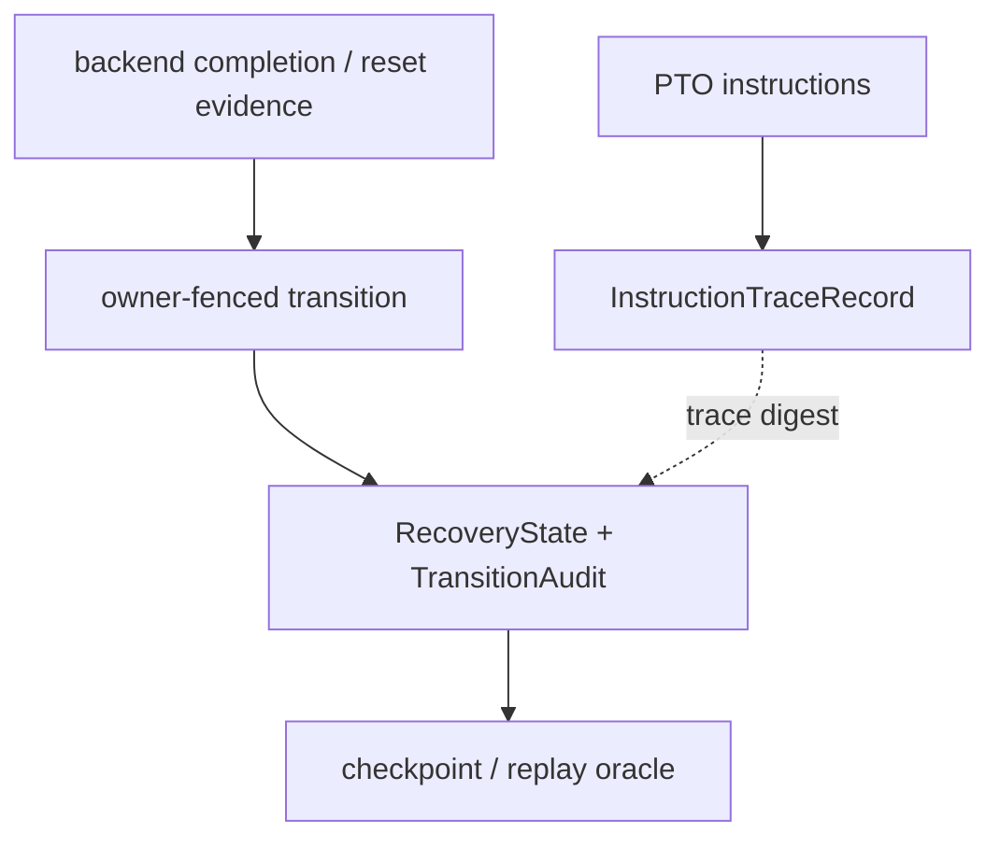

> 源码基线：pto-isa [`15a9e0a0`](https://github.com/hw-native-sys/pto-isa/commit/15a9e0a0845955f5d7a409a7f4d1609a263b5d25)。CPU_SIM instruction trace 由已合入的 [PR #328](https://github.com/hw-native-sys/pto-isa/pull/328) 恢复并完善。本文严格区分**当前代码事实**、**本次测试事实**和**建议恢复协议**；`StableReason`、`TransitionAudit` 与 durable replay store 尚不存在于仓库。

## 本篇在 PTO 课程路线中的位置

第 59 章证明：notification 可以丢，权威状态不能丢；`RECOVERY_ONLY→NORMAL` 必须以 owner-fenced CAS 同时推进 revision、mode 与 admission generation。但 `revision=109→110` 只说明状态变了，并不回答谁改的、为什么能改、依据哪份 completion/reset evidence、关闭了多少 recovery debt。

本章只补这条可解释性链：**把人类日志、指令 trace 与权威 transition audit 分开；由稳定 reason code 描述机器可判定的变化类型，由原子 audit record 把前后 revision、authority、evidence 和资源差量绑定，最后用 replay oracle 重建并校验 canonical state。**

课程位置：

`durable revision → stable reason → atomic transition audit → crash replay → cross-backend correlation`

## 前置知识

- CPU_SIM `TPipe` 的真实线性化点是 `record()` 的 publish 与最后一个 `free()` 的 release；`commit_seq` 只排序进程内 FIFO。
- recovery owner 只有持有当前 `owner_epoch` 才能应用 result；reason code 不能替代 authority 或 evidence。
- durable state 与 revision 必须同事务提交；notify、metrics 和普通文本日志都是可丢失的派生输出。
- checkpoint 可以截断历史，但必须先证明 checkpoint state 等于被截断 transition 的 replay 结果。

## 今日两个核心问题

1. 现有 CPU_SIM instruction trace 已经记录 opcode、Tile shape/layout/address 和 worker 顺序，为什么它仍不能证明 `RECOVERY_ONLY@109` 合法变成 `NORMAL@110`？
2. 怎样设计最小的 stable reason 与 transition audit，使崩溃发生在 write/commit/notify 任一边界时，replay 都得到唯一结果，并能拒绝旧 owner 或冲突重放？

## PTO 全栈中的位置

instruction trace 属于 data plane：它解释一个 kernel invocation 执行了哪些 PTO 指令。transition audit 属于 recovery control plane：它解释 canonical ownership state 的一次授权变化。二者可以通过 digest/correlation reference 关联，但不能互相冒充。



上游是 PTO instruction、backend terminal evidence 与旧 `RecoveryState`；下游是 checkpoint、admission、故障诊断和跨 backend Golden。审计不应进入每次 `TPUSH/TPOP` 的热路径，它只覆盖改变 durable recovery truth 的低频控制面 transition。

## 概念和精确语义

### Stable reason 不是一段稳定的英文

建议使用带 schema version 的闭合枚举，而不是解析日志字符串：

```text
StableReason = {
  RECOVERY_EVIDENCE_APPLIED,
  CHECKPOINT_PUBLISHED,
  QUARANTINE_RETAINED,
  OWNER_TAKEOVER,
  RECOVERY_TO_NORMAL,
  RECONCILE_UNKNOWN
}
```

reason 只回答“按哪条状态机边转换”，不回答“转换是否真实”。正确性仍来自 expected `(owner_epoch, previous_revision)`、evidence witness、前置不变量和原子提交。新 reader 遇到未知 reason version 时必须保留原始值并 fail closed；把 unknown 映射成 `OTHER` 会丢失 replay 语义。

### TransitionAudit 是提交证书，不是旁路日志

从上一章不变量向上推导，最小记录应包含：

```text
TransitionAudit = {
  schema_version,
  transition_id, operation_id,
  owner_epoch, previous_revision, new_revision,
  from_mode, to_mode, admission_generation,
  reason_code, subject_key,
  evidence_hash,
  before_state_hash, after_state_hash,
  resource_delta = {wal_bytes, quarantine_bytes, cleanup_reserved_bytes}
}
```

`timestamp`、message 和 stack trace 可以附加，但不能决定顺序；replay 顺序来自 `(owner_epoch,new_revision)`。原始 Tile payload、地址内数据和凭据不应进入 audit，保存 digest 与受访问控制的 evidence reference 即可。

三个核心后置条件是：`new_revision=previous_revision+1`；`after_state_hash` 等于应用 transition 后的 canonical state；同一 `(owner_epoch,new_revision)` 只能有一个 payload。相同 `transition_id+payload` 重放是幂等，相同 ID 不同 payload 或同 revision 不同 hash 必须报冲突并停止自动恢复。

## 真实文件、类型、API 或指令逐段解读

### `InstructionTraceRecord`：能看见指令，不能看见 recovery authority

[`InstructionTraceRecord`](https://github.com/hw-native-sys/pto-isa/blob/15a9e0a0845955f5d7a409a7f4d1609a263b5d25/include/pto/cpu/trace.hpp#L67-L96) 记录 `block_idx`、`subblock_id`、worker-local `sequence_id`、opcode，以及输入/输出 Tile 的 address、shape、layout、dtype。`ReserveInstructionTraceSequenceId()` 在当前 trace state 内递增；[`DumpInstructionTraceJson`](https://github.com/hw-native-sys/pto-isa/blob/15a9e0a0845955f5d7a409a7f4d1609a263b5d25/include/pto/cpu/trace.hpp#L437-L486) 输出 JSONL。

这是很有价值的执行事实，但 schema 没有 pipe direction/slot、owner epoch、recovery revision、reason、evidence hash 或 before/after state。即便 trace 中出现 `TFREE`，也只证明 wrapper 被执行，不能证明某个旧 generation 的 backing 已获授权复用。

### `LaunchKernelMultiCore`：文件顺序不是全局因果顺序

[`LaunchKernelMultiCore`](https://github.com/hw-native-sys/pto-isa/blob/15a9e0a0845955f5d7a409a7f4d1609a263b5d25/include/pto/common/cpu_stub.hpp#L367-L426) 为每个 worker 重置 thread-local trace，执行 kernel 后分别序列化，再按 `core_id` 把 chunk 拼成一次 launch 的 `trace.jsonl`。所以 `sequence_id` 只在 `(block_idx,subblock_id)` 内有序；文件里 worker A 的行排在 worker B 前面，不等于 A 在 wall clock 上先完成。

### `SharedState`：真正变化的对象仍在 pipe 状态机里

[`TPipe::SharedState`](https://github.com/hw-native-sys/pto-isa/blob/15a9e0a0845955f5d7a409a7f4d1609a263b5d25/include/pto/cpu/TPush.hpp#L561-L588) 持有 `occupied`、outstanding pop、direction、`commit_seq`、consumer claim 与 `slot_busy`。[`Producer::record`](https://github.com/hw-native-sys/pto-isa/blob/15a9e0a0845955f5d7a409a7f4d1609a263b5d25/include/pto/cpu/TPush.hpp#L748-L776) 在 mutex 内 publish entry 后通知；[`Consumer::free`](https://github.com/hw-native-sys/pto-isa/blob/15a9e0a0845955f5d7a409a7f4d1609a263b5d25/include/pto/cpu/TPush.hpp#L924-L970) 在最后 consumer 后清 direction/sequence/busy 并减少 `occupied`。

这里同样没有 durable audit。`reset_for_cpu_sim()` 还会把 `commit_seq` 和 `next_commit_seq` 重置，说明它们是局部执行顺序，而非可跨 crash 重放的 transition identity。

## 对象、Tile、Buffer 与 Audit Record 生命周期

真实 `16×16xf32` Tile 含 256 个元素、1024 B。`TPipe<0,DIR_BOTH,1024,2,2,true>` 为 C2V/V2C 各维护两个 slot：allocate 取得一个 busy slot，payload 写入 local storage，record 赋 `commit_seq` 并 publish，wait 建立 `(direction,slot)` borrow，最后 free 才允许复用。

建议的 audit 生命周期与 Tile 不同：owner 读取 `RecoveryState@r` 与 evidence；构造 deterministic transition payload；在同一 durable transaction 中校验 owner/revision、写 `State@r+1` 和 audit record；commit 后 record 不再可修改。notification、metrics 和人类日志从 committed record 派生。checkpoint 覆盖 `r+1` 后，旧 segment 才可按 retention policy compact；compact 不能删除仍被 evidence、reader lease 或争议调查引用的 record。

审计所有者应是提交 canonical state 的 runtime registry，而不是 kernel、编译器 pass 或单个 worker。worker 可以产生 evidence，却无权独立宣布 revision 前进。

## 端到端调用链或指令链

1. PTO kernel 执行 `TLOAD/TADD/TSTORE` 或 TPipe publish/borrow/release；CPU_SIM 可生成 instruction trace。
2. backend adapter 产生 completion、confirmed cancel 或 scoped reset evidence；否则保留 `UNKNOWN`。
3. current owner 读取 `RecoveryState@r`，以 stable reason 选择 transition rule，并计算 before/after hash 与资源差量。
4. registry 原子执行 `compare(owner_epoch,revision) + append audit + replace state`。
5. commit 成功后才发送 best-effort notify，并可写人类可读 message。
6. crash-replay 从 checkpoint state 开始，按 revision 应用 audit；每步复算 state hash 和不变量，遇到 gap、冲突、未知 schema 或 evidence mismatch 即 fail closed。

```mermaid
sequenceDiagram
    participant O as Recovery owner
    participant R as Durable registry
    participant N as Notify / log
    participant P as Replay oracle
    O->>R: read RECOVERY_ONLY@109
    O->>R: atomic state+audit CAS to 110
    alt crash before commit
        P->>R: reload 109; no transition
    else commit then crash before notify
        O--xN: notification lost
        P->>R: replay audit 110
        R-->>P: NORMAL@110 / generation 13
    end
```

## 具体 shape、Tile 和状态演算

沿用 `16×16xf32=1024 B`、`SlotNum=2`、`DIR_BOTH`，两向 FIFO payload capacity 合计 `2×2×1024=4096 B`。revision 107 的 recovery state 为：4 KiB WAL、1024 B quarantine、unknown action `op7`、mode=`RECOVERY_ONLY`、generation 12。

- `r107→r108`：adapter 返回同 generation 的 terminal evidence `E7`。reason=`RECOVERY_EVIDENCE_APPLIED`，`evidence_hash=H(E7)`，unknown count `-1`；mode 不变。
- `r108→r109`：checkpoint `C42` 覆盖 closure 并允许 WAL compaction。reason=`CHECKPOINT_PUBLISHED`，资源差量 `wal=-4096 B`。若 quarantine 仍无 terminal/reset witness，则它必须保持 `1024 B`，不能为了让账面归零而删除。
- `r109→r110`：所有 critical debt 已闭合，reserve 已归还。reason=`RECOVERY_TO_NORMAL`，`from/to=RECOVERY_ONLY/NORMAL`，generation `12→13`，quarantine 差量 `-1024 B`。state 与 audit 一次提交。

假设 owner 在 r110 commit 后、notify 前崩溃。只有文本日志时，调查者可能只看见最后一条“准备恢复”；只有 instruction trace 时，能看见 Tile 指令却不知道 owner authority。audit replay 则从 r109 的 hash、E7/C42 reference 和 r110 record 得到唯一 `NORMAL@g13`。若攻击或损坏把 `resource_delta.quarantine_bytes` 改成 0，复算的 after-state hash 不匹配，oracle 必须停止。

## 为什么这样设计及替代方案

| 方案 | 延迟/吞吐与容量 | 正确性与维护成本 |
| --- | --- | --- |
| 仅 free-text log | 写入便宜、检索直观 | 文案可变、字段缺失，不能作 replay 输入 |
| 仅 instruction trace | 能诊断算子、shape、worker 内顺序 | 热路径数据量大；没有 recovery authority 和 durable state transition |
| 仅最新 snapshot | 恢复最快、存储最小 | 不知道“为什么”，难以定位错误 owner 或资源泄漏 |
| 全量 event sourcing | 历史最完整 | schema 演进、隐私、索引、写放大和长期 retention 成本高 |
| 原子 state + 紧凑 transition audit | 每次控制面变化一条，热路径不增加 durable 写 | 需事务 store、hash canonicalization、compaction 与 replay verifier |

最小可辩护方案是最后一种。reason 采用稳定枚举，message 负责可读性；audit 记录状态变化与证据摘要，instruction trace 负责执行细节。需要更深排障时，以 `trace_digest`/`evidence_ref` 关联，而不是把数万条指令塞进 control-plane transaction。

## 访存、计算、流水、并行和硬件约束

本章不改变 Tile shape、dtype、layout、local/GM location，也不在 `TPUSH/TPOP/TFREE` 上增加 durable I/O。instruction trace 已是可编译关闭、运行时开关的诊断设施；transition audit 应只发生在 evidence apply、takeover、checkpoint、quarantine closure 和 mode handoff 等低频边界。

性能要分别计量：state+audit transaction p50/p99、每 transition bytes、replay records/s、checkpoint 后 retained bytes、hash 计算、notify 派生延迟，以及开启 instruction trace 的独立开销。对 A2/A3/A5 的真实 hardware ordering，本章没有公开证据支持统一全局时钟；跨 backend 只能用显式 causal link、operation key 和 terminal witness 对齐，不能按 host timestamp 强行排序。

## 测试证据与未覆盖风险

本次在 `15a9e0a0` 执行两组直接测试：

- `python3 tests/run_cpu.py -t ttrace --trace-mode`：构建 PASS，`ttrace` 在本次环境中 13 ms PASS。[`CapturesBasicTileInstructions`](https://github.com/hw-native-sys/pto-isa/blob/15a9e0a0845955f5d7a409a7f4d1609a263b5d25/tests/cpu/st/testcase/ttrace/main.cpp#L135-L176) 验证 opcode、worker identity、sequence、Tile 地址和 shape；[`MultiCoreLaunchExportsEachInvocation`](https://github.com/hw-native-sys/pto-isa/blob/15a9e0a0845955f5d7a409a7f4d1609a263b5d25/tests/cpu/st/testcase/ttrace/main.cpp#L412-L475) 验证 2 block×2 subblock、每 worker 7 条连续记录，以及两次 launch 的独立 JSONL。
- `python3 tests/run_cpu.py -t tpushpop`：构建 PASS，`tpushpop` 在本次环境中 79 ms PASS。[`dir_both_full_capacity_and_delayed_free`](https://github.com/hw-native-sys/pto-isa/blob/15a9e0a0845955f5d7a409a7f4d1609a263b5d25/tests/cpu/st/testcase/tpushpop/main.cpp#L1211-L1256) 验证两方向各占满两个 slot、延迟 free 后归零；[`dir_both_four_push_pipeline_round_trip`](https://github.com/hw-native-sys/pto-isa/blob/15a9e0a0845955f5d7a409a7f4d1609a263b5d25/tests/cpu/st/testcase/tpushpop/main.cpp#L1258-L1305) 验证 Cube/Vector 两线程的 32 次往返。

这些测试证明 instruction trace schema/导出和正常 pipe FIFO，不证明 durable audit。仍需 deterministic failpoints：audit PREPARED 后 crash、state 写后 audit 丢失、commit 后 notify 丢失、同 transition ID 不同 payload、revision gap/duplicate/reorder、旧 owner apply、unknown schema、evidence hash mismatch、torn frame、trace file 缺失/损坏、敏感字段 redaction，以及 A2/A3/A5 terminal evidence 与 transition correlation 的少量真机 Golden。

## 与前后章节的连接

第 55–59 章已从 reset intent、checkpoint/compaction、recovery debt、cleanup reserve 推进到 durable revision 和 NORMAL handoff。本章给这些 transition 加上可机读因果：

`evidence → owner-fenced rule → stable reason → atomic state+audit → replay/hash verification`

下一章将解决仍未闭合的跨执行域问题：CPU_SIM 有 worker-local sequence，A2/A3 有 ready/free credit，A5 有 local FIFO/flag，backend recovery 又有 operation key。必须定义 correlation ID 和 causal link，才能把 control-plane transition 与正确的 native evidence/trace 相连，而不伪造全局时钟。

## 本篇结论、知识债、三个理解检查问题和下一章

结论：instruction trace 回答“执行了什么”，transition audit 回答“权威状态为何、由谁、凭什么改变”；stable reason 是状态机标签，不是证明；canonical state、revision 和 audit 必须原子提交；replay 以 revision 和 hash 为序，不以 timestamp 或日志出现顺序为序。

知识债仍包括真实 `StableReason/TransitionAudit` schema、canonical hash 编码、事务 store、WAL frame/CRC、schema evolution、reader lease/retention/redaction、checkpoint 与 audit cutoff、evidence registry、cross-backend correlation、tamper/partition detection，以及 A2/A3/A5 真机 trace/evidence Golden。

三个理解检查问题：

1. 为什么 4 个 CPU_SIM worker 的 JSONL 文件顺序不能直接作为全局 happens-before？
2. `reason=RECOVERY_TO_NORMAL` 为什么不能单独证明 r109→r110 合法？
3. state 已提交、notify 尚未发送时崩溃，为什么 audit replay 能恢复；若 state 与 audit 分两次提交又会出现什么歧义？

下一章：**一条 Trace 怎样跨 Backend 串起来——Correlation ID、Causal Link 与 A2/A3/A5 Evidence Join。**

## 课程账本增量

- 章节：60；源码基线 `15a9e0a0`，关联已合入 trace PR #328。
- 新覆盖：`InstructionTraceRecord/State`、`PtoInstrTraceScope`、`DumpInstructionTraceJson`、`LaunchKernelMultiCore` 的 per-worker 收集与合并导出，以及 `SharedState/record/free` 与执行 trace 的语义边界。
- 新建议对象：versioned `StableReason`、`TransitionAudit`、atomic state+audit commit 与 crash-replay oracle。
- 新不变量：reason 不替代 authority/evidence；state/revision/audit 同事务；timestamp 不参与正确性排序；同 transition ID 的冲突 payload fail closed；checkpoint 只有覆盖 replay state 后才能截断 audit。
- 测试结果：`ttrace --trace-mode` 与 `tpushpop` 构建、测试均 PASS；当前测试未覆盖 durable transition、crash replay 或 cross-backend correlation。
- 下一章：cross-backend correlation ID、causal link 与 native evidence join。
