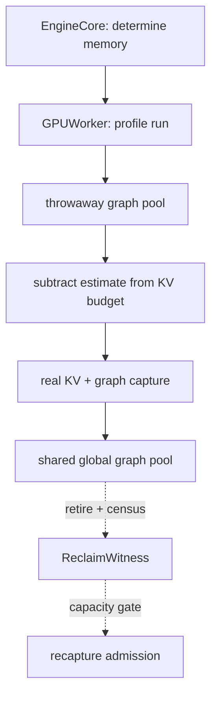

> 源码基线：vLLM [`4274ae95`](https://github.com/vllm-project/vllm/commit/4274ae956c7df16b07f6d68ba400e6321de1f47e)，相对上一章前进 86 个提交；本文涉及的 graph pool、profiling 与 release 主路径未变。已合入 [PR #59160](https://github.com/vllm-project/vllm/pull/59160) 提供 cuMem graph pool 的 sleep/offload 证据；仍开放的 [PR #59368](https://github.com/vllm-project/vllm/pull/59368) 与 [PR #51590](https://github.com/vllm-project/vllm/pull/51590) 仅作为计划和实验事实，不能写成当前实现。

## 本篇在课程路线中的位置

第 50 章把失败 key 固化为 `EAGER_ONLY`，并规定 orphan graph 必须经过 admission fence、replay lease drain 和删除。今天只追问删除后的物理事实：**Python entry 不可达、CUDA graph executable 被销毁、HBM 可重新分配，是不是同一件事？如果不是，recapture 凭什么再次占用显存？**

课程位置：

`orphan retirement → graph-pool census → reclaim witness → recapture admission backpressure`

## 前置知识回顾

- graph replay 固定 kernel 参数与虚拟地址；只要旧 executable 仍可能 replay，它关联的地址就不能换给别的对象。
- `GRAPH_READY/EAGER_ONLY` 是 group 控制面终态；worker-local graph object 和物理 pool 是另一条资源生命周期。
- `cancel requested`、Python 引用删除、allocator cache 释放、device free bytes 增加是四个强度不同的事实。
- 同一 generation 的迟到 capture 只能回收，不能越过 group final 重新开放 replay。

## 本篇要回答的核心问题

1. vLLM 当前怎样在 KV cache 分配前预留 graph 显存，又怎样在真实 capture 后对比估算？
2. `self.graphs.clear()`、`gc.collect()` 与 `empty_cache()` 各自能证明什么，为什么 shared pool 下无法把某个 key 的“估计字节数”直接返还？
3. 怎样定义一个可审计的 `ReclaimWitness`，并把它接到 recapture admission，而不是等到 OOM 才被动收敛？

## 组件在全局架构中的位置

当前启动期已经有一条容量链；缺的是运行期回收结果回灌 admission 的链：



实线是当前代码；虚线是本文建议的运行期控制面。关键原则是：**启动时用估算保护 KV 预算，运行时则必须用观测到的 pool/设备状态保护 recapture 峰值。**

## 完整调用链

### 1. 公开初始化入口先为 graph 留预算

[`EngineCore`](https://github.com/vllm-project/vllm/blob/4274ae956c7df16b07f6d68ba400e6321de1f47e/vllm/v1/engine/core.py#L298-L323) 经 [`Executor.determine_available_memory`](https://github.com/vllm-project/vllm/blob/4274ae956c7df16b07f6d68ba400e6321de1f47e/vllm/v1/executor/abstract.py#L162-L164) 调到每个 `GPUWorker`。worker 先做普通 `profile_run`，再调用 [`model_runner.profile_cudagraph_memory()`](https://github.com/vllm-project/vllm/blob/4274ae956c7df16b07f6d68ba400e6321de1f47e/vllm/v1/worker/gpu/model_runner.py#L1018-L1021)。返回值是单个 `int` 字节数，随后从 `requested_memory - non_kv_cache_memory` 中再扣除，得到 [`available_kv_cache_memory_bytes`](https://github.com/vllm-project/vllm/blob/4274ae956c7df16b07f6d68ba400e6321de1f47e/vllm/v1/worker/gpu_worker.py#L660-L709)。

[`profile_cudagraph_memory`](https://github.com/vllm-project/vllm/blob/4274ae956c7df16b07f6d68ba400e6321de1f47e/vllm/v1/worker/gpu/cudagraph_utils.py#L872-L987) 临时建立最小 KV cache，把全局 pool 指向 `throwaway_pool`，完整测 PIECEWISE/encoder/speculator，只抽样两个最大 FULL descriptor 并外推。finally 中清 wrapper、丢 speculator manager、清临时 KV、`gc.collect()` 和 `empty_cache()`。因此它的后置条件不是“留下可 replay graph”，恰恰是“估出 headroom 后把 profiling graph 全部销毁”。

### 2. 真实 capture 进入进程级 shared pool

真实 warmup 后，[`GPUWorker.compile_or_warm_up_model`](https://github.com/vllm-project/vllm/blob/4274ae956c7df16b07f6d68ba400e6321de1f47e/vllm/v1/worker/gpu_worker.py#L913-L943) 调 `capture_model()`，再比较真实 free-memory delta 与启动估算。`CudaGraphManager`、普通 `CUDAGraphWrapper` 和 `BreakableCUDAGraphWrapper` 都从 [`get_global_graph_pool()`](https://github.com/vllm-project/vllm/blob/4274ae956c7df16b07f6d68ba400e6321de1f47e/vllm/platforms/interface.py#L1315-L1320) 取得同一个 opaque handle，并通过 [`capture_pool`](https://github.com/vllm-project/vllm/blob/4274ae956c7df16b07f6d68ba400e6321de1f47e/vllm/compilation/cudagraph_pool.py#L21-L45) 路由到普通 graph pool 或 sleep-mode cuMem pool。

PyTorch 的 [Graph memory management](https://docs.pytorch.org/docs/2.14/notes/cuda.html#graph-memory-management) 明确要求 graph-private pool 活到 `CUDAGraph` 和 capture 期间产生的 tensors 都离开作用域；共享 pool 可以减少浪费，但只在 graphs 不并发 replay、顺序关系安全时成立。vLLM 选择全局共享正是为了复用峰值 segment，所以“每个 key 各占多少物理字节”通常不是可加总量。

### 3. 正常 release 只给出对象级动作

Elastic EP 的 [`_release_cuda_graphs`](https://github.com/vllm-project/vllm/blob/4274ae956c7df16b07f6d68ba400e6321de1f47e/vllm/distributed/elastic_ep/elastic_execute.py#L436-L462) 调 manager [`release_graphs()`](https://github.com/vllm-project/vllm/blob/4274ae956c7df16b07f6d68ba400e6321de1f47e/vllm/v1/worker/gpu/cudagraph_utils.py#L396-L406)：清 `graphs`、关闭 `_graphs_captured`，再清所有 breakable wrapper entries；随后 reset compiler、GC、synchronize、`empty_cache()`。源码没有返回释放字节、pool snapshot 或 generation-bound witness。

所以当前调用者知道“release 流程走完”，却不知道某个 orphan key 删除后 pool segment 是被其他 graph 继续占用、留在 caching allocator，还是已经回到设备 free list。

## 关键类型、字段和状态生命周期

当前关键对象生命周期如下：

- `BatchExecutionDescriptor → torch.cuda.CUDAGraph`：由 `CudaGraphManager.graphs` 强引用；`clear()` 后 Python owner 消失，但 shared pool 可能仍被其他 graph/tensor 持有。
- `_BreakableEntry → BreakableCUDAGraphCapture → segments`：segments 保存 bound `CUDAGraph.replay`；清 entry 才能释放整条 capture 引用链。eager break 的参数使用 weak ref，专门避免把 pool slot 跨 descriptor 强行 pin 住。
- `_global_graph_pool`：平台 class singleton 持有 opaque pool id，不等于一块可独立 free 的 tensor；所有 capture domain 可能共享。
- cuMem `pointer_to_data`：每个 allocation 带 `tag`、handle、`is_asleep` 与可选 CPU backup。它能按 `cudagraph` tag 做物理映射 census，但 sleep 是保留 VA/内容以便恢复，不是永久 retire。

建议增加的接口（**非当前实现**）：

```text
GraphPoolCensus = {
  worker_attempt, context_generation, pool_id,
  live_keys, live_graphs, replay_leases,
  pool_reserved_bytes, device_free_bytes, allocator_backend
}

ReclaimWitness = {
  generation, graph_domain, descriptor_hash,
  admission_fenced, replay_leases_zero, entry_absent,
  pool_bytes_before, pool_bytes_after,
  device_free_before, device_free_after,
  verdict: RECLAIMED | REUSED_IN_POOL | QUARANTINED
}
```

`REUSED_IN_POOL` 不是失败：如果旧 key 的 slot 已可供同一安全 pool 内的新 graph 重用，它可降低 `M_capture_growth`；但它不能被记成 `device_free`。只有 census 明确了 allocator backend 和 pool identity，这两个数才有可比较意义。

## 逐函数源码解读

### `profile_cudagraph_memory`：容量估算，不是 reclaim oracle

它的输入是持有模型、KV spec、manager 和 static buffers 的 `GPUModelRunner`，输出为字节数；执行假设是 worker 独占初始化阶段，device 上可以 capture/synchronize。FULL 外推公式是“首图成本 + 其余图按第二个样本、至少 1 MiB”，它是启发式预算，不提供 per-key 所有权。

开放的 PR #59368 指出 free-memory delta 会混入首次 NCCL/JIT、warmup cache 和负 sample 等非 pool 项，并提议用 allocator snapshot 的 `segment_pool_id` 量 shared pool；PR #51590 则为旧 runner 提议全 descriptor profiling。两者都有实验数据，但截至本基线均未合入，本文只把它们视为“当前观测接口仍不够”的证据。

### `clear_graphs/release_graphs`：删除 owner，不返回物理结果

普通 wrapper 的 [`clear_graphs`](https://github.com/vllm-project/vllm/blob/4274ae956c7df16b07f6d68ba400e6321de1f47e/vllm/compilation/cuda_graph.py#L232-L233) 与 breakable wrapper 的 [`clear_graphs`](https://github.com/vllm-project/vllm/blob/4274ae956c7df16b07f6d68ba400e6321de1f47e/vllm/compilation/breakable_cudagraph.py#L313-L314) 都只是 dict clear。PyTorch `empty_cache()` 也只释放 allocator 中未占用的 cached memory；官方文档明确说它不会增加 PyTorch 自己可用的显存，只可能改善碎片。因此 `entry_absent=True` 是必要条件，不是容量结论。

### cuMem `cudagraph_pool`：可做 tag census，但 sleep 不等于 retire

[`CuMemAllocator.cudagraph_pool`](https://github.com/vllm-project/vllm/blob/4274ae956c7df16b07f6d68ba400e6321de1f47e/vllm/device_allocator/cumem.py#L433-L448) 创建独立 `MemPool` 并把 capture allocation 标成 `cudagraph`；sleep 会备份并 unmap physical pages，wake 在原 VA remap。它给出了最接近 resource ledger 的 `pointer_to_data`，但当前 `get_current_usage()` 汇总所有 tag，且没有 `(domain,key) → ranges` 映射。它能证明 graph pool 映射了多少，不足以证明某个 key 独占多少。

## 具体示例与 shape/状态演算

先看仓库里的直接测试。`test_profile_cudagraph_memory_frees_throwaway_pool` 创建 64 MiB 临时 KV，再为主 manager 和 speculator 各 capture 一个产生 64 MiB output 的 graph：capture 时 `memory_reserved` 至少增加 `3 × 64 = 192 MiB`；profiling teardown 后必须严格回到 baseline。这证明 **throwaway pool 全生命周期闭合时**可以得到强回收证据，不证明 persistent shared pool 中删除一个 key 会释放同样字节。

再做一个 shared-pool 教学演算（数值用于解释，不是仓库 benchmark）：

| 时刻 | K8 graph | K16 graph | shared pool segment | device free 增量 |
| --- | --- | --- | ---: | ---: |
| capture 后 | live | live | 96 MiB | 0 |
| 删除 K8 | absent | live | 96 MiB | 0 |
| 删除 K16、tensor 尚有引用 | absent | absent | 96 MiB | 0 |
| 引用归零 + GC；segment 可由 pool 重用 | absent | absent | 96 MiB | 0 |
| allocator 真正 release segment | absent | absent | 0 MiB | 96 MiB |

K8 capture 期间虽曾需要 72 MiB，它与 K16 共享同一 96 MiB 峰值段；删除 K8 不能把 72 MiB 加回 admission。安全预算应写成：

\[
M_{weights}+M_{KV}+M_{workspace}+M_{graph\ pool}+M_{quarantine}+M_{recapture\ peak}+M_{fragmentation}\le M_{usable}
\]

若 census 显示旧 pool 已有足够可重用空闲空间，则本次 `M_recapture_peak` 只取预测的增量；否则取完整 capture 峰值。`M_quarantine` 在 hung rank 没有 context/process reset witness 前不得归零。

## 为什么这样设计及替代方案

| 方案 | 延迟/吞吐 | 显存与并发 | 正确性/维护成本 |
| --- | --- | --- | --- |
| 删除 entry 后立即把估计值返还 | admission 快 | 容易 double-count shared segment | 不可接受，OOM 只是迟到的证据 |
| 每次 retire 全进程 pool + `empty_cache` | recapture 慢、成功 key 也丢失 | census 简单、峰值可预测 | 安全基线，隔离性差 |
| shared pool census + 增量准入 | 保留成功 graph，减少重复分配 | 必须跟踪 pool、lease、fragmentation | 推荐；实现和测试成本最高 |
| 每 key 独立 pool | per-key reclaim 清晰 | 失去跨 shape 峰值复用，segment 更多 | ownership 简单，显存效率可能更差 |

最小可落地顺序是：先把整池 release 做成有 witness 的安全基线；再增加 pool snapshot 和 key manifest；最后才做 per-key retirement。没有稳定的物理 oracle 时，精细 admission 只是在精确记录一个猜测。

## 性能、并发、正确性与边界条件

- **延迟**：recapture admission 不能只看稳态 free bytes，还要预留 capture 时旧/新 generation 同时存在的峰值。
- **吞吐**：过早全池释放会让高命中 K8 退回 eager；过度保守 quarantine 又会长期损失 graph 收益，应以 `replay_saved_time / incremental_pool_byte` 排队，而不是按到达顺序无限重抓。
- **显存**：`memory_reserved` 对普通 caching allocator 有意义；cuMem/pluggable allocator 可能绕过 PyTorch tracking，当前 [`memory_profiling`](https://github.com/vllm-project/vllm/blob/4274ae956c7df16b07f6d68ba400e6321de1f47e/vllm/utils/mem_utils.py#L298-L320) 因此用 `get_memory_info()` 的 free delta 计算总占用。witness 必须记录观测口径。
- **并发**：先冻结该 key 的 dispatch，再让 replay lease 归零；census 前后都要在明确 stream/event fence 后采样，不能用一次 host dict clear 推断 device quiescence。
- **graphability**：shared pool 的收益依赖 graphs 不并发且按安全顺序 replay；未来多 stream 会改变这个前提，源码已有 TODO。
- **失败方式**：若 pool snapshot 不支持当前 backend、free bytes 被同进程其他任务扰动、或 rank/context 状态未知，verdict 只能是 `QUARANTINED`，不能用估算补成 `RECLAIMED`。

建议 admission 采用水位而非通用百分比：

```text
admit(key) iff
  measured_headroom
  >= predicted_incremental_capture_peak(key)
     + failure_reserve
```

三项都从同一 allocator/backend 的近期 census 与 capture 样本得到；源码没有数据时不应发明固定阈值。

## 测试证据与未覆盖风险

当前直接测试事实：

- [`test_profile_cudagraph_memory_frees_throwaway_pool`](https://github.com/vllm-project/vllm/blob/4274ae956c7df16b07f6d68ba400e6321de1f47e/tests/v1/worker/test_gpu_model_runner_v2_cudagraph_profiling.py#L346-L405) 验证上述 3×64 MiB 捕获后 `memory_reserved` 回到 baseline；它覆盖全量 profiling teardown，不覆盖 persistent pool 的 per-key delete。
- 同文件的 CPU orchestration tests 验证无 graph 返回 0、异常仍 teardown、wrapper pool 被重定向并恢复、speculator manager 被丢弃；它们验证控制流和引用清理，不验证真实 HBM。
- [`test_cudagraph_pool_sleep`](https://github.com/vllm-project/vllm/blob/4274ae956c7df16b07f6d68ba400e6321de1f47e/tests/basic_correctness/memory/cumem/test_cumem.py#L428-L480) 验证 `cudagraph` tag 在 sleep 后按原映射恢复，graph replay 仍正确；[`sleep-mode E2E`](https://github.com/vllm-project/vllm/blob/4274ae956c7df16b07f6d68ba400e6321de1f47e/tests/basic_correctness/memory/sleep_mode/test_sleep_mode.py#L229-L268) 覆盖 FULL、PIECEWISE、breakable 与 TP=2 custom all-reduce。它证明 offload/remap，不证明永久 reclaim。
- 当前 tests 中没有直接调用 `release_graphs()`，也没有“删 K8、保留 K16”后检查 pool segment/free bytes 的测试。

本地环境仍没有 `pytest`，本章未声称重新运行 suite。最小新增 golden 应覆盖：shared pool 两 key 删除一个时不得虚增容量；最后一个 graph/tensor 离开作用域后产生 witness；late replay lease 阻止 delete；普通 allocator 与 cuMem 两种 census；`empty_cache` 前后 fragmentation；owner crash 后旧 generation witness 被拒；TP 任一 rank quarantine 时 group admission 失败；连续失败 recapture 触发 backpressure 而非 storm。

## 与前后章节的连接

到这里，recapture 的证据链从逻辑终态落到了物理容量：

`EAGER_ONLY → replay fence → entry retirement → pool census → reclaim witness → capacity admission`

下一章将处理 admission 队列本身：多个 key 同时等待时，怎样用 replay 收益、增量 pool byte、capture cost 与 SLO 选择顺序，并阻止同一失败 key 反复 recapture 形成抖动。

## 本篇结论、知识债、三个理解检查问题和下一章

结论：

1. vLLM 已在启动期估算 graph memory 并从 KV 预算扣除，但这不是运行期 per-key reclaim oracle。
2. `graphs.clear()` 只消除一个 Python owner；shared pool、capture tensors、allocator cache 和 device free list 是四层不同状态。
3. shared pool 的物理占用按峰值复用，不能把每个 graph 的 capture delta相加，也不能在删除一个 key 后原样返还。
4. `ReclaimWitness` 必须绑定 worker/context generation、pool、key、replay lease 与一致的字节观测口径；未知只能 quarantine。
5. recapture admission 应使用 `headroom ≥ incremental capture peak + failure reserve`，并把 orphan/quarantine 继续计入容量。

仍欠真实 `GraphPoolCensus/ReclaimWitness` schema、pool-specific snapshot adapter、普通 allocator/cuMem 统一口径、per-key FULL/PIECEWISE retire、replay refcount、fragmentation accounting、TP group capacity aggregate、watermark/backpressure 与真机 OOM/late-replay golden。

理解检查：

1. K8 与 K16 共用 96 MiB pool segment 时，为什么删除逻辑上占 72 MiB 的 K8 不能立刻把 72 MiB 返还 scheduler？
2. `memory_reserved` 下降、`get_memory_info().free` 上升和 cuMem allocation `is_asleep=True` 分别证明了什么？
3. 为什么 `ReclaimWitness` 必须绑定 context generation，而不能只记录 descriptor 和释放字节？

下一章：**Pool 有空间也不能全抓——Benefit-per-byte、Recapture Queue 与 Anti-thrashing。**

## 课程账本增量

- 第 51 章；源码基线 `4274ae95`。
- 新覆盖启动期 graph memory profiling → KV budget、throwaway/global/cuMem pool、wrapper/manager ownership、Elastic EP release、allocator/free-memory 观测口径。
- 新确认不变量：entry absence、pool reusable bytes、allocator cached bytes 与 device free bytes不可互换；shared pool 只能按物理 census 做增量准入；quarantine 在 reset witness 前继续占预算。
- 测试缺口：per-key release、shared-pool segment census、generation-bound reclaim witness、ordinary/cuMem parity、fragmentation、TP aggregate 与 recapture storm backpressure。
