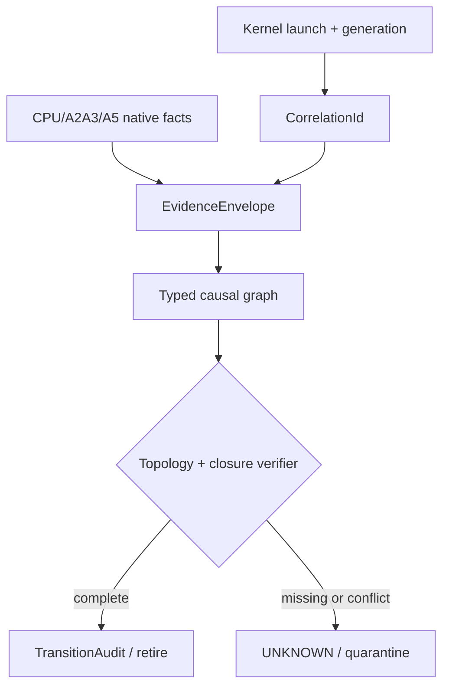
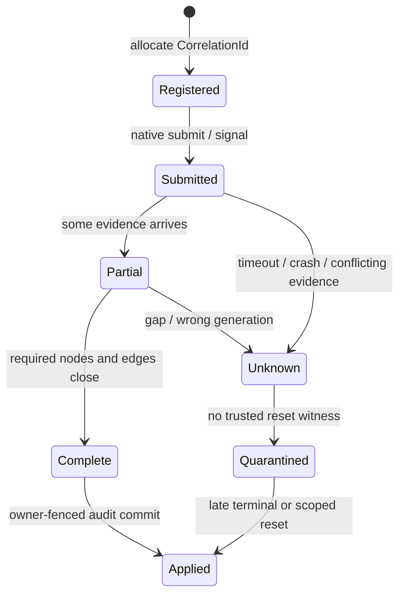

> 源码基线：pto-isa [`418de18d`](https://github.com/hw-native-sys/pto-isa/commit/418de18dde8fa33773dc5c384fdfe5506463b628)，合入于 2026-10-09。本文严格区分**当前代码/规范事实**、**本次测试事实**和**建议恢复协议**；`CorrelationId`、`CausalLink`、`EvidenceEnvelope` 与跨 backend join verifier 尚不存在于仓库。

## 本篇在 PTO 课程路线中的位置

第 60 章已经把 instruction trace 与 control-plane `TransitionAudit` 分开：前者回答“执行了哪些指令”，后者回答“权威 recovery state 为什么改变”。剩下的断点是：audit 引用的 completion evidence 到底来自哪一次 launch、哪个 backend、哪一代 workspace、哪一组 producer/consumer？

本章只补这条连接：**先用稳定的 operation/attempt/generation identity 找到同一件事，再用有类型的 causal link 表达 happens-before，最后按 backend topology 检查证据闭包。时间戳只做诊断，不参与正确性判定。**

课程位置：

`instruction trace → correlation identity → typed causal graph → backend evidence closure → transition audit`

## 前置知识

- CPU_SIM `InstructionTraceRecord.sequence_id` 是 worker-local 序号；`block_idx` 与 `subblock_id` 才组成 worker identity。
- `set_flag/wait_flag` 的 ISA identity 是 `(src_pipe, dst_pipe, event_id)`，表达 producer→consumer 的方向性依赖，不是全局 barrier。
- A2/A3 cross-core event 是 mode2 broadcast/reduce；A5 使用 per-subblock semaphore，并允许只阻塞指定 pipeline。
- event/semaphore ID 会复用。相同物理 ID 不代表相同历史，更不能替代 run、attempt 或 generation。
- 只有同代 terminal evidence、可信 scoped reset 或持续 quarantine 才能授权 backing reuse。

## 今日两个核心问题

1. 为什么把 CPU_SIM JSONL、A2/A3 flag 和 A5 semaphore 按时间排序，仍然不能证明它们属于同一次逻辑操作？
2. 怎样定义最小 correlation identity 与 causal graph，使 A2/A3 的“一次 broadcast/一次 reduce”和 A5 的“两次 1:1 signal/分 pipeline wait”都能证明同一个逻辑闭包，又不伪造硬件状态同构？

## PTO 全栈中的位置

上游是 kernel launch、PTO event chain、owner/generation 与 backend-native signal；中间层把 native observation 包成 immutable evidence；下游是 `TransitionAudit`、quarantine release、checkpoint 和跨 backend fault Golden。



关键边界是：correlation 解决“是不是同一件事”，causality 解决“谁必须先于谁”，closure 解决“授权 transition 所需的参与者和边是否齐全”。三者不能合并成一个 timestamp 或一个 event ID。

## 概念和精确语义

### 1. `CorrelationId` 必须在 submit 前产生

下面是**建议 schema**，不是当前 API：

```text
CorrelationId = {
  operation_id,        // 逻辑操作，稳定且全局唯一
  attempt_id,          // 同一 operation 的第几次物理尝试
  owner_epoch,         // 谁有权解释/应用结果
  execution_domain,    // device / stream / cluster / session
  workspace_generation,
  backend_profile      // CPU_SIM / A2A3 / A5
}
```

`operation_id` 不能在完成后从日志反推；否则 crash-before-log 会生成“无身份动作”。`attempt_id` 也不能省：超时后重试同一 logical operation 时，旧 attempt 的迟到 flag 不能完成新 attempt。`backend_profile` 不用于宣称三者等价，而用于选择各自的 closure rule。

### 2. native locator 只是 envelope 的一部分

同一个 logical edge 在三个 backend 上有不同 locator：

| Backend | 当前可见事实 | 建议 native locator | 不能单独证明 |
| --- | --- | --- | --- |
| CPU_SIM | `block_idx/subblock_id/sequence_id/opcode/operands` | `launch_id + worker + [seq_begin,seq_end] + trace_digest` | 跨 worker happens-before、设备 completion |
| A2/A3 | `ffts_cross_core_sync`、`wait_flag_dev`、mode2 credit | `device/group + event_id + signal_ordinal + participant_set` | 属于哪个 attempt、旧 credit 已清空 |
| A5 | `set_intra_block`、`wait_intra_block`、pipe 与 sem ID | `device/block + pipe + sem_id + target_subblock + signal_ordinal` | 另一个 subblock 也已完成、整个 SU terminal |

因此建议的 `EvidenceEnvelope` 至少还要绑定 `CorrelationId`、evidence kind、producer/consumer logical node、native locator、payload/trace digest、observed revision，以及签发该证据的 adapter/schema version。physical ID 可以定位 observation，却不能充当时间身份。

### 3. `CausalLink` 是有类型的偏序边

最小 edge type 可分为：

- `PRODUCES`：某条指令/span 产生 payload 或 signal；
- `UNBLOCKS`：signal 允许指定 consumer 前进；
- `COMPLETES`：backend terminal witness 完成某个 attempt；
- `RESET_COVERS`：可信 reset 的 scope 覆盖 operation/domain/generation；
- `SUPERSEDES`：新 attempt 取代旧 attempt 的控制权，但不宣称旧物理动作已停止。

合法 link 必须满足两端 `operation_id/attempt_id/generation` 一致，或由规则显式声明跨 attempt 的 `SUPERSEDES`；source/destination role 与 backend topology 相容；evidence digest 不冲突。墙钟、采集时间和 JSONL 行号可以附带，却不能生成 `COMPLETES` 边。

### 4. closure 是集合证明，不是“看见最后一步”

对 logical operation `o`，设 backend profile 给出的必需节点集为 `V_req(o)`、必需边集为 `E_req(o)`；当前收到的可信证据经过 identity、schema 与 digest 校验后，得到 `V_obs(o)`、`E_obs(o)`。最小完成条件是：

```text
V_req(o) ⊆ V_obs(o)
E_req(o) ⊆ E_obs(o)
and every observed endpoint has the same (operation, attempt, generation)
and no two envelopes claim conflicting payload for one evidence_id
```

这里的 `E_req` 由 backend adapter 根据 logical DAG 与 profile 共同生成。A2/A3 可以让一份 broadcast envelope 展开成两条 logical edge，但该 envelope 必须声明覆盖的 participant set；A5 的两份 1:1 signal 不能互相替代；CPU_SIM 的 `TSTORE` 只是某个 worker 的 program-order terminal，除非 wrapper 另给出 launch completion/peer edge，否则不能自动进入 `E_req` 的跨 worker部分。

建议 verifier 依次执行六步，并输出稳定 reason：

1. **身份过滤**：严格匹配 operation、attempt、owner epoch、domain 与 workspace generation；旧代归入自己的债务集合。
2. **完整性校验**：验证 envelope schema、canonical bytes、digest/signature 与 immutable native locator。
3. **拓扑展开**：把 A2/A3 broadcast/reduce 展开为 logical multi-edge；A5 保留 subblock/pipe；CPU 保留 worker/span。
4. **局部合法性**：检查 producer/consumer role、pipe direction、event/sem 范围与重复 ordinal。
5. **闭包检查**：比较 required/observed participant 与 edge；缺边输出 `MISSING_WITNESS`，不做最佳努力完成。
6. **冲突检查与提交**：同 evidence ID 的不同 payload、同 ordinal 的不同 producer、未知 schema 或 scope widening 输出 `CONFLICT/UNKNOWN`；只有无冲突闭包才能产生 evidence-root hash。

前置条件是 registry 已冻结该 attempt 的 topology 和 payload identity；后置条件只是生成 immutable `CompleteEvidenceRoot`，并不直接 free 资源。真正的 reuse 仍需要当前 owner 在 expected revision 上消费该 root、提交 state+audit。非法组合包括：把 attempt1 的 signal 接到 attempt2 的 wait；以 AIV0 witness 替代 AIV1；把 A5 `PIPE_V` terminal 扩大成整个 device terminal；用 `trace.jsonl` 的文件末尾推导 runtime completion；用 reset API 调用成功但 scope 未覆盖 workspace generation 的结果构造 `RESET_COVERS`。

### 5. 三种“相同”必须分开

跨 backend调试常把三类 equality 混在一起：

- **semantic equality**：三个 backend 对同一输入计算出相同 logical result；
- **causal equality**：它们实现同一个 required logical DAG；
- **physical equality**：它们产生相同数量、顺序和粒度的 native event。

课程目标只要求前两项，第三项明确不要求。A2/A3 的一个 broadcast 与 A5 的两个 signal 在 physical trace 上不同，却可实现相同的两个 ready edge；反过来，即使两份日志 opcode 完全一致，只要 attempt/generation 不同，也没有 causal equality。这个区分让 cross-backend Golden 可以比较 verdict、required node/edge closure 与最终数值，而不把硬件代际差异误判为失败。

## 真实文件、类型、API 与实现逐段解读

### CPU_SIM：trace 有 worker identity，却没有 operation identity

[`include/pto/cpu/trace.hpp`](https://github.com/hw-native-sys/pto-isa/blob/418de18dde8fa33773dc5c384fdfe5506463b628/include/pto/cpu/trace.hpp) 的 `InstructionTraceRecord` 包含 `block_idx`、`subblock_id`、`sequence_id`、`opcode`、输入/输出 Tile 与 scalar；`InstructionTraceState` 是 thread-local，`ReserveInstructionTraceSequenceId()` 在该 state 的 mutex 下递增。`PtoInstrTraceScope` 在构造时捕获 worker/opcode/输入，在析构时补输出并 append。

这精确证明了单 worker 的 program order，却没有 `launch_id`、`operation_id`、`attempt_id`、owner epoch 或 generation 字段。launch ID 只体现在导出目录。把不同文件中相同 `sequence_id=6` 的 `TSTORE` 视为同一 completion，是 identity collision。

### A2/A3：一个物理 signal 可对应两条逻辑边

[`include/pto/npu/a2a3/TSync.hpp`](https://github.com/hw-native-sys/pto-isa/blob/418de18dde8fa33773dc5c384fdfe5506463b628/include/pto/npu/a2a3/TSync.hpp) 将 `TMOV_A2V`、`TMOV_V2M/TEXTRACT_V2M` 的特定 pipe 组合识别为 `IsCrossCore`，并静态要求 cross-core event 关闭 `AutoToken`、由调用者给 `CrossCoreId`。`InitImpl` 用 mode2 message 调 `ffts_cross_core_sync`；`WaitImpl` 调 `wait_flag_dev`。普通跨 pipe event 才走 `set_flag/wait_flag`。

规范 [`set_cross_core`](https://github.com/hw-native-sys/pto-isa/blob/418de18dde8fa33773dc5c384fdfe5506463b628/docs/isa/scalar/ops/pipeline-sync/set-cross-core.md) 与 [`wait_flag_dev`](https://github.com/hw-native-sys/pto-isa/blob/418de18dde8fa33773dc5c384fdfe5506463b628/docs/isa/scalar/ops/pipeline-sync/wait-flag-dev.md) 给出 mode2 语义：C→V 一次 signal 同时到达 AIV0/AIV1；V→C 时 Cube 的一次 wait 必须等两个 subblock 的 signal。逻辑图里仍有 `ready→AIV0`、`ready→AIV1` 两条边，以及 `AIV0→join`、`AIV1→join` 两条边；只是 backend 用 broadcast/reduce 压缩了物理 observation。

### A5：每个 subblock、每条 pipeline 分开证明

[`include/pto/npu/a5/TSync.hpp`](https://github.com/hw-native-sys/pto-isa/blob/418de18dde8fa33773dc5c384fdfe5506463b628/include/pto/npu/a5/TSync.hpp) 的 cross-core `InitImpl` 对 `CrossCoreId` 和 `CrossCoreId+16` 各调用一次 `set_intra_block`；`WaitImpl` 调 `wait_intra_block(Base::srcPipe, CrossCoreId)`。规范 [`set_intra_block`](https://github.com/hw-native-sys/pto-isa/blob/418de18dde8fa33773dc5c384fdfe5506463b628/docs/isa/scalar/ops/pipeline-sync/set-intra-block.md) 明确无 broadcast，ID 0–15 与 16–31 区分两个 subblock；[`wait_intra_core`](https://github.com/hw-native-sys/pto-isa/blob/418de18dde8fa33773dc5c384fdfe5506463b628/docs/isa/scalar/ops/pipeline-sync/wait-intra-core.md) 只阻塞指定 pipeline，其余 pipe 可继续。

这意味着 A5 join 不能看到“一条 sem 完成”就折叠为 cluster completion。closure 必须逐 subblock、逐要求的 pipeline 检查；否则 AIV0 完成而 AIV1 迟到时会提前释放共享 backing。

### 规范事实、实现事实与硬件推断的边界

当前资料足以确认 API 选择、ID 映射、blocking scope 和测试中的功能行为，但不能据此推出片上 semaphore 的物理存储位置、消息网络延迟、counter 更新的真实原子域或各 pipeline 的具体 cycle。A2/A3 “SU 级阻塞比 A5 per-pipe wait 更可能损失 overlap”是由可见 blocking scope 推导出的性能方向，不是已经量化的真机结论；A5 “两次 signal 元数据更多”也不等于 wall time 必然更高，因为它可能与其它 pipe 并行。文章后续所有 performance 比较都只把这些作为待测假设。

实现还显示 cross-core event 必须手工指定 ID，普通 event 才可由 `EventIdCounter` 自动轮转；这说明编译期/调用方已经承担一部分 ID 生命周期责任，却没有提供跨 launch generation。即使静态检查保证 ID 范围合法、`Wait()` 与 `Init()` 类型匹配，也仍无法拒绝“上一 launch 的 event3 被下一 launch 复用”这一时间错误。因此 correlation registry 不是重复 event verifier，而是补足 verifier 无法跨进程、跨 crash、跨 generation维护的历史身份。

## 对象与证据生命周期



建议 registry 在 submit 前写入 `Registered`。每份 evidence 以 immutable envelope 追加，joiner 只构造新 snapshot，不修改原始 trace。`Complete` 只说明 backend-specific closure 成立；还要由当前 owner 在 expected revision 上提交 `TransitionAudit`，才能进入 `Applied`。旧 attempt 的迟到 evidence 保留用于诊断或解除它自己的 quarantine，不能更新新 attempt。

对象所有权也必须清楚：launch owner 创建 `CorrelationId` 并冻结 topology；backend adapter 只拥有把 native fact 封装为 envelope 的权限，不能决定资源复用；joiner 持有 immutable evidence snapshot，输出三值 `Complete/Incomplete/Conflict`；recovery owner 才能把 `Complete` 应用到 canonical state。任何一层 crash 都不应要求修改旧 envelope：重启后重新读取 registry、重建图并计算相同 evidence root 即可。若 adapter 在 native action 之后、envelope 持久化之前崩溃，该 attempt 是 `MAY_HAVE_APPLIED`，必须查询、reset 或 quarantine，不能以“没有 envelope”推断“没有执行”。

## 端到端调用链与证据链

以一次 `TMOV_A2V` 后由两个 vector subblock 消费、再由 Cube join 为例：

1. runtime 先登记 `op7/attempt2/owner42/workspace_gen9`；
2. kernel/adapter 将 logical nodes `ready`、`aiv0_done`、`aiv1_done`、`join` 与 native locator 绑定；
3. A2/A3 把 `ready→aiv0/aiv1` 压成一次 mode2 broadcast，把两个 done→join 压成一次 reduce wait；A5 则保留两个 semaphore target 与 per-pipe wait；
4. CPU_SIM 只能从每个 worker 的 trace span 证明局部执行，跨 worker edge 必须由 launch wrapper/event adapter 补充，不能由文件顺序猜；
5. join verifier 检查 identity、attempt/generation、participant set、typed edge 与 digest；
6. closure 成立后，当前 owner 把 evidence-root hash 写进 `TransitionAudit`；否则结果为 `UNKNOWN`，backing 留在 quarantine。

## 具体 shape、Tile 和状态演算

设 payload 是 `16×16xf32`，ND layout，1024 B；workspace generation=9，double buffer 两槽共 2048 B。logical operation 为 `op7`，attempt=2，event base=3。

**A2/A3。** Cube 对 event 3 做一次 mode2 broadcast，物理记录只有一次，但 joiner 展开为 `ready→AIV0` 和 `ready→AIV1`。AIV0、AIV1 各 signal done；Cube `wait_flag_dev(3)` 只有消费两 lane credit 后才产生 `join` witness。若只收到 AIV0 evidence，状态是 `Partial`，不能把 slot 0 的 1024 B 交给 generation 10。

**A5。** AIV0 使用 sem 3，AIV1 使用 sem 19；两条 `set_intra_block`/对应 wait 分别形成两条边。即使 AIV0 的 `PIPE_V` 已解除阻塞，AIV1 或要求的 store pipeline 未闭合，cluster closure 仍不成立。A5 的细粒度等待有更好的 overlap 潜力，但也使 verifier 必须保留 pipe scope。

**CPU_SIM。** 两 block×两 subblock 各产生 `sequence_id=0..6` 的 7 条 trace，共 28 条；两次 launch 又各自从 0 开始。合法 locator 是 `(launch_id,block,subblock,seq span)`，而不是 `sequence_id=6`。若 launch 812 的一个 worker 文件缺失，不能用 launch 813 的同 shape、同地址 `TSTORE` 补洞。

把该例写成 closure 表更直观：

| Logical requirement | A2/A3 witness | A5 witness | CPU_SIM witness |
| --- | --- | --- | --- |
| payload ready to AIV0 | mode2 broadcast，participant 含 AIV0 | sem3 signal/wait | worker0 span + adapter edge |
| payload ready to AIV1 | 同一 broadcast，participant 含 AIV1 | sem19 signal/wait | worker1 span + adapter edge |
| AIV0 done before join | lane0 credit 被 reduce wait 消费 | AIV0 return signal + scoped wait | worker0 terminal + adapter edge |
| AIV1 done before join | lane1 credit 被 reduce wait 消费 | AIV1 return signal + scoped wait | worker1 terminal + adapter edge |
| attempt terminal | participant set 全闭合并有 runtime terminal | 所有 required subblock/pipe 闭合并有 runtime terminal | launch wrapper terminal；JSONL alone 不够 |

这张表也限定替代写法：A2/A3 adapter 可以把一份 physical evidence 引用两次，但两条 logical edge 必须共享同一 digest并列明 coverage；它不能复制两份互不相关的 envelope 冒充两个 signal。A5 adapter 则不能为了“统一格式”把 sem3/19 提前合并，否则丢失 partial completion 与错误 subblock 的诊断能力。

## 为什么这样设计及替代方案

最诱人的替代方案是建立全局 timestamp：把所有日志 NTP/PTP 对齐后排序。它成本看似低，却同时违反三条硬约束：时钟存在偏差；采集可晚于真实执行；event ID、地址和 sequence 会复用。时间顺序最多帮助诊断，不能证明 identity 或 completion。

另一种方案是在每个 Tile payload 中嵌入 correlation header。它能跟随数据，却会改变 layout/对齐、增加 GM/UB 流量，并让计算 kernel 处理控制元数据。更合适的默认是 sidecar registry：热路径只携带短 token/native locator，冷路径保存完整 envelope；必要时对 trace span 做 Merkle/digest，而不是逐条持久化全部 operand。

join 也不应强制三 backend 输出相同事件序列。正确目标是**同一逻辑 DAG、不同 lowering、相同 closure verdict**。A2/A3 的物理压缩减少 signal/wait，但 SU 级阻塞可能扩大 stall；A5 事件更多、元数据更大，却允许其他 pipe 继续。统一成最小公分母会损失 A5 overlap，统一成 A5 细粒度又会伪造 A2/A3 不存在的 observation。

还有一种折中是只记录 `operation_id`，不记录 attempt/generation。它能解决并发请求串线，却无法解决重试与迟到完成：op7 第一次超时后启动第二次，同一个 event3 的旧 signal 仍可能被误接到新 wait。增加 `attempt_id` 拒绝逻辑重试串线，增加 workspace generation 防止地址复用串线，增加 owner epoch 防止旧 controller 应用结果。这三个维度看似重复，实际分别 fence 物理执行、内存身份和控制权，删掉任意一个都会留下独立反例。

工程上也不应在证据热路径同步写大 JSON。可让 adapter 先把小的 fixed-size envelope 写入预分配 ring，异步持久化完整 operand/diagnostic；authorization 只依赖已持久化的 canonical fields 与 digest。若诊断 payload 丢失但 canonical envelope 完整，正确性仍可判定；若 canonical envelope 丢失，即使有漂亮日志也必须 fail closed。这样把 correctness record 与 observability payload 分层，能限制延迟和存储放大。

## 访存、计算、流水、并行和硬件约束

- correlation 元数据不改变 1024 B Tile 的数学 shape/dtype/layout；若侵入 payload，会额外占带宽并破坏既有 DMA contract。
- evidence join 位于 control plane，不应给每条 `TADD/TLOAD` 增加 durable transaction；建议以 launch/span 为单位聚合并哈希。
- A2/A3 mode2 reduce 只有 participant set 完整时才能映射为 logical join；重复 credit 必须用 signal ordinal/attempt 隔离。
- A5 per-pipe wait 的 completion scope 小于 whole-core terminal；用它授权整个 workspace reuse 是 scope widening。
- 任何 backend adapter 无法读取 native counter/terminal state时，应输出 `UNKNOWN`，不能用“超时已过”或“日志最后一行是 store”补证据。

## 测试证据与未覆盖风险

本次在与最新提交对应文件逐 blob 相同的源码上执行：

- `python3 tests/run_cpu.py -t ffts`：构建 PASS，`ffts` 223 ms PASS。[测试](https://github.com/hw-native-sys/pto-isa/blob/418de18dde8fa33773dc5c384fdfe5506463b628/tests/cpu/st/testcase/ffts/main.cpp) 覆盖 mode2 broadcast 保留三次重复通知、reduce 每 lane 消费一个 credit、device/group 隔离、run-boundary reset、非法 mode/event/context 拒绝，以及 3000 轮三槽跨共享库 pipeline 的数据可见性。
- `python3 tests/run_cpu.py -t ttrace --trace-mode`：构建 PASS，`ttrace` 15 ms PASS。[`MultiCoreLaunchExportsEachInvocation`](https://github.com/hw-native-sys/pto-isa/blob/418de18dde8fa33773dc5c384fdfe5506463b628/tests/cpu/st/testcase/ttrace/main.cpp) 验证 2 block×2 subblock、每 worker 7 条 `TASSIGN/TLOAD/TADD/TSTORE` 连续序列，以及两次 launch 的独立 JSONL。
- 已合入 [PR #328](https://github.com/hw-native-sys/pto-isa/pull/328) 明确报告 trace-enabled/disabled、worker identity 与多 launch 导出回归；本章复用其 trace 事实，但未把 PR 自述当作跨 backend completion 证明。

逐项看不变量：`BroadcastRetainsRepeatedNotifications` 证明 credit 不因设置 base 被误清；`JoinConsumesOneCreditFromEachLane` 证明 reduce 需要两 lane，而不是最后到达者覆盖前者；`EventDeviceAndGroupIsolation` 证明 native identity 至少包含 device/group；`RuntimeResetDiscardsCredits` 只在“无 active worker 保留 registry pointer”的测试前提下成立，不能推广成生产 cancel；`CrossLibraryPipelinePreservesDataVisibility` 证明正常路径数据可见性，不证明 crash 后迟到写已停止。`ttrace` 则证明 worker 内序列和导出分区，不证明四个 worker 的相对时间。正因为每项测试的 postcondition 不同，join protocol 必须引用精确 witness kind，不能笼统写成 `test_passed=true`。

当前缺口：没有 A5 `set_intra_block/wait_intra_block` 的同等级 fault/closure test；没有把 FFTS event 与 instruction trace 绑定到 operation/attempt/generation；没有 duplicate ID、旧 attempt late signal、缺 worker、冲突 digest、wrong participant、crash-before-envelope、adapter schema mismatch、reset scope widening 与 A2/A3/A5 真机 differential Golden。现有测试证明 native 协议和局部 trace，不证明建议的 evidence join。

## 与前后章节的连接

第 60 章建立 `state + audit` 原子提交，本章规定 audit 引用的 evidence root 怎样从多 backend observation 形成：

`register identity → collect native envelope → build typed DAG → verify backend closure → owner-fenced audit`

下一章将处理闭包不完整的常态：某个 worker trace、lane signal 或 adapter reply 永久缺失时，怎样区分 `Missing/Conflicting/Stale`，让 partial graph 可诊断、可重试，却永远不能被误当成 terminal witness。

## 本篇结论、知识债、三个理解检查问题和下一章

结论：跨 backend trace join 的公共层不是 timestamp 或相同物理 ID，而是 stable operation identity、attempt/generation fence 与 typed causal graph；A2/A3 的 broadcast/reduce 和 A5 的 per-subblock/per-pipe wait 可以证明同一 logical DAG，但 closure rule 必须保留各自 topology；CPU_SIM worker-local trace 需要 launch/event adapter 才能跨 worker建立因果；缺失或冲突 evidence 一律 `UNKNOWN` 并保持 quarantine。

知识债包括真实 `CorrelationId/EvidenceEnvelope/CausalLink` schema、register-before-submit registry、native adapter、signal ordinal、evidence-root canonical encoding、schema evolution、retention/redaction、owner-fenced join transaction、A5 fault tests、duplicate/late-signal crash Golden，以及 A2/A3/A5 真机 differential oracle。

三个理解检查问题：

1. 为什么 A2/A3 一次 broadcast 在 logical DAG 中仍必须展开成两条 consumer edge？
2. A5 的 `PIPE_V` wait 已完成，为什么不能直接证明整个 2048 B double buffer 可以复用？
3. 两个 JSONL 中都出现 `block=0, subblock=1, sequence=6, TSTORE`，还缺哪些字段才能判断它们是否属于同一 attempt？

下一章：**Evidence Join 断了一条边怎么办——Partial Graph、Missing Witness 与 Fail-closed Reconciliation。**

## 课程账本增量

- 章节：61；源码基线 `418de18d`，关联 trace PR #328。
- 新覆盖：A2/A3 `Event::InitImpl/WaitImpl` 与 mode2 FFTS；A5 `set_intra_block/wait_intra_block` 的 per-subblock/per-pipe lowering；CPU_SIM `InstructionTraceRecord/State` 与 `ffts/ttrace` 回归。
- 新建议对象：`CorrelationId`、`EvidenceEnvelope`、typed `CausalLink`、backend topology closure verifier 与 evidence-root hash。
- 新不变量：identity 先于 submit；physical event/address/sequence 可复用且不能充当时间身份；timestamp 不产生 completion；逻辑 DAG 可统一但 native topology 不可抹平；缺失/冲突/wrong-generation evidence fail closed。
- 测试结果：`ffts` 与 `ttrace --trace-mode` 构建、测试均 PASS；A5 fault closure 与 cross-backend join 尚无直接测试。
- 下一章：partial graph、missing/conflicting witness 与 fail-closed reconciliation。
