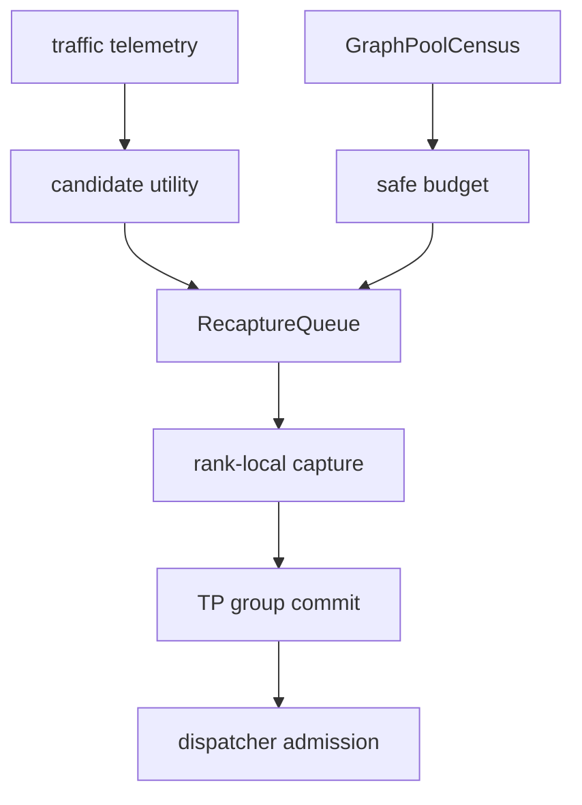
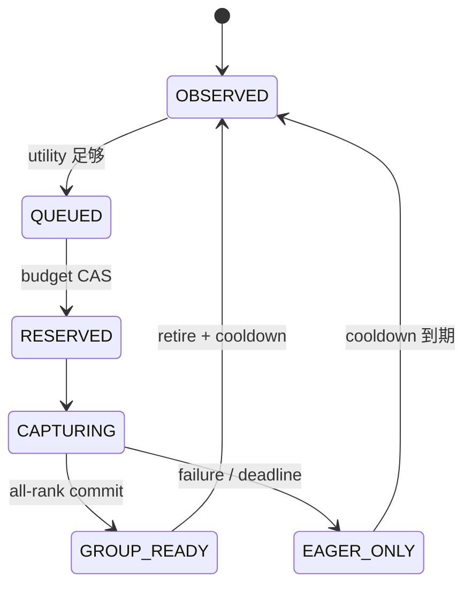

> 源码基线：vLLM [`7d1d8660`](https://github.com/vllm-project/vllm/commit/7d1d8660d620149bc4eadf795cbb80a1f884ddc2)，相对上一章前进 139 个提交。本文严格区分**当前代码事实**与**建议策略**：当前 `main` 没有运行期 recapture queue、benefit-per-byte 打分或 per-key retire；这些是由现有容量和 dispatch 约束推导出的下一步设计。

## 本篇在课程路线中的位置

第 51 章解决的是“能不能抓”：只有 `GraphPoolCensus`、generation-bound `ReclaimWitness` 与 failure reserve 能证明容量安全。今天只解决“该抓谁”：即使 headroom 足够容纳某些 graph，也不能把所有可能 shape 都捕获，否则冷 key 占住显存、capture 暂停拖长恢复、流量稍变就反复 capture/retire。

课程位置：

`reclaim witness → safe headroom → benefit-per-byte queue → hysteresis → stable graph set`

## 前置知识回顾

- CUDA Graph 的收益主要来自减少 host launch/dispatch 开销；收益随 key 的命中次数增长，不是“捕获一次就必然划算”。
- graph memory 来自 shared pool；候选 key 的 charge 必须是加入当前 pool 后的**边际峰值**，不能使用孤立 capture delta。
- `CudagraphDispatcher` 的 key 是 shape/LoRA/runtime-mode compatibility key；它不是 lifetime、capacity 或 generation certificate。
- graph 不存在或不合法时，正确 fallback 是 eager；优化失败不能破坏执行语义。

## 本篇要回答的核心问题

1. 当前 vLLM 怎样决定 capture key、捕获顺序和运行期 fallback？为什么它尚不能回答“哪个 key 最值得占用下一 MiB”？
2. 一个 recapture candidate 的收益、显存成本和 capture 风险应怎样计量？
3. 怎样避免 K8、K16 在负载边界附近反复进入/退出 graph set，形成 capture storm？

## 组件在全局架构中的位置

当前主链是静态配置驱动；建议增加的队列位于 census/admission 与 worker capture 之间，并且不能直接改写 dispatcher 可见 key：



上游输入包括 key 命中率、eager/graph service time、padding cost、capture time、pool marginal bytes 与当前 generation；下游消费者是 worker capture、TP/PP group commit 和 `CudagraphDispatcher`。队列只决定尝试顺序，最终 replay 权仍来自前几章定义的 per-key group final 与 live-handle validation。

## 完整调用链

当前启动链可以压缩为：

1. `VllmConfig` 解析或生成 `cudagraph_capture_sizes`。
2. `CudagraphDispatcher.initialize_cudagraph_keys()` 将 size 与 LoRA case 展开为 FULL/PIECEWISE `BatchDescriptor` key。
3. `GPUWorker.compile_or_warm_up_model()` 先 warmup compile-only size，再调用 `GPUModelRunner.capture_model()`。
4. `get_capture_descs()` 按 PIECEWISE→FULL 分组，并在组内按 `(num_tokens, num_active_loras)` largest-first 排序。
5. `_capture_cudagraphs()` 对每个 descriptor warmup、capture；全部完成后 graph key 可供 dispatch。
6. 运行期 `dispatch()` 先找 FULL，再找 relaxed PIECEWISE；无匹配 key 返回 `CUDAGraphMode.NONE`，走 eager。

源码事实见 [`VllmConfig` 的 size 生成](https://github.com/vllm-project/vllm/blob/7d1d8660d620149bc4eadf795cbb80a1f884ddc2/vllm/config/vllm.py#L2500-L2554)、[`GPUWorker.compile_or_warm_up_model`](https://github.com/vllm-project/vllm/blob/7d1d8660d620149bc4eadf795cbb80a1f884ddc2/vllm/v1/worker/gpu_worker.py#L873-L928)、[`get_capture_descs`](https://github.com/vllm-project/vllm/blob/7d1d8660d620149bc4eadf795cbb80a1f884ddc2/vllm/v1/cudagraph_dispatcher.py#L324-L348) 和 [`capture_model`](https://github.com/vllm-project/vllm/blob/7d1d8660d620149bc4eadf795cbb80a1f884ddc2/vllm/v1/worker/gpu_model_runner.py#L6730-L6834)。

## 关键类型、字段和状态生命周期

### 当前对象：静态集合到可 dispatch key

`CompilationConfig.cudagraph_capture_sizes` 是升序整数集合；`post_init_cudagraph_sizes()` 还要求最后一个元素等于 `max_cudagraph_capture_size`。默认 throughput 模式选择 `[1,2,4]`，8–255 之间每 8 一个 size，256 起每 16 一个；interactivity 模式对 1–32 更密。用户显式列表会去重、排序并裁剪到 `max_num_batched_tokens`。

`CudagraphDispatcher` 随后创建 `cudagraph_keys[mode]`。对一次 `num_tokens=5` 的请求，如果 size 8 已捕获，padding map 会把它送到 8；如果 15 超出已有 `[1,8]`，测试明确要求返回 `NONE`。因此“覆盖更多 key”同时带来两类成本：更多 graph/pool 元数据，以及把实际 batch pad 到更大 shape 的无效计算。

### 建议对象：`RecaptureCandidate`

```text
RecaptureCandidate = {
  graph_generation, graph_domain, descriptor,
  expected_ranks, telemetry_window,
  expected_hits, eager_time, graph_time, padding_time,
  capture_time_p99, marginal_pool_bytes, failure_reserve_bytes,
  state, score_revision, cooldown_until
}
```

生命周期建议为 `OBSERVED → QUEUED → RESERVED → CAPTURING → GROUP_READY | EAGER_ONLY`。`RESERVED` 必须原子扣减同一 census revision 的 budget；capture 失败、deadline 或 generation 变化都进入 `EAGER_ONLY`/退回观测态并释放 reservation。旧 generation 的 candidate、telemetry 和迟到 final 都不能复用于新地址代际。



## 逐函数源码解读

### `VllmConfig`：规则生成的是 coverage，不是 workload optimum

[`vllm/config/vllm.py`](https://github.com/vllm-project/vllm/blob/7d1d8660d620149bc4eadf795cbb80a1f884ddc2/vllm/config/vllm.py#L2508-L2554) 的分段步长减少配置复杂度，并显式让超过默认 ceiling 的 uniform decode 回退 eager。这是合理的静态默认值，但代码没有读取生产命中率、p99、padding waste 或 per-key memory。它回答“准备哪些常见 size”，不回答“reset 后在有限 headroom 中先恢复哪些”。

### `get_capture_descs()`：largest-first 是 pool 复用策略，不是价值排序

[`get_capture_descs()`](https://github.com/vllm-project/vllm/blob/7d1d8660d620149bc4eadf795cbb80a1f884ddc2/vllm/v1/cudagraph_dispatcher.py#L324-L348) 固定 PIECEWISE 在前、FULL 在后，组内 largest-first。对应注释说明大 shape 先捕获，使小 shape 复用已分配 pool。这优化物理 pool 峰值，却没有考虑一个大 shape 也许几乎从不出现。因此它应保留为**已选集合内部的 capture 顺序**，不能直接当作队列优先级。

### `profile_cudagraph_memory()`：提供总量估计，尚未提供可加总的 per-key charge

当前 profiler 每个 mode 只采样前两个 descriptor，以 first-capture 加每图至少 1 MiB 的估算外推；FULL 与 PIECEWISE 共用 runtime pool时，shared 部分取 max，per-graph 部分求和。源码明确显示共享部分不能简单相加。[相关实现](https://github.com/vllm-project/vllm/blob/7d1d8660d620149bc4eadf795cbb80a1f884ddc2/vllm/v1/worker/gpu_model_runner.py#L6630-L6727) 与已合入 [PR #53682](https://github.com/vllm-project/vllm/pull/53682) 还证明 profiling 必须使用 throwaway pool，避免污染真实 capture。

因此队列的内存分母必须是：

`marginal_bytes(k | P) = peak_pool(P ∪ {k}) - peak_pool(P)`

其中 `P` 是当前 committed graph set。若无法得到这个条件增量，只能使用保守上界或把候选保持 queued，不能把 standalone delta 当作可承诺容量。

### `dispatch()`：eager fallback 是 anti-thrashing 的安全底座

[`dispatch()`](https://github.com/vllm-project/vllm/blob/7d1d8660d620149bc4eadf795cbb80a1f884ddc2/vllm/v1/cudagraph_dispatcher.py#L233-L322) 未命中 FULL/PIECEWISE 时返回 `NONE`。这意味着 cold key 无须为了正确性捕获；队列可以耐心等待证据，业务仍可 eager 前进。反过来，若把“未捕获”误当故障，就会在流量抖动时强迫 recapture storm。

## 具体示例与 shape/状态演算

下面是**教学演算，不是仓库 benchmark**。假设 FULL decode 候选 K1/K8/K16，输入 `input_ids int32[N]`、`positions int64[N]`、`slot_mapping int64[N]`，统计窗口 60 秒；当前 generation 为 43。收益统一换算为该窗口内节省的执行时间：

`net_value(k) = hits × (t_eager - t_graph - t_padding) - t_capture_p99`

`score(k) = max(0, net_value(k)) / marginal_bytes(k | P)`

| key | hits | 每次净节省 | capture p99 | 边际显存 | net / score |
| --- | ---: | ---: | ---: | ---: | ---: |
| K1 | 30,000 | 12 µs | 100 ms | 4 MiB | 260 ms / 65 ms·MiB⁻¹ |
| K8 | 12,000 | 17 µs（已扣 padding） | 120 ms | 12 MiB | 84 ms / 7 ms·MiB⁻¹ |
| K16 | 500 | 35 µs（已扣 padding） | 140 ms | 24 MiB | −122.5 ms / 0 |

若 census 给出 20 MiB headroom、其中 4 MiB 必须保留为 capture failure reserve，可消费 budget 为 16 MiB。队列选择 K1 后重新计算 K8 的条件边际 charge；若仍为 12 MiB，则 K1+K8 恰好进入，K16 保持 eager。注意这不是普通 0/1 knapsack 的固定权重：shared pool 使加入顺序可能改变后续候选的边际 bytes，必须在每次 group commit 后按新 census revision 重算。

对象状态如下：K1 `QUEUED→RESERVED(4 MiB)→CAPTURING→GROUP_READY`；提交后 generation 仍为 43，但 pool revision 前进。K8 的旧 score revision 失效，重算后才能 reserve。若 rank 1 在 K8 capture deadline 前未完成，group final=`EAGER_ONLY`，12 MiB reservation 释放；rank 0 的迟到 graph 只进入 orphan 回收，不能重新插队。

## 为什么这样设计及替代方案

| 方案 | 优点 | 主要问题 |
| --- | --- | --- |
| 全部静态捕获 | 实现简单，启动后无选择逻辑 | cold key 占 pool；reset/scale 时恢复时间和峰值不可控 |
| 首次命中 lazy capture | 热 shape 自然浮现 | 请求承担 capture 长尾；并发首命中、TP 原子发布和 OOM rollback 很难 |
| 仅按命中次数排序 | 统计便宜 | 忽略每次收益、padding、capture 成本和边际显存 |
| benefit-per-byte queue | 在容量约束下最大化可验证收益 | 需要 telemetry、条件内存估计、group commit 和策略稳定性 |

第一性原理结论不是“总用一个复杂 score”，而是先守住三条硬约束：不超物理 budget、未提交 key 只走 eager、旧 generation 永不复活。在此基础上，只有当 launch 开销的可移除时间经过 replay 次数放大，超过 capture/padding/失败成本时，候选才值得入队；分母必须是对当前 pool 的边际 charge。

## 性能、并发、正确性与边界条件

anti-thrashing 至少需要四道门：

1. **双阈值**：进入条件 `score ≥ enter_threshold`，退出条件 `score < exit_threshold`，且 `enter_threshold > exit_threshold`。数值不能凭空指定，应由回收/capture p99、SLO gap 与 headroom 校准。
2. **最短驻留与 cooldown**：刚 group-commit 的 key 在 `min_residency` 内不因短窗口下降而 retire；失败 key 到 `cooldown_until` 前不得重试。
3. **窗口与衰减**：telemetry 使用固定窗口/EMA，并记录样本量；低样本候选不能因一次尖峰跳到队首。
4. **generation/census fencing**：reservation 绑定 graph generation、pool revision 和 expected rank set；任一变化都使 ticket 失效并重新评估。

并发上，队列 owner 只能发出有限 capture concurrency；capture 会同步 device、占用临时 workspace，并可能与 serving 竞争。若业务 SLO 不允许在线 capture，队列应只在 drain/maintenance window 执行。TP group 以最小 headroom rank 为容量瓶颈；不能让 rank 0 的高 score 覆盖 rank 1 的不足。

## 测试证据与未覆盖风险

[`test_cudagraph_dispatch.py`](https://github.com/vllm-project/vllm/blob/7d1d8660d620149bc4eadf795cbb80a1f884ddc2/tests/v1/cudagraph/test_cudagraph_dispatch.py#L95-L249) 直接验证：`[1,8]` 在各 mode/LoRA 组合生成预期 key 数；size 8 命中 FULL/PIECEWISE；size 15 返回 eager；`get_capture_descs()` 的 mode 分组与 largest-first 顺序稳定。它证明静态 key、fallback 和 capture order，不证明收益排序。

已合入 [`1be6e937`](https://github.com/vllm-project/vllm/commit/1be6e937b2b49bae652370d80294f6171bd7b981) 把大 capture size 的 profiling KV block 数从 size 本身收紧为 `min(max_num_reqs,max_capture_size)`，证明 capture 峰值确实会成为工程约束；但它也不是运行期 admission。

仍缺的直接测试：带 fake clock 的 hit-rate 翻转；shared-pool 条件 charge 重算；enter/exit hysteresis 与 min-residency；TP 两 rank score/headroom 不一致；reservation 后 OOM；capture deadline 与迟到 final；reset 使全部 ticket 失效；recapture storm 下 eager p99、TTFT/TPOT 与 goodput；真实 GPU 上每 key replay savings、padding cost、capture p99 和 pool marginal bytes 的联合校准。

## 与前后章节的连接

第 47–51 章已经建立 `generation → per-key final → deadline → orphan retire → reclaim witness`。本章把安全容量变成选择策略：

`ReclaimWitness → marginal budget → utility queue → group commit → stable replay set`

下一章要处理队列 owner 自身的故障：reservation 已扣、capture 也许已经开始，但 owner 在 group commit 前崩溃。必须定义 durable ticket、reserve lease、takeover reconciliation 与 reservation leak 回收。

## 本篇结论、知识债、三个理解检查问题和下一章

结论：当前 vLLM 的静态 size 规则负责常见 coverage，largest-first 负责 shared-pool 复用，dispatcher 负责 graph/eager 正确选择；三者都不是运行期收益调度器。安全的 recapture queue 应以窗口内净收益除以对当前 pool 的边际显存，逐次重算，并用 hysteresis、驻留期、cooldown 与 generation fence 保持稳定。

知识债仍包括真实 `RecaptureCandidate/ReservationTicket` schema、per-key telemetry、条件 pool estimator、TP/PP queue owner、capture concurrency、durable queue、replay refcount、fragmentation、在线 capture SLO，以及 OOM/reset/late-final/traffic-oscillation 真机 Golden。

三个理解检查问题：

1. 为什么 largest-first capture 能降低 pool 峰值，却不能作为 candidate 价值排序？
2. shared pool 下，为什么 K8 的 standalone capture delta 不能直接作为队列权重？
3. `score` 刚跌破进入阈值时立即 retire，会怎样制造 capture storm；哪四道门能阻止它？

下一章：**Ticket 扣了显存，Owner 崩了——Durable Reservation、Takeover Reconciliation 与 Leak Recovery。**

## 课程账本增量

- 章节：52；源码基线 `7d1d8660`。
- 新覆盖：静态 capture-size 生成、`post_init_cudagraph_sizes`、`initialize_cudagraph_keys/get_capture_descs/dispatch`、`compile_or_warm_up_model/capture_model/profile_cudagraph_memory`。
- 新确认不变量：largest-first 只优化已选集合的 pool 复用；未命中 key 可安全 eager；memory charge 必须是条件边际峰值；reservation 绑定 generation/census revision/expected ranks。
- 建议策略：benefit-per-byte queue、逐 commit 重算、enter/exit hysteresis、min-residency、cooldown 与有限 capture concurrency。
- 测试证据：dispatcher suite 验证静态 key、mode、eager fallback 与 largest-first；尚无运行期 queue/anti-thrashing 测试。
- 下一章：durable reservation ticket、owner takeover 与 leak recovery。
