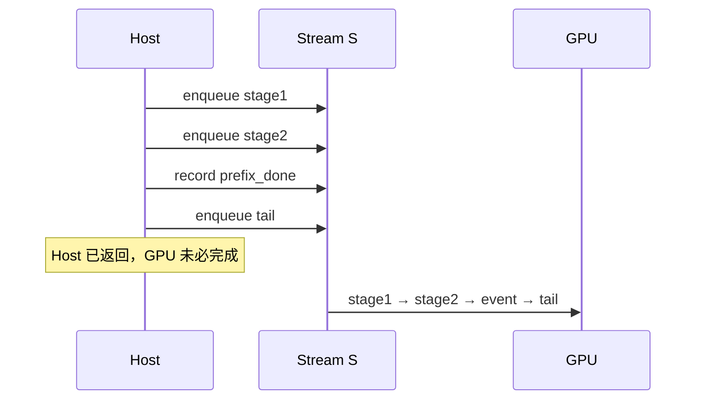

[课程目录](/courses/cuda-graph/) · 下一课：[Event 建立 happens-before](/courses/cuda-graph/02-event-happens-before/)

## 先钉死三个时刻

一次 kernel launch 至少包含三个不同的时刻：

1. Host API 返回；
2. 工作被提交进某条 Stream 的有序队列；
3. GPU 真正执行完成。

通常 launch 对 Host 是异步的，所以 `kernel<<<...>>>()` 返回只说明调用已提交，不说明输出已经能被 CPU 或另一条无依赖 Stream 使用。后面所有 Graph 问题，本质上都建立在这个边界之上。

同一 Stream 的核心契约是 FIFO：后提交的工作不能越过前面的工作。假设同一条 `S` 上有：

```cpp
stage1<<<1, 1, 0, S>>>(values);       // values[0] = 41
stage2<<<1, 1, 0, S>>>(values);       // values[1] = values[0] + 1
cudaEventRecord(prefix_done, S);
tail_stage<<<1, 1, 0, S>>>(values);
```

那么 `stage2` 必然在 `stage1` 之后执行，也能看到前者的写入；这里不需要额外 Event。`prefix_done` 只覆盖 record 点之前的前缀，不包含后提交的 `tail_stage`。



## 不同 Stream 提供的是机会，不是承诺

两条 Stream 之间若没有 Event 或其他依赖，CUDA 不保证它们的相对执行次序。这意味着调度器**可以**让它们重叠，而不是它们**一定**并行。常见的串行原因包括：

- 一个 kernel 已占满 SM、寄存器、shared memory 或带宽；
- copy engine、PCIe/NVLink 或 HBM 成为瓶颈；
- 硬件并发能力不足；
- legacy default stream 或某个同步 API 引入了隐藏 barrier；
- 两个 kernel 虽无 API 依赖，却因资源竞争被调度成串行。

所以“没有 happens-before”与“timeline 上发生 overlap”是两件事。前者是契约，后者是某次运行的结果。

## Host 时间与 GPU 时间不能混测

CPU 侧包住一串 launch 的耗时，主要测到 Python/C++ 调度和提交，不等于 GPU elapsed。测 GPU 前缀应把两个 timing Event 记录到相应 Stream：

```cpp
cudaEventRecord(start, S);
for (int i = 0; i < n; ++i) {
  tiny_kernel<<<grid, block, 0, S>>>(...);
}
cudaEventRecord(stop, S);
cudaEventSynchronize(stop);
cudaEventElapsedTime(&ms, start, stop);
```

`CUDA_LAUNCH_BLOCKING=1` 适合定位异步报错，但会把提交路径同步化，不能用它的 timeline 推导生产性能。

## 映射到 vLLM

在 PyTorch 中，`torch.cuda.current_stream()` 是当前工作被提交的执行车道。vLLM 进行 Graph capture 时会切换到专用 capture stream；真正 replay 时，图被 launch 到 **replay 当时的 current stream**。Graph 是一个可执行 DAG，不是永久绑定的 Stream。

因此，若 `static_input.copy_()` 和 `graph.replay()` 都提交到同一运行流 `Se`，同流 FIFO 已建立 `copy → replay`，无需再插 Event。若输入由独立 `Sin` 生产，则必须让消费者等待生产者：

```python
with torch.cuda.stream(Sin):
    static_input.copy_(runtime_input, non_blocking=True)

Se.wait_stream(Sin)   # 或用精确 Event
with torch.cuda.stream(Se):
    graph.replay()
```

这也回答一个常见误区：Graph 在 `Sc` 上 capture，并不意味着它以后都提交到 `Sc`。

## 本课反例

- launch 返回后，CPU 立刻读 GPU 结果；
- 把两个 kernel 放到不同 Stream，就声称它们一定重叠；
- 把 Host 调用顺序当成不同 Stream 的 GPU 顺序保证；
- 用一次 Nsight 调度结果反推 API 永久契约；
- 用 CPU submit time 代表 GPU 执行时间。

## 验收题

1. `kernel<<<..., S>>>` 返回时，输出能否直接供 CPU 使用？
2. `A → record(E) → B` 位于同一 Stream，等待 `E` 是否包含 `B`？
3. 两个无依赖 Stream 上的 kernel 为什么仍可能串行？
4. Graph 在 `Sc` capture、在 `Se` current context 中 replay，本次执行提交到哪条 Stream？

答案应分别是：不能；不包含；无依赖只允许并发而不保证资源足够；提交到 `Se`。

参考：[CUDA Programming Guide：Asynchronous Execution](https://docs.nvidia.com/cuda/cuda-programming-guide/02-basics/asynchronous-execution.html)。

vLLM 映射源码：[`parallel_state.py::graph_capture`](https://github.com/vllm-project/vllm/blob/v0.22.1/vllm/distributed/parallel_state.py) 与 [`CUDAGraphWrapper`](https://github.com/vllm-project/vllm/blob/v0.22.1/vllm/compilation/cuda_graph.py)。

[返回目录](/courses/cuda-graph/) · 下一课：[Event 建立 happens-before](/courses/cuda-graph/02-event-happens-before/)
