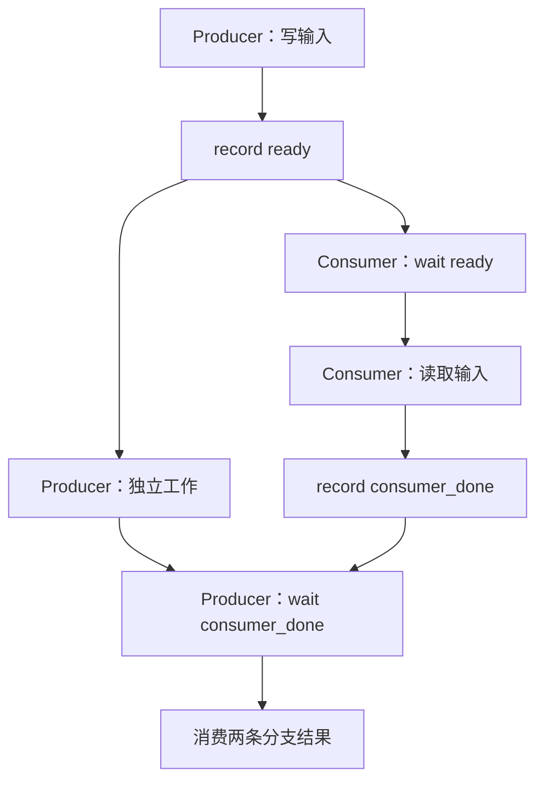

上一课：[Stream FIFO](/courses/cuda-graph/01-stream-fifo/) · [课程目录](/courses/cuda-graph/) · 下一课：[Async Copy 与隐式同步](/courses/cuda-graph/03-default-stream-async-copy/)

## Event 记录的是一条 Stream 的前缀

`cudaEventRecord(E, P)` 在 producer Stream `P` 上插入一个记录点。Event 完成表示该记录点之前的工作已经完成；它不自动覆盖 record 之后才提交的工作。

跨流 producer/consumer 的最小设备侧依赖是：

```cpp
write_input<<<..., P>>>(buffer);
cudaEventRecord(ready, P);

cudaStreamWaitEvent(C, ready, 0);
read_input<<<..., C>>>(buffer);
```

等待方向永远从数据依赖推导：`P` 生产、`C` 消费，所以 **C 等 P**。Host 在 `cudaStreamWaitEvent` 调用后可以继续提交工作；真正停住的是 `C` 中位于 wait 之后的 GPU 工作。



图中 producer 在 `ready` 后的 `B` 与 consumer 的 `C` 没有彼此顺序；它们可能重叠。最后 producer 作为汇合后的消费者，等待 `consumer_done`，于是 `D` 同时位于 `B` 和 `C` 之后。

## 四个 API 分别阻塞谁

| API | 语义 | 会阻塞 Host 吗 |
| --- | --- | --- |
| `cudaEventRecord(E, S)` | 在 `S` 中排入记录点 | 通常不会 |
| `cudaStreamWaitEvent(T, E)` | `T` 后续工作等待 Event | 不会 |
| `cudaEventQuery(E)` | 查询完成状态 | 不会，返回状态 |
| `cudaEventSynchronize(E)` | 当前 CPU 线程等待 Event | 会 |

纯依赖 Event 通常用 `cudaEventDisableTiming` 创建，避免不需要的 timing 开销；计算 elapsed time 的 Event 则保留 timing 能力。

第一次 record 前的 Event 代表空前缀，wait 可能立即通过。一个 Event 被再次 record 后，已经提交的旧 wait 绑定的是当时可见的 record，不会“追着未来的 record 走”。因此循环复用 Event 时，必须同时证明提交顺序和资源生命周期。

## 为什么不用 `cudaDeviceSynchronize`

设备全局同步能让很多错误暂时消失，但它把所有无关 Stream 都纳入等待，破坏 overlap，也掩盖真正缺失的依赖边。正确方法是等待最小的 producer 前缀：

```text
只需 GPU consumer 等 producer → stream wait event
CPU 必须读取 producer 结果      → event synchronize
CPU 只想探测进度               → event query
```

## 映射到 vLLM Offloader

vLLM 的权重预取存在两条方向相反的边：

```text
compute → copy：旧权重读完，才能覆盖静态槽位
copy → compute：新权重写完，目标层才能消费
```

在 `PrefetchOffloader.start_onload_to_static()` 中，current/compute stream 记录 fork Event，`copy_stream` 等待后执行 H2D，再记录 `_copy_done_event`。`_wait_for_layer()` 让当前计算流等待该 copy-done Event。

`sync_prev_onload()` 则用于进入 capture/replay 前清理上一阶段仍在图外飞行的异步 copy。否则 Graph 内固定地址的 buffer 可能一边被旧 copy 改写，一边被当前 forward 读取。

第 4 课还会看到 `join_after_forward()`：即使某次预取到本轮结束都没有被真实层消费，也必须在 `EndCapture` 前由 origin stream 等待它，否则辅助流仍游离在捕获域之外。

## 本课反例

- Producer 写 buffer 后，Consumer 不 wait 就读取；
- 把“producer 等 consumer”写反，制造不必要串行甚至环；
- 认为 Host 对不同 Stream 的 launch 顺序自动建立设备顺序；
- Event 尚未 record 就依赖它保护真实数据；
- 用全局同步替代局部依赖，并据此声称流水已经正确；
- 复用 Event 时忽略 record/wait 的代际关系。

## 验收题

1. `cudaStreamWaitEvent()` 阻塞的是 CPU 还是目标 Stream 的后续工作？
2. `A → record(E) → B` 中，另一条 Stream 等 `E` 是否等待 `B`？
3. `Sin` 生产输入、`Se` replay Graph，哪条流等待哪条流？
4. Event 为什么既能用于 eager 跨流依赖，也能在合法 capture 中成为图边？

答案：目标 Stream；不等待 `B`；`Se` 等 `Sin`；因为 record/wait 描述的是设备 DAG 中可捕获的依赖，而不是 Host 控制流。

参考：[CUDA Runtime Event Management](https://docs.nvidia.com/cuda/cuda-runtime-api/group__CUDART__EVENT.html)。

vLLM 映射源码：[`PrefetchOffloader`](https://github.com/vllm-project/vllm/blob/v0.22.1/vllm/model_executor/offloader/prefetch.py)。

上一课：[Stream FIFO](/courses/cuda-graph/01-stream-fifo/) · 下一课：[Async Copy 与隐式同步](/courses/cuda-graph/03-default-stream-async-copy/)
