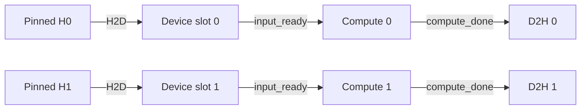

上一课：[Event](/courses/cuda-graph/02-event-happens-before/) · [课程目录](/courses/cuda-graph/) · 下一课：[多流 Capture](/courses/cuda-graph/04-multistream-capture-fork-join/)

## `Async` 不是一句完整的性能结论

`cudaMemcpyAsync` 是否稳定地与 Host、kernel 或另一条 copy 重叠，取决于 copy 方向、Host 内存类型、硬件 copy engine、驱动路径和目标 Stream。API 名字带 `Async` 只给出调用语义的一部分，不能替代依赖和 lifetime 分析。

Host 到 Device 的流水通常要求 pinned Host memory。若 source 是 pageable memory，Runtime 可能先做内部 staging，调用会出现额外阻塞，预期 overlap 也可能消失。即便 source 已 pinned，Host 仍不能在 H2D 真正完成前修改或释放它；D2H 的 destination 同理，完成前不能读取或释放。

## 两个 slot、三条 Stream

最小流水可使用两个轮换 slot，以及 H2D、compute、D2H 三条 non-blocking Stream：



每个 slot 的关键代码是：

```cpp
cudaMemcpyAsync(d_in[s], h_in[s], bytes,
                cudaMemcpyHostToDevice, h2d);
cudaEventRecord(input_ready[s], h2d);

cudaStreamWaitEvent(compute, input_ready[s], 0);
transform<<<grid, block, 0, compute>>>(d_in[s], d_out[s]);
cudaEventRecord(compute_done[s], compute);

cudaStreamWaitEvent(d2h, compute_done[s], 0);
cudaMemcpyAsync(h_out[s], d_out[s], bytes,
                cudaMemcpyDeviceToHost, d2h);
cudaEventRecord(slot_done[s], d2h);
```

上面只描述一个 slot 的一代工作。循环重新使用 `s` 前，Host 必须确认 `slot_done[s]` 已完成，并完成对 `h_out[s]` 的消费；否则新的 H2D/compute 可能覆盖仍在 D2H 或 CPU 使用中的 Host/Device buffer。同步 CPU consumer 可在轮回到该 slot 时执行 `cudaEventSynchronize(slot_done[s])`，读取结果后再改写 `h_in[s]`；异步 Host consumer 则还要用自己的队列/引用计数表达“CPU 已用完”。

两条链具有 overlap 的机会，但实际是否重叠仍受 `asyncEngineCount`、`concurrentKernels`、PCIe/NVLink、HBM 带宽和 kernel 资源占用约束。

## 默认 Stream 的隐式边

legacy default stream 会与普通 blocking streams 产生传统的隐式同步关系；per-thread default stream 的作用域不同；通过 `cudaStreamNonBlocking` 创建的 Stream 不参与这类 legacy implicit synchronization。

但 `cudaStreamNonBlocking` 的含义不是“所有操作永远不阻塞 CPU”，也不是“自动与其他 Stream 并行”。它只关闭一类与 legacy default stream 的隐式关系。第三方库若意外把工作提交到 legacy default stream，可能让本来设计好的流水出现 barrier，甚至干扰 capture。

## 常见的流水破坏点

- 热路径中的 `cudaDeviceSynchronize()` 把所有 slot 压平；
- H2D 前后复用同一 Host source，却没有等待前一代 copy；
- D2H 完成前读取 Host output；
- 提前释放 Device buffer，忽略 copy/kernel 仍在飞行；
- lazy allocation、首次库初始化或 autotune 落入热路径；
- 用 `CUDA_LAUNCH_BLOCKING=1` 的 timeline 推导正常运行时 overlap；
- 只看到两条 non-blocking Stream，就宣称必然并行。

## 映射到 vLLM

在权重 offload 场景，CPU storage 需要满足 non-blocking H2D 的前提；`StaticBufferPool` 提前分配 GPU staging slot，并以固定 shape、stride、dtype 和地址循环复用。copy stream 负责 `gpu_buffer.copy_(cpu_storage, non_blocking=True)`，compute stream 则通过 Event 在真正消费该层前等待。

从 eager/piecewise 切换到 FULL Graph 时，`sync_prev_onload()` 必须先把旧的图外 copy 纳入当前流的依赖。它不是为了让 CPU 停住，而是防止 replay 使用的静态地址与上一阶段未完成的 H2D 发生读写竞争。

## 验收题

1. pinned Host source 为什么必须存活到 H2D 真正完成？
2. `cudaStreamNonBlocking` 关闭的是什么，而不保证什么？
3. 为什么两个 `Async` API 仍可能没有 overlap？
4. eager copy stream 的未完成工作为什么要在 FULL Graph replay 前处理？

参考：[Default Stream Behavior](https://docs.nvidia.com/cuda/cuda-runtime-api/stream-sync-behavior.html) 与 [API Synchronization Behavior](https://docs.nvidia.com/cuda/cuda-runtime-api/api-sync-behavior.html)。

vLLM 映射源码：[`PrefetchOffloader` 与 `StaticBufferPool`](https://github.com/vllm-project/vllm/blob/v0.22.1/vllm/model_executor/offloader/prefetch.py)。

上一课：[Event](/courses/cuda-graph/02-event-happens-before/) · 下一课：[多流 Capture](/courses/cuda-graph/04-multistream-capture-fork-join/)
