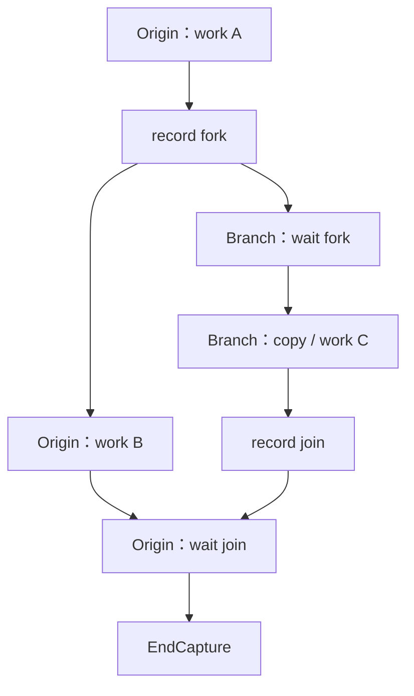

上一课：[Async Copy](/courses/cuda-graph/03-default-stream-async-copy/) · [课程目录](/courses/cuda-graph/) · 下一课：[Graph 生命周期](/courses/cuda-graph/05-graph-lifecycle/)

## “Graph 内辅助流必须 join”到底是什么意思

多流 capture 不是“同时对几条 Stream 调用 begin”。通常只有 origin stream 显式 `BeginCapture/EndCapture`。辅助流要通过 **capture 内记录的 Event** 从 origin fork 出去，并在结束前用另一条 Event join 回 origin。



最小代码：

```cpp
cudaStreamBeginCapture(origin, cudaStreamCaptureModeGlobal);

work_a<<<..., origin>>>();
cudaEventRecord(fork_event, origin);
cudaStreamWaitEvent(branch, fork_event, 0);

work_b<<<..., origin>>>();
work_c<<<..., branch>>>();
cudaEventRecord(join_event, branch);
cudaStreamWaitEvent(origin, join_event, 0);

work_d<<<..., origin>>>();
cudaStreamEndCapture(origin, &graph);
```

fork 证明 branch 的工作属于当前 capture；join 证明 origin 的结束点位于 branch 完成之后。join 是一条设备依赖边，不是 CPU 同步，不是销毁 Stream，也不要求把两条分支实际串成一条。

若 fork 后漏掉 join，`EndCapture` 可能返回 `cudaErrorStreamCaptureUnjoined`（904），且得不到可执行 Graph。即使 capture 已 invalidated，也应按 API 要求结束 capture 并清理相关状态，而不是把 Stream 永久留在异常捕获态。

## 为什么“下一轮才使用”也必须 join

假设最后一层 forward 结束时，copy stream 已经开始预取下一轮的权重。虽然当前 forward 不消费该 buffer，但这条 H2D 已在当前捕获域中 fork。若 origin 直接结束 capture，Runtime 无法证明该分支何时完成，也无法形成闭合 DAG。

因此“图内所有辅助流必须在图结束前 join”的严格含义是：**所有被当前 capture 纳入的分支，都必须存在回到 origin 结束点的依赖路径**。它不要求业务结果一定被本轮使用。

## `join_after_forward()` 如何保证闭环

vLLM `PrefetchOffloader` 的捕获期流程可还原为：

1. `start_onload_to_static()`：compute/origin 记录 fork，copy stream 等待；
2. copy stream 执行 H2D，并记录 `_copy_done_event`；
3. 若本轮某层使用该权重，`_wait_for_layer()` 让 compute 等 copy-done，正常完成 join；
4. 若 forward 结束仍有 `_prefetch_in_capture=True` 的分支，`join_after_forward()` 让 origin 等相应 copy-done；
5. 所有辅助分支闭合后，才离开 `torch.cuda.graph(...)` 的捕获范围。

这些 Python flag 是**捕获期记账**。Replay 时 Python 不会重新遍历 `join_after_forward()`；捕获到的 Event record/wait、memcpy 和 kernel 节点已成为 executable graph 的一部分。

进入 capture 前还要调用 `sync_prev_onload()`，排空或建立对旧 eager copy 的依赖。原因是 capture 不能安全地依赖捕获域外、代际不明确的外部事件；这类跨边界错误还可能触发 stream capture isolation（905）。

## 反例清单

- branch 未通过 captured Event 就提交工作；
- fork 以后，origin 未等待 branch 的完成 Event 就 `EndCapture`；
- 用 `branch.synchronize()` 代替图内 join；
- 在 capture 内等待上一轮图外 Event，代际和隔离域不清楚；
- 由 branch 尝试结束 origin 发起的 capture；
- capture invalidated 后跳过清理；
- 误以为 replay 时 Python flag 会再次执行并修复依赖。

## 验收题

1. 什么操作把 branch stream 合法拉入 capture？
2. join 是 Host 同步、Stream 销毁，还是图内依赖边？
3. 最后一层预取到下一轮才使用，为什么当前图仍需 join？
4. 删除 origin 对 join Event 的 wait，预期错误是什么？
5. `join_after_forward()` 的 Python 循环在 replay 时是否运行？

参考：[CUDA Programming Guide：CUDA Graphs](https://docs.nvidia.com/cuda/cuda-programming-guide/04-special-topics/cuda-graphs.html)。

vLLM 映射源码：[`parallel_state.py::graph_capture`](https://github.com/vllm-project/vllm/blob/v0.22.1/vllm/distributed/parallel_state.py) 与 [`prefetch.py::join_after_forward`](https://github.com/vllm-project/vllm/blob/v0.22.1/vllm/model_executor/offloader/prefetch.py)。

上一课：[Async Copy](/courses/cuda-graph/03-default-stream-async-copy/) · 下一课：[Graph 生命周期](/courses/cuda-graph/05-graph-lifecycle/)
