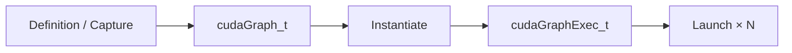

上一课：[多流 Capture](/courses/cuda-graph/04-multistream-capture-fork-join/) · [课程目录](/courses/cuda-graph/) · 下一课：[Update 与重录](/courses/cuda-graph/06-capture-update-recapture/)

## 三阶段、三个不同对象

CUDA Graph 的生命周期应拆成：



- `cudaGraph_t` 是定义出的节点和依赖模板；
- `cudaGraphExec_t` 是实例化后的可执行 snapshot；
- launch stream 规定本次 Graph 与图外工作的排序边界。

Graph 可以由 Stream Capture 得到，也可以用 Explicit Graph API 手工增加 kernel/memcpy/event nodes 和 dependency。前者适合复用现有 Stream 程序，后者适合主动管理节点及参数更新。

```cpp
cudaStreamBeginCapture(stream, cudaStreamCaptureModeGlobal);
stage_a<<<..., stream>>>(input, work);
stage_b<<<..., stream>>>(work);
stage_c<<<..., stream>>>(work, output);
cudaStreamEndCapture(stream, &graph);

cudaGraphInstantiateWithFlags(&exec, graph, 0);
```

## Graph 保存拓扑和指针，不保存业务值快照

假设捕获时 kernel 参数中包含 `device_input` 地址。Graph 记录这个地址及节点参数，但不会冻结该地址里的 token 值。正确的 replay 模式是固定 allocation，每轮只改内容：

```cpp
cudaMemcpyAsync(device_input, host_input, bytes,
                cudaMemcpyHostToDevice, replay_stream);
cudaGraphLaunch(exec, replay_stream);
cudaMemcpyAsync(host_output, device_output, bytes,
                cudaMemcpyDeviceToHost, replay_stream);
```

三步都在同一 replay stream，FIFO 已建立 `H2D → Graph → D2H`。若重新分配 `device_input`，只修改 Host 变量并不会更新已实例化 Graph 中的旧指针；必须用支持的 node 参数更新机制、更新 executable，或重新建图。

同样，Graph 在 capture stream `Sc` 上录制，不等于绑定 `Sc`。在 current stream `Se` 中调用 replay，本次 Graph 提交到 `Se`；图内捕获的多流分支仍保留其 DAG，不会被压回一条 Stream。

## Capture 成功不代表 replay 正确

Runtime 只证明捕获过程形成了合法图，并不证明业务契约完整。例如：

- metadata 指针稳定，但内容没有在 replay 前更新；
- output 是同一静态 storage，多次保存引用却没有 `clone()`，历史结果被下一轮覆盖；
- KV 写入位置变化，但 slot mapping 仍是上一轮内容；
- RNG 状态没有按框架要求维护；
- 图外 consumer 在 output 完成前读取；
- 同一 GraphExec 的下一次 launch 虽会在前一次完成后才执行，但图外 consumer 若未建立依赖，仍可能与下一次 launch 争用将被覆盖的 static output。

CUDA 会序列化同一 GraphExec 的多次 launch。若确实要让图本体并发执行，需要独立 instantiate 的 GraphExec 与独立 static resources，并证明地址、副作用和 workspace 不冲突。

## Graph 为什么可能更快

主要收益是把大量逐 kernel 的 Python、框架和 Driver 提交工作压缩为一次 Graph launch，而不是让长 kernel 的数学计算自动变快。

\[
T_{eager}\approx T_{python}+T_{framework}+\sum_i T_{launch,i}+T_{gpu}
\]

\[
T_{graph}\approx T_{stage}+T_{graphLaunch}+T'_{gpu}
\]

若只有一个长 kernel 主导，`\sum T_{launch}` 很小，收益可能有限。若有几十上百个短 kernel，Host bubbles 明显，Graph 才更可能有效。时间上的回本条件可写为：

\[
R(T_{eager}-T_{replay}) > T_{warmup}+T_{capture}+T_{instantiate}
\]

Static buffer、graph pool 和 workspace 的额外显存不是时间项，应该作为独立的容量约束与机会成本评估。固定的“重放几次必回本”没有普适答案，必须在真实 workload 上测量。

## 映射到 vLLM

vLLM `CUDAGraphEntry` 持有 `BatchDescriptor`、`torch.cuda.CUDAGraph`、captured output，以及 debug 模式下的 input addresses。`CUDAGraphWrapper` 是执行器：runtime mode 不匹配时 pass-through；匹配且未捕获时创建 entry/capture；已有 graph 时 replay。

Dispatcher 则位于更上一层，决定本轮使用哪一个 runtime mode 和 descriptor。它不是 CUDA Runtime 生命周期的一部分。安全 fallback 必须先在 dispatcher 阶段落到 `NONE`；生产期若伪造一个漏捕获 descriptor 直接交给 wrapper，wrapper 并不会替你静默 eager。

## 验收题

1. `cudaGraph_t` 与 `cudaGraphExec_t` 分别是什么？
2. Graph 是否保存 static input 的数值快照？
3. 在 `Sc` capture、在 `Se` replay，本次执行提交到哪条 Stream？
4. input copy 和 replay 同在 `Se` 时是否还需额外 Event？
5. 为什么单个长 kernel 的 workload 可能几乎不受益？

vLLM 源码入口：[`CUDAGraphEntry` / `CUDAGraphWrapper`](https://github.com/vllm-project/vllm/blob/v0.22.1/vllm/compilation/cuda_graph.py)。

上一课：[多流 Capture](/courses/cuda-graph/04-multistream-capture-fork-join/) · 下一课：[Update 与重录](/courses/cuda-graph/06-capture-update-recapture/)
