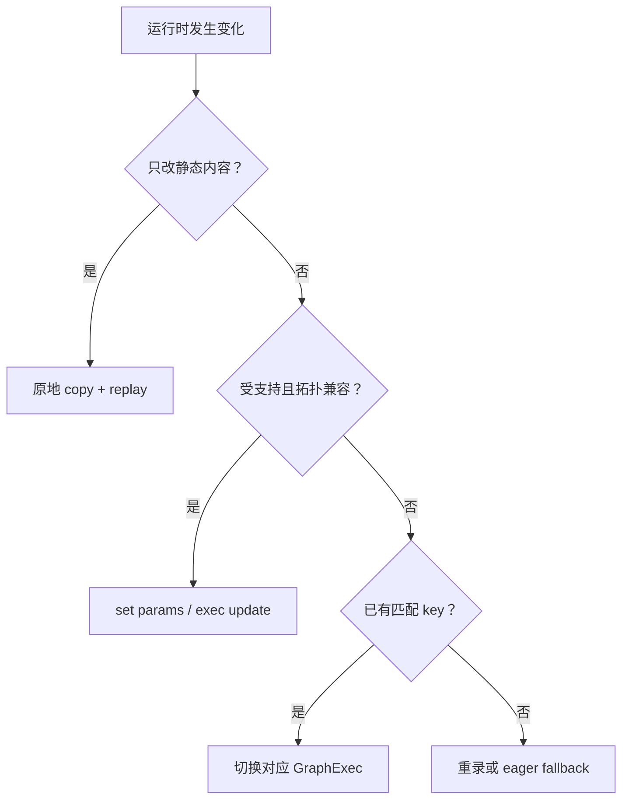

上一课：[Graph 生命周期](/courses/cuda-graph/05-graph-lifecycle/) · [课程目录](/courses/cuda-graph/) · 下一课：[内存与生命周期](/courses/cuda-graph/07-memory-pool-workspace-lifetime/)

## 先分清“值变了”还是“执行计划变了”

Graph 可以复用，不代表一切都必须完全不变。真正的判断标准是：变化是否破坏已实例化 executable 中记录的地址、节点参数解释、依赖拓扑、workspace plan 或副作用顺序。

| 变化 | 首选机制 |
| --- | --- |
| static buffer 的 token、position、slot 等内容 | 原地更新后 replay |
| 已知节点支持更新的少量参数 | `cudaGraphExec*NodeSetParams` |
| 新旧 Graph 可严格映射，拓扑兼容 | `cudaGraphExecUpdate` |
| shape/layout/topology/workspace family 改变 | 新 key，重新 capture/instantiate |
| 条件不受支持或生命周期失效 | 拒绝该图，fallback |

例如，同一地址里的 token ID 从 17 改成 42，不需要新 key；Graph 会读取新内容。反过来，若 batch shape 使 kernel grid、attention plan、workspace 大小或 collective 顺序变化，继续 replay 旧图就不安全。不能更新也不重新捕获时，应走 eager（在 vLLM 中通常表现为 runtime `NONE`），而不是赌“形状看起来差不多”。

## Capture 的典型禁止项

Active capture 中的危险操作通常具备一个共同点：它们要求 Host 观察尚未完成的设备状态，或引入 Runtime 无法封闭到当前 DAG 的全局副作用。典型包括：

- `cudaDeviceSynchronize()` 等覆盖 active capture 的同步；
- query/synchronize 正在 capture 的 Stream 或 captured Event；
- capture blocking stream 时与 legacy default stream 冲突；
- 同步 `cudaMemcpy()`；
- 普通 `cudaMalloc()` 并期待每次 replay 都重新执行 Host allocation；
- 尚未支持 capture 的库/API；
- branch fork 后没有 join；
- 把两张独立 capture 用 Event 强行合并；
- `.item()`、D2H flag 或依赖 GPU 值的 Python `if`。

`.item()` 不只是“比较慢”。它把设备结果搬回 Host，并让后续拓扑取决于一个捕获时刻的 Host 分支；replay 不会重新执行 Python，因此这个控制依赖根本不在设备 DAG 里。

非法操作会使 capture invalidated。即使失败，也要在 origin stream 正确调用 `EndCapture` 清理状态，并处理空 Graph/错误码。

## Capture Mode 不是安全开关

`Global`、`ThreadLocal`、`Relaxed` 控制 Runtime 检查潜在不安全 API 的范围，不决定哪些节点被捕获。`Relaxed` 只是少替你拦截一部分行为，并不会把外部同步、动态 allocation、Host 分支或未闭合辅助流变成 graph-safe。

## `cudaGraphExecUpdate` 不是任意动态图

Exec update 要求新旧图能建立稳定的节点/依赖映射。节点类型、拓扑、创建顺序、context 以及某些参数约束都可能令更新失败。生产实现必须检查 update 结果；失败后回到重新实例化或安全 fallback。

分桶也只是有限拓扑的缓存策略：

- bucket 少：padding、无效计算和 static memory 浪费更大；
- bucket 多：capture 时间、Graph memory 和 cache 管理成本更高；
- exact key 最容易证明正确；
- 只有 metadata/mask 能证明 padding 语义无影响时，才能扩大复用。

## 映射到 vLLM

vLLM 不在热路径任意修改 GraphExec，而是预先构造有限的 capture descriptors。Dispatcher 先把 real token 数向上补到 capture size，再查合法 key。命中 FULL 或 PIECEWISE 才把 runtime mode/descriptor 交给 wrapper；否则返回 `NONE`。

这条职责边界很重要：wrapper 不是安全判定器。它信任 `ForwardContext`；若生产期给出一个未捕获 descriptor，它不会自动帮你 eager，而可能因 capture monitor 已关闭而报错。安全 fallback 必须发生在 Dispatcher 选择阶段。

## 验收题

1. static input 内容改变是否需要新 key？
2. shape 相同但 attention plan 改变，能否仅更新内容后 replay？
3. `Relaxed` 是否会让 capture 中的危险 API 自动安全？
4. `cudaGraphExecUpdate` 失败后应继续用旧图，还是重录/fallback？
5. 为什么 `.item()` 破坏的不只是性能？

参考：[CUDA Runtime Graph Management](https://docs.nvidia.com/cuda/cuda-runtime-api/group__CUDART__GRAPH.html)。

vLLM 映射源码：[`CudagraphDispatcher`](https://github.com/vllm-project/vllm/blob/v0.22.1/vllm/v1/cudagraph_dispatcher.py) 与 [`CUDAGraphWrapper`](https://github.com/vllm-project/vllm/blob/v0.22.1/vllm/compilation/cuda_graph.py)。

上一课：[Graph 生命周期](/courses/cuda-graph/05-graph-lifecycle/) · 下一课：[内存与生命周期](/courses/cuda-graph/07-memory-pool-workspace-lifetime/)
