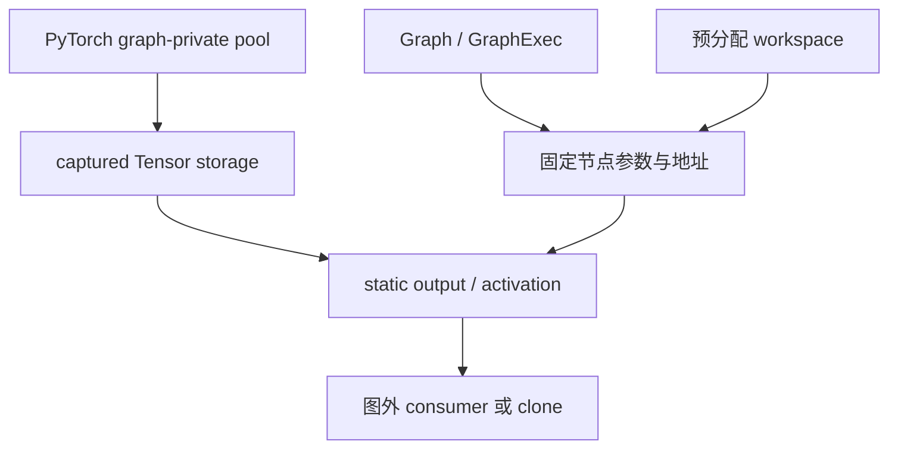

上一课：[Update 与重录](/courses/cuda-graph/06-capture-update-recapture/) · [课程目录](/courses/cuda-graph/) · 下一课：[PyTorch CUDAGraph](/courses/cuda-graph/08-pytorch-cudagraph/)

## “固定地址”背后至少有四层机制

讨论 Graph 内存时，最容易犯的错误是把所有 pool 都称为“CUDA Graph pool”。实际上至少要分开：

| 层 | 对象 | 生命周期依据 |
| --- | --- | --- |
| 原生 allocation | `cudaMalloc/cudaFree` | Host API 与同步证明 |
| Stream-ordered allocator | `cudaMallocAsync/cudaFreeAsync` | Stream order、Event 与 memory pool |
| Graph memory node | Graph 中的 alloc/free node | Graph edge 与每次 launch 的 GPU 顺序 |
| PyTorch graph-private pool | caching allocator 为 capture 保留的地址 | `CUDAGraph`、pool token、captured Tensor 引用 |

Graph memory node 能把 allocation lifetime 本身表达在设备 DAG 中；PyTorch graph-private pool 则是框架为了让捕获期间的 activation/output 地址在 replay 中稳定而采用的 allocator 策略。两者不是同一个 API，也不能用一个对象的规则解释另一个。



## 为什么 vLLM 仍倾向预分配 workspace

即使 CUDA 支持 memory nodes，也不代表每个框架算子都会把内部 allocator、算法选择和 workspace lifetime 表达成 graph nodes。Attention、GEMM、custom op 或通信库可能在首次执行时 lazy init、autotune、选择不同 plan，并申请大小不同的 scratch。

推理系统通常更愿意在 capture 前完成 warmup，并由 caller 或长期 runtime artifact 持有最大/分桶后的 workspace：

- 地址和容量进入明确契约；
- replay 不触发 allocator；
- 算法 plan 不在热路径变化；
- 多 Graph 共享时能审计读写冲突；
- OOM 与 fallback 可以在 capture/admission 阶段处理。

这是一种工程策略，不是原生 CUDA Graph “绝对不能分配内存”。

## Output 为什么特别危险

PyTorch capture 中产生的 `static_output` 往往来自 graph-private pool。每次 replay 写回同一 storage：

```python
graph.replay()
history.append(static_output)  # 危险：只是多保存了几个同地址引用
```

下一次 replay 会覆盖前一次结果。若下游只在下一轮前消费，直接引用可以；若要跨 replay 保存历史，就必须在正确 Stream 顺序下 `clone()` 到独立 storage。

Graph 对象销毁也不等于所有相关内存立刻可回收。captured output、activation 或共享 pool token 仍被 Tensor 引用时，allocator 必须继续维持其有效性。反过来，提前释放 workspace/output，却仍有异步 kernel 或图外 consumer 在访问，则是 use-after-free。

## 两张图共享 pool 的约束

共享 pool 可以降低内存峰值和碎片，但安全条件很强：

- replay 顺序与 capture 时证明的顺序一致；
- 两张图不并发使用重叠的 pool 区域；
- 前一张图的输出在被覆盖前已消费或 clone；
- workspace 和副作用 buffer 不发生别名冲突；
- 所有跨流 use/free 都有 Event 或图边。

因此 vLLM 通常让大 shape 先 capture，再 capture 小 shape，使后者尽量复用已经建立的较大 pool，降低额外峰值和碎片。但“capture 顺序优化内存”与“runtime 优先选择哪种图”是两条不同逻辑：前者可 PIECEWISE→FULL、大→小，运行时仍可 FULL→PIECEWISE→NONE。

## 地址固定不等于物理页永远不变

Stream-ordered allocator 或 Graph memory pool 可以复用物理 backing；Graph 节点看到的虚拟地址稳定，并不意味着背后的物理页永远相同。正确性依赖地址在规定 lifetime 内有效，以及访问顺序受 DAG 保护，而不是把 allocator 实现细节当 ABI。

## 映射到 vLLM

`CUDAGraphWrapper` 为 entry 保存 captured output 和 `CUDAGraph`；graph pool 由 capture 流程协调。model runner 则持有 static input、attention metadata、slot mapping、workspace 等长期资源。清理时必须按所有权逆序：先阻止新 replay，等待在途工作，释放依赖 output/workspace 的 consumer，再释放 graph entry/pool。

LoRA、offload static slots、KV cache 和 attention workspace 的生命周期并不因为“都在 GPU 上”而自动一致。每个 buffer 都要回答：谁分配、谁每轮更新、哪条流生产/消费、何时可覆盖、哪个对象最后释放。

## 验收题

1. Graph memory node 与 PyTorch graph-private pool 是否是同一个机制？
2. 原生 Graph 能有 allocation node，为什么 vLLM 仍预分配 workspace？
3. 连续保存多次 `static_output` 引用为什么读到的可能都是最后一轮？
4. Graph 对象销毁后，captured output Tensor 仍存活，能否假设 pool 已释放？
5. 大 shape 先 capture 的主要工程目的是什么？

参考：[Stream-Ordered Memory Allocation](https://docs.nvidia.com/cuda/cuda-programming-guide/04-special-topics/stream-ordered-memory-allocation.html) 与 [PyTorch CUDA Graphs](https://docs.pytorch.org/docs/stable/notes/cuda.html#cuda-graphs)。

vLLM 映射源码：[`CUDAGraphWrapper` 的 graph pool 与 entry 生命周期](https://github.com/vllm-project/vllm/blob/v0.22.1/vllm/compilation/cuda_graph.py)。

上一课：[Update 与重录](/courses/cuda-graph/06-capture-update-recapture/) · 下一课：[PyTorch CUDAGraph](/courses/cuda-graph/08-pytorch-cudagraph/)
