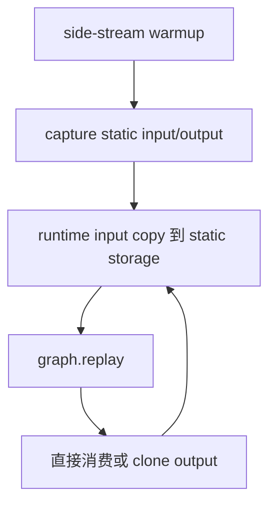

上一课：[内存与生命周期](/courses/cuda-graph/07-memory-pool-workspace-lifetime/) · [课程目录](/courses/cuda-graph/) · 下一课：[Graph-Safety Harness](/courses/cuda-graph/09-graph-safety-harness/)

## PyTorch 没有把动态图自动变静态

`torch.cuda.CUDAGraph` 的核心做法，是由调用者建立长期存活的 static input/output，并在 replay 前原地更新内容。最小闭环如下：

```python
import torch

model = model.cuda().eval()
static_input = torch.empty_like(example, device="cuda")

# 1. side stream warmup：触发 lazy init、autotune、allocator 路径
warmup = torch.cuda.Stream()
warmup.wait_stream(torch.cuda.current_stream())
with torch.cuda.stream(warmup), torch.no_grad():
    for _ in range(3):
        model(static_input)
torch.cuda.current_stream().wait_stream(warmup)

# 2. capture：输出对象也进入长期生命周期
graph = torch.cuda.CUDAGraph()
with torch.no_grad():
    with torch.cuda.graph(graph, stream=warmup):
        static_output = model(static_input)

# 3. replay：换内容，不换对象/storage
with torch.no_grad():
    static_input.copy_(runtime_input)
    graph.replay()
    result = static_output.clone()  # 仅在需要独立生命周期时
```



## Tensor object、storage 与 metadata 必须分层

一个 Tensor 变量改绑到新对象，不等于 Graph 中 kernel 参数指向的新地址。至少要检查：

- Python Tensor object；
- underlying storage 和 `data_ptr()`；
- shape、stride、dtype、device、layout；
- view/alias 关系；
- output 是否由 static storage 承载；
- metadata Tensor 的地址与内容；
- RNG generator/state。

同 shape 也不一定可复用：stride 或 layout 改变会使 kernel 对同一地址的解释变化；attention metadata 虽可保持固定 Tensor shape，内容却必须每轮正确 staging。

## Warmup 的职责

Warmup 不是为了“把 GPU 跑热”这么简单。它要在捕获外完成：

- CUDA context、库 handle 和 communicator 初始化；
- kernel/module lazy load；
- Triton/cuBLAS/cuDNN autotune 与 plan 选择；
- allocator 路径和 workspace 申请；
- 自定义 op 首次注册或 cache 填充。

Warmup 应在 side stream 进行，并与调用者 current stream 做入口/出口交接。否则前序参数更新可能未完成，或 warmup 的结果仍在飞行就开始 capture。

## Replay 前的 Stream 顺序

若 `static_input.copy_()` 和 `graph.replay()` 都在同一 current stream，FIFO 已保证 copy 完成后 Graph 才消费，不需要额外 Event。若 staging 在 `Sin`、replay 在 `Se`，则让 `Se` 等 `Sin`。方向来自 producer/consumer，而不是来自“哪条流更重要”。

Replay 后，图外 consumer 也必须位于 output 完成之后。若 consumer 在同一 `Se`，同流 FIFO 足够；换流则继续用 Event 建边。

## 五个故意破坏实验

1. 把 Python 变量改绑到一个新 Tensor，但不 copy 到 static input；Graph 仍读旧 storage。
2. 输入 shape 相同、stride 改变；必须拒绝或显式转成捕获布局。
3. 在 forward 中插 `.item()` 并驱动 Python 分支；控制流无法进入 replay。
4. 连续 `history.append(static_output)`；所有引用都指向同一可覆盖 storage。
5. 加入随机算子但不使用 graph-safe RNG 机制；重复性或状态推进错误。

另外，capture 成功后应至少做一组长循环（例如 1000 次）：“同 signature、每轮不同内容”持续 replay，并逐轮或抽样与 eager golden 比较。只测一次相同输入，无法发现 stale metadata、输出覆盖、KV 累积和 RNG 状态错误；非法 signature 还要单独断言它命中新图或 eager fallback。

## 映射到 vLLM

vLLM 把这个最小闭环扩展为多 key runtime：model runner 长期持有 static input/metadata/workspace，Dispatcher 选择 descriptor，`CUDAGraphWrapper` 持有每个 descriptor 的 graph entry 和 static output。模型 forward 还包含 KV 写入、LoRA、offloader 和 NCCL，因此“地址固定”只是必要条件之一。

`make_graphed_callables` 适合规则参数结构和固定调用序列；vLLM 这类有多 `BatchDescriptor`、KV 副作用、非 Tensor metadata 和显式 fallback 的系统，更需要自己的 Graph manager/dispatcher。

## 验收题

1. 为什么 runtime input 要 copy 到 static input，而不是把变量换成新 Tensor？
2. static output 何时可以直接返回，何时必须 clone？
3. 同 shape、不同 stride 能否默认复用？
4. copy 在 `Sin`、replay 在 `Se` 时谁等待谁？
5. capture 成功后为什么还要做多内容、多轮 golden 对比？

参考：[PyTorch CUDA Semantics：CUDA Graphs](https://docs.pytorch.org/docs/stable/notes/cuda.html#cuda-graphs) 与 [`torch.cuda.graph`](https://docs.pytorch.org/docs/stable/generated/torch.cuda.graph.html)。

vLLM 映射源码：[`GPUModelRunner`](https://github.com/vllm-project/vllm/blob/v0.22.1/vllm/v1/worker/gpu_model_runner.py) 与 [`CUDAGraphWrapper`](https://github.com/vllm-project/vllm/blob/v0.22.1/vllm/compilation/cuda_graph.py)。

上一课：[内存与生命周期](/courses/cuda-graph/07-memory-pool-workspace-lifetime/) · 下一课：[Graph-Safety Harness](/courses/cuda-graph/09-graph-safety-harness/)
